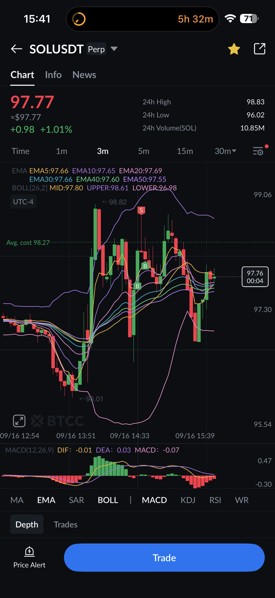
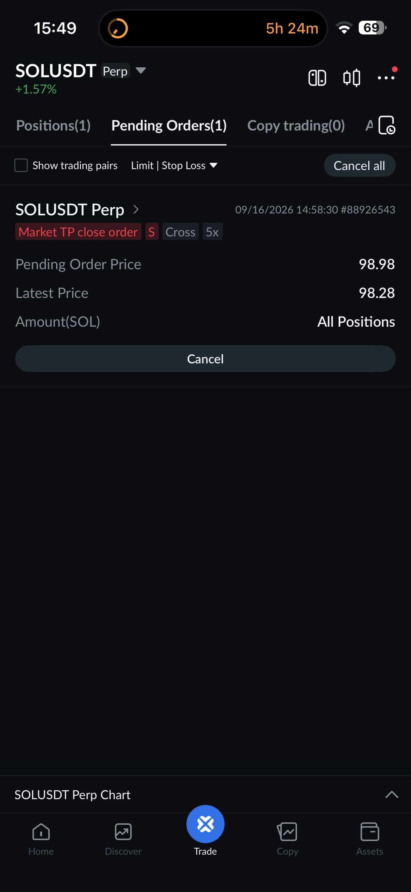

# 🗓️ Daily Review — Wednesday, September 16, 2026
### TradingView-to-Crypto-Exchange Connectivity — BTCC, Crypto.com & Coinbase Go Live | Position still open, no prop-firm fills today

---

## 📋 Session Summary

| Date | Accounts | Session P&L | Instruments | Trade Count | Account Status |
|------|----------|-------------|--------------|-------------|-----------------|
| Sep 16-17, 2026 | BTCC (Perpetual Account USDT) | *Pending — position still open as of writing* | SOLUSDT.P | 1 open long (BTCC), tested on crypto.com/Coinbase | No prop-firm order fills today |

This wasn't a prop-firm trading day — it was the day BTCC, crypto.com, and Coinbase all became directly executable from TradingView, tested live across both desktop and mobile.

---

## 📖 Session Narrative

BTCC perpetuals, crypto.com spot, and Coinbase's live balance are now all connected directly to TradingView's execution panel. I tested each one today, starting cautiously at 1x leverage with 1 SOL on BTCC, then moved to 5x once I had a feel for the panel — TradingView's slider let me size up to 6 SOL at 100%, and that's the position I'm still in as of writing (long SOLUSDT.P, avg cost 98.27, 5x, Cross margin, opened ~14:58 UTC-4).

Each exchange's TradingView execution panel turned out to expose different settings than the others, and different again from Tradovate's futures panel — worth documenting properly rather than re-discovering each time (full breakdown now lives on `setup/prop-firm-rules.html`'s new Crypto Exchange Execution Mechanics section, and the exchange bentos themselves moved into `setup/community.html`'s new Crypto Exchanges section). The short version: BTCC doesn't expose a cross/isolated toggle in TradingView even though isolated margin is newly available in BTCC's own native app; crypto.com's panel shows margin type directly and adds Post-Only/Reduce-Only/Stop-Limit that BTCC's TradingView panel doesn't have; Coinbase doesn't show a leverage concept at all in this panel, but does track separate Futures PnL and Perpetuals PnL fields even for what's mostly a spot connection right now. BTCC's own native mobile app is notably responsive — full order management (Positions / Pending Orders / Copy Trading tabs) worked instantly, and confirmed a real UI quirk: a TP order placed through TradingView's execution panel shows up under BTCC's native "Pending Orders" tab, not wherever a TP set directly inside BTCC's own app would show — same account, two different places to look depending on which surface set the bracket.

Also compared a TradingView-exported order CSV (`btcc-orders-all-2026-09-16...csv`) against BTCC's own native transaction-history export format (see `data/imports/2026/08-Aug/BTCC/btcc-orders_20260626_thru_20260829.csv` for the native shape). They're not interchangeable: TradingView's export is order-centric (symbol, side, type, fill status, no P&L/fee/margin columns, timestamps in local UTC-4) while BTCC's native export is settlement-centric (P&L, fees, margin, net P&L computed per row, timestamps in UTC+8). The TradingView CSV is kept as a comparison reference only — see `data/imports/2026/09-Sep/BTCC-TradingView-export-comparison/README.md` — **it was not used to update the master trade ledger**, since the position it documents is still open and has no closing fill.

Crypto.com and Coinbase are both still in "testing, not yet relying on day to day" status. Crypto.com currently holds a spot balance with no perp balance (Master Account USD, $0 while funds get positioned) — the inverse of BTCC, which holds a perp balance with no spot balance. Coinbase's live balance ($17.47 as of testing) was previously only visible for derivatives here; spot access through TradingView is new as of this round. Interesting side-note: a Bybit chart pane (BTCUSDT/HNTUSDT spot) appeared alongside both the crypto.com and Coinbase panels in these screenshots — charting access to Bybit already exists through TradingView even though live execution there hasn't been tested yet.

Position-sizing on BTCC's panel specifically has four distinct modes (USDT Margin, % Balance, Risk\|USDT, Risk\|% Balance) — the Risk-based ones are the closest crypto equivalent to the WASL-style risk-defined-in-position-sizing approach already used on the futures side. Practice so far: sizing via Risk\|%Balance, always setting a real take-profit rather than trading with a mental-only stop — looking back, letting a loser run without a firm TP has more often produced a larger loser than it's paid off by holding for more.

---

## 📊 Trade Log

No closed fills today. One open position as of writing:

| Exchange | Instrument | Side | Qty | Leverage | Entry (avg cost) | Status |
|---|---|---|---|---|---|---|
| BTCC | SOLUSDT.P | Long | 6 SOL | 5x | 98.27 | Open — unrealized P/L moved from -$2.52 (15:00) to +$8.94 (23:49) across the session |

Full closing details, realized P/L, and a proper trade review will follow once the position closes and the authoritative BTCC native export is available — this review intentionally does not fabricate an exit.

---

## 📸 Key Charts

Additional mobile captures from the same session (IMG_4836-4839, 4841-4842) and one shared chart card (Image-1.jpg) are archived under `data/screenshots/` but not individually embedded here — same position, same milestone, redundant for the written record.

---

## 🧠 Behavioral Notes

Went in cautiously — 1x leverage, 1 SOL, on an exchange I hadn't executed live through before — before scaling to 5x once the panel's behavior was understood. That sequencing (small size first, understand the tool, then size up) is the same discipline already established on the futures side, applied cleanly to a new venue.

Noted honestly in my own words: I haven't been actively trading BTCC because I wanted to stay in one execution environment at a time, and TradingView being that home base for BTCC/crypto.com/Coinbase/Hyperliquid(Xato) now — instead of needing separate apps for each, or a different exchange like Bybit/Phemex/MEXC just to get single-environment execution — removes the reason that hesitation existed. That's a real, specific unlock, not just a nice-to-have integration.

---

## 🔑 Key Lessons

1. **Different exchanges' TradingView panels are not interchangeable UIs wearing different skins.** Margin-type visibility, position-sizing method, available order types, post-only availability, and time-in-force options all differ meaningfully across BTCC/crypto.com/Coinbase — assuming muscle memory from one transfers cleanly to another is a real risk (see the "SL enables quantity in risk" vs. "show order confirmation" same-panel-slot gotcha documented on `prop-firm-rules.html`).
2. **An exchange's own native app and its TradingView connection can disagree on where things show up**, even for the same account — BTCC's TP-via-TradingView landing in native's "Pending Orders" tab rather than wherever a natively-placed TP would show is the concrete example from today.
3. **A partial-day export from a different tool is not a substitute for the authoritative source.** TradingView's order-centric CSV export was useful for a same-day comparison, but it doesn't carry P&L/fee/margin fields the way BTCC's own native export does — good discipline to keep it clearly labeled as reference-only rather than letting it drift into the ledger.
4. **One consolidated execution environment removes friction that was quietly gating activity.** The reluctance to trade crypto more actively wasn't about the assets — it was about not wanting to fragment across multiple exchange-specific apps. Solving that through TradingView is the actual unlock, worth naming plainly rather than treating as incidental.

---

## 🤖 SmartTraderAI Post-Market Copy-Paste Fields

---

**What actually happened?**

---

*[Placeholder — position still open. Today's actual work (testing BTCC/crypto.com/Coinbase execution through TradingView, both desktop and mobile) is documented in full above; this field is for the closed trade's outcome once it happens.]*

---

**What did you learn?**

---

*[Placeholder — pull from Key Lessons above once the position closes, plus whatever the close itself surfaces.]*

---

**What were your results for the day?**

---

*[Placeholder — pending the position closing and the authoritative BTCC export.]*

> Full daily-review: https://github.com/drasticstatic/trading-assistant-public-preview/blob/main/fortuna-exports/overview-summaries/2026/09-Sep/export_20260916_daily-review.md
> Full individual trade review:
> *[Placeholder — link once the SOL position closes and a trade review is written]*

---

## 🎯 Forward Focus

1. Close the open BTCC SOL position, then provide the authoritative BTCC native export for a proper trade review and ledger entry.
2. Finish testing spot trading through Coinbase specifically ("need to test yet" per Christopher's own screenshot filenames) — spot access is new, not yet exercised.
3. Test Bybit execution (charting access already exists via TradingView; live execution not yet tried).
4. Rebuild the TradingView layout/watchlist structure around execution venue ("Tradovate" / "CEX") instead of the old ZTH/IT/STB labels, per the plan noted in `project_exchange_roster.md` memory — re-verify `tradingview_mcp_workflow.md`'s CDP entity IDs once that restructuring lands, since they'll likely break.

---

*Daily Review — Fortuna · September 16, 2026*
