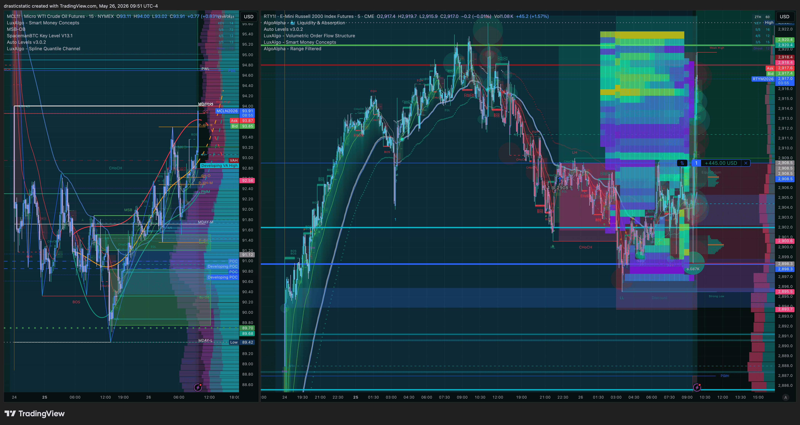
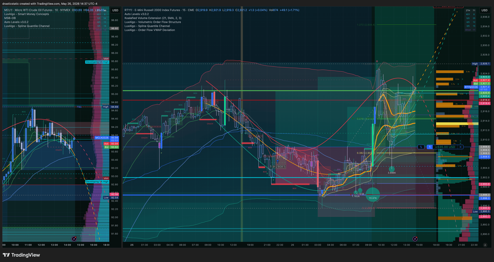
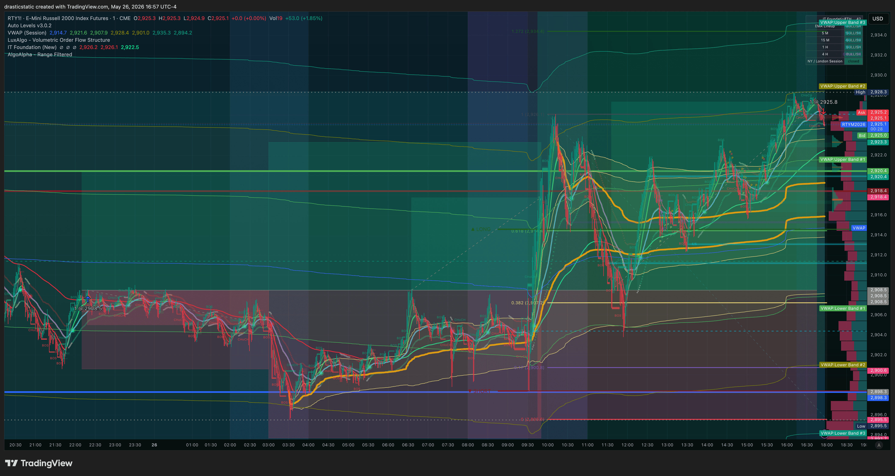

# 🔍 Trade Review — RTY Long · TPT 50K PRO (861085464) · Tue, May 26, 2026
### 20260526_RTY-TPT861085464_001 · +$865.00 · Backlog reconstruction — technical record only
### Reconstructed from Tradovate/BTCC order-fill CSVs — journal/psychology data pending

[Jump to 📝 Notes for Coaches ↓](#notes-for-coaches)

---

## ⚡ What Happened in One Paragraph

On Tuesday, May 26, 2026, a long RTY position (1 contract) on TPT 50K PRO (861085464) entered at 2,908.50 and exited at 2,925.80 after 18h 35m, closing a gain of $865.00. This review was generated from the Aug 2026 trade-review backlog pass — reconstructed directly from Tradovate order-fill CSV exports (or BTCC's transaction history for crypto), not from a same-day TradeZella export or session notes, since neither exists for this trade. Narrative context, emotional state, and coaching notes are marked pending below until Christopher provides journal/Apple Notes/Littlebird data for this period.

---

## 📊 Trade Data

| Field | Value |
|---|---|
| Account | TAKEPROFIT861085464 |
| Platform | TPT 50K PRO (861085464) |
| Instrument | RTY |
| Contract | RTYM6 |
| Direction | Long |
| Entry Price | 2,908.5000 |
| Exit Price | 2,925.8000 |
| Qty | 1 |
| Entry Time | 22:19:04 ET |
| Exit Time | 16:55:02 ET |
| Duration | 18h 35m |
| Venue | Tradovate |
| TP Set/Result | — (not reconstructed from fill data) |
| SL Set/Result | — (not reconstructed from fill data) |
| MFE | — (requires tick data, not available) |
| MAE | — (requires tick data, not available) |
| Gross P&L | $865.00 |
| Net P&L | $865.00 (commissions not separately captured in this data source) |
| Realized R:R | — |
| Zella Score | — (no TradeZella export for this date) |
| Rating | — |
| Emotionally Stable | — (pending journal data) |

---

## 📋 Order Execution

| Time (ET) | Order | Instrument | Price | Status |
|---|---|---|---|---|
| 22:19:04 | Buy Limit | RTYM6 | 2916.20 | Filled |
| 06:37:46 | Sell Limit | RTYM6 | 2938.40 | Canceled |
| 06:37:46 | Sell Limit | RTYM6 | 2938.40 | Canceled |
| 16:55:02 | Sell Market | RTYM6 | 2925.80 | Filled |

---

## 📖 Session Narrative

*Pending journal data.* This trade was reconstructed purely from order-fill CSVs as part of the Aug 2026 backlog-processing pass — no same-day premarket plan, session notes, or TradeZella narrative exists for it yet. Once Christopher provides the corresponding Apple Notes/Littlebird/journal entries for this period, this section should be filled in with the broader session context: what was happening across other instruments, the setup thesis, and how the trade actually unfolded relative to plan.

---

## 📸 Screenshot Timeline

**09:51:05 ET — RTY chart capture**

**14:37:08 ET — RTY chart capture**

**16:57:33 ET — RTY chart capture**

*Screenshots matched by date + instrument from TradingView-tagged filenames in `_Screenshots-2B-filed/`, copied into `data/screenshots/` — not yet individually verified against this specific trade window (a date+instrument match, not a confirmed frame-by-frame match).*

---

## 📝 Notes for Coaches + SmartTraderAI

*Pending journal data.* No TradeZella "Notes for Coaches" field exists for this trade (no TradeZella export covers this date). Once narrative/journal data is available, this section should cover: what the setup intended vs. what happened, and one concrete coaching recommendation per issue identified.

---

## 🧠 Behavioral Notes

*Pending journal data — no TradeZella emotion/stability tags exist for this trade.* Pattern Tracker status (from the order data alone, not psychology):

| Pattern | Status |
|---|---|
| Pattern 7 (SL modification) | — not reconstructed; see Order Execution above for any SL-type orders visible in the matched window |
| Pattern 8 (exit passivity) | — cannot be determined from fill data alone without knowing if a TP/SL closed the trade vs. a manual exit |
| Pattern 9 (pre-rest order hygiene) | — not reconstructed |

**What went right:** trade closed with a defined P&L rather than an open-ended hold — full assessment pending journal data.

---

## 🔁 Pattern Tracker

Trade 20260526_RTY-TPT861085464_001 logged.

> See full running progress tracker (all sessions, behavioral arc, compliance scores, statistical summary): [../../../../data/progression/pattern_tracker.md](../../../../data/progression/pattern_tracker.md)

This trade is part of the bulk Aug 2026 backlog-reconstruction pass — see the ["Trade Log — May 14 – Aug 28, 2026" continuation section](../../../../data/progression/pattern_tracker.md#trade-log-continued) for the full technical record this review is drawn from.

---

## 🎯 Forward Focus

1. Cross-reference this trade against journal/Apple Notes/Littlebird data once provided, and fill in the pending narrative, behavioral, and coaching sections above.
2. If a TradingView screenshot is confirmed to match this specific trade window, move it into `data/screenshots/` and update the Screenshot Timeline embed path accordingly.
3. Roll this trade's outcome into the relevant account's status in `setup/accounts/PropFirms/prop-firm-progression.md` if not already reflected there.

---

> See full trade review: https://github.com/drasticstatic/trading-assistant-public-preview/blob/main/fortuna-exports/trade-reviews/2026/05-May/review_20260526_RTY-TPT861085464_001.md

---

*Produced with 🙏🏼 Fortuna — Wealth Warden | Claude Code CLI*
*Trade Review — RTY Long · May 26, 2026 · 20260526_RTY-TPT861085464_001*
