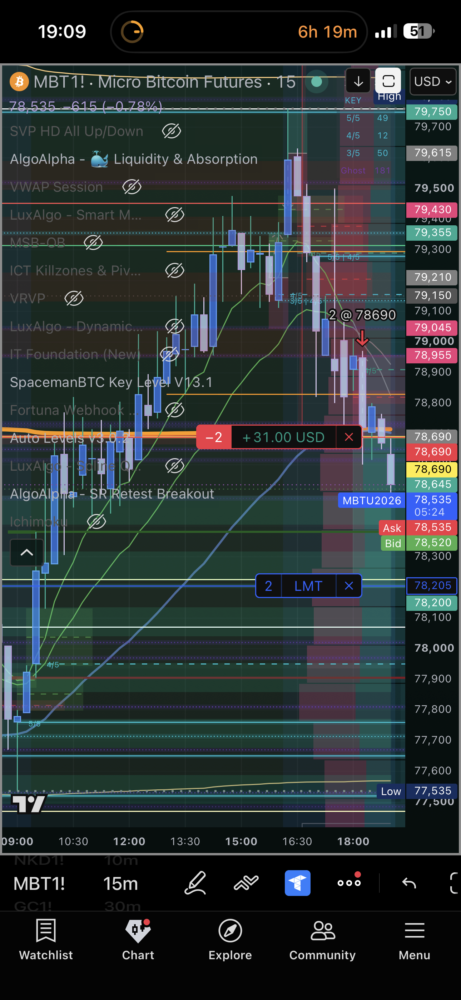
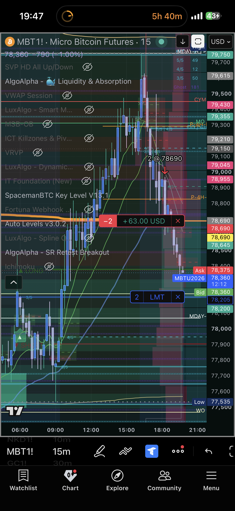
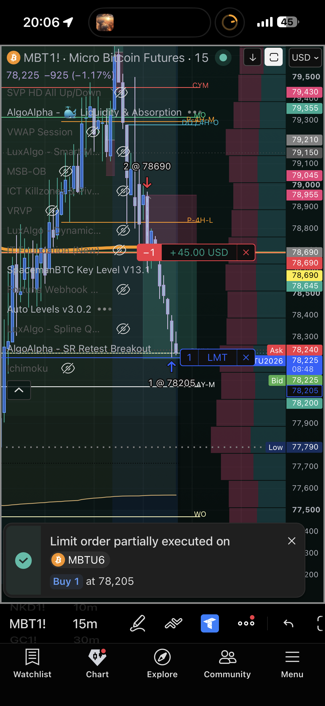
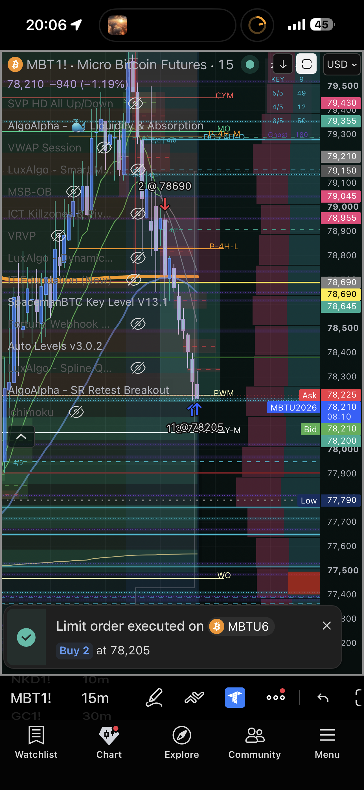

# 🔍 Trade Review — MBT1 Short · APEX11 · Monday, September 14, 2026
### 20260914_MBT1-APEX11_009 · +$97.00 · Backlog reconstruction — technical record only
### Reconstructed from Tradovate order-fill CSV exports — journal/psychology data pending

[Jump to 📝 Notes for Coaches ↓](#notes-for-coaches)

---

## ⚡ What Happened in One Paragraph

On Monday, September 14, 2026, a short MBT1 position (2 contracts) on APEX4848390000011 entered at 78690 and exited at 78205 after 1h26m, closing a gain of +$97.00. This review was generated from the Sep 9-16 incremental import — reconstructed directly from Tradovate order-fill CSV exports, not from a same-day TradeZella export or session notes unless noted below.

---

## 📊 Trade Data

| Field | Value |
|---|---|
| Account | APEX4848390000011 |
| Platform | Apex-484839-11 (APEX4848390000011) — TradeCopia Group B follower, 1x TOF197288 |
| Instrument | MBT1 |
| Contract | MBTU6 |
| Direction | Short |
| Entry Price | 78690 |
| Exit Price | 78205 |
| Qty | 2 |
| Entry Time | 18:25:49 ET |
| Exit Time | 19:52:25 ET |
| Duration | 1h26m |
| Venue | Tradovate |
| TP Set/Result | — (not reconstructed from fill data) |
| SL Set/Result | — (not reconstructed from fill data) |
| MFE | — (requires tick data, not available) |
| MAE | — (requires tick data, not available) |
| Gross P&L | +$97.00 |
| Net P&L | +$97.00 (commissions not separately captured in this CSV) |
| Realized R:R | — |
| Zella Score | — (see TradeZella full-export note in pattern_tracker.md; not matched per-trade this round) |
| Rating | — |
| Emotionally Stable | — (pending journal data) |

---

## 📋 Order Execution

| Time (ET) | Order | Instrument | Price | Status |
|---|---|---|---|---|
| 18:25:49 | Sell | MBTU6 | 78690 | Filled |
| 19:52:25 | Buy | MBTU6 | 78205 | Filled |

*Only the two matched fills fall within this trade's window in the source CSV (Orders-12.csv) — no additional canceled TP/SL orders captured for this specific trade.*

---

## 📖 Session Narrative

This was the recovery-plan trade from Monday evening while I was on the road — Apex-11 only, 2 micros instead of my usual 3. I'd chased MBT1 (Group A) and MGC (Group B) most of the day, nervous on the MGC position (it ran to TP and I wish I'd caught more of the pullback after). By the time I got into this MBT1 short, execution was sloppy — I'd canceled the 'on submit' auto-mirror status late in the day specifically to let Apex keep trading independently after TopOne stopped for the day (I re-enable 'on submit' when I turn the TradeCopia reconciler back on). It felt like it could have been revenge trading in the moment — I was nervous about that — but the setup felt right, and the 4 iPhone screenshots below show the plan actually playing out: short 2 @ 78690, partial cover 1 @ 78205, then full cover confirmed at 78205 for +$97.00. Screenshot/Tradovate fill-time clocks may be off by ~40-45 minutes from each other — I was traveling, likely a timezone display difference between my phone and the Tradovate export, not two different moments.

---

## 📸 Screenshot Timeline

**iPhone, Monday Sep 14 evening (on the road) — MBT1! 15m chart, short 2 @ 78690 already open, floating +$31**

**Same position ~38 min later, floating +$63 as price extended lower, LMT exit still resting at 78205**

**Limit order partially executed — Buy 1 at 78,205 (first contract covered)**

**Limit order fully executed — Buy 2 at 78,205 (both contracts covered, trade closed)**

---

## 📝 Notes for Coaches + SmartTraderAI

*Pending journal data.*

Structural note: part of the incremental Sep 9-16, 2026 import — see [[project_tradecopia]] context. 

---

## 🧠 Behavioral Notes

*Pending journal data.*

| Pattern | Status |
|---|---|
| Pattern 7 (SL modification) | — not reconstructed |
| Pattern 8 (exit passivity) | — appears to be an active exit, not an AutoLiq |
| Pattern 9 (pre-rest order hygiene) | — not reconstructed |

**What went right:** clean directional win, 1h26m hold, active exit.

---

## 🔁 Pattern Tracker

Trade 20260914_MBT1-APEX11_009 logged.

> See full running progress tracker (all sessions, behavioral arc, compliance scores, statistical summary): [../../../../data/progression/pattern_tracker.md](../../../../data/progression/pattern_tracker.md)

---

## 🎯 Forward Focus

1. Cross-reference this trade against journal data once provided.
2. As TradeCopia mirror data accumulates, watch for a pattern in per-account execution divergence (see mirror table) — if one follower consistently gets worse fills, that's a routing/bracket-config issue worth raising with TradeCopia support, not a behavioral pattern.

---

> See full trade review: https://github.com/drasticstatic/trading-assistant-public-preview/blob/main/fortuna-exports/trade-reviews/2026/09-Sep/review_20260914_MBT1-APEX11_009.md

---

*Produced with 🙏🏼 Fortuna — Wealth Warden | Claude Code CLI*
*Trade Review — MBT1 Short · Monday, September 14, 2026 · 20260914_MBT1-APEX11_009*
