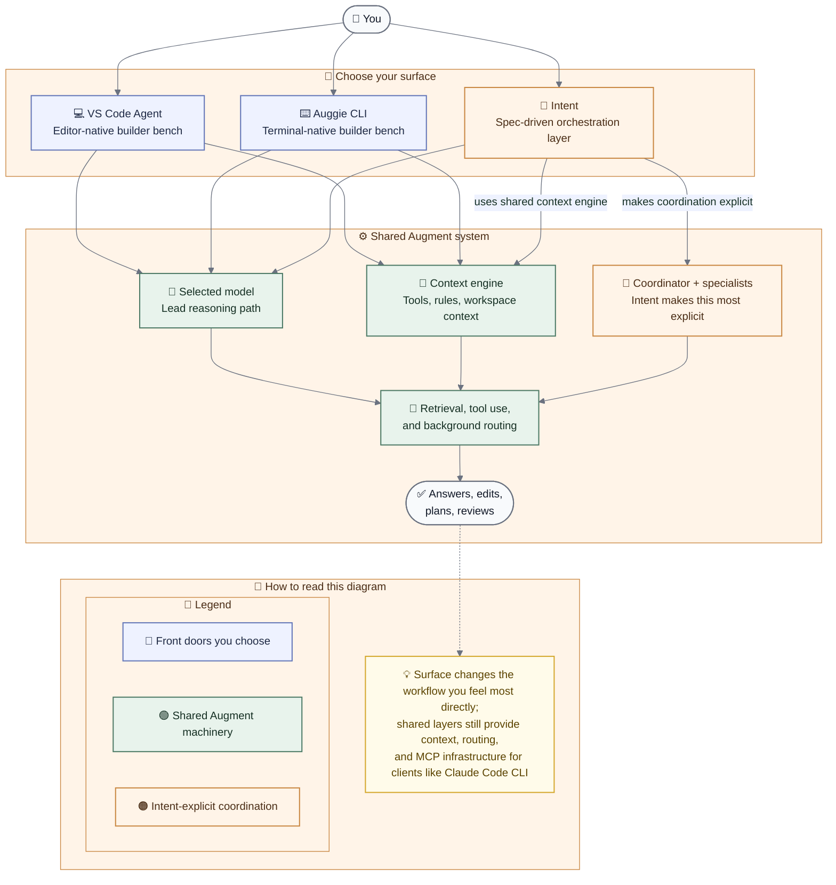

# 🧠 Augment Architecture Notes

## Executive summary

- **Augment is not best understood as one chatbot**. It behaves more like an agentic system with context, tools, rules, and sometimes specialized roles.
- **The three main user-facing surfaces are different on purpose**: VS Code Agent is the editor-native builder bench, Auggie CLI is the terminal-native builder bench, and Intent is the orchestration layer.
- **MCP extends the ecosystem without becoming a fourth native surface**: you can plug Augment Context Engine into external clients, for example **Claude Code CLI**, while Augment supplies the retrieval layer underneath.
- **Intent makes the team metaphor explicit** with coordinator-style planning, specialist roles, specs, and delegated work.
- **The most important open architecture question is model routing**: choosing something like `Opus` likely sets the lead reasoning path, but may not mean it is the only model or system involved in every behind-the-scenes step.

This started as class research and turned into something better: a **shareable field guide** to how Augment feels in real use.

The goal is not to dump every fact at once.

The goal is to give someone just enough of the right mental model that they think:

> *“Ohhh. This is not just one chatbot. This is a workflow.”*

One of the biggest questions behind this whole note is also one of the most interesting:

> *When you choose something like Opus, are you really getting only Opus — or is Augment still quietly routing some behind-the-scenes work to lighter models or supporting systems?*

> **Sources used here:** public Augment docs reviewed on 2026-03-06 + Intent-native observations shared from this workspace

## ✨ If you only read one minute of this

Augment gets much easier to understand when you stop imagining **one assistant** and start imagining a **small software team**.

It also gets easier when you separate the three main front doors people actually use:

- **VS Code Agent** = the editor-native builder bench
- **Auggie CLI** = the terminal-native builder bench
- **Intent** = the orchestration layer

- **General** explores
- **Developer** builds
- **PR Reviewer** checks
- **PR Shepherd** helps move work toward merge-ready
- **UI Designer** polishes the experience

But the real magic is not just the starter types.

It is the workflow:

> **one agent plans → one builds → one reviews → one polishes**

And one of the central ideas this guide is exploring is:

> **your chosen model may be the lead thinker, without necessarily being the only system doing every piece of work.**

That helps explain why Intent can feel surprisingly smooth in larger repos.

## 🗺️ The mental model that makes everything click

The safest way to think about Augment is this:

| Layer | What it does | Confidence |
| --- | --- | --- |
| VS Code Agent / Auggie CLI / Intent | The surfaces where you interact with Augment | ✅ |
| Rules & guidelines | Teach Augment your preferences and project conventions | ✅ |
| Tools | Let the agent read, edit, search, and run commands | ✅ |
| Subagents / specialists | Give narrower jobs to more focused agents | ✅ |
| Retrieval / context systems | Help Augment find the right code and docs quickly | 🟡 |
| Internal model routing | May optimize how work is handled under the hood | ❓ |

In plain English:

> **Augment is best understood as an agentic system with roles, tools, and context — not just a single prompt going to a single model.**

That is exactly why the “Opus selected by default” question matters so much: the interesting architecture question is often not just *which model you picked*, but *what else the system may still be orchestrating around it*.

## 🧭 Same ecosystem, three very different front doors

Before going deeper into Intent, it helps to separate the three surfaces users are most likely to touch.

| Surface | What it feels like | Best at | Distinct thing users notice |
| --- | --- | --- | --- |
| **VS Code Agent** | A native IDE teammate | Tight iteration, code edits, reviewing changes without leaving the editor | Public docs say the selected model in the Augment panel applies to Agent for the current workspace |
| **Auggie CLI** | A terminal-first agentic assistant | Shell-heavy work, repo inspection, quick command-driven tasks | Interactive mode shows tool calls and results, and docs note the CLI is still missing some IDE-plugin features |
| **Intent** | A spec-driven orchestration layer | Planning, delegation, parallel specialists, and cleaner handoffs | Public docs describe it as both a spec-driven development app and an agent orchestration app, and say each prompt creates a Space with its own dedicated git branch and worktree |

What stays similar across all three:

- they belong to the same Augment ecosystem
- they rely on Augment’s codebase understanding and context systems
- rules, tools, and workspace context still matter
- model choice still matters
- shared repo understanding is **not** the same thing as shared chat history

One extra twist is worth naming: **MCP is not really a fourth front door. It is plumbing.**

That matters because Augment’s **Context Engine MCP** can be plugged into other agent clients too, which means the ecosystem is not limited to Augment’s native surfaces.

For example, you might use **Claude Code CLI** while letting Augment provide the deep codebase retrieval layer underneath through MCP.

If I had to reduce the distinction to one line:

> **VS Code helps you build in place, CLI helps you build from the terminal, and Intent helps you organize the whole operation.**

## 🎭 Intent is where the cast becomes explicit

Of the three surfaces, Intent is the one that makes roles the most visible.

VS Code Agent and Auggie CLI can still feel agentic.

Intent is just the place where the team structure becomes part of the product itself.

One of the most useful additions to this guide came from **Intent itself in this workspace**.

Here is the simple breakdown worth sharing with teammates:

| Agent type | Best for |
| --- | --- |
| `General` | Exploring a repo, planning work, documenting, and figuring out next steps |
| `Developer` | Building features, editing files, fixing bugs, and implementing scoped tasks |
| `PR Reviewer` | Reviewing changes, checking for issues, and giving feedback |
| `PR Shepherd` | Moving a branch or PR toward merge-ready by coordinating fixes and follow-up |
| `UI Designer` | Layout, visual polish, UX, navigation clarity, and front-end presentation |

If you want the shortest possible summary:

- **General** = figure it out
- **Developer** = build it
- **Reviewer** = check it
- **Shepherd** = move it to done
- **UI Designer** = make it feel better

## 🧩 Where Intent gets interesting

The real power is not just picking a starter type.

It is using agents like a **small team instead of one all-purpose chatbot**.

A common pattern looks like this:

1. **Coordinator** plans the work
2. **Developer / Implementor** builds it
3. **Reviewer / Verifier** checks it
4. **UI Designer** improves presentation when needed

So the real advantage is not just the role label.

It is the ability to combine roles into a workflow with clear responsibilities.

That is what makes Intent feel different from VS Code Agent or Auggie CLI.

Those two are fantastic builder benches.

Intent is the planning room with the whiteboards on the wall.

## 🛠️ What a specialist really is

A specialist is basically **an agent with a narrower job than a normal starter type**.

In plain English, creating a specialist means:

- give the agent a single role
- give it clear boundaries
- give it success criteria
- let it hand off when needed

Example specialist flow:

| Specialist | Job |
| --- | --- |
| Coordinator specialist | Writes the plan, breaks work into waves, delegates |
| Pine Script developer specialist | Focuses only on Pine code, tests, and notes |
| Verifier specialist | Checks whether the output matches the spec and catches regressions |

This is why Intent can feel more reliable as work gets bigger: **each agent has less ambiguity about what “good” looks like**.

## 💬 How communication works between agents

There are two especially useful ways to think about agent communication in Intent:

### 1) Persistent workspace agents

These are agents you add manually and keep around in the workspace.

Why that matters:

- they stay available
- they can get familiar with the repo over time
- they become part of your standing workflow

### 2) Task-based delegated agents

These are created or assigned for a specific scoped task.

Why that matters:

- work can be split into passes
- different agents can own different kinds of thinking
- you do not need one giant conversation doing everything at once

In practice, a coordinator-style agent can:

- write or update a shared spec
- break work into task waves
- delegate tasks to developers
- ask reviewers or verifiers to check results
- send follow-up messages if something needs revision

That is when it starts to feel less like chatting and more like **orchestrating a lightweight software team**.

## 📍 A practical use pattern that works well

If someone asked, *“Okay cool, but how would I actually use this?”* — this is a strong real-world pattern:

1. start with **General** when you need discovery or planning
2. use **Developer** when implementation begins
3. add **UI Designer** when presentation matters
4. add **PR Reviewer** when you want a standing review layer
5. use a **Coordinator-style** agent once the repo or task gets complex enough to benefit from planning and delegation

Why this works:

- one agent organizes
- one builds
- one checks
- one polishes

That structure becomes especially helpful when a project mixes:

- docs
- code
- UI
- multi-step changes
- verification

## 🧠 Why this workspace has probably felt smooth

Based on the Intent behavior you shared, the likely pattern was:

1. you started with a **General** workspace
2. you added a **Coordinator-style** agent
3. that coordinator delegated implementation and review work

That is exactly why it can feel so smooth:

> **you are not using Intent like a single chatbot — you are using it like an orchestrated team**

## 🔄 What to do after you add agents

This part is refreshingly simple.

Once the agents exist, you can say things like:

- `Developer added`
- `Reviewer added`
- `UI Designer added`
- `All 3 added`

Then the coordinator can handle the next move.

That usually works best when the flow is:

1. add or update the spec
2. define the task clearly
3. approve the plan
4. delegate implementation
5. route verification afterward

That keeps the work traceable and avoids “mystery AI changes.”

## 🤝 Can the agents communicate after that?

Yes.

Once they exist in the workspace, they can be worked with in two broad ways:

- **message them / coordinate with them**
- **delegate scoped work through the spec**

That is one of the best reasons to use Intent for multi-step work:

> the workflow stays structured instead of dissolving into one endlessly branching chat

## 🧱 Important architecture notes that are easy to miss

These details matter a lot in real life.

### Chat history is siloed by interface

Augment VS Code, Augment CLI, and Augment Intent do **not** share chat transcripts.

The main exception you mentioned is **Claude Code CLI + Claude Code VS Code**, which can share history via `claude --resume`.

So if someone expects one Augment surface to “remember the conversation” from another, that expectation will usually be wrong.

### Shared context is not the same as shared conversation

Different Augment interfaces may share the same **codebase context or indexing**, but that is not the same thing as sharing chat history.

This is a big distinction.

- **shared context** = they may understand the same repo
- **shared history** = they remember the same conversation

Those are not the same.

### Files on disk are the bridge

If you want continuity across tools or interfaces, the safest bridge is not memory.

It is files.

That means:

- specs
- notes
- handoff docs
- decision logs
- TODO files

If a decision matters, write it down somewhere the next tool can read.

### Intent uses its own clone of the repo

This is another very practical detail.

Intent can work in a **separate working copy**, which helps agents operate without colliding with another tool’s uncommitted changes.

The upside:

- less accidental interference
- cleaner scoped work

The tradeoff:

- syncing between clones matters if you are also working in VS Code or another local clone

## ⚙️ Where rules and subagents fit into all this

This is the less glamorous part, but it is important because it explains how you shape behavior.

| If you want to... | Use this |
| --- | --- |
| Set personal preferences everywhere | User Guidelines or `~/.augment/rules/` |
| Share repo-wide standards | `<workspace_root>/.augment/rules/` |
| Add directory-specific behavior | `AGENTS.md` or `CLAUDE.md` in subdirectories |
| Create a reusable specialist | `./.augment/agents/` subagent |
| Make a read-only reviewer | Subagent with `disabled_tools` |

Public docs clearly support:

- user rules
- workspace rules
- hierarchical `AGENTS.md` and `CLAUDE.md`
- CLI subagents with their own prompt, model, and tool permissions

That means the “specialist agent” idea is not just a vibe.

It is a real part of how Augment can be configured.

## 🤖 What the public docs clearly support

Here is the short version, without overloading the reader:

- Intent docs describe Intent as both a **spec-driven development app** and an **agent orchestration app**
- Intent docs say creating a prompt creates a **Space** with its own dedicated git branch and worktree
- CLI docs say interactive mode shows **tool calls and results** and note Auggie is currently beta and does **not** support all IDE-plugin features yet
- Agent docs say Augment Agent is powered by **Context Engine** and a powerful **LLM architecture**
- Agent docs say the selected model in the Augment panel applies only to **Agent for the current workspace**
- Context Engine MCP docs say you can **plug Augment Context Engine into any agent via MCP**
- Context Engine MCP docs describe a **local server** for active development and a **remote server** for adding to / understanding code
- MCP docs explicitly include quickstarts for external tools like **Claude Code CLI**, which makes the “Augment context + non-Augment agent client” pattern a documented capability
- **User Guidelines** are stored locally in the IDE and apply to Agent and Chat in that IDE
- **User Rules** live in `~/.augment/rules/` and apply across workspaces
- **Workspace Rules** live in `<workspace_root>/.augment/rules/`
- **Hierarchical rules** come from `AGENTS.md` and `CLAUDE.md` found up the directory tree
- In IDE docs, workspace rules support **Always / Manual / Auto**
- In CLI docs, rule frontmatter uses `always_apply` and `agent_requested`
- CLI docs note that **manual rules are not yet supported there**
- User Guidelines do **not** currently apply to Completions, Instructions, or Next Edit

The one subtle but important nuance:

> only `AGENTS.md` and `CLAUDE.md` are discovered hierarchically — `.augment/rules/` is loaded from the workspace root, not every subdirectory

Another useful nuance:

> MCP extends Augment beyond its native interfaces. VS Code Agent, Auggie CLI, and Intent are the main Augment surfaces — but Context Engine MCP lets Augment also act like shared context infrastructure for other clients.

## 🧪 Subagents are very real

The CLI docs are especially clear on this point.

Subagents can have their own:

- prompt
- context window
- model
- tool restrictions
- workspace or user-level storage location

They can also run in parallel and report progress back to the main thread.

That gives strong public support for the broader idea that **Augment can work as a system of specialists, not just one monolithic assistant**.

## 🧠 The one place to stay cautious: model routing

This was the most speculative part of the original research, and it is still the part I would phrase most carefully.

It is also one of the most important themes of this document.

The practical question many people really care about is this:

> **If I choose Opus as my default, does Augment still delegate some behind-the-scenes work to lighter models like Sonnet or Haiku, or to other supporting systems, without asking me?**

That question matters across **all three surfaces**.

The workflow may feel different in VS Code, CLI, and Intent, but that does not automatically mean the internal routing contract is fully different or fully exposed.

Safe version:

> **Choosing a model in Augment likely affects primary reasoning behavior, but the public docs reviewed here do not define an exact per-subtask routing contract.**

The best cautious explanation for teammates is:

- your selected model likely matters a lot
- that does **not** necessarily mean it is the only thing involved in every internal step
- it is very plausible that Augment combines the chosen model with retrieval, tooling, and possibly lighter-weight background handling
- the exact “Opus delegates to Sonnet/Haiku in these specific cases” contract is **not** clearly spelled out in the public docs reviewed here

What I would avoid presenting as fact:

- “Opus always plans, Sonnet always executes, Haiku always handles cheap work.”
- “The selected model is the only system touching every step.”

Those ideas may be plausible.

But based on the docs reviewed here, they are not something I would present as a guaranteed internal contract.

## 🪄 The most useful way to explain the three surfaces to a teammate

If I had to explain them quickly to a teammate, I would say this:

- **VS Code Agent** = the fastest builder bench when you want to stay in the editor
- **Auggie CLI** = the fastest builder bench when your workflow already lives in the terminal
- **Intent** = the best orchestration layer when the work benefits from specs, delegation, and specialist handoffs

And across all three, the most interesting architecture question is still not just “which model did I pick?”

It is also:

> **what work might still be getting routed automatically behind the scenes?**

## ❓ Open questions still worth watching

Even after all this, a few questions remain interesting:

1. What is the exact internal routing policy between high-end and lightweight models?
2. Does model selection behave identically across VS Code, CLI, and Intent in every case?
3. How stable are these Intent role labels across workspaces and future versions?
4. How much of Augment’s orchestration is model-to-model delegation versus retrieval, tooling, and background infrastructure?

## 🔗 Sources used for this note

- Augment docs — Introducing Intent by Augment  
  <https://docs.augmentcode.com/intent/overview>
- Augment docs — Using Agent  
  <https://docs.augmentcode.com/using-augment/agent>
- Augment docs — Interactive mode  
  <https://docs.augmentcode.com/cli/interactive>
- Augment docs — Context Engine MCP  
  <https://docs.augmentcode.com/context-services/mcp/overview>
- Augment docs — Claude Code Quickstart  
  <https://docs.augmentcode.com/context-services/mcp/quickstart-claude-code>
- Augment docs — Rules & Guidelines for Agent and Chat  
  <https://docs.augmentcode.com/setup-augment/guidelines>
- Augment docs — Rules & Guidelines (CLI)  
  <https://docs.augmentcode.com/cli/rules>
- Augment docs — Subagents  
  <https://docs.augmentcode.com/cli/subagents>
- Intent-native summaries captured in this workspace  
  Source: user-provided Intent role / workflow notes on 2026-03-06
