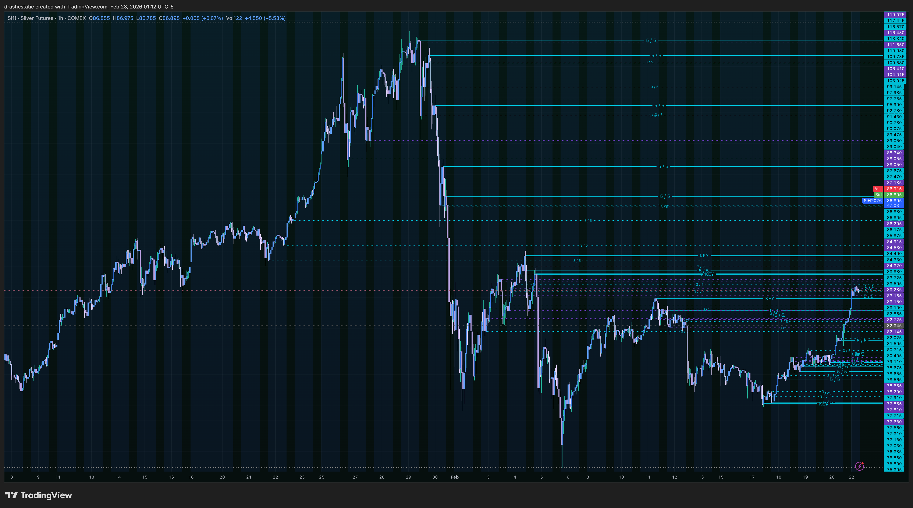
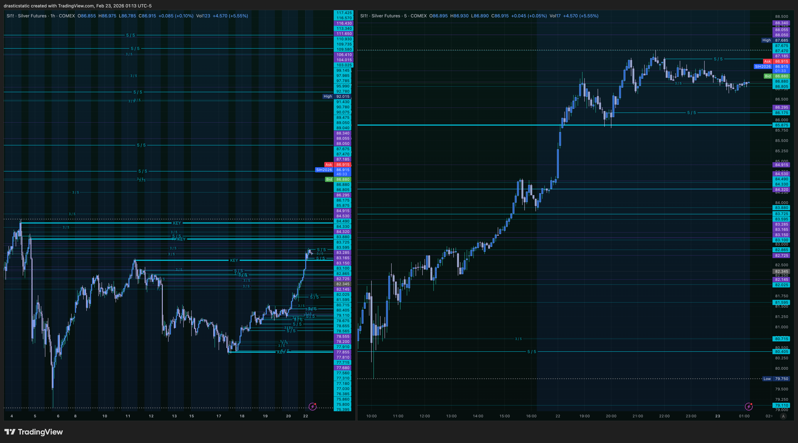
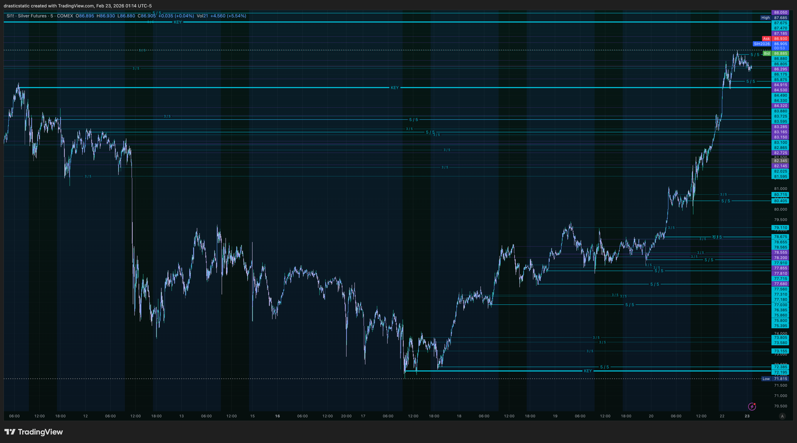
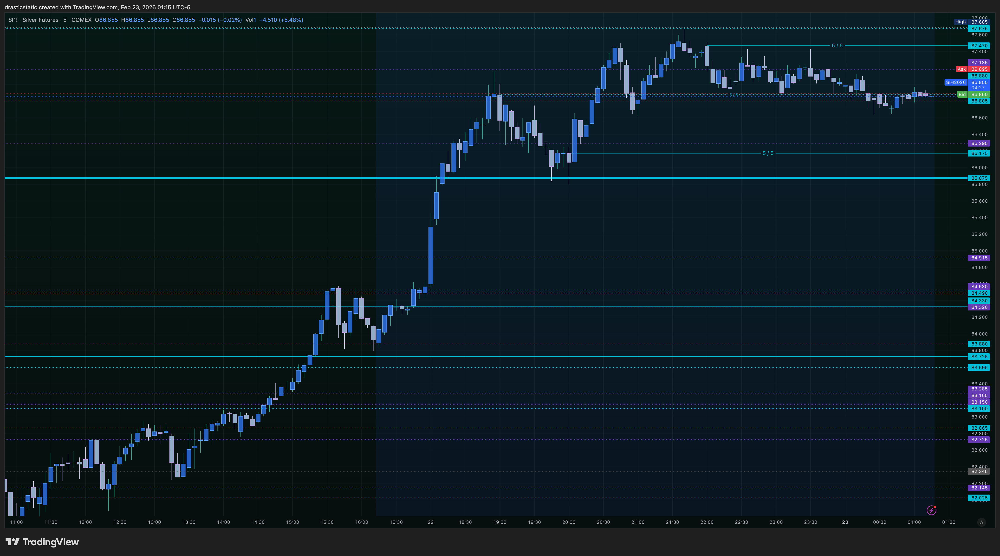
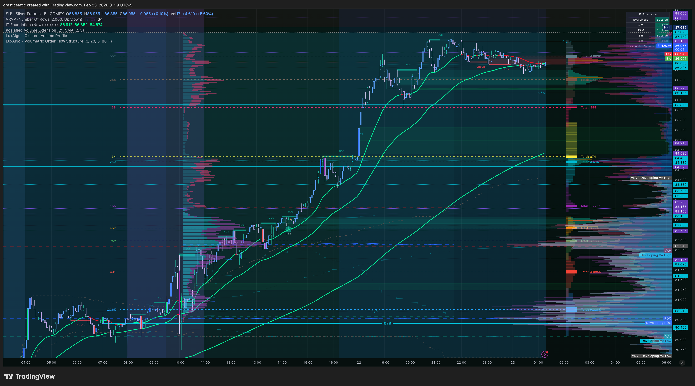

# 🥇🥈 GC + SI — SMT Divergence Analysis
### Gold & Silver Futures | Pre-Market Feb 23, 2026 | Fortuna

---

> 🎯 **Primary bias: Bullish on both metals**
> 🔍 **SMT status: No active divergence — both trending together**
> ⚡ **Key watch: SI relative strength at any GC ATH sweep**

> ⚠️ **FCR correction (locked in):** First candle =
> 15-min close (9:30–9:45 EST). LONG/SHORT from HERE rays
> mark the HIGH/LOW of that 15-min candle. Entry = limit
> order on the FVG displacement break on 5-min chart.

---

## 📊 SI Screenshots

### 1 — Macro View


### 2 — 1hr + 5min Dual View


### 3 — Clean Trend View


### 4 — 5min + VRVP


### 5 — 5min + IT Foundation EMAs + Clusters VP + VRVP


---

## 🥈 SI — Structure Analysis

### 🌍 Macro View (Screenshot 1)

Silver's macro chart mirrors GC almost exactly — the same
V-shaped sharp selloff absorbed and then a powerful bull
rally back toward ATH levels. The right side of the chart
shows a dense stack of cyan **5/5 levels** created on the
way up, identical in character to GC's level architecture.

> ⚠️ **Price note:** Exact price levels not confirmed from
> chart reading — Christopher's chart data is the source of
> truth. The structural read is based on candle patterns
> and level placement only.

One immediately visible difference from GC: SI's recovery
rally has a **steeper recent impulse** visible on the macro
chart — the final leg up to current levels came in a very
sharp move, creating a gap in the level structure below.
That gap = potential fast-move territory on any pullback.

---

### 📐 1hr Structure (Screenshot 2)

The dual view (1hr left, 5min right) tells the same bullish
story as GC but with one notable detail: the **5/5 level
cluster on SI is more spread out** than GC's tight ATH
stack. This means SI's 1hr color flips happened at more
distributed price points during the rally — there are
identifiable support steps rather than one tight cluster.

That's actually constructive for pullback long setups:
each 5/5 level is a potential reaction point with room
between them, rather than a messy overlapping cluster.

The 5min (right panel) shows price has pulled back from
the recent high and is sitting above what appears to be
a 5/5 support level — watching for bullish continuation.

---

### 🌏 Trend Context (Screenshot 3)

The clean wide view confirms: SI broke out of a major
multi-month base, re-accumulated, and launched. Higher
highs, higher lows on every timeframe. The trend is up.
The 5/5 ladder below provides structured support all the
way down.

**Critical observation:** Looking at SI's chart vs GC's
chart side by side — SI has **not yet eclipsed its prior
all-time high** in the same way GC has. GC has been making
clear new ATH territory (per the price data: ATH 5626.8).
SI's rally, while strong, appears to be approaching but
**potentially lagging behind GC's ATH extension.**

This lag is the foundation of the SMT divergence framework.

---

### 📦 Volume Profile — 5min VRVP (Screenshot 4)

The 5-min chart with VRVP shows:

- **POC is below current price** — buyers have been pushing
  above value area, momentum continuation signal ✅
- The sharp impulse candle visible on the 5min created an
  **imbalance zone** (FVG territory) below current price —
  this is where a pullback would naturally find buyers
- The VRVP distribution is building a new value area at
  current levels — absorption happening
- **Labeled levels visible:** 5/5 levels at the key
  reaction points, including one solid cyan line that
  appears to be a KEY level (thicker line weight) marking
  a significant structural pivot

The 5-min labels I can read from this chart give us the
current operating range — levels Christopher has marked
define the structure clearly.

---

### 📈 IT Foundation EMAs + Clusters VP (Screenshot 5)

The most information-rich screenshot:

- ✅ IT Foundation EMAs: **steeply bullish** — same config
  as GC, angling sharply upward
- ✅ Price is **above** the EMA envelope — trend extended
- ✅ Current price is **pulling back toward** the EMA stack
  — this is the Scenario A setup on SI as well
- **LuxAlgo Clusters VP:** horizontal volume bands visible
  — these are indicator-generated lines, not manual levels.
  The volume cluster zones show where significant volume
  has transacted, providing additional confluence context
- **VRVP (right panel):** confirms POC and value area
  distribution consistent with screenshot 4

> 🔍 The EMA pullback on SI is setting up identically to
> GC — both pulling back toward their respective EMA stacks
> from extended ATH positions.

---

## 🔴🟡 SMT Divergence — GC vs SI

### Current Status: Tracking Together ✅ (No Divergence)

Both metals are in confirmed bull trends with identical
macro structure — same V-shape recovery, same 5/5 ladders,
same EMA configuration. As of this pre-market read, SI
is **not diverging from GC.** They are moving in sync.

**This is the baseline.** What matters is whether they
*stay* in sync at the next key test.

---

### The Divergence Playbook for NY Open

**Scenario 1 — 🟢 Full Sync (Continuation)**
```
GC pushes toward ATH (5626.8 area)
SI also pushes toward its corresponding high
→ Both metals showing strength together
→ Long bias confirmed on BOTH instruments
→ Scenario A setups on both:
   Wait for 15-min first candle close (9:30–9:45)
   Watch for FVG displacement above the high
   Enter limit on FVG, SL candle 1 low, 2:1 TP
```

**Scenario 2 — 🔴 SMT Bearish Divergence (GC leads)**
```
GC sweeps above ATH (5626.8) — liquidity grab
SI FAILS to make a corresponding new high
→ Smart money running a GC liquidity trap
→ Watch GC 1hr for bearish color flip
   (this creates a new 5/5 level at the top)
→ Wait for 15-min first candle close at 9:30–9:45
→ If first candle is bearish and closes below the
   ATH sweep level:
   Mark the LOW as SHORT from HERE
   Wait for FVG displacement below on 5-min
   Enter limit on FVG, 2:1 TP
→ SI confirmation: if SI also starts turning
   bearish at its high = added confluence
```

**Scenario 3 — 🔴 SMT Bearish Divergence (SI leads)**
```
SI sweeps its high and rejects hard
GC hasn't yet reached its ATH
→ Silver leading the exhaustion signal
→ Watch GC for follow-through weakness
→ Same FCR setup rules apply once GC
   shows the first 15-min bearish close
```

**Scenario 4 — ⚪ Chop / No Setup**
```
Both metals churn below their highs
No clean 15-min first candle direction
No valid FVG displacement
→ Stay flat. There is no trade today.
   Tomorrow will offer a cleaner setup.
```

---

## 🎯 Pre-Session Checklist

```
FCR Execution Rules (updated — E-Book confirmed):
[ ] Both SI and GC charts open side by side
[ ] At 9:30 ET: watch BOTH for direction clues
    during the 15-min first candle formation
[ ] At 9:45 ET: first 15-min candle CLOSES
    → Mark HIGH (LONG from HERE)
    → Mark LOW (SHORT from HERE)
    → on BOTH instruments
[ ] Switch to 5-min chart
    → Wait for FVG displacement through H or L
    → FVG valid = any of 3 candles closes OUTSIDE
      the first 15-min candle range
    → Enter LIMIT ORDER on the FVG
    → SL = low of candle 1 of FVG pattern
    → TP = 2:1 fixed R:R
[ ] Monitor SI vs GC for divergence at any ATH
    approach — one sweeping while other lags = trap
[ ] Mental state check before session start (1-10)
[ ] Out of all trades by 4:00 PM ET
```

---

## 📐 What to Watch Overnight (Before NY Open)

The ETH session on both metals will set context:

- **GC:** Does overnight price reclaim the 5/5 cluster
  just below ATH, or does it continue distributing?
- **SI:** Does SI track GC's overnight movements with
  similar magnitude? Asymmetry overnight = early SMT
  signal for the morning session.
- **Key tell:** If GC rallies overnight but SI lags
  proportionally → potential divergence setup brewing
  for the 9:30 open.

---

*🙏🏼 Fortuna — Wealth Warden | Claude Code CLI*
*Anthropic claude-sonnet-4-6 | Feb 23, 2026*
