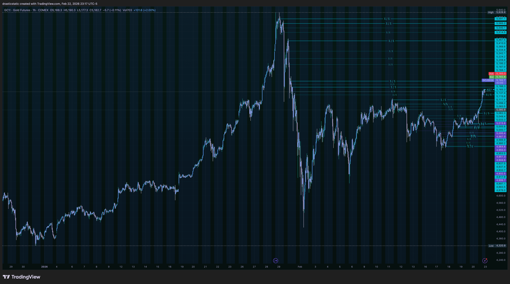
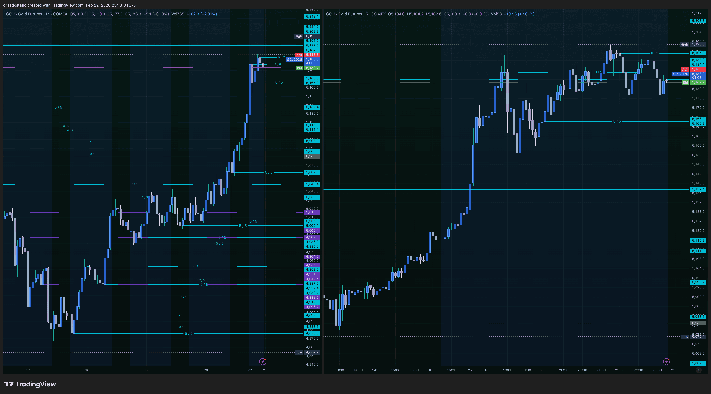
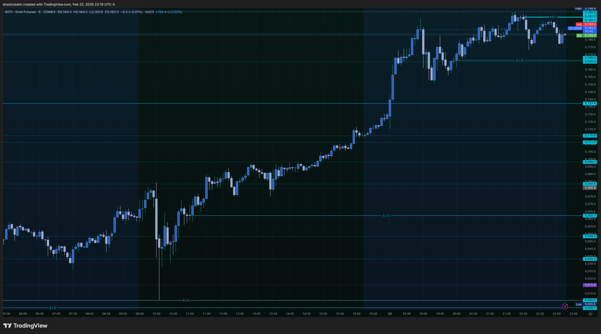
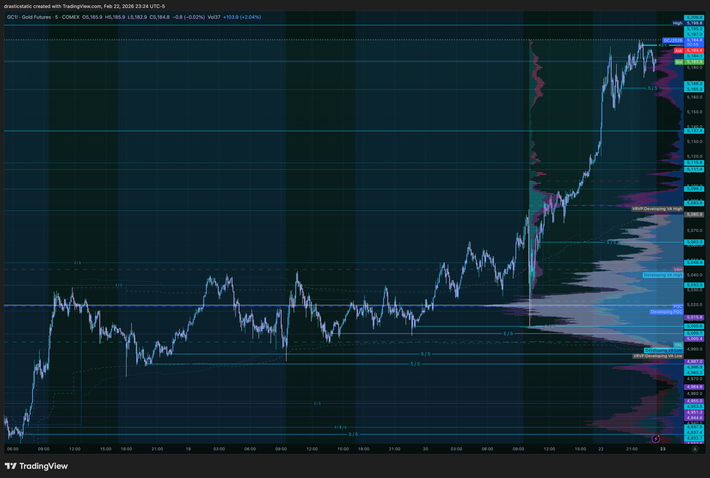
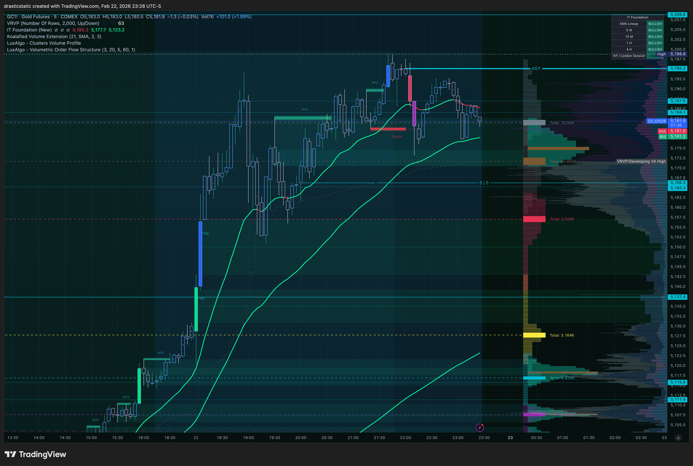

# 🥇 GC — Pre-Market Analysis
### Gold Futures | Sunday Feb 22, 2026 | Fortuna

---

> 🎯 **Session bias: Bullish**
> Best setup: **Scenario A** — EMA pullback + LONG from HERE at 9:45
> SMT watch: **SI analysis → `GC_SI_SMT_premarket_20260223.md`**
> ⚠️ FCR correction: first candle = 15-min close (9:30–9:45), not 5-min

---

## 📊 Screenshots

### 1 — Macro View (Wide)


### 2 — 1hr + 5min Dual View


### 3 — Clean Trend View


### 4 — 5min + VRVP


### 5 — 5min + IT Foundation EMAs + VRVP


---

## 🌍 Macro Structure

Gold is in a **historic parabolic bull run.** The wide chart
shows a clean V-shaped selloff fully absorbed, followed by a
relentless drive to all-time highs. Per chart data:
- **ATH: 5626.8**
- **Recent significant level: 5198.8**

The right side of the macro chart is a tight stack of cyan
**5/5 levels** — every one a 1hr color flip created on the
way up. That cluster near ATH means the 1hr has been flipping
rapidly as price carves new ground. That's what a parabola
looks like in the level system.

> 💡 **Key observation:** Price hasn't spent enough time at
> these ATH levels to create meaningful 3/5 demotions yet —
> everything in the cluster is still active and fresh.

> ⚠️ **Fortuna correction:** An earlier version of this file
> incorrectly stated ATH as "$2,935–$2,945" — those were
> pre-training assumptions, not chart data. Corrected above.

---

## 📐 1hr Structure

[](.)
Bullish ladder of support intact on the 1hr.

The dual view (screenshot 2) confirms:

- Clean bullish impulse with multiple **5/5 levels** on the
  way up providing layered support below current price
- The tight level cluster near ATH = fresh, unmitigated
  institutional reference points
- 5min shows slight pullback from ATH spike into
  consolidation — structure holding

**1hr verdict: 🐂 Strongly bullish. Trend intact.**

---

## 🌏 Trend Context

Screenshot 3 (clean view) shows the full picture clearly:
Gold broke out of a multi-month consolidation, re-accumulated,
and launched. Every timeframe shows higher highs and higher
lows. There is no structural reason to fight this trend —
the bias is **long until a KEY level breaks.**

---

## 📦 Volume Profile (5min VRVP)

The VRVP on the 5min (screenshot 4) is confirming:

- **POC sits below current price** — in a trending market,
  this means buyers are consistently pushing above the
  established value area → momentum continuation signal ✅
- The ATH spike created a new volume node at the top that
  is still forming (absorption, not yet distribution)
- **LuxAlgo Clusters VP** lines are visible on this chart —
  these are indicator-generated levels, not manually placed
  rays

> 🔍 **Watch that forming node** — if buyers absorb it,
> it becomes the new value base. If sellers defend it,
> it becomes near-term resistance.

---

## 📈 IT Foundation EMAs (Inevitrade)

Screenshot 5 shows the Inevitrade EMA configuration:

- ✅ EMAs steeply angled **upward** — strong bull trend
- ✅ Price ran **above** the EMA envelope to ATH
- ✅ Current pullback is back **toward** the EMA stack

That pullback toward the EMA is the setup. In a strong
trending market, price stretching above the EMAs and
returning to them is where **disciplined trend-following
entries live** — the EMAs represent the institutional
interest line.

> ⚠️ **Note:** The colored lines visible in screenshot 5
> alongside the EMAs are from the **LuxAlgo** and **IT
> Foundation** indicators — not manually placed FCR levels.
> No LONG/SHORT from HERE levels have been placed on GC
> for this session.

---

## 🥈 GC + SI — SMT Divergence Framework

Adding **Silver (SI)** to the chart set is the right call.
GC and SI are the cleanest SMT divergence pair in the metals
complex — when they split at a key level, smart money is
running a trap on one side.

### What to watch:

**✅ Bullish confirmation (both in sync)**
```
GC sweeps ATH → SI also sweeps its high
Result: institutional momentum, continuation
Bias : long
```

**⚠️ SMT Bearish Divergence (manipulation signal)**
```
GC sweeps ATH liquidity above cluster
→ SI FAILS to make corresponding new high
Result: liquidity sweep on GC, likely reversal
Action: watch for 1hr bearish color flip at ATH
        → would create a new 5/5 / KEY level
        → potential short setup IF Christopher
           places a SHORT from HERE at that level
```

**⚠️ SMT Bearish Divergence (Silver leads)**
```
SI sweeps its high → GC lags / fails
Result: silver leading the exhaustion signal
Action: same — watch GC for structural confirmation
```

> The divergence between GC and SI is one of the most
> reliable institutional tells in the metals complex.
> One sweeping while the other fails = liquidity trap.

---

## 🎯 Scenarios for NY Open (9:30 ET)

---

### 🟢 Scenario A — EMA Pullback Long *(Highest Probability)*
**Trend-aligned | A+ Setup**

```
Price pulls back toward EMA stack overnight
→ finds 5/5 support level in the ladder
→ Christopher places LONG from HERE
→ FCR entry at 9:35 on first bullish
  5min candle above that level
```

Confirmation checklist:
- [ ] Price at or near IT Foundation EMA stack
- [ ] 5/5 level providing support at pullback low
- [ ] SI making corresponding higher low (no divergence)
- [ ] First 5min candle at 9:30 closes bullish above level
- [ ] LONG from HERE placed, 9:35 FCR entry

**Why it's A+:** EMA + 5/5 level + trend direction + SI
confirmation = four-layer confluence. This is the setup
to wait for patiently.

---

### 🟡 Scenario B — ATH Sweep + SI Divergence Short
**Counter-trend | Requires SI confirmation**

```
Price spikes above ATH into cluster zone
→ SI fails to confirm new high
→ 1hr candle body closes bearish = new 5/5
→ Christopher places SHORT from HERE at that 5/5
→ FCR entry at 9:35 on first bearish 5min candle
```

Confirmation checklist:
- [ ] GC sweeps above ATH, SI does NOT follow
- [ ] 1hr candle at ATH closes bearish (creates 5/5)
- [ ] SHORT from HERE placed at that 5/5 level
- [ ] First 5min candle at 9:30 closes bearish
- [ ] VRVP POC has shifted above current price

**Why it needs all boxes checked:** This is a
counter-trend trade in a parabolic market. Every box
must confirm. Missing one = stay flat.

---

### ⚪ Scenario C — Choppy ATH Consolidation
**No setup | Stay flat and observe**

```
Price churns in the 5/5 cluster
No clean FCR structure at 9:35
No SI divergence signal
→ No trade. Watch and learn.
```

> Not every session hands you a trade. Scenario C
> with patience is still a winning outcome.

---

## 📋 Pre-Session Checklist

```
[ ] SI chart leveled up + open alongside GC
[ ] Note whether overnight session confirms or
    challenges the 5/5 ladder below ATH
[ ] Check if 1hr has created any new 5/5 levels
    (new color flips) overnight
[ ] Identify which scenario price is setting up
    BEFORE 9:30 — not after
[ ] Mental state check before session start
```

---

*🙏🏼 Fortuna — Wealth Warden | Claude Code CLI*
*Anthropic claude-sonnet-4-6 | Feb 22, 2026*
