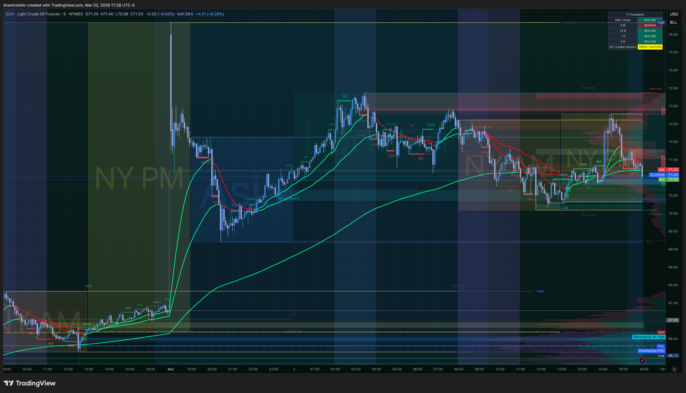
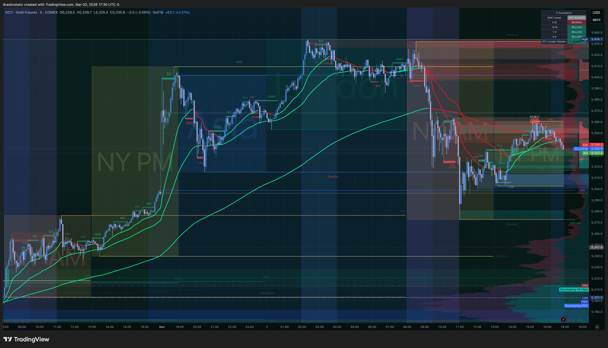
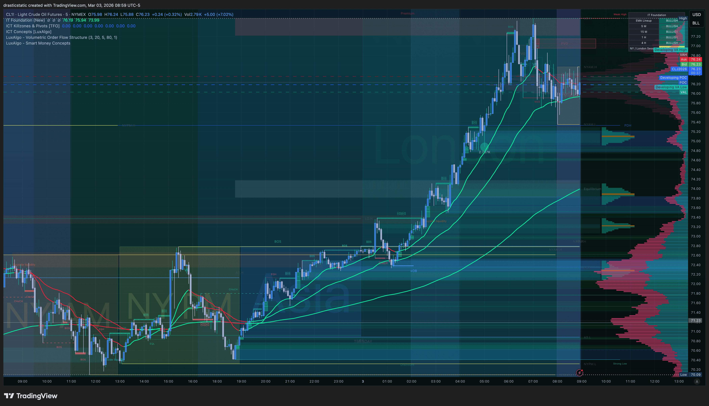

# Pre-Market — CL (Light Crude Oil) | Tuesday, March 3, 2026
#### Fortuna — Wealth Warden | Claude Code CLI
#### Basis: March 2 Evening Session Read (5:28 PM ET)

---

## Instrument Context

| Field | Value |
|-------|-------|
| Instrument | CL (Light Crude Oil) — CLJ6 |
| Session | NY AM — Tuesday, March 3, 2026 |
| Evening Read Timestamp | March 2, 2026 — 5:28 PM ET |
| Apex Status | ✅ Tradeable — CL is not on the halted metals list |
| Metals (GC, SI) | ❌ Halted on Apex — reference only |

---

## March 2 Evening Context (Carried Forward)

**What happened to CL on March 2:**
- ISM Manufacturing PMI (10:00 AM) triggered a large bullish spike across all instruments including CL
- CL ran strongly from the overnight lows through the NY AM session on the ISM print
- Post-spike: price ran to the day's high, then distributed lower through the NY PM session
- By 5:28 PM ET, CL was in the NY PM zone with the day's bullish run losing steam

**IT Foundation EMA Read at 5:28 PM (1-hour chart):**
- EMAs ran steeply green through the morning ISM spike
- By NY PM: EMAs **converging** — faster EMA beginning to cross or cross through the slower
- Status: **Transitioning — no longer clean green dominant**
- Implication: No directional confirmation. EMA gate not clear for either bias.

**GC (Gold) Read at 5:30 PM — Confluence Reference:**
- GC sold off hard post-ISM — large bearish distribution through PM session
- IT Foundation EMAs: **Red dominant** — bearish cross confirmed
- GC aligned bearishly = commodity sector headwind for CL
- Not tradeable on Apex — reference only

**17:28 ET — CL ISM spike visible, EMAs converging post-run, transitioning**

**17:30 ET — GC red dominant confirmed, bearish commodity alignment for CL context**

---

## Into Tuesday March 3 — Overnight Update

*CL 1hr at 8:59 AM ET — overnight resolution bullish. EMAs fanned out green dominant. Strong bullish structure.*

**Overnight resolution:** The EMA transition flagged in the March 2 evening session resolved **bullish**. CL did not roll over — it continued higher through the overnight ETH session.

**IT Foundation EMA Read (1-hr, March 3 morning):**
- **GREEN DOMINANT** — EMAs have fanned out in a clear bullish stack
- Price is above both EMAs; EMAs are angled upward and separated
- This is no longer a transition — it is a confirmed bullish EMA structure

**Price action overnight:**
- CL held the ISM spike gains and extended through the overnight session
- No meaningful pullback to the EMA zone overnight — strong trend continuation
- Price is now elevated, sitting at the top of the move from the ISM print

**Bias update:**
- March 2 evening: Transitioning / uncertain
- March 3 morning: **BULLISH — Green dominant confirmed**

**GC (confluence reference):** Was red dominant March 2 PM. Check fresh GC chart at open for updated read — if GC has also turned green dominant, commodity alignment is bullish. If GC remains bearish, watch for CL divergence.

**Key question for March 3 open:**
Is this overextended, or is there a pullback entry forming?
- Green dominant → Scenario B LONG valid if pullback to EMA zone forms
- Watch for 5-min FVG + displacement on a retracement toward the 9 or 21 EMA
- If price has run too far from EMAs, wait — do NOT chase. EMA reversion risk increases the further price extends.

---

## Levels to Watch (Update with fresh marks at open)

| Level | Type | Notes |
|-------|------|-------|
| March 2 High | Overhead resistance | ISM spike high — supply if price returns |
| March 2 Low | Support reference | Below current NY PM range |
| EMA convergence zone | Dynamic S/R | Where the 9 and 21 EMA crossed |
| FRVP Value Area | Context | Visible on 1-hr from March 2 |

*Note: Remark with fresh TradingView screenshots at session start for exact prices.*

---

## Pre-Session Game Plan

### Primary Scenario — CL SHORT (if EMAs confirm red dominant)
1. IT Foundation 1-hr EMA cross confirmed (red dominant)
2. 5-min CHoCH + displacement to downside
3. FVG formed — limit entry in FVG on pullback
4. GC still bearish = commodity alignment ✅

### Secondary Scenario — CL LONG (if EMAs hold green dominant)
1. 1-hr EMAs held — green dominant structure intact
2. 5-min displacement + FVG to upside
3. Entry on pullback into FVG

### Scenario C — No Trade
- EMAs still converging / no clean cross
- Choppy 5-min structure
- GC and CL diverging without clear read
- **Action:** Flat. CL is a secondary opportunity for this session — equity indices (MNQ/ES/YM) take priority.

---

## Rules (CL Specific)

- EIA inventory report: **Wednesdays 10:30 AM ET** — no new entries 10:15–10:45 on CL Wednesdays (not applicable today — Tuesday)
- CL is active in NY AM and NY PM sessions — watch both windows
- Metals (GC, SI) halted on Apex — GC read is for confluence only
- Size: 1 contract maximum (eval account)

---

*Produced with 🙏🏼 Fortuna — Wealth Warden | Claude Code CLI*
*Pre-Market Analysis · CL · Mar 3, 2026*
*CL instrument premarket — March 3, 2026 | Based on March 2 evening session (5:28 PM ET)*
