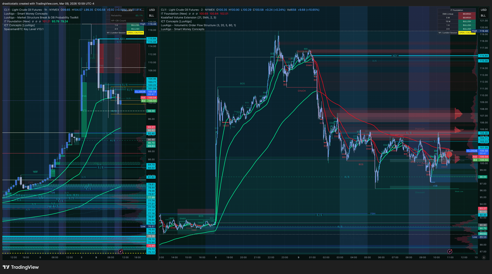
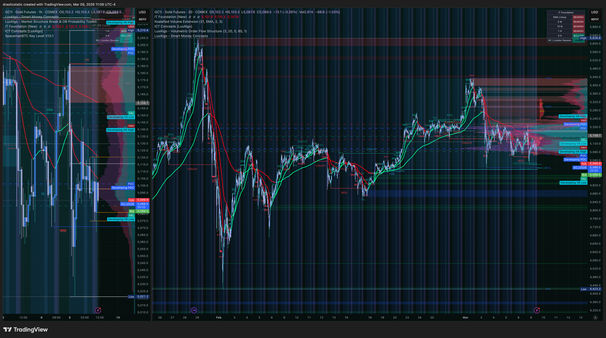
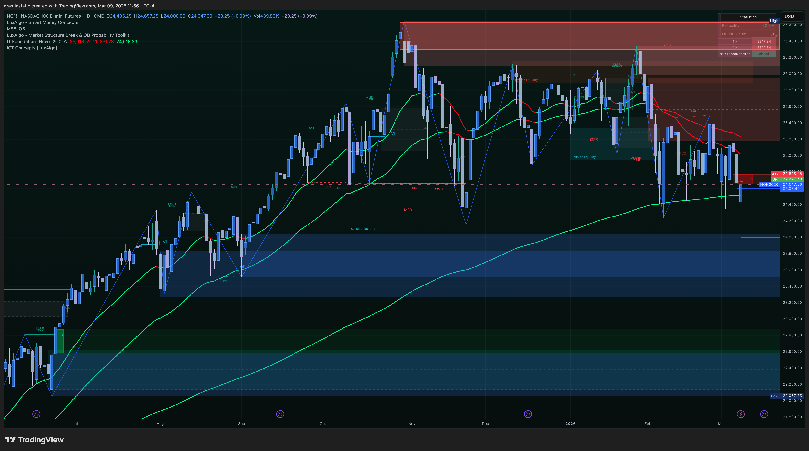
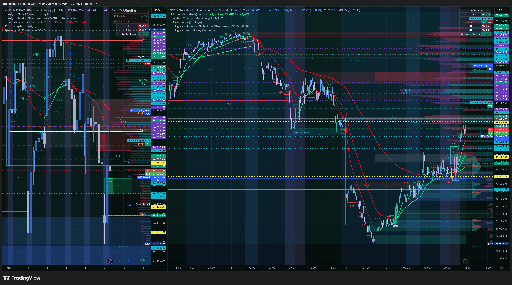
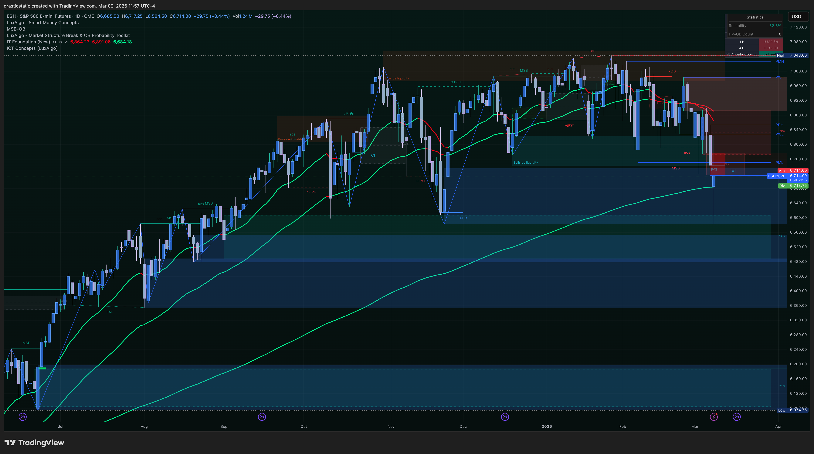
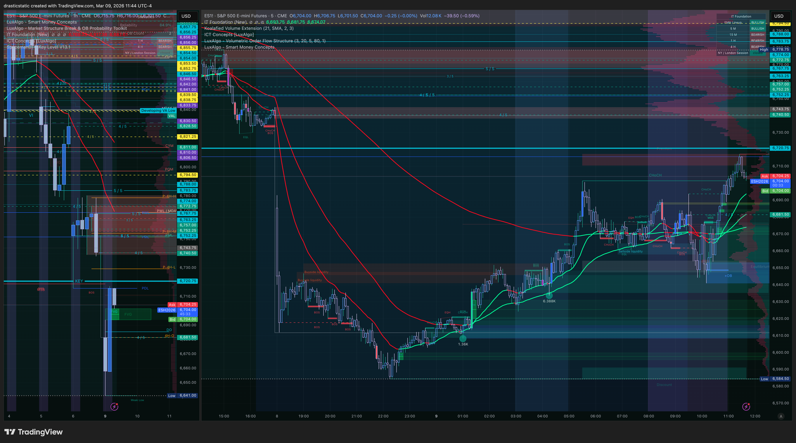
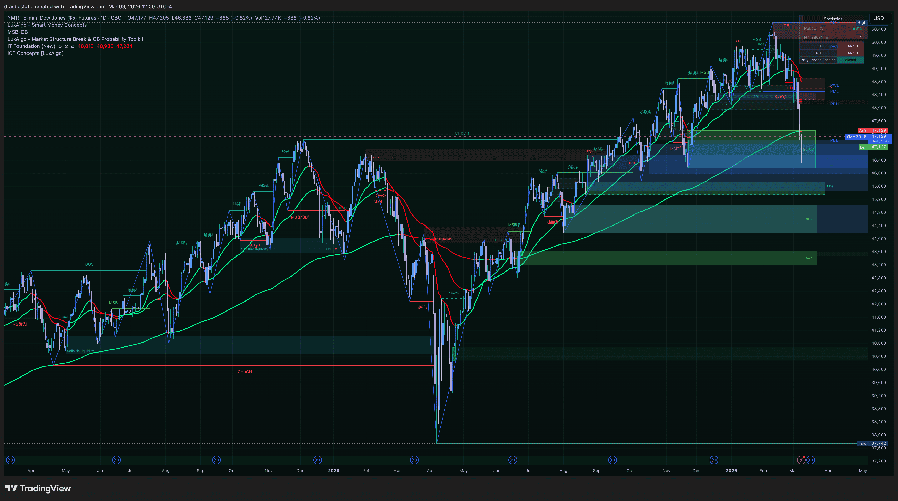
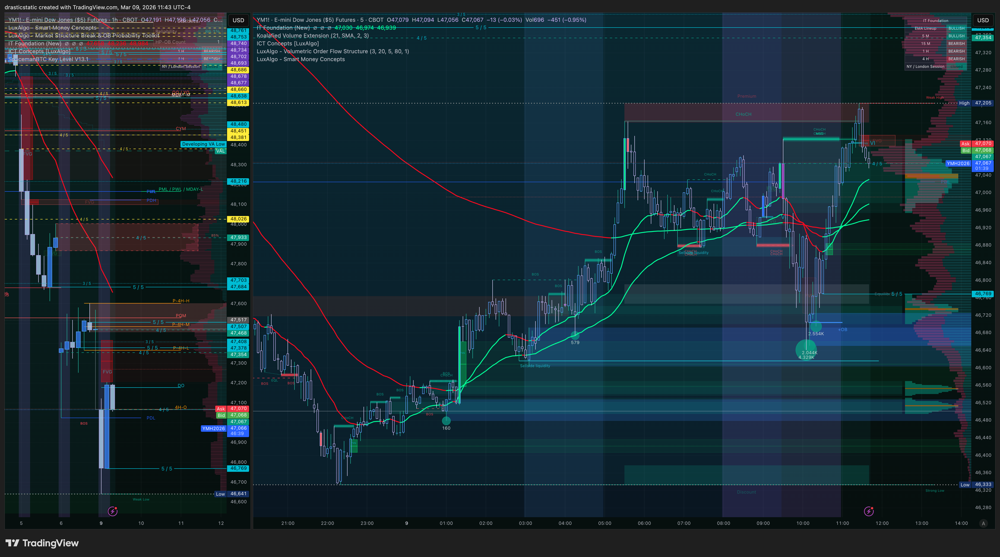

# Pre-Market Summary — March 9, 2026 (Monday)
### Fortuna | Wealth Warden Trading Assistant
*ETH/evening session — morning occupied by STB live coaching + commute. Desk arrival afternoon/evening.*

[Jump to 🤖 SmartTraderAI Copy-Paste ↓](#smarttraderai-copy-paste)

---

## 📋 Session Dashboard

| Field | Value |
|-------|-------|
| **Date** | Monday, March 9, 2026 |
| **Session type** | ETH/evening — soft monitoring approach, trade only if A+ conditions met |
| **Accounts active** | APEX-484839-06 (100K) · TakeProfitTrader 50K |
| **APEX-06 gap** | ~$6,000 · Deadline: March 24 |
| **TPT gap** | ~$3,000 · Deadline: end of March |
| **Pre-market status** | ⚠️ No formal AM pre-market — STB live coaching served as morning brief |
| **FCR observed** | ❌ Not at desk at 9:30 AM open |
| **HTF bias** | ⚠️ MIXED — market at major daily inflection point |

> **Note:** Morning occupied by STB live coaching session (watched coaches trade live) and commute. No personal trade taken — correct given no full pre-session analysis. Desk arrival afternoon/evening. All analysis below built from coaching context + screenshots captured through the session.

---

## ⚠️ Session Risk Alert

| Flag | Status |
|------|--------|
| APEX-06 deadline | Mar 24 — ~$6,000 gap. Runway: 15 sessions. |
| TPT 50K deadline | End of March — ~$3,000 gap |
| CL Sunday spike | 31% range spike at 18:00 open — macro/geopolitical event. Elevated volatility carry-forward. |
| No formal FCR read | RTH open not monitored — FCR candle direction unknown. Do not assume scenario. |
| HTF inflection | Daily key levels being tested across all three indices — genuine two-sided risk |
| Post-blowup stance | Conservative entry stance since Mar 3 — correct and appropriate |

---

## 🌙 Overnight / ETH Context

**CL — Major Sunday 18:00 Open Spike:**

CL spiked at the Sunday 18:00 futures open — up 21% of the range initially, extending to 31% total before reversing. As of the 10:59 AM screenshot: retraced 17% from the high, now 21% from the high and still **280 ticks above Friday's end-of-day range**. The full retracement to Friday's close has not yet completed. This spike — likely geopolitical/macro driven — set the volatility tone for the overnight session and directly impacted how equity indices opened.

*CL1! 10:59 ET — Sunday 18:00 spike clearly visible. 31% range extension then reversal. Still 280 ticks above Friday EOD range as of screenshot. Retracement thesis active.*

**GC — Safe-Haven Context:**

Gold remains elevated from the safe-haven demand that built through the Feb–Mar sell-off. As of 11:09 AM, GC is showing distribution/choppiness at the highs with IT Foundation EMAs beginning to roll. If GC continues to lose strength while equities are testing key levels, that's the safe-haven exhaustion signal — reducing the macro tailwind for further equity selling.

*GC1! 11:09 ET — Elevated at highs. EMAs beginning to roll. Distribution visible. Safe-haven bid may be fading.*

**Equity ETH — Key Level Tests Across All Three:**

All three equity index futures tested significant daily-level support/resistance zones overnight:
- **NQ:** Tested daily key support at the Sunday 18:00 open — held. Now bouncing.
- **ES:** Bounced from lows, currently pressing into resistance (former support zone now overhead).
- **YM:** Showing consistent relative strength — cleared its key level and testing it as support from above.

---

## 🌤️ At the Open

Not observed — STB live coaching session in progress at 9:30 AM open. FCR candle not analyzed this session. No personal entry evaluated at the open.

**From coaching context:**
- STB snapshot: **all instruments neutral** except EURUSD (neutral-bullish)
- Coach bias: **short overall** but actively watching long projections given key level action
- Coaches traded live — Christopher observed but did not take personal trades (correct — no full pre-session analysis completed)

---

## 🔗 SMT Divergence Scenarios

| Index | ETH Read | Daily Read | Signal |
|-------|----------|------------|--------|
| **NQ** | Tested key support — held — bouncing | Daily key support (green zone) held | ✅ Bullish for bounce |
| **ES** | Bounced from lows — currently at resistance | Former support = now overhead resistance | ⚠️ Decision point |
| **YM** | Relative strength — cleared key level | Showing healthier structure vs NQ/ES | ✅ Leading higher |
| **RTY** | *To be updated as screenshots added* | — | — |

**Current scenario read:** Inconclusive — the market is at a genuine inflection point.

- **Scenario B LONG valid if:** ES breaks through resistance, YM continues leading, IT Foundation EMAs confirm green dominant on the 5-min/10-min. NQ supporting from below confirms the bounce thesis.
- **Scenario A/B SHORT valid if:** ES rejects at resistance, YM rolls back under its key level, EMAs remain/flip red dominant. The broader descending channel structure reasserts.
- **Scenario C (flat):** ES indecision at resistance + mixed index alignment = no trade. Friday's lesson applies — do not force at a decision zone, especially on a Monday without FCR.

---

## 📅 Economic Calendar

| Time (ET) | Event | Impact | Notes |
|-----------|-------|--------|-------|
| *To be confirmed* | Check for Monday macro releases | — | No major events flagged during morning coaching session |
| Wednesday 10:30 AM | EIA Crude Oil Inventories | High | **No new CL entries 10:15–10:45 AM ET Wednesday** |

> **CL note:** Given Sunday's 31% spike and active retracement — CL is in high-volatility mode regardless of EIA. Monitor CL behavior at the 280-tick gap back to Friday's range as a macro context indicator all week.

---

## 🎯 Today's Priority Instruments

| Instrument | Bias | Plan |
|-----------|------|------|
| **ES (MES)** | ⚠️ MIXED — at resistance | Watch EMA gate confirmation before any entry. Resistance rejection = short. Break + hold = long setup. |
| **NQ (MNQ)** | ⚠️ Neutral — support held | Confirmation instrument. Support holding = long bias viable if EMAs align. |
| **YM** | Mild bullish (relative strength) | Leading indicator. If YM continues above its key level, long thesis strengthens. |
| **CL** | Bearish retracement active | 280 ticks back to Friday range — continuation thesis. Not tradeable on Apex if metals restriction applies. *Confirm CL availability.* |
| **GC** | Watching safe-haven fade | Macro context only. |

---

## 📊 NQ — Analysis

**HTF (Daily):**

Long-term uptrend intact — large IT Foundation EMA (green) still rising from below with significant separation. However, intermediate structure has broken down from the ATH distribution zone (visible red/orange zone at the top of the daily chart). The shorter-term red EMA has crossed below and is diverging. NQ has sold off significantly from ATH and is now testing a major daily support zone (green horizontal block).

**Key observation:** The Sunday 18:00 open tested this daily support zone directly — and it held. That is a meaningful structural signal. A daily key support hold after a sustained sell-off is the beginning of a potential base.

**ETH current read:** Bouncing from the support test. IT Foundation EMAs on the shorter timeframe beginning to curl green. The question is whether this is a genuine reversal or a dead-cat bounce before another leg lower.

**11:56 ET — NQ Daily: long-term uptrend intact, daily key support zone tested and held**

**11:48 ET — NQ ETH/RTH: support test at Sunday open, hold, bounce visible**

---

## 📊 ES — Analysis

**HTF (Daily):**

Same long-term uptrend structure as NQ — large green EMA rising from far below. Distribution zone at the top is clear. After the breakdown, ES has sold off through what was a major support level — that former support is now overhead resistance. The current ETH bounce has pushed price back up into this resistance zone.

**Key observation:** ES is not testing support like NQ — it is testing resistance from below. This is a structurally weaker position than NQ. The level overhead has already been breached once (during the sell-off) and is now the decision zone: can buyers reclaim it, or will sellers defend it from above?

**ETH current read:** Pressing into resistance. This is where the session's directional bias will be determined. Watch the candle reaction at this zone closely.

**11:57 ET — ES Daily: former support now overhead resistance, ETH bounce pressing into this zone**

**11:44 ET — ES ETH/RTH: bounce from lows pressing into resistance, decision zone active**

---

## 📊 YM — Analysis

**HTF (Daily):**

YM daily structure is notably different from NQ and ES. The sell-off from the highs was present but less severe relative to its key levels. The daily structure shows YM potentially forming a higher-low or base relative to the broader trend. Multiple green support zones visible with a clear level structure.

**Key observation:** YM has been the relative strength leader throughout this entire sell-off period — flagged on Mar 4, Mar 6, and confirmed again today. In ETH, YM cleared its key level and is now testing it as support from above. That is a bullish structural shift compared to ES (still below resistance) and NQ (holding support from below).

**ETH current read:** Leading the bounce. If YM holds above its key level through the evening, that is the primary long confirmation signal for the session.

**12:00 ET — YM Daily: relative strength vs NQ/ES, healthier structure, multiple support zones intact**

**11:43 ET — YM ETH/RTH: cleared key level, testing as support from above**

---

## 🧠 Pre-Session Mental State / Behavioral Reminder

*Soft approach day — correct given the context.*

Weekend was a significant infrastructure push (Augment Intent Waves 43–45 + cross-repo work). Energy was spent productively but rest is part of the plan tonight regardless of whether a trade sets up. The machine shop day is handled. Charts will be cleaned. Pine Script work is on the table.

**Behavioral rules that apply today:**
- No FCR read = no Scenario A confirmation available for the RTH session. Do not backfill.
- EMA gate is the entire gate for an ETH session. Which direction the 5-min/10-min EMAs confirm at desk arrival is the scenario. No entry before confirmation.
- ES at resistance is a decision zone — not a guaranteed short. Wait for the market to show the hand.
- **One clean setup or nothing.** The accounts are healthy. There is no deadline pressure tonight.
- If conditions are not there: Pine Script, chart cleaning, and rest. Come back Tuesday with a full pre-market analysis built before the open.

---

## ⏱️ Live Session Updates

*To be updated as Christopher provides notes and additional screenshots from the session.*

| Time (ET) | Update |
|-----------|--------|
| ~10:59 | CL screenshot: 31% Sunday spike visible, active retracement, 280 ticks above Friday EOD. |
| ~11:09 | GC screenshot: elevated at highs, EMAs beginning to roll, distribution visible. |
| ~11:44–11:48 | NQ/ES/YM ETH+RTH screenshots: NQ support held, ES at resistance, YM leading. |
| ~11:56–12:00 | NQ/ES/YM daily charts: HTF inflection point confirmed across all three. |
| *Evening* | *Christopher to add session notes + additional screenshots* |

---

## 🤖 SmartTraderAI Pre-Market Copy-Paste Fields

---

### 1. What news releases today?

No major high-impact scheduled releases flagged during the Monday March 9 morning coaching session. The dominant market driver today is the macro/geopolitical event that triggered the Sunday 18:00 CL spike — origin not confirmed but the price action (31% range spike in crude, equity index key level tests) suggests a significant overnight development. STB snapshot showing all instruments neutral suggests the market has not definitively resolved the directional question from that event. Upcoming week: EIA Crude Oil Inventories Wednesday 10:30 AM ET — no new CL entries 10:15–10:45 AM ET that day.

---

### 2. What are the expected figures? What effect has this event had on the markets before?

N/A for scheduled releases today. The CL Sunday spike is the key event to contextualize: a sharp intraday spike to new highs followed by an aggressive reversal is a classic failed breakout / distribution structure — the "air underneath" thesis that was identified on Mar 6 is now playing out on a larger scale. Historically, geopolitical CL spikes that fail to hold above prior resistance and reverse within the same session tend to flush to pre-spike levels and beyond. The 280-tick gap back to Friday's EOD range is the target if the retracement continues.

---

### 3. List both your HTF bias and key levels

**HTF bias: MIXED — genuine daily inflection point across all three indices.**

NQ and ES are in confirmed bearish intermediate structures (broken from ATH distribution zones, red EMA crossover on daily). However, NQ has tested its daily key support zone and held — that is a structural signal that requires respect. ES is pressing into former support (now resistance) from below. YM is showing relative strength and is positioned above its key level.

Key levels (require ETH/intraday verification before entry):
- **ES:** Overhead resistance zone (former support — now the decision level). Break and hold = reclaim. Rejection = continuation lower.
- **NQ:** Daily key support zone (green block) — held at Sunday open. This is the floor to watch.
- **YM:** Key level now acting as support from above — holding this is the long signal.
- **CL:** 280 ticks above Friday EOD range — this gap is the continuation retracement target.
- **GC:** Elevated but rolling — watch for safe-haven exhaustion signal.

---

### 4. List your Intraday bias and levels

**Intraday bias: UNCONFIRMED — wait for EMA gate at desk arrival.**

No FCR read available for today's RTH session (not at desk). ETH picture is genuinely two-sided:

**Long bias conditions (Scenario B LONG):** IT Foundation EMAs confirm green dominant on 5-min/10-min at desk arrival + ES holds above or breaks through resistance + YM continues above key level. Entry: FVG/ZTH confluence in the pullback zone above NQ support. All five layers required.

**Short bias conditions (Scenario A/B SHORT):** ES rejects at resistance and rolls + YM loses key level + EMAs confirm red dominant. Entry: FVG displacement at resistance retest. All five layers required.

**No trade conditions (Scenario C):** ES indecision at resistance + mixed index alignment + EMAs inconclusive. This is the most likely scenario if the inflection point hasn't resolved by desk arrival.

---

### 5. Expectations for the day?

Soft approach. Morning coaching observation confirmed the picture is genuinely two-sided at a major daily inflection point — coaches with short bias but actively watching long setups, STB snapshot all neutral. No personal trade taken in the morning session (correct — no full pre-session analysis).

Evening session: arrive at the desk, read the EMA gate first. If EMAs have confirmed direction and a clean FVG/ZTH setup is building within the A+ five-layer framework — one trade. If not, the evening is Pine Script development, chart cleaning, and rest. Come back Tuesday with a full pre-market built before the open.

The accounts are healthy (APEX-06 and TPT preserved). There is no urgency. The edge is in waiting for the right conditions, not in trading every session.

> Full pre-market summary:
https://github.com/drasticstatic/trading-assistant-public-preview/blob/main/smarttrader-ai/analysis/premarket/2026/03-Mar/premarket_20260309_summary.md

---

*Fortuna — Wealth Warden | Claude Code CLI*
*Anthropic claude-sonnet-4-6 | March 9, 2026*
