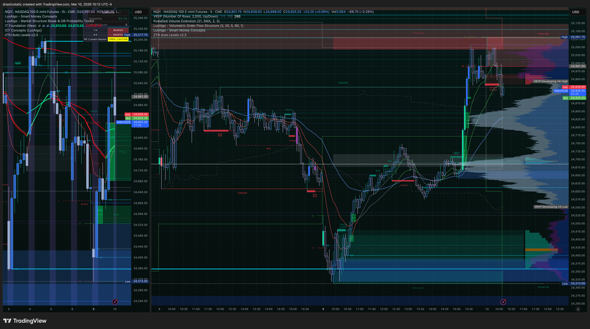
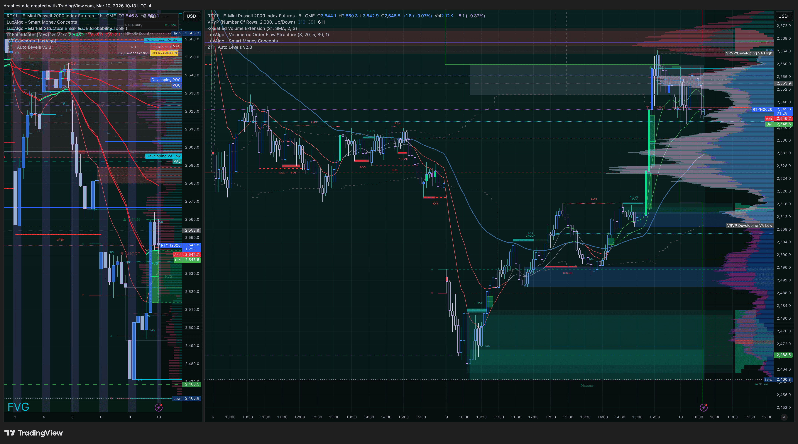
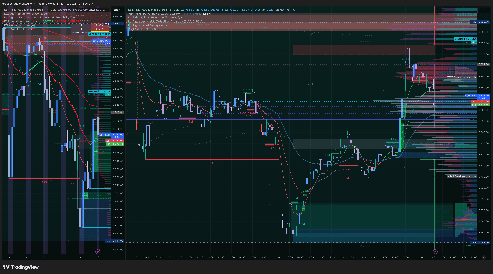
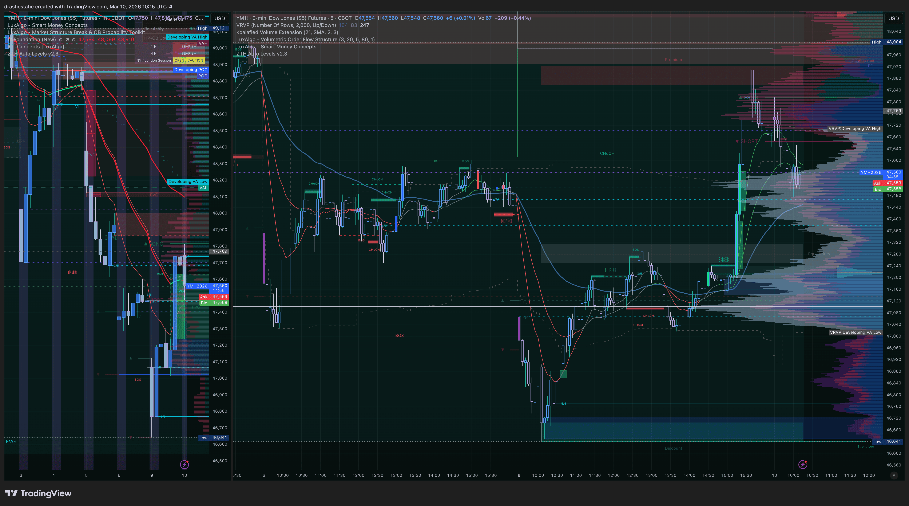
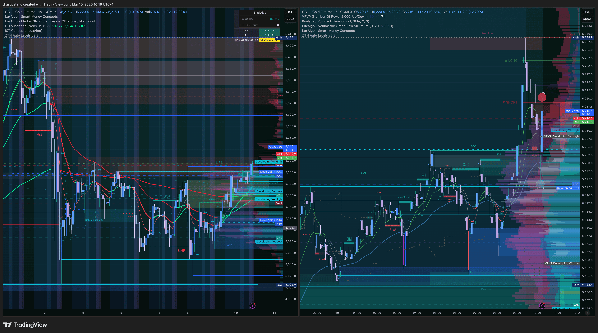
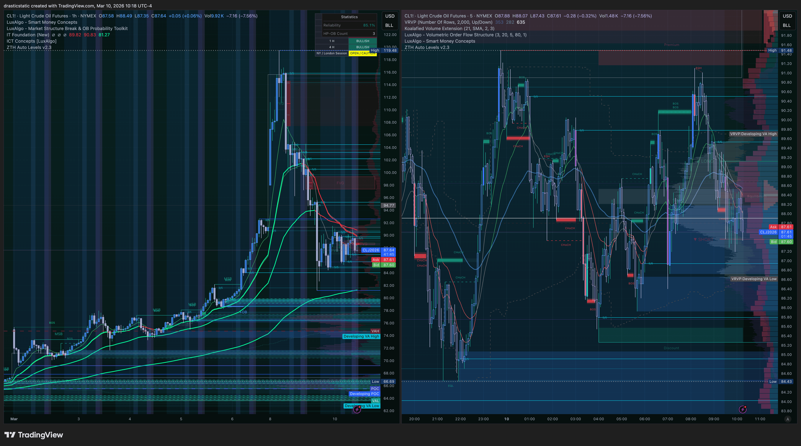

# Pre-Market Summary — Tuesday, March 10, 2026
#### Fortuna — Wealth Warden | Claude Code CLI
#### Session type: Live RTH — Active monitoring

[Jump to 🤖 SmartTraderAI Copy-Paste](#smarttraderai-copy-paste)

---

## 📋 Session Dashboard

| Field | Value |
|-------|-------|
| **Date** | Tuesday, March 10, 2026 |
| **Accounts active** | APEX-484839-06 (100K) · TakeProfitTrader 50K |
| **APEX-06 gap** | ~$6,000 · Deadline: March 24 (14 days) |
| **TPT gap** | ~$3,000 · Deadline: end of March |
| **Primary instrument** | MNQ / NQ — confirming ES, YM |
| **EIA window** | N/A (Wednesday only) |
| **Metals** | Halted on Apex — no GC, SI trades |

---

## ⚠️ Session Risk Alert

- **APEX-06 deadline pressure:** 14 days remaining, ~$6,000 gap. Pattern 6/7 risk — do not let deadline urgency override FCR + EMA gate. One clean A+ per session is the path.
- **Choppy open confirmed:** SFP candle at 9:30 open. Coaches stopped out in both directions early. Wait for FCR confirmation — do not enter on initial displacement without strength confirmation.
- **Weak displacement warning (active case study):** Initial FCR short displacement was not sustained — near-full retrace back into range. Market then resolved LONG through consistent bullish candles above "long from here" ray. No state of delivery change on 1hr — no new session lows. **Direction: LONG bias now active per FCR.**

---

## 🌙 Overnight / ETH Context

- Bearish structure carried from Mar 6 close into the week
- NQ tested daily key support at Sunday open and held — bullish structural signal into Monday
- YM showed relative strength through Mar 9 — cleared key level and holding from above
- ES spent Monday pressing into resistance (former support zone)
- ZTH indicator: v2.3 closed overnight Mar 9→10. Verified with ZTH coach in 1-on-1 at **8 AM this morning** — accuracy confirmed. Working live. v2.4 refinements queued (Kavanah has the details).

---

## 🌤️ At the Open (Live Development — as of ~10:15 ET)

FCR range established at 9:45. Initial market behavior:

1. **Initial displacement:** Short-from-here ray breached but displacement was **weak** — not sustained. Near-full retrace back into FCR range. Coaches initially had short bias and tested quick longs, getting stopped out in both directions. Classic SFP-open environment.

2. **Reversal confirmation:** Bullish candles then closed consistently above the "long from here" ray. ChoCH (Change of Character) formed. Bullish FVGs present. FCR LONG signal now active.

3. **Structural context:** No change in state of delivery on the 1-hour to the downside — no new session lows. Market posture has shifted from looking at session lows to session highs.

4. **Coaches:** Now aligned looking to recent session highs. Short idea no longer in alignment with the automated STB market snapshot (neutral-bullish across indices).

> **FCR case study logged:** Mar 10 weak displacement → reversal pattern. See `strategies/smarttradingblueprint/analysis/fcr_case_study_tracker.md`.

---

## 🔗 SMT Divergence Scenarios

| Scenario | Condition | Action |
|----------|-----------|--------|
| **Scenario A** | NQ + ES + YM all confirm LONG above FCR HIGH | A+ long entry from FVG |
| **Scenario B** | NQ leading LONG, ES/YM at decision | B-grade — IT Foundation EMA gate required; green dominant = valid |
| **Scenario C** | Mixed — one diverging | No trade — wait for resolution |

*YM showing relative strength as of pre-session context — watch for confirmation vs divergence as session develops.*

---

## 📅 Economic Calendar

*To be updated with any high-impact releases for March 10.*

---

## 🎯 Priority Instruments

1. **NQ / MNQ** — Primary. FCR LONG active. Watch for FVG entry from consistent above-HIGH consolidation.
2. **ES** — Confirming. Watch for SMT alignment with NQ.
3. **YM** — Relative strength leader — confirmation or divergence signal.
4. **GC** — Neutral Bearish. At key structural level — breakout retest or support. Not tradeable on Apex.
5. **CL** — Retracing from Sunday open spike. Watchlist only unless A+ setup develops.

---

## 📊 Pre-Session Market Snapshot (STB — as of session open)

| Instrument | Bias |
|-----------|------|
| NQ | Neutral Bullish |
| ES | Neutral Bullish |
| YM | Neutral Bullish |
| GC | Neutral Bearish |
| BTCUSD | Neutral |
| ETHUSD | Neutral |
| EURUSD | Strong Bullish |
| GBPUSD | Strong Bullish |

---

## 📸 Market Development Screenshots (~10:12–10:18 ET)

**10:12 ET — NQ**

**10:13 ET — RTY**

**10:14 ET — ES**

**10:15 ET — YM**

**10:16 ET — GC**

**10:18 ET — CL**

---

## 🧠 Pre-Session Mental State / Behavioral Reminder

Yesterday was a hard day outside the desk — job loss, mounting pressure, the weight of everything happening at once. Christopher walked his dog and came back with a plan. That posture carries to today.

The STB manager had it right. When this moment is looked back on, it'll be a "how cool is that" — the ZTH indicator is live and coach-verified this morning, the accounts are intact, and the FCR case study from today's open is a direct result of the journaling work Christopher has been doing.

**One trade. Process first. The gap closes itself when the A+ conditions are there.**

---

## ⏱️ Live Session Updates

- FCR resolved LONG ~10:15 ET. NQ long-from-here (25,080) = prior 5/5 ZTH level. 1hr candle holding above. ZTH coach long on GC pivot during morning session.
- MNQ trade projection: limit at 1hr/5min FVG alignment below HVN shelf on VRVP. Filled 3x @ 25,023.75 (14:17 ET).
- ~16:09: 1 tick from SL — SL held. FCR Pine Script timeframe bug discovered and flagged to Kavanah.
- 16:59: Apex hard close @ 25,005.75. -$108. Pattern 8 identified. See `STB_export_20260310_daily-review.md` and `review_20260310_MNQ_001.md`.

---

## 🤖 SmartTraderAI Pre-Market Copy-Paste Fields

---

### 1. What news releases today?

*To be confirmed — check economic calendar for March 10 high-impact events.*

---

### 2. What are the expected figures? What effect has this event had on the markets before?

*To be confirmed with calendar data.*

---

### 3. List both your HTF bias and key levels

**HTF Bias:** Neutral-bullish. Bearish weekly structure from prior weeks but NQ held daily key support at Sunday open — bullish structural signal. No new session lows confirmed heading into Mar 10. Coaches pivoting to session highs.

**Key levels:**
- FCR HIGH ("long from here") ray — established at 9:45 close
- FCR LOW ("short from here") ray — breached and rejected; no longer primary reference
- Recent session highs — primary target with LONG bias active
- 1-hr state of delivery: no change to the downside

---

### 4. List your Intraday bias and levels

**Intraday Bias:** LONG — FCR confirmed after weak initial short displacement resolved bullish. ChoCH formed above FCR HIGH ray. Bullish FVGs present.

**Intraday levels:**
- Entry: FVG from the bullish displacement above FCR HIGH ray
- Target: recent session highs
- SL: below ChoCH structure / FCR HIGH ray
- Gate: IT Foundation EMAs must be green dominant (Scenario A or B)

---

### 5. Expectations for the day?

FCR LONG is the primary setup. The SFP open environment has passed — consistent bullish candles above the HIGH ray with ChoCH and FVGs. If NQ, ES, and YM are aligned (Scenario A), this is an A+ long entry from the FVG. If only NQ + one other confirm (Scenario B), the EMA gate is the filter. No trade without the gate. One clean entry, hold to structural target, no re-entries.

> Full pre-market summary: https://github.com/drasticstatic/trading-assistant-public-preview/blob/main/smarttrader-ai/analysis/premarket/2026/03-Mar/premarket_20260310_summary.md

---

*Fortuna — Wealth Warden | Claude Code CLI*
*Anthropic claude-sonnet-4-6 | March 10, 2026*
