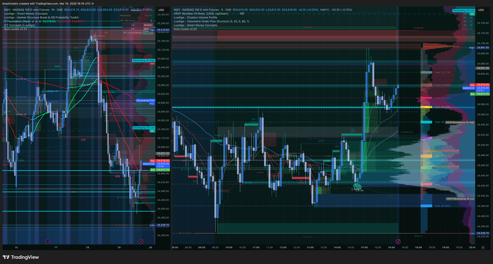
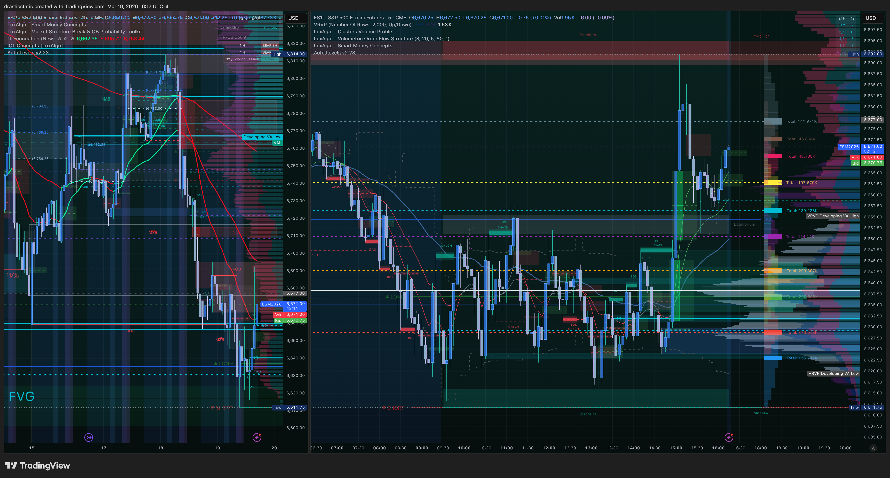
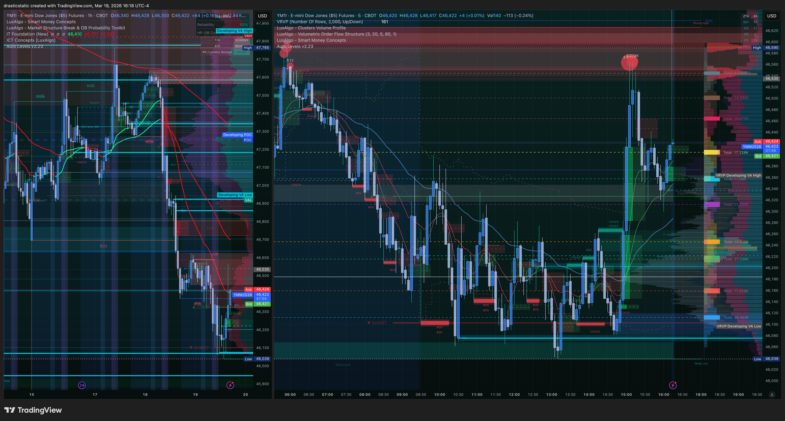
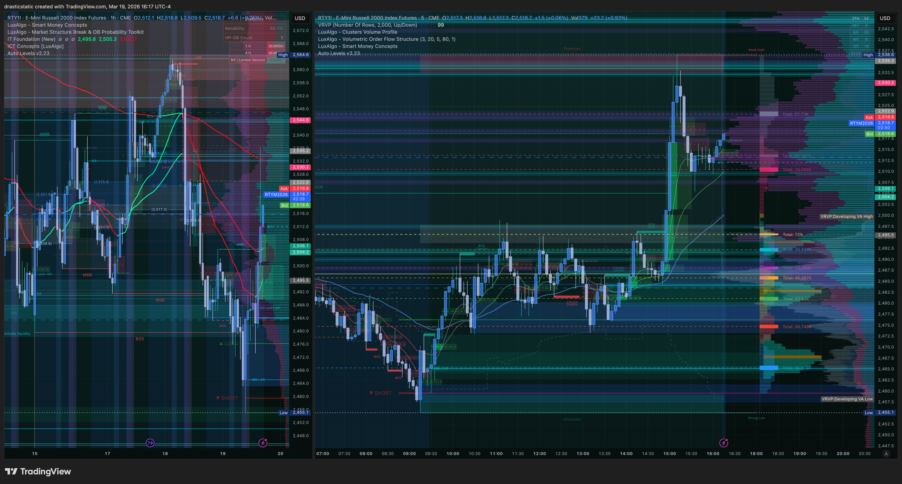
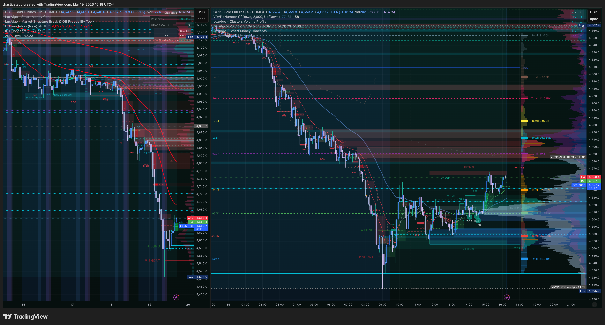
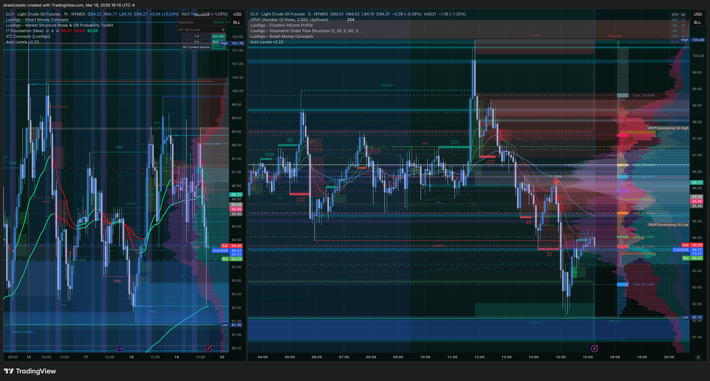

# Afternoon Session Review — March 19, 2026
### ~15:00 ET · Post-FOMC · Afternoon/ETH Scope

*No formal pre-market this morning — Christopher prioritized rest and cleared personal/legal space (unemployment filing, domestic relations, attorney). ZTH 1-on-1 cancelled (coach under the weather). Inevitrade live call active via phone during a walk. This document was started at ~15:00 ET; screenshots added at 16:16–16:19 ET (RTH close snapshot — NQ, ES, YM, RTY, GC, CL).*

[Jump to 🤖 SmartTraderAI Copy-Paste ↓](#smarttraderai-copy-paste)

---

## 📋 Session Dashboard

| Account | Status | Gap | Deadline |
|---------|--------|-----|----------|
| APEX-484839-06 | ✅ Active | ~$3,515 | Mar 24 (5 days) |
| TPT 50K | ✅ Active | ~$3,000 | End of March |

**Primary instruments today:** MNQ · ES/MES · YM (triple-index read) · GC (TPT scope) · CL (ZTH + IT)
**Metals on Apex:** ❌ Halted (GC, SI, HG, MGC, MGC) — TPT only for metals plays
**Session scope:** Late RTH (→16:00 ET hard close) + ETH if setup qualifies

---

## ⚠️ Session Risk Alert

- **Post-FOMC session** — FOMC announcement was yesterday (March 18). Markets are digesting the decision and repositioning. These sessions can carry momentum OR reverse hard — wait for direction to confirm, not predict.
- **Emotional reset completed** — Christopher cleared stressors before coming to the desk. This is a skill. Entering from a clear head is itself a risk management decision.
- **APEX-06: 5 days to deadline** — $3,515 gap. One clean A+ trade changes the math significantly. Force nothing. One trade per session, set pre-session.
- **Metals (Apex):** GC remains halted. Any GC read is observation only — trade it on TPT or sit it out.
- **EIA window:** Wednesdays only — today is Thursday, no CL restriction from that rule.
- **Late RTH scope:** If entry is taken before 16:00, define a hard personal close time. Pattern 8 (exit passivity) is still the active behavioral risk — partial profit + scratch rule + 16:00 ET close rule are the fixes.

---

## 🌙 Overnight / Post-FOMC Context

Yesterday's FOMC announcement removed the pre-meeting uncertainty that had kept many coaches on the sidelines. The outcome — and the market's reaction — now sets the near-term directional frame. Based on Christopher's live read at ~15:00 ET:

- **NQ:** Pumping bullish candles but respecting/rejecting off a strong range level. Indecision between buyers stepping in post-FOMC and supply sitting overhead. Not a clean breakout yet — if it holds above the range and closes a 15min candle above, bullish continuation case builds.
- **GC (Gold):** Caught a falling knife setup (STB coaches watching) — similar to the knife that took MNQ to TP on the prior morning. GC is now retracing from that bounce. Typical pattern: sharp knife-catch → short consolidation → fade or follow-through. Coaches are watching level hold.
- **CL (Crude Oil):** Aggressively reclaiming the support of a range. This is a more committed read — oil is showing strength at support. ZTH + IT setup territory if a ZTH level aligns with the reclaim.

The macro context: post-FOMC sessions typically see either follow-through in the FOMC direction (if the decision was well-received) or a fade of the knee-jerk reaction as positioning normalizes. The bullish tone on NQ + CL reclaiming support suggests the market is leaning constructive, but the range rejection on NQ is the key ambiguity.

---

## 🌤️ Afternoon Context (No Formal Open — ETH Scope)

There was no morning session today — no FCR candle to reference from Christopher's desk. However:

- The FCR framework still generates levels from the 9:30 candle that the auto-levels v2.23 Pine Script will have plotted. Those HIGH and LOW rays are structural reference even without having watched the open live.
- **STB coaches were active this morning** — Christopher noted the GC knife-catch that mirrors the MNQ setup from two days ago. The pattern is documented in the FCR case study tracker.
- The Inevitrade call (live now) will carry the macro analysis and any afternoon/ETH setup reads from Craig's framework. This is good preparation.
- **First live session with auto-levels v2.23** — the community published version is now in Christopher's hands. Watch for any visual notes to feed back to Auggie.

---

## 🔗 SMT Divergence Scenarios

Reading the indices from Christopher's ~15:00 ET description:

**Scenario A read (developing):**
- NQ pumping bullish candles = bullish
- CL reclaiming range support = constructive / bullish
- GC retracing after knife-catch = neutral/fading
- If ES and YM align with NQ bullish push → Scenario A LONG scenario builds. Watch for all three to confirm above the range before entry.

**Scenario B watch:**
- NQ is the lead instrument. If NQ breaks and holds above the range level it's currently testing, and IT Foundation EMAs flip green dominant, Scenario B LONG is valid.
- Counter-trend (short into a bullish NQ) requires EMAs red dominant — do not take without the gate.

**Scenario C risk:**
- If NQ is pumping while ES/YM remain below their range levels, that divergence = Scenario C. No trade.
- GC retracing while equities push = metals/equities divergence — watch, don't trade as a standalone signal.

---

## 📅 Economic Calendar

| Time (ET) | Event | Expected Impact |
|-----------|-------|-----------------|
| Yesterday | **FOMC Rate Decision** | Primary driver — positioning ongoing. Rate decision is known; market still digesting Chair's language and dot plot. |
| 8:30 AM | Jobless Claims (if Thu) | Initial claims — if released today, could have colored the morning session |
| Remainder | Low-impact data | Post-FOMC session; the Fed is the story. |

*Note: Christopher filed for unemployment today (regardless of approval — following procedure after being let go from prior employer). Real-life awareness of claims data context.*

---

## 🎯 Today's Priority Instruments

| Instrument | Opportunity | Platform | Notes |
|------------|-------------|----------|-------|
| **MNQ** | ⭐ Primary | Apex | Post-FOMC directional read — Scenario A/B LONG if NQ clears range |
| **CL** | ⭐ Watch | Apex | Aggressively reclaiming range support — ZTH/IT entry if level holds |
| **GC** | 👁️ Observe | TPT only | Knife-catch retracing — coaches watching level. No Apex access. |
| **ES/MES** | 📊 SMT read | — | Triple-index confirmation layer |
| **YM** | 📊 SMT read | — | Triple-index confirmation layer |

---

## 📊 Chart Analysis — RTH Close Snapshot (16:16–16:19 ET)

Six charts captured at RTH close. All screenshots use auto-levels v2.23 — first live session with the published version.

---

### NQ — Post-FOMC Afternoon Bull Run

**16:16 ET — NQ full session view**

**HTF read (left panel):** NQ remains in a macro downtrend from its highs — EMAs showing bearish structure, lower highs in place. The broader context is a bounce/recovery within a larger bearish environment.

**Intraday read (right panel):** A significant afternoon bull surge — strong green candle column pushing up through the session. Price made a large directional move and is consolidating near ZTH levels at the close. The auto-levels v2.23 ZTH horizontal lines are visible and price is interacting with them at the top of the move.

**ETH setup watch:** If price holds above the ZTH support level that capped today's move, continuation long is in scope. If it fails back below, watch for consolidation before next directional read.

---

### ES — Aligned Bullish Afternoon

**16:17 ET — ES full session view**

**HTF read (left panel):** Same macro downtrend structure. Large FVG labeled in the lower portion — a longer-term reference zone. EMAs bearish.

**Intraday read (right panel):** ES mirrors NQ — strong afternoon bull push, same timing, same structure. ES confirming NQ direction = Scenario A alignment active. Price closed strong on RTH.

---

### YM — Bull Push with Caution Signal

**16:18 ET — YM full session view**

**HTF read (left panel):** Bearish macro structure — same downtrend pattern as NQ/ES.

**Intraday read (right panel):** YM joined the afternoon bull push. Notably, a red dot signal is visible on a candle near the session high — this is an SFP or rejection pattern firing at the upper ZTH/FCR level. YM is confirming the move but also showing a hesitation/rejection signal at resistance. Watch this in ETH — if YM can reclaim and hold above that level, bull continuation. If it fades from there, the divergence matters.

---

### RTY — Quad Confirmation

**16:17 ET — RTY full session view**

**HTF read (left panel):** Downtrend from highs — bearish macro.

**Intraday read (right panel):** RTY joined the afternoon move. All four indices (NQ, ES, YM, RTY) moved together in the afternoon — this is **Scenario A confirmed**. Quad alignment. The move was real and broad-based, not just NQ leading while others lagged.

**SMT summary:** No divergence in the afternoon push. All four confirmed. ETH continuation watch requires all four to hold their gains — if any one index starts making lower lows into ETH, that divergence changes the read.

---

### GC — Post-FOMC Knife Catch

**16:18 ET — GC full session view (TPT scope — Apex halted)**

**HTF read (left panel):** GC is in a sustained and aggressive downtrend — the most directional chart of the day. The long declining move from highs is clearly visible. This is post-FOMC: risk-on environment means gold selling off.

**Intraday read (right panel):** The "falling knife" Christopher described is confirmed. GC dropped hard intraday, then found support and began a bounce recovery. The STB coaches were watching this level — it held and provided the knife-catch bounce. However, GC is still in heavy downtrend context. The bounce is a technical level hold, not a reversal signal.

**Note:** Apex access halted for GC. TPT scope only. This chart is observational — informs the macro risk-on/risk-off read (equities bullish = gold selling = risk-on confirmation).

---

### CL — Range Chop with Support Defense

**16:19 ET — CL full session view**

**HTF read (left panel):** CL in a longer-term range/channel. The big picture is more neutral than the equity indices — oil has been rangebound rather than in a clean trend.

**Intraday read (right panel):** CL showed a range reclaim attempt — buyers defending the support level. However, by RTH close price had pulled back from the reclaim attempt and is in a chop zone. The "aggressive reclaim" from the walk description became more muted by close. CL is watching the same support — it hasn't broken down, but it hasn't convincingly cleared either.

**EIA reminder:** Today is Thursday — no EIA restriction (Wednesdays only, 10:15–10:45 ET). CL remains tradeable if a ZTH + IT setup emerges in ETH.

---

## 🧠 Pre-Session Mental State / Behavioral Reminder

**Today's context:** Christopher woke up, chose rest over trading, handled significant life stress (legal, financial, family) with clarity and calm, and is now decompressing via a walk before returning to the desk. This sequence — recognize stress → address it → clear the space → return fresh — is exactly the behavioral discipline the coaches and psychologist have been reinforcing.

**Reminders:**
- You cleared the noise. The desk you return to is a clean one.
- One setup. Pre-defined. Let the trade trade.
- **Pattern 8 fix is active protocol:** Partial TP → Scratch condition → 16:00 ET hard close. Define all three before entering.
- The APEX gap is $3,515 over 5 days. That is achievable in 1–2 A+ trades. It is also blown in one bad session. Patience = the edge.
- auto-levels v2.23 is live on the chart. This is the most refined version yet. Trust the levels.

---

## ⏱️ Live Session Updates

**~15:00 ET (Christopher, pre-walk):**
- NQ: bullish candle push, respecting/rejecting range
- GC: post-knife-catch retrace (STB coaches watching the level — mirrors the knife that took MNQ to TP prior morning)
- CL: aggressively reclaiming range support
- Inevitrade call live on phone during walk

**~16:16–16:19 ET (RTH close — screenshots captured):**
- **Scenario A confirmed** — NQ, ES, YM, RTY all made a large coordinated afternoon bull push
- NQ holding near ZTH resistance at RTH close
- YM showing a red dot rejection signal at the session high — watch in ETH
- GC knife-catch bounce holding, still in macro downtrend — risk-on confirmed
- CL support defended but reclaim faded into RTH close — range chop, not directional conviction
- **ETH watch:** Continuation long if indices hold above ZTH support. YM divergence = early warning sign.

---

## 🤖 SmartTraderAI Pre-Market Copy-Paste Fields

---

**1. What news releases today?**

Post-FOMC session (FOMC announcement was March 18). Weekly jobless claims were likely released this morning (Thursday). Primary driver remains yesterday's Fed rate decision and Chair Powell's press conference language. No high-impact scheduled events remaining for today's session.

---

**2. What are the expected figures? What effect has this event had on the markets before?**

FOMC: Rate decision is now known. The key follow-on effects — equity positioning, dollar reaction, gold/metals repricing, energy direction — are playing out in real time. Post-FOMC sessions typically see one of two patterns: (1) momentum continuation in the FOMC direction as laggard participants adjust positions, or (2) a "buy the news / sell the fact" reversal once the initial reaction is absorbed. The bullish NQ action at 15:00 ET and CL reclaiming range support suggests the market is leaning toward pattern (1) — post-FOMC risk-on continuation.

---

**3. List both your HTF bias and key levels**

**HTF bias: BEARISH macro structure, BULLISH bounce in progress.**

All four equity indices (NQ, ES, YM, RTY) remain in macro downtrend on the daily/HTF view — lower highs, EMAs bearish. This afternoon's move is a recovery bounce within that larger bearish context, not a confirmed reversal. GC's post-FOMC selloff confirms risk-on positioning.

Key HTF reference levels (from auto-levels v2.23 on chart):
- **NQ:** ZTH levels acting as overhead resistance at the top of today's afternoon push — the KEY/5-5 cluster visible in the intraday chart. The FCR HIGH ray from the 9:30 candle is a key structural reference for the full session.
- **ES:** FVG labeled on the HTF chart is a longer-term zone to watch on any continuation or pullback.
- **GC:** Hard support level at the knife-catch low — coaches watching whether it holds.

---

**4. List your Intraday bias and levels**

**Intraday bias: LONG — Scenario A confirmed (quad index alignment).**

All four indices — NQ, ES, YM, RTY — moved together in the afternoon. This is textbook Scenario A. No SMT divergence in the directional push. The move was real and broad-based.

Key nuances for ETH:
- **NQ** is holding near ZTH overhead resistance at RTH close — needs to absorb or break above cleanly for ETH continuation.
- **YM** showed a rejection signal (red dot) at the top of the move — watch for YM weakness as early divergence warning in ETH.
- **CL** support held but the reclaim attempt faded into RTH close — range-bound for now, not a clean directional conviction.
- **GC** knife-catch bounce is a data point: risk-on continues as long as equities hold.

ETH levels to watch: the ZTH support level immediately below current NQ price (visible on the intraday chart) is the key line. Hold above = ETH continuation long setup. Fail back below = wait for re-entry at the next lower ZTH level.

---

**5. Expectations for the day?**

Returning from a dog walk/Inevitrade call with a clear head into a post-FOMC market. Primary expectation: identify whether NQ's 15:00 push is a sustained breakout or a rejection. If it holds and SMT confirms, a late-RTH or ETH LONG on MNQ is in scope. CL range reclaim is a secondary watch — if ZTH level aligns, IT setup possible. No morning trades — managing 5-day APEX deadline with patience, not pressure. One A+ trade is the target. No trade is the correct result if conditions don't fully align.

---

*Fortuna — Wealth Warden · March 19, 2026*
