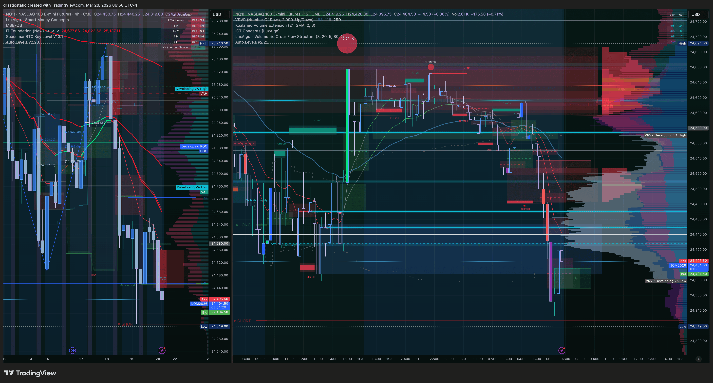
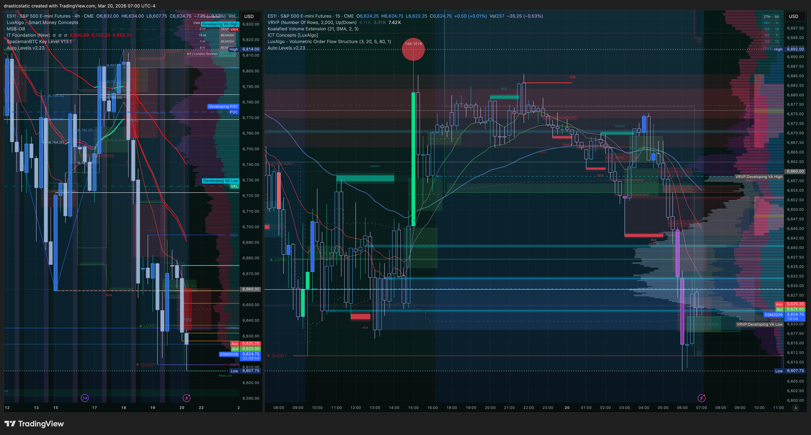
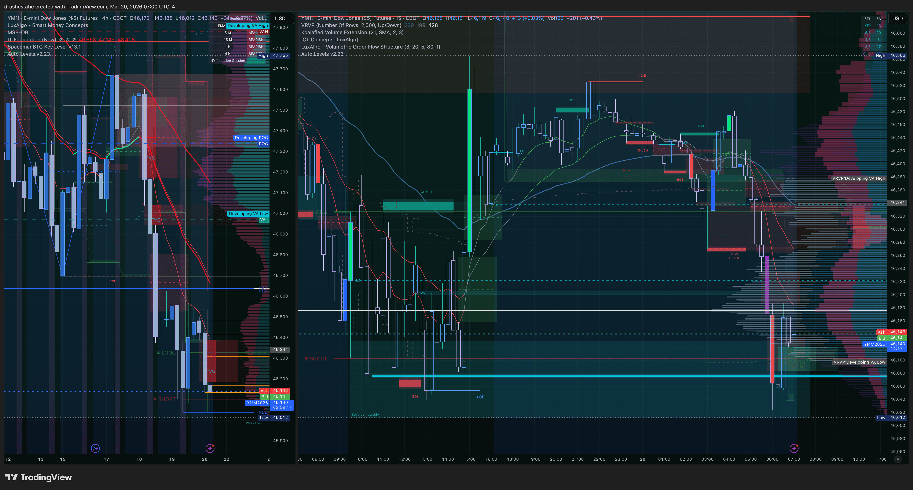
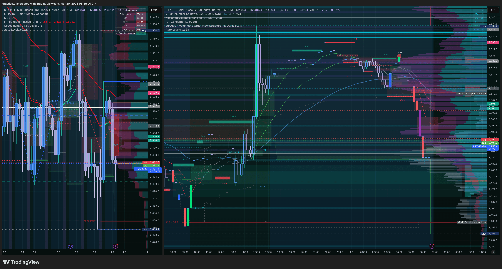
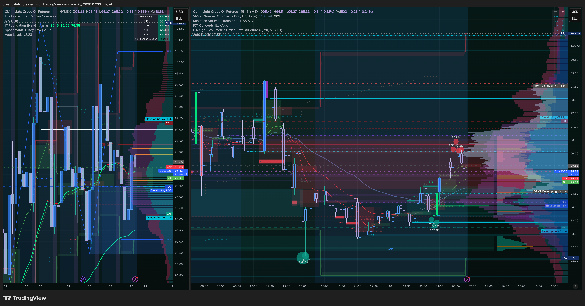

# Pre-Market Summary — March 20, 2026
### Friday · Quadruple Witching · Post-FOMC Trend Continuation

[Jump to 🤖 SmartTraderAI Copy-Paste ↓](#smarttraderai-copy-paste)

---

## 📋 Session Dashboard

| Account | Status | Gap | Deadline |
|---------|--------|-----|----------|
| APEX-484839-06 | ✅ Active | ~$3,515 | Mar 24 (4 days) |
| TPT 50K | ✅ Active | ~$3,000 | End of March |

**Primary instruments:** MNQ · ES/MES · YM (triple-index read) · CL (ZTH + IT)
**Metals on Apex:** ❌ Halted (GC, SI, HG, MGC)
**Session type:** Friday — quadruple witching expiration · elevated volatility expected near close

---

## ⚠️ Session Risk Alert

- **⚡ Quadruple Witching Day** — options, index futures, index options, and single-stock futures all expire today (third Friday of March). Elevated volume and volatility especially 15:00–16:00 ET as positions roll or close. This can create whipsaw moves that look like clean setups but aren't — be skeptical of intraday signals near the close.
- **Eval deadline in 4 days** — anxiety is acknowledged and named. The anxiety does not change the entry rules. One A+ setup changes the math; one bad forced entry makes it worse. Patience remains the edge.
- **Pre-market read: bearish** — NQ and ES strong bearish (STB snapshot). YM neutral. This is Scenario B / divergence territory until all four confirm. Do not enter without the full read.
- **EIA:** Wednesday only — no CL restriction today.

---

## 🌙 Overnight / Pre-Market Context

Yesterday's post-FOMC RTH bull push (Scenario A confirmed across all four indices) has been completely reversed. The sell started in ETH yesterday evening — we documented it at 20:45 ET — and has continued through overnight into pre-market this morning. The macro downtrend thesis has been reinforced on every timeframe.

**Key structural development overnight:** The indices are now trading below the levels they occupied before the post-FOMC afternoon spike. That means the FOMC "catalyst" move has been fully given back, and the market is continuing the macro downtrend that was in place before the announcement. This is the FCR case study post-FOMC pattern unfolding in real time — Day 2 of the 3-day observation window.

---

## 🌤️ At the Open

Today's 9:30 FCR candle will be critical context. Given the pre-market structure:
- FCR HIGH ("long from here") will be set below yesterday's RTH close — the market has already retraced overnight
- Displacement BELOW the FCR LOW today on all four indices would be the cleanest Scenario A SHORT setup
- If the open bounces into the FCR box and holds, watch for range-hold / false breakout behavior before committing

**Quadruple witching note:** The 9:30 open on witching Fridays often has a volatility spike as hedges are lifted. The first 15-minute candle may be unusually wide. Wider FCR range = larger displacement required = less frequent but more meaningful signals.

---

## 🔗 SMT Divergence Scenarios

**Pre-market read (06:58–07:00 ET):**
- **NQ:** Strong bearish — SFP rejection at post-FOMC spike high, continued sell overnight. At ZTH level support pre-market.
- **ES:** Strong bearish — same structure as NQ. Both confirming.
- **YM:** Neutral — sitting *at* ZTH support rather than having broken through. The lone holdout.
- **RTY:** Most aggressive sell — making new lows, leading the group down. Risk-off confirmed.
- **STB snapshot:** Strong bearish NQ + ES · Neutral YM

**Scenario read:**

**Scenario B SHORT** is the current pre-market read — NQ/ES/RTY all bearish, YM holding a support level. NQ is the lead instrument. If IT Foundation EMAs are red dominant, a Scenario B SHORT is valid without waiting for YM.

**Scenario A SHORT watch** — if YM loses its ZTH support level at or after the 9:30 open and all four indices displace below their FCR LOW rays, that upgrades to Scenario A. This is the highest-conviction version.

**YM divergence warning** — if NQ/ES break lower but YM continues to hold, treat it as Scenario C and wait. YM's "neutral" read is the one ambiguous piece. Do not ignore it.

---

## 📅 Economic Calendar

| Time (ET) | Event | Notes |
|-----------|-------|-------|
| All day | **Quadruple Witching** | March quarterly expiration — elevated volume throughout, peak volatility 15:00–16:00 ET |
| 8:30 AM | Any pre-market data | Check for any surprise data releases before open |
| 9:30 AM | Regular open | FCR candle forms — wider range likely on witching Friday |

---

## 🎯 Today's Priority Instruments

| Instrument | Read | Platform | Notes |
|------------|------|----------|-------|
| **MNQ** | ⭐ Short bias | Apex | Scenario B SHORT live — watch for Scenario A upgrade if YM confirms |
| **CL** | 👁️ Long watch | Apex | Defending ZTH support at 07:03 ET — potential bounce setup if level holds |
| **ES/MES** | 📊 SMT confirm | — | Confirming NQ direction |
| **YM** | ⚠️ Divergence watch | — | Neutral vs NQ/ES bearish — the key ambiguity. Loss of support = Scenario A upgrade |
| **RTY** | 📊 Risk-off signal | — | Leading group lower, confirming short bias |

---

## 📊 Chart Analysis — Pre-Market Snapshot (06:58–07:03 ET)

### NQ — SFP Rejection + Macro Sell Continues

**06:58 ET — NQ pre-market**

**Left panel (HTF/daily):** Macro downtrend firmly in place. EMAs bearish (red over green). Lower highs structure intact.

**Right panel (intraday):** The post-FOMC spike (the large green candle we documented at RTH close yesterday) is now capped by a red dot SFP rejection signal. The sell from that spike has been clean and directional — continuation through ETH and into overnight. NQ is currently sitting at a ZTH support level pre-market. Volume profile shows a thin area immediately above (low volume node = price moved through quickly on the way down) and heavier volume below — distribution structure.

---

### ES — Matching NQ, Strong Bearish Confirmed

**07:00 ET — ES pre-market**

**Right panel:** Same spike + SFP rejection + sell structure as NQ. ES is tracking NQ cleanly — no divergence between the two. Both are at ZTH support levels pre-market. The STB "strong bearish" read on ES is confirmed by this chart — the bounce that looked like potential continuation yesterday has been fully reversed.

---

### YM — Neutral: Holding ZTH Support

**07:00 ET — YM pre-market**

**Right panel:** YM shows the same spike and reversal pattern but is sitting *at* its ZTH support level rather than through it. This is why STB reads YM as "neutral" while NQ/ES are "strong bearish" — YM hasn't confirmed the next leg down yet. The ZTH level is acting as a decision zone. **This is the key chart to watch at the 9:30 open** — does YM hold and create SMT divergence, or does it lose the level and upgrade the read to Scenario A SHORT?

---

### RTY — Leading Lower, Risk-Off Confirmed

**06:59 ET — RTY pre-market**

**Right panel:** RTY is making the most aggressive new lows of the group — volume profile concentrated at lower levels, small caps leading the sell. This is a classic risk-off confirmation. When RTY leads lower while YM holds, the read is: institutional money is reducing risk-asset exposure (small caps first), but legacy large-cap value (Dow/YM) is still being defended. The Dow holding is a delay, not a reversal signal.

---

### CL — Defending ZTH Support, Potential Long Setup

**07:03 ET — CL pre-market**

**Right panel:** CL is *not* confirming the equity bear move — it's defending a ZTH support level (the green box visible at the lows). The pattern shows a volatile overnight with a recovery back to the support zone. This divergence from equities is worth noting: if CL holds and bounces from ZTH support while equities continue lower, that's oil-specific strength.

**ZTH/IT setup criteria for CL long:**
- [ ] ZTH support level holds with a body close above (not just a wick)
- [ ] IT Foundation EMAs gate — green dominant on the relevant TF
- [ ] XBR (Brent) confirming — no divergence between WTI and Brent
- [ ] Defined SL below the ZTH level, not below an arbitrary round number

---

## 🧠 Pre-Session Mental State / Behavioral Reminder

**The honest read:** The anxiety Christopher is feeling about the eval deadline is real and is being named clearly — that's the skill. The important distinction: the charts are not actually confusing right now. HTF = bearish. Pre-market = bearish. They're aligned. The sense of "noise" between timeframes is anxiety looking for permission to do something, not genuine chart ambiguity.

**The frame that matters:** The eval gap ($3,515 in 4 days) is achievable. It is also *not* achievable by forcing entries in a strong-bearish pre-market environment without a confirmed setup. One A+ trade — Scenario A SHORT with full five-layer confirmation — covers a large portion of the gap with appropriate position sizing. One panic trade covers none of it and costs drawdown.

**Protocol today:**
1. Watch the 9:30 FCR candle form — note the HIGH and LOW
2. Read YM at the open — does it hold or lose ZTH support?
3. If Scenario A/B SHORT confirms with FCR displacement below LOW + EMA gate red + FVG: that is the trade
4. If conditions don't fully align by the time a quality setup forms: **$0 is a valid result today**
5. Pattern 8 fix is still active: define partial TP + scratch condition + 16:00 ET hard close *before* entering

---

## ⏱️ Live Session Updates

*Pre-market as of 07:03 ET. Updates to be added during session.*

**07:00 ET pre-market state:**
- NQ + ES: Strong bearish — SFP rejection at post-FOMC spike, overnight sell, at ZTH support
- YM: Neutral — holding ZTH support, the key divergence piece
- RTY: Most aggressive sell, risk-off confirmed
- CL: Defending ZTH support, potential long setup in play
- STB snapshot: Strong bearish NQ/ES · Neutral YM

**ZTH mastermind call (pre-open):**
- Coach: **Bearish off many levels** on all indices — confirms pre-market analysis
- CL: Coach not trading it — ranging too much. Removing CL from today's active watch.
- **Scenario alignment:** STB strong bearish NQ/ES + ZTH bearish off levels = both coaching groups pointing same direction. No conflict.
- **Session key takeaway:** Emotional discipline matters more than strategy backtesting. Proven strategies fail without the discipline to execute them cleanly. The edge is in the trader, not the system.

**Auto-levels v2.23 — 4/5 session rail bug identified:**
- 9:30 open 4/5: correct ✅
- 16:00 close 4/5: printing at bar open (should appear at 16:00 close)
- ETH 4/5 levels: frequently labelling as "prev4/5" — detection logic picking wrong session boundaries (21:00, 23:00, 6:00 opens instead of designed 17:00 close, 18:00 open)
- Logged and routed to Auggie — see `AGENT-SYNC/created-by-fortuna/prompts/2026/03-Mar/AUGGIE_PROMPT_20260320.md`

---

## 🤖 SmartTraderAI Pre-Market Copy-Paste Fields

---

**1. What news releases today?**

Quadruple witching — March quarterly expiration of stock options, index futures, index options, and single-stock futures. Elevated volume and volatility expected throughout the session, peaking 15:00–16:00 ET. No major scheduled economic data today. The primary macro driver remains the FOMC outcome from March 18 and how the market continues to digest it.

---

**2. What are the expected figures? What effect has this event had on the markets before?**

Quadruple witching does not have a "figure" — it's a structural market event. Historically: the morning open is often volatile as overnight positions resolve; the middle of the day tends toward relative calm; and the final hour sees a surge in volume and price action as options/futures expire and positions roll. Directional trades near the 15:00–16:00 ET window carry elevated reversal risk — not the ideal time for fresh entries. Pre-market and early-session setups (before 12:00 ET) are the cleaner window on witching Fridays.

---

**3. List both your HTF bias and key levels**

**HTF bias: BEARISH** — all four equity indices remain in macro downtrend. The post-FOMC RTH bull push (documented Mar 19 RTH) has been fully reversed overnight. Price on NQ, ES, YM, and RTY is now below its pre-FOMC-bounce levels. The macro trend has reasserted cleanly.

Key HTF reference levels (from auto-levels v2.23):
- NQ: ZTH support level where price is sitting pre-market — hold or break will define the session direction
- ES: Same — at ZTH support, strong bearish pending that level
- YM: ZTH support that is currently *holding* — the neutral piece
- CL: ZTH green box support at the lows — key for energy long setup

---

**4. List your Intraday bias and levels**

**Intraday bias: SHORT** — Scenario B confirmed pre-market (NQ/ES/RTY bearish, YM lagging). Scenario A upgrade pending YM losing its ZTH support at or after the 9:30 open.

Key intraday levels:
- FCR HIGH and LOW from today's 9:30 first 15-min candle (to be set at open)
- NQ/ES ZTH support levels at pre-market lows — break below = continuation short
- YM ZTH support — holds = Scenario B; breaks = Scenario A
- CL ZTH support green box — holds = potential long setup

---

**5. Expectations for the day?**

Post-FOMC macro downtrend in full continuation. Today is quadruple witching which adds volatility but not direction — the trend is already established. Primary expectation: if the 9:30 FCR candle produces a displacement below the LOW ray on NQ/ES (with YM eventually confirming), that is the cleanest short setup of the week. Secondary watch: CL defending ZTH support for a potential ZTH/IT long if confirmed. Eval anxiety is acknowledged and set aside — one A+ setup is the objective, not one trade per day. No trade is the correct result if conditions aren't met.

---

> Full pre-market summary: https://github.com/drasticstatic/trading-assistant/blob/main/smarttrader-ai/analysis/premarket/2026/03-Mar/premarket_20260320_summary.md

*Fortuna — Wealth Warden | Claude Code CLI* / *Anthropic claude-sonnet-4-6 | March 20, 2026*
