# Pre-Market Summary — March 23, 2026
### Monday · Post-Witching · APEX Deadline Eve

[Jump to 🤖 SmartTraderAI Copy-Paste ↓](#smarttraderai-copy-paste)

---

## 📋 Session Dashboard

| Account | Status | Gap | Deadline |
|---------|--------|-----|----------|
| APEX-484839-06 | ✅ Active | ~$4,000 | **Mar 24 — TOMORROW** |
| TPT 50K | ✅ Active | ~$3,000 | End of March |

**Primary instruments:** MNQ · ES/MES · YM · RTY (triple-index SMT) · CL (ZTH + IT)
**Metals on Apex:** ❌ Halted (GC, SI, HG, MGC)
**Session type:** Monday — post-quadruple-witching continuation · macro downtrend in force

---

## ⚠️ Session Risk Alert

- **⏰ APEX-06 deadline is tomorrow, March 24.** ~$4,000 gap. This is the highest single-session pressure point of the recovery arc. The urgency is real and is being named clearly. One A+ trade at appropriate size is the only path — forcing entries under deadline pressure closes the account faster than doing nothing. $0 is a valid result if conditions don't align.
- **Morning pump noted:** Pre-market lows were bought. A corresponding pump is occurring in crypto simultaneously. This is a risk-on short-cover/liquidity sweep within the macro downtrend — not a trend reversal. The macro structure is firmly bearish on all four indices.
- **STB snapshot = neutral:** This was taken before the pump. The chart structure is bearish. The pump may have temporarily elevated the STB read toward neutral but the HTF bias has not changed.
- **Christopher chose rest over Sunday trading:** Correct call. Fatigue compromises the entry filter. Trading rested on deadline day is worth more than trading tired the day before.

---

## 🌙 Overnight / Pre-Market Context

The macro downtrend that was in force through the FOMC week (Mar 17–20) has continued without interruption. All four equity indices made new lows in the overnight/early pre-market period. The session opened with aggressive selling — a continuation of the post-witching Friday close — before a sharp bounce (the pump) recovered some of the overnight loss.

The pump is occurring simultaneously in crypto markets. This is the kind of correlated liquidity event that can look like a reversal but is structurally a short-term bounce against the dominant trend. The evidence: EMAs remain firmly red and downward-sloping on all four equity indices; no higher high has been made; and the macro lower-high, lower-low pattern is intact.

**Key takeaway for the open:** price is elevated vs overnight lows because of the pump. The FCR candle at 9:30 will form from this pumped pre-market price. Watch whether the pump continues into the open (widening FCR box) or exhausts (clean displacement setup developing).

---

## 🌤️ At the Open

- FCR HIGH ("long from here") and LOW ("short from here") rays form on the 9:30 first 15-min candle
- If the pump carried into the open: FCR box may be elevated vs overnight lows — the SHORT setup requires displacement BELOW the FCR LOW, not the overnight low
- If the pump exhausts before 9:30: price may open closer to the actual level structure, creating a cleaner setup
- **Watch:** does the pump reverse before the open? If it does, that itself confirms short bias — the bounce found no buyers

---

## 🔗 SMT Divergence Scenarios

**Pre-market read (08:24–08:26 ET, post-pump):**
- **NQ:** Strong bearish — all EMAs red, aggressive sell, lower lows. Pump visible at right edge.
- **ES:** Strong bearish — matching NQ. Both confirming. EMAs red, downward slope.
- **YM:** Bearish — multiple stacked green ZTH support levels in current zone. May lag the other three again as large-cap value is defended last.
- **RTY:** Most aggressive seller — at stacked green support levels, leading the group lower. Risk-off fully in force.
- **Pre-pump STB snapshot:** neutral. Post-pump structural read: all four bearish at different degrees.

**Scenario read:**

**Scenario A SHORT watch** — if the pump exhausts and all four indices displace below their FCR LOW rays at or after the 9:30 open, this is the highest-conviction short setup of the week. YM's support zones are the key confirmation piece.

**Scenario B SHORT** — if NQ/ES/RTY break the FCR LOW while YM remains at its support stack, Scenario B SHORT is valid with IT Foundation EMA gate red dominant on MNQ.

**Scenario C (no trade)** — if the pump continues aggressively through the open and FCR forms with a bullish displacement above the HIGH ray, do not counter-trend short on deadline day. Wait for the next 1hr boundary.

**Pump caution note:** if the pump has not fully exhausted by 9:30, be careful of an aggressive opening move. Let the FCR candle form in full before acting.

---

## 📅 Economic Calendar

| Time (ET) | Event | Notes |
|-----------|-------|-------|
| All week | End of March approaching | Quarter-end rebalancing possible — elevated volatility later this week |
| 9:30 AM | Regular open | FCR candle forms — elevated pre-market range from pump means wider FCR possible |
| 10:00 AM | CB Consumer Confidence (possible) | Check for any scheduled 10 AM data — can move ES/NQ within 10 min of the open |

*No EIA this session (Wednesdays only). No FOMC. No major scheduled early-week data expected.*

---

## 🎯 Today's Priority Instruments

| Instrument | Read | Platform | Notes |
|------------|------|----------|-------|
| **MNQ** | ⭐ Short bias | Apex | All EMAs red. Deadline day — one A+ setup. Do not force. |
| **RTY** | 📊 Lead instrument | — | Most aggressive seller. Stacked ZTH support below. |
| **YM** | ⚠️ Confirmation piece | — | Support stack holding. Loss = Scenario A upgrade. |
| **ES/MES** | 📊 SMT confirm | — | Confirming NQ direction. No divergence. |
| **CL** | 👁️ Watch only | Apex | Bullish EMA structure vs equity bear — diverging. ZTH/IT setup if levels align. |
| **GC** | 📊 Context only | — | Bearish (EMAs red, selling with equities). Metals halted on Apex — info only. |

---

## 📊 Chart Analysis — Pre-Market Snapshot (08:24–08:26 ET)

### NQ — Macro Downtrend Continuing · Pump at Lows

**08:24 ET — NQ pre-market**
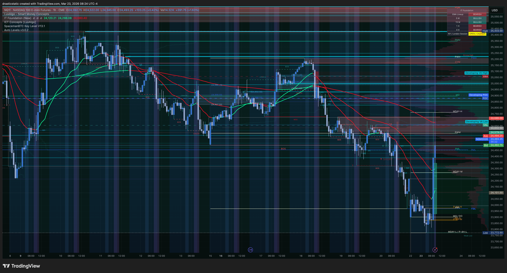

All EMAs red and downward-sloping. The pattern is clear: the post-FOMC bear continuation that started the week of March 16 has not broken. Price made new lows overnight before the pump. The pump is visible at the far right edge — price bouncing from the overnight low. Multiple cyan auto-levels visible above current price = overhead resistance stack. Short bias structurally intact.

---

### ES — Matching NQ · Strong Bearish Confirmed

**08:25 ET — ES pre-market**
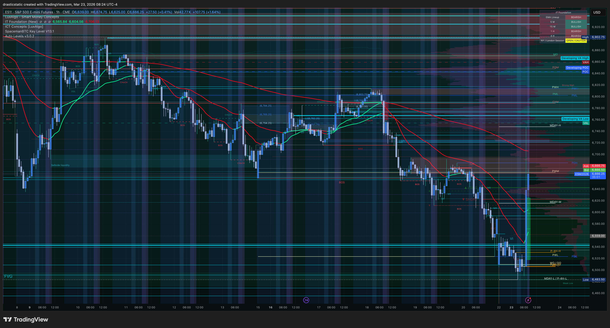

ES mirrors NQ exactly — no divergence between the two. Same EMA structure, same pump at right edge. ES and NQ are confirming each other's bearish read without any SMT ambiguity. The STB "neutral" snapshot likely reflects the pump lifting price off lows momentarily rather than any structural change in direction.

---

### YM — Bearish · ZTH Support Stack in Current Zone

**08:25 ET — YM pre-market**
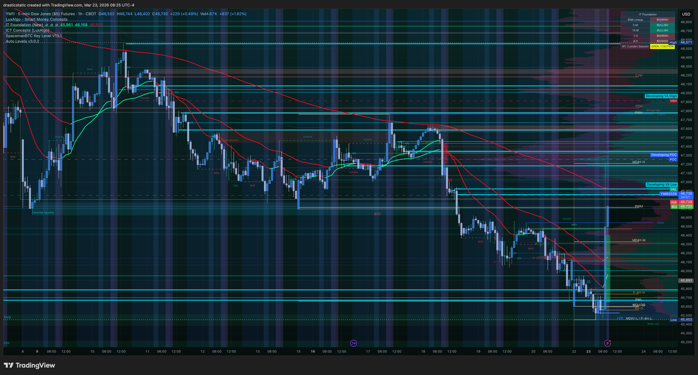

YM is bearish but sitting at a stack of green auto-levels (ZTH support). This is consistent with its pattern from last week — YM lags the other three by defending its support zones before eventually confirming lower. The EMAs are red. The pump has put YM at a key decision zone. If YM's support stack breaks at or after 9:30 and NQ/ES/RTY displace below their FCR LOWs, this is a Scenario A SHORT.

---

### RTY — Leading Lower · Risk-Off Confirmed · At Stacked Support

**08:25 ET — RTY pre-market**
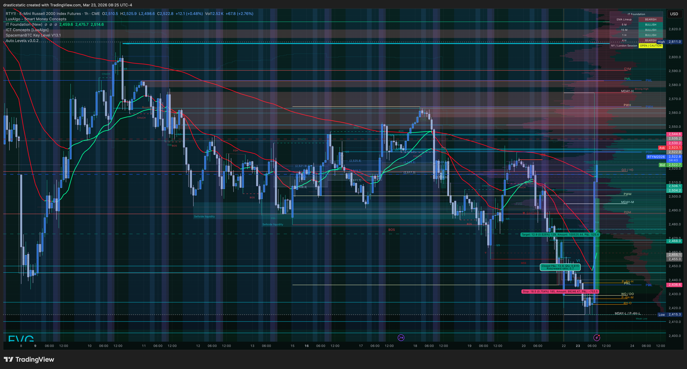

RTY has led the group lower throughout this entire move — small caps are the most risk-sensitive and the most aggressively sold. At 08:25 ET, RTY is sitting at a cluster of green ZTH support boxes. The structure says: RTY has come far, fast, and is at a natural support cluster. If this cluster breaks (or breaks on the open), RTY likely leads the next leg lower. The pump lifted RTY back to the top of this support cluster.

---

### GC — Bearish · Selling With Equities · Broad Liquidation Signal

**08:25 ET — GC pre-market**
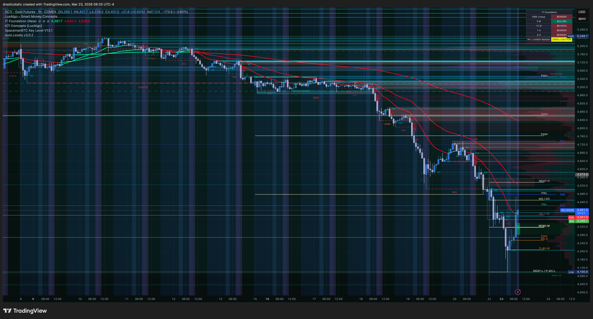

⚠️ *Correction: initial read of this chart as bullish was wrong — EMAs are red and downward-sloping, price is making lower lows. GC is bearish.*

Gold is selling alongside equities, not acting as a safe haven. This is a more significant signal than a clean equity-only selloff: when gold cannot catch a bid during an equity decline, it typically points to **forced deleveraging** — margin calls and broad asset liquidation across classes rather than a rotation out of risk assets. The "flight to safety" trade is not activating. This reinforces the bear read on equities and adds a macro dimension (potential credit stress, forced selling). Metals halted on Apex — this chart is information only, not a tradeable signal.

---

### CL — Bullish EMA Structure · Diverging from Equities

**08:26 ET — CL pre-market**
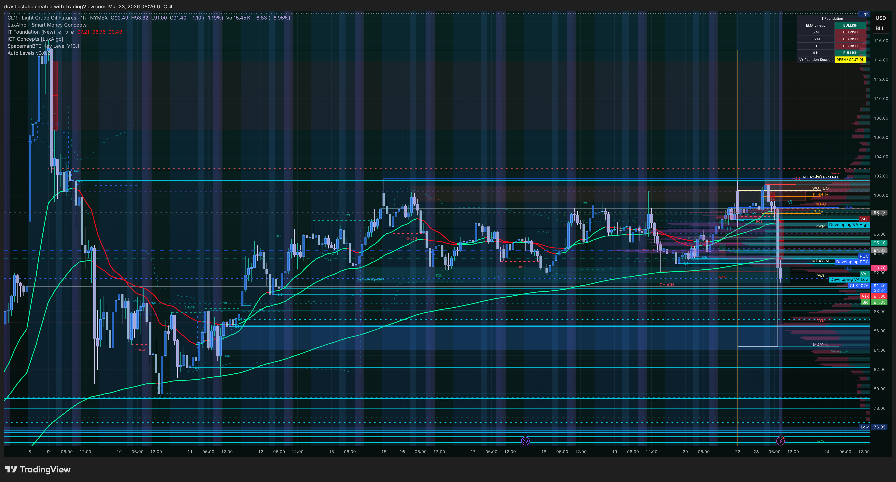

CL's EMA structure is green-dominant (bullish positioning) which diverges from the equity bear. This is the same CL structure noted in the Mar 20 pre-market summary. CL is either being supported by supply concerns independent of equity direction, or reflecting the energy component of the broader inflation/macro picture. A ZTH + IT setup on CL requires the IT Foundation EMA gate to confirm and a defined level to trade off — do not chase into the range. Keep on watch.

---

## 🧠 Pre-Session Mental State / Behavioral Reminder

**On the deadline:** Tomorrow is March 24. The account has a ~$4,000 gap. This is real and it is acknowledged — no point pretending the pressure isn't there. The correct frame: the pressure does not change what a valid setup looks like. The five-layer filter doesn't have a "deadline override" — it exists precisely for moments when the mind wants to take a lower-quality trade. One properly-sized A+ setup in a strong bearish environment with all four layers aligned covers a large portion of the gap. One forced entry in a pumping pre-market covers zero of it and costs drawdown.

**On the pump:** The pump is noise within the downtrend until proven otherwise. It has not broken the EMA structure on any of the four indices. It has not made a higher high. It has not changed the macro direction call. Let the 9:30 candle form. Read the FCR. Trade what appears, not what the deadline wants to appear.

**On the rest decision:** Choosing not to trade Sunday when tired was the correct call. Pattern 9 awareness. Being rested on the highest-pressure day of the arc is worth more than a half-asleep Sunday session. This is the right sequence.

**Protocol today:**
1. Watch the 9:30 FCR candle form — note HIGH and LOW rays
2. Read YM at the open — does the support stack hold or break?
3. Wait for pump to show its hand — does it continue or reverse?
4. If Scenario A/B SHORT confirms (FCR displacement below LOW + EMA gate red + FVG) → that is the trade
5. Write exit rules on the chart BEFORE placing the bracket — partial TP level + scratch condition
6. Cancel ALL orders before any step away from the desk (Pattern 9)
7. If conditions don't align: **$0 is a valid result today**

---

## ⏱️ Live Session Updates

**08:24–08:26 ET pre-market state:**
- NQ + ES: Strong bearish — all EMAs red, lower lows, pump visible at overnight lows
- YM: Bearish — stacked ZTH support in current zone, the holdout piece
- RTY: Most aggressive seller — at stacked support, leading group lower
- CL: Bullish EMA structure, diverging from equities
- GC: Bearish — EMAs red, selling with equities (broad forced liquidation, not rotation). Metals halted on Apex, information only
- Crypto pump occurring simultaneously — risk-on short-cover bounce within downtrend
- **STB market snapshot:** Neutral (pre-pump) → structural read bearish on all four

---

**08:57–08:58 ET — 5-min chart update**

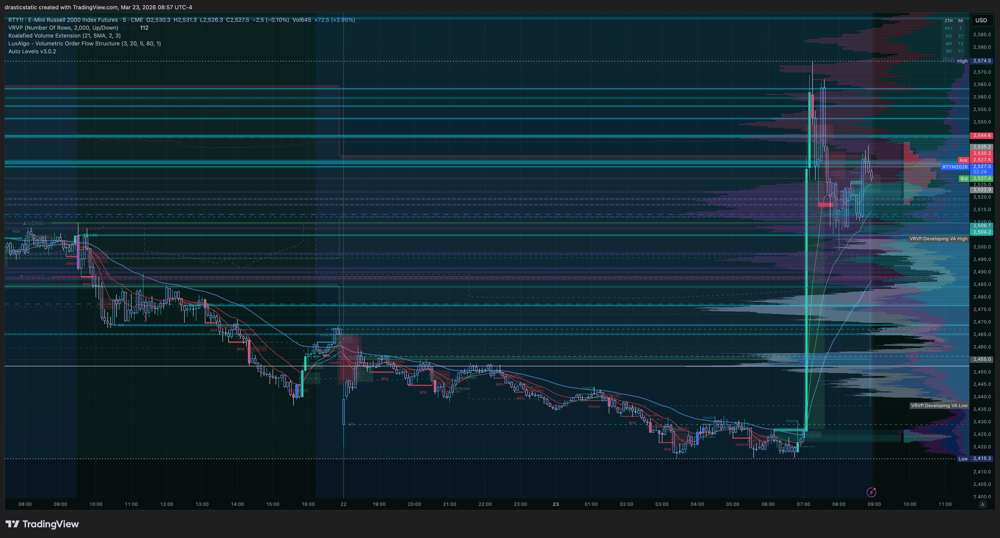

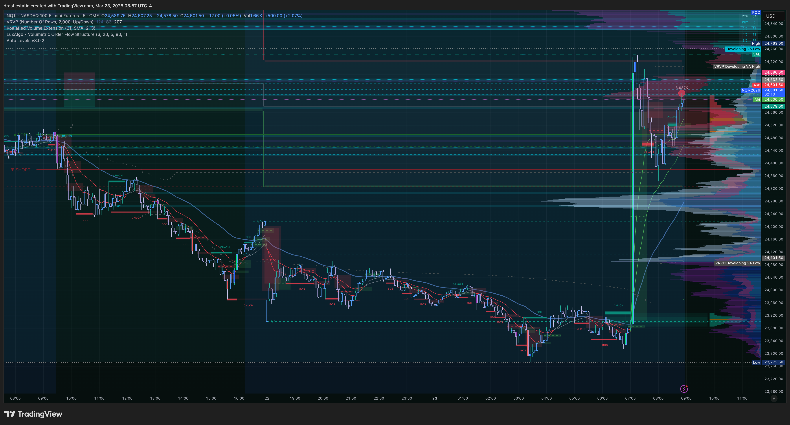

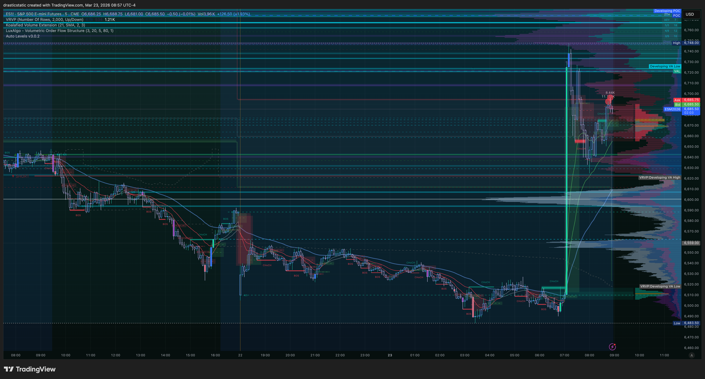

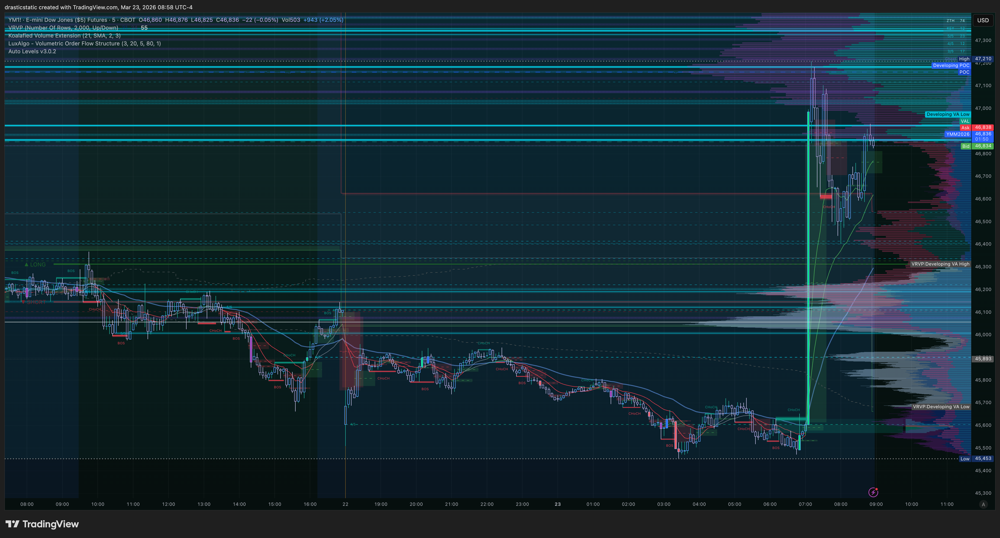

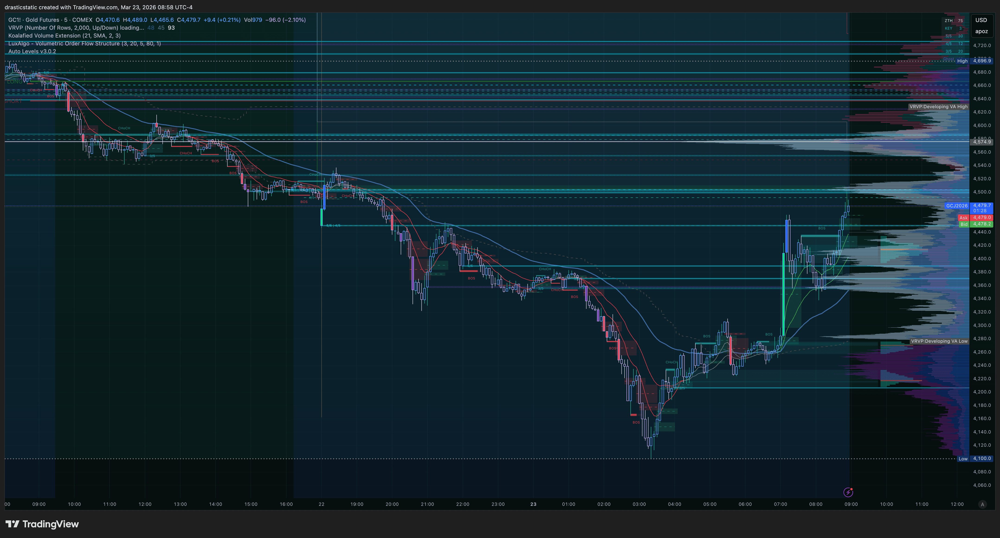

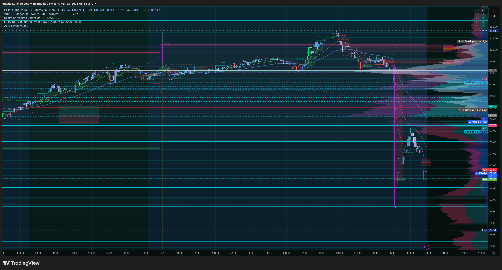

The 5-min charts clarify what the pump was and where price is now sitting:

**Price displaced below Friday's FCR "long from here" level on all four indices.** The pump from overnight lows carried price back up — but it came up into the underside of that Friday FCR LOW ray, not through it. All four are now in a **break-and-retest (BRT)** structure: price broke below, bounced back to the level, and is now being tested as resistance. The volume profile on NQ and ES shows a high-volume node sitting directly at/above the retest zone = additional resistance confirming the level.

**The read on "reversal or more liquidation?"** This is not reversal price action. A reversal would require reclaiming Friday's FCR LOW with conviction and forming a higher high. What the charts show is: the pump found resistance exactly at the broken support level and is now stalling. This is the textbook BRT rejection setup. If the retest fails and price rolls over here, the next leg lower begins from a technically cleaner position (BRT shorts have defined risk against the retest high).

**CL divergence note:** CL is not following the equity bear — holding its levels with bullish EMA structure intact. Not tradeable on the current entry criteria but worth watching for a ZTH/IT setup if the level stack aligns.

**Key watch into 9:30:** Does the FCR candle form above or below Friday's "long from here" level? If the open is at or below it (the retest failed), the short setup into the FCR LOW displacement is already in motion before the candle even closes.

---

**10:08–10:10 ET — Live session update**

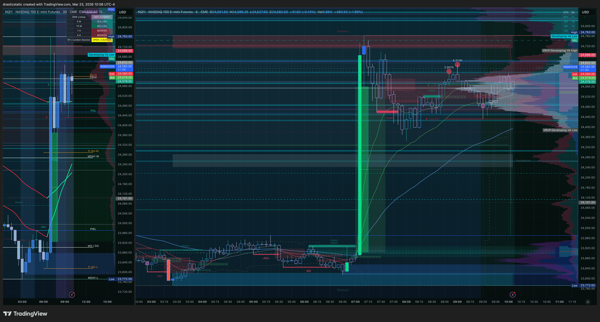

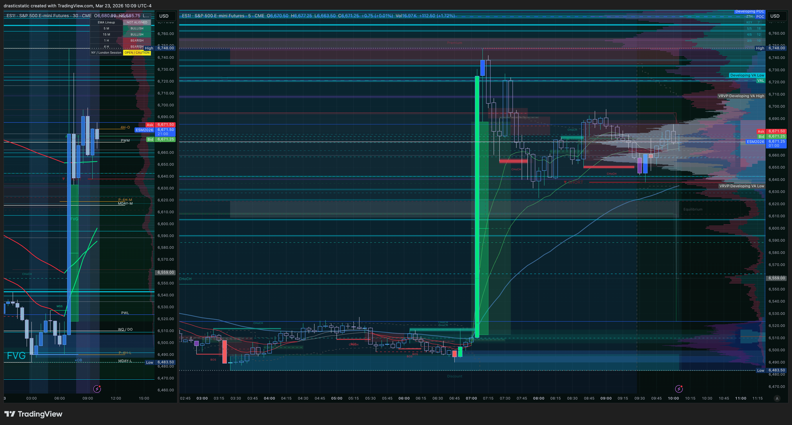

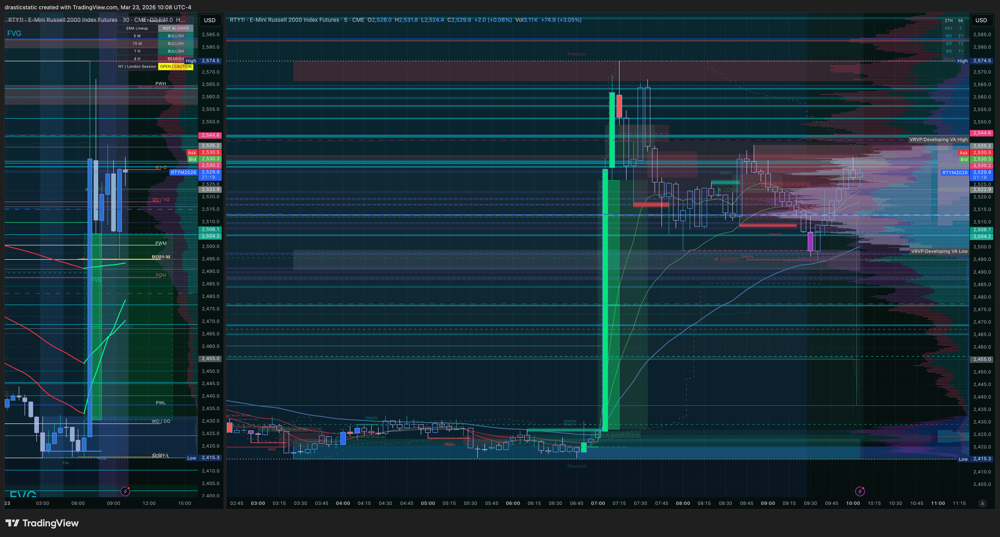

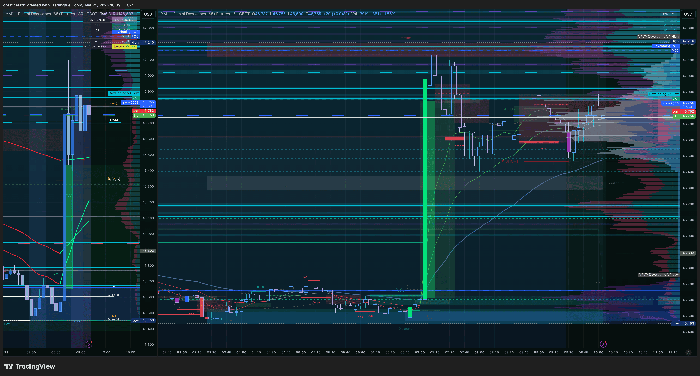

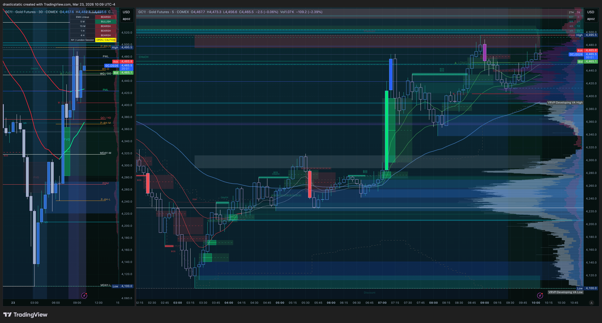

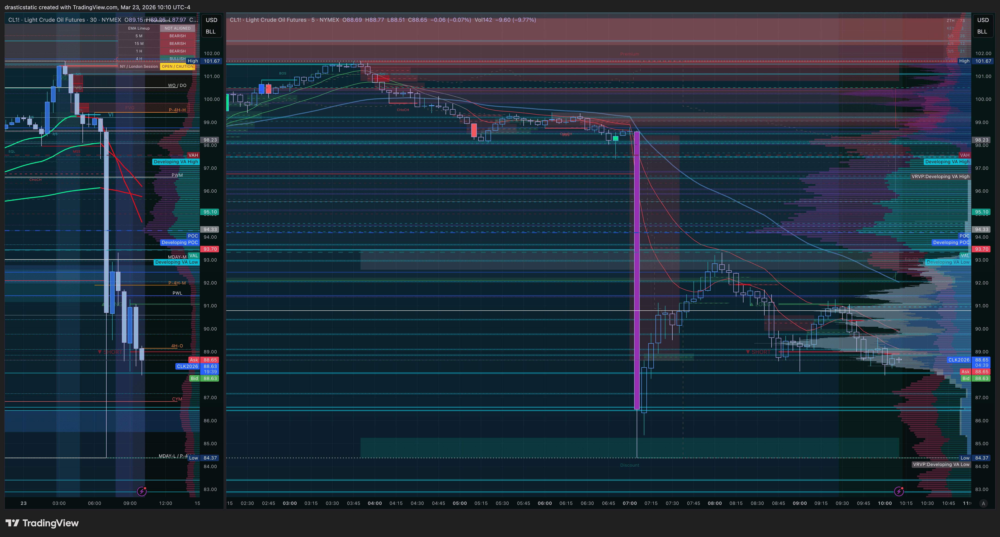

**9:30 FCR candle:** A massive spike upward across all four equity indices at the open. The FCR "long from here" HIGH ray was set at a very elevated level by this spike. Price briefly pierced ABOVE the FCR HIGH (Christopher noted "we are above the long from here") then pulled back below it — now trading inside the FCR box, falling back toward the FCR LOW ray. The volume profile shows heavy concentration at the top of the spike zone = that candle filled a significant amount of orders up there.

**The absorption read (STB Bookmap):** Aggressive buying is visible but NOT being reflected in price. This is the critical signal. When large buy orders are getting filled but price doesn't move up correspondingly, it means sellers are absorbing every bid — supply is overwhelming demand at current levels. The buyers are not being rewarded. When that buying exhausts, there is no floor under the market and the sellers take full control. This is the setup STB is calling a "vicious sell" — and it is structurally consistent with the macro bear context.

**The FCR spike as a liquidity sweep:** The 9:30 spike above the "long from here" level likely served a structural purpose — sweeping stops and grabbing late longs above resistance before the actual move. Institutional short entries fill most efficiently at spike highs where there is aggressive buying (retail chasing the breakout). The pullback below the FCR HIGH immediately after the spike is consistent with this.

**Coaching divergence — ZTH long vs STB short:**
- **ZTH:** watching continuation long — primary focus is GC (V-recovery bounce off ZTH support, sharp and clean). Secondary: NQ long.
- **STB:** watching Bookmap absorption, leaning into the pre-market bearish analysis, about to enter short.
- **Christopher's platform (Apex/MNQ):** GC is halted on Apex — ZTH's primary thesis is not tradeable here. The NQ secondary long is counter-trend against the macro bear structure. STB's short thesis aligns with the macro context and the FCR HIGH rejection.

**Current watch (10:10 ET):** Price is inside the FCR box, moving toward the FCR LOW ray. The setup that matters: if all four indices displace BELOW the FCR "short from here" LOW ray with EMA confirmation, that is the short entry signal. The absorption not reflecting in price + STB commitment + macro downtrend all point the same direction. Wait for the displacement — do not anticipate it.

---

**17:09–17:11 ET — RTH close**

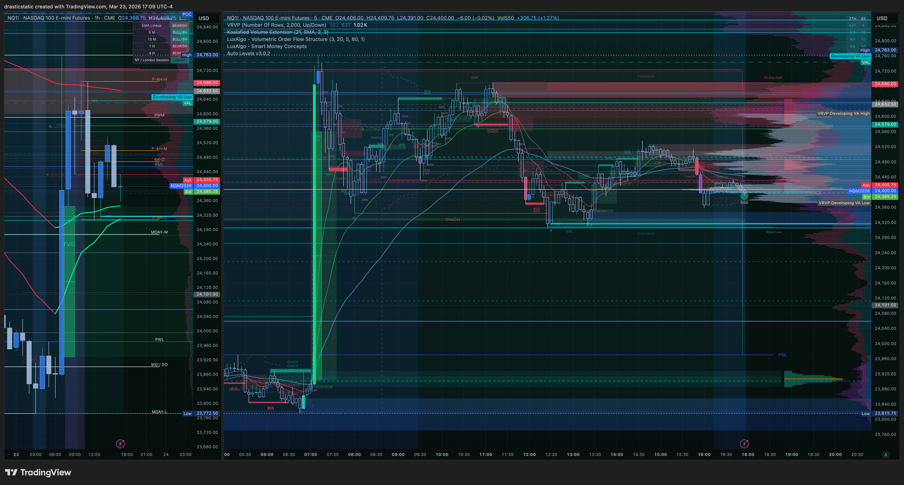

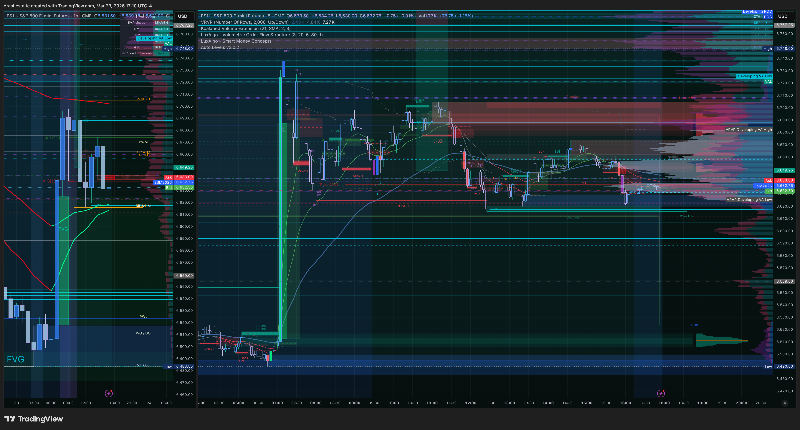

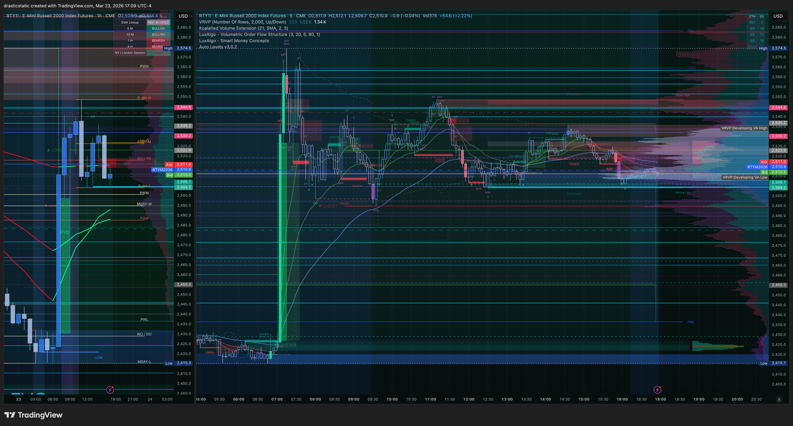

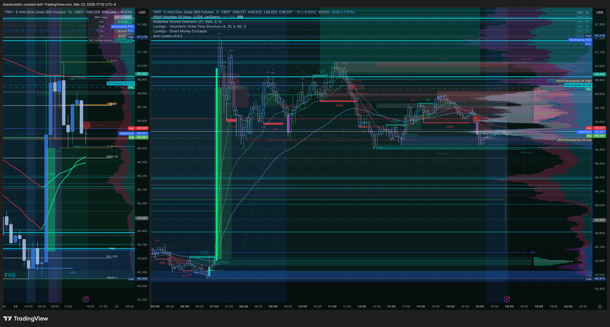

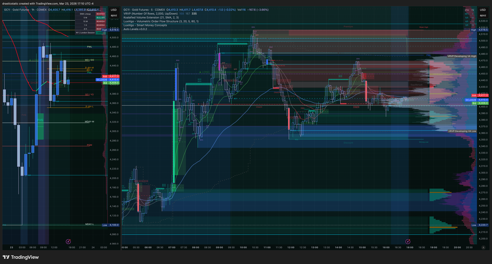

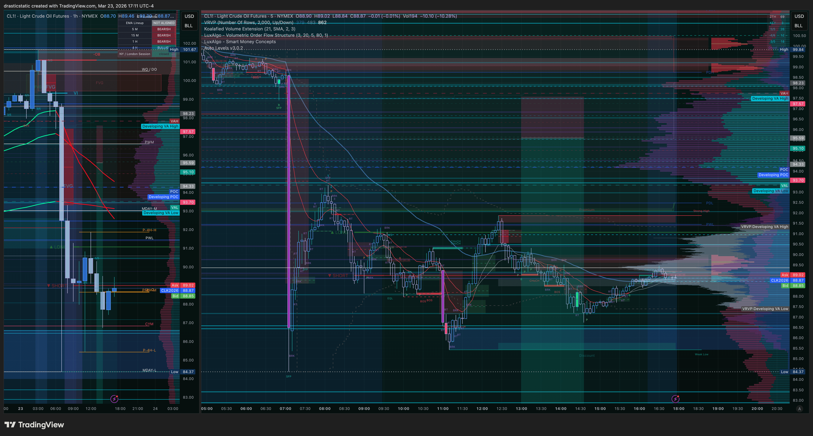

**Session result: $0. No trade taken. Correct call.**

The RTH session was genuinely difficult. After the 9:30 spike, all four indices churned in a choppy range — lower than the morning highs, higher than the overnight lows. No clean displacement setup materialized. The market went where the coaches saw it going (lower bias confirmed structurally) but never gave a clean entry signal with defined risk.

**What the coaches experienced:**
- **STB:** Initial short stopped. Two additional shorts attempted, both stopped at break even. Three stopped positions on a day where the directional read was correct — this is what "waiting for the vicious sell" that never came looks like. The absorption signal was real but the timing didn't resolve cleanly during RTH.
- **ZTH:** GC long thesis was correct — GC had a significant recovery day. The coach exited at -$50 on one attempt, then watched it come back into the entry zone and run. Right thesis, difficult execution. The NQ long watch did not produce a clean entry either.
- **Christopher:** Watched both coaching groups navigate real-time stops and missed entries. Stayed out. Identified "some ideas that would have played out and some that wouldn't" — this is an honest and accurate read. On a day where two experienced coaches got stopped multiple times, preservation is not failure.

**The "too nervous to execute" note:**
This deserves reflection in the evening calls. There are two distinct things it could be:
1. *Correct calibration* — the market was genuinely choppy, the setups were not meeting the five-layer filter, and the body knew it even if the mind wanted to act. This would be healthy.
2. *Deadline paralysis* — the APEX gap (~$4,000 due tomorrow) making every potential entry feel like it carries existential weight, raising the effective entry threshold so high that valid setups get passed over.

The distinction matters. If it's (1), today was a success. If it's (2), the pressure is affecting decision-making in a different way than forced entries — instead of forcing bad trades, it's blocking valid ones.

**GC close note:** GC ended the day significantly above its lows — the ZTH long call was directionally right. Metals halted on Apex = this was not tradeable today, but it's worth noting for the broader market read. Gold recovering while equities churn = the safe-haven bid eventually activated during the session.

**CL close note:** CL sold off hard from its morning highs and closed in a lower range. The ZTH/IT long watch did not produce a clean setup — the entry criteria weren't met and price confirmed why.

**Evening:** Three mentoring calls completed — ZTH mastermind, STB mentoring, Inevitrade mentoring. Main Inevitrade coach did not trade RTH. Other IT coaches caught wins in the session. Multiple coaches across all three groups classified today's RTH as untradeable. Christopher did not trade RTH — consistent with coaches' own experience.

---

**20:46–20:48 ET — ETH displacement beginning**

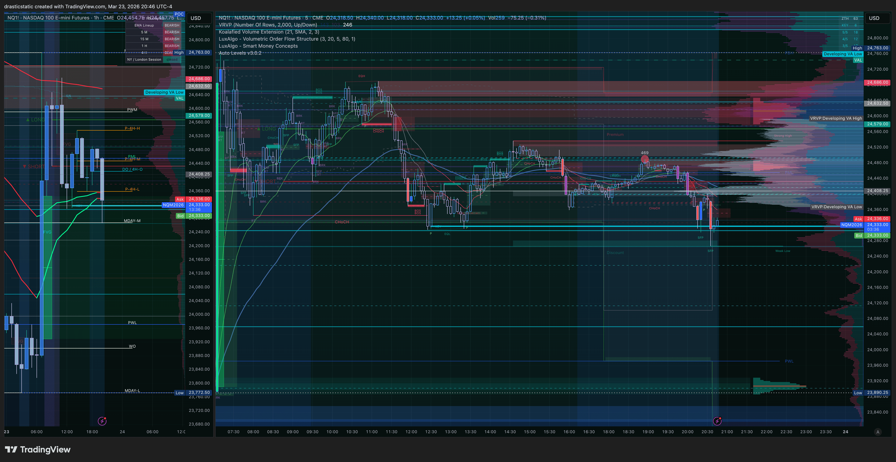

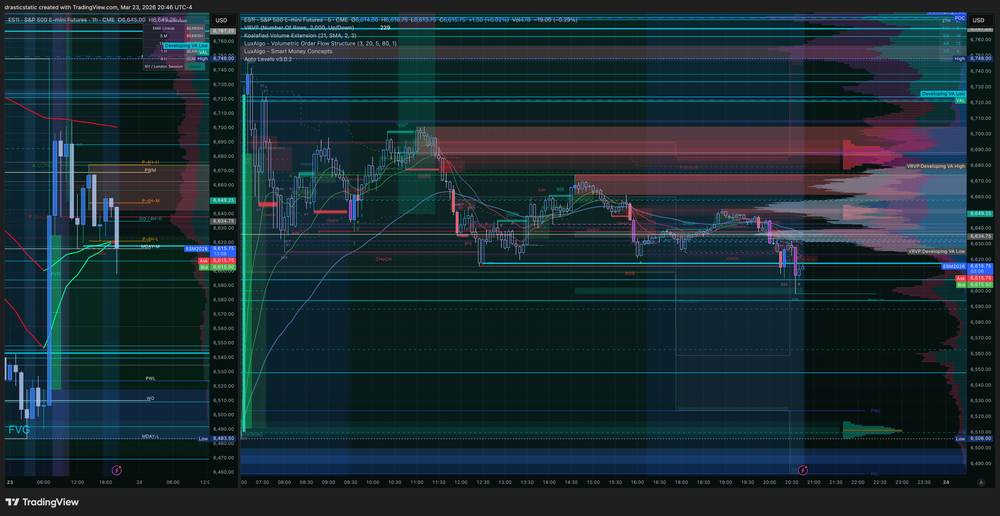

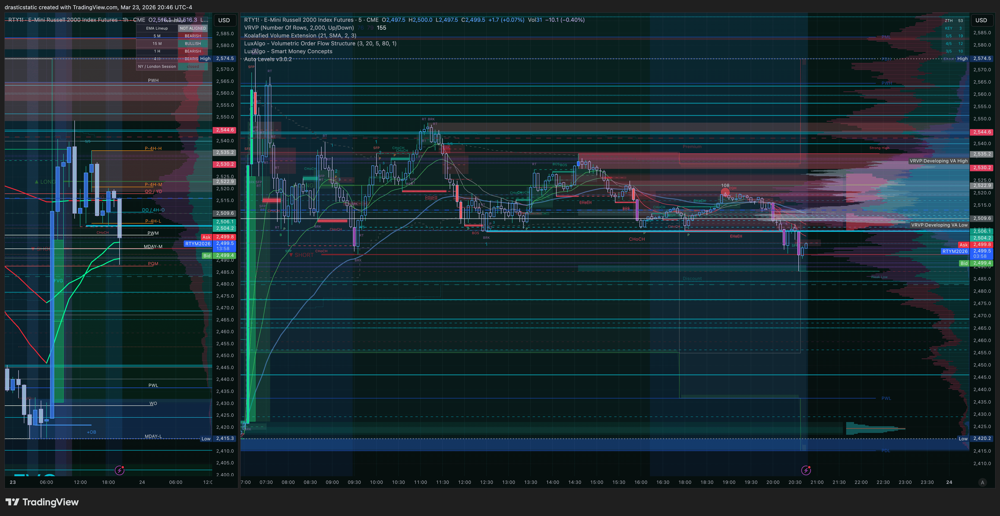

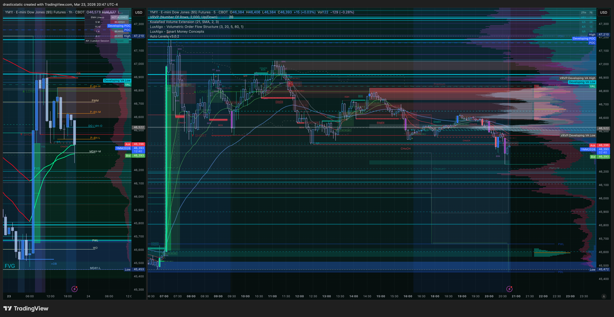

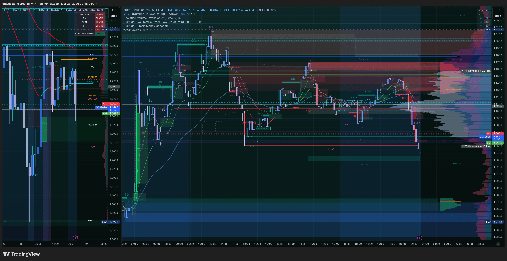

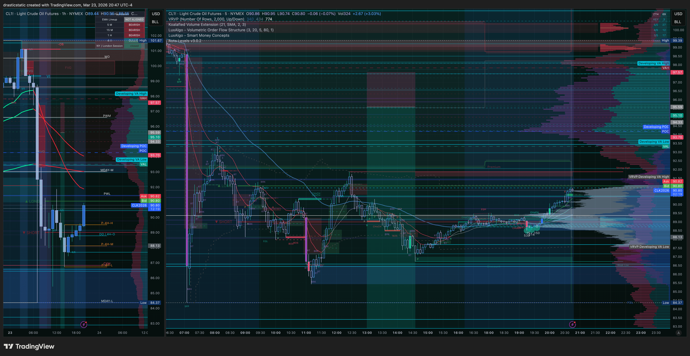

The RTH consolidation has broken to the downside in ETH. All four equity indices displacing lower simultaneously. IT Foundation EMAs curling red-dominant. Volume profile on all four shows price entering low-volume air below the RTH range — thin area, less resistance, faster movement. RTY leading. GC rolled over again. CL ranging separately.

**This is Inevitrade's session.** ETH/overnight is the IT window. The IT Foundation EMA gate is their tool. The displacement is structurally real.

**The five-layer check for any potential entry:**
1. FCR scenario — ETH has no FCR. ZTH/IT structure applies. Is there a ZTH level or IT EMA gate confirming direction? ✅ IT EMAs red-dominant, all four displacing
2. IT Foundation EMAs gate — red dominant on MNQ? Needs chart confirmation at entry timeframe
3. FVG displacement confirmed — visible on the downward move
4. SMT divergence — all four confirming, no divergence
5. Fibonacci golden pocket — needs specific level identification

**Pre-entry requirements if a trade is taken:**
- Write partial TP level + scratch condition on chart BEFORE bracket placed — no exceptions
- SL at structural invalidation, placed pre-entry, not moved
- Pattern 9: if stepping away at any point — cancel ALL orders first

**APEX deadline note:** The gap is ~$4,000 due tomorrow. The nervousness is real and is named. One properly-sized A+ trade in a confirmed ETH displacement covers meaningful ground. One rushed entry without defined exit rules in a volatile ETH session at 20:46 with a deadline tomorrow covers none of it. The checklist exists for exactly this moment.

---

## 🤖 SmartTraderAI Pre-Market Copy-Paste Fields

---

**1. What news releases today?**

Monday, March 23. No major scheduled economic data in the early session. CB Consumer Confidence possible at 10:00 AM ET — check before the open. No EIA (Wednesdays only). No FOMC. End-of-month / end-of-quarter positioning begins to build this week — may contribute to elevated volatility as we approach March 31, but no specific catalyst today.

---

**2. What are the expected figures? What effect has this event had on the markets before?**

If CB Consumer Confidence prints at 10:00 AM: a miss (lower than expected) would reinforce the current bearish macro thesis — consumer sentiment deteriorating in a downtrending equity environment. A beat would be contradictory to the macro bear read and could produce a sharp but likely short-lived bounce. The risk is a 10 AM data pop immediately after a 9:30 FCR setup — be aware of the timing overlap if the setup forms early.

---

**3. List both your HTF bias and key levels**

**HTF bias: BEARISH** — all four equity indices continue the macro downtrend that has been in force since early March. The post-FOMC rally (documented Mar 19 RTH) was fully reversed within 24 hours. New lows were made overnight into this session. The structure is bearish at every timeframe.

Key HTF reference levels (from auto-levels v3.0.2):
- NQ: Multiple cyan levels stacked above current price = overhead resistance. Overnight lows = watch for break-and-hold below
- ES: Same structure as NQ. HTF bearish anchored below FOMC bounce highs
- YM: Stacked green ZTH support in current zone — the key level cluster for Scenario A upgrade
- RTY: At stacked ZTH support cluster — break = next leg confirmed
- CL: Green EMA structure — independent bullish positioning. Key ZTH/IT levels define tradeable range

---

**4. List your Intraday bias and levels**

**Intraday bias: SHORT** — pump is a bounce within the downtrend, not a reversal. Scenario B SHORT live pre-market (NQ/ES/RTY bearish, YM at support). Scenario A SHORT if YM loses support stack at open.

Key intraday levels:
- FCR HIGH and LOW from today's 9:30 first 15-min candle (to be set at open)
- YM stacked ZTH support zone — holds = Scenario B; breaks = Scenario A
- RTY stacked support cluster — break and hold below = confirming next leg
- Overnight lows on NQ/ES — break below = continuation confirmed beyond the pump
- CL ZTH levels — define any ZTH/IT setup entry/SL if CL watch activates

---

**5. Expectations for the day?**

Macro downtrend continues. The pre-market pump is a short-cover / liquidity sweep bounce within the trend — expect it to either exhaust before 9:30 or produce an elevated FCR box that ultimately resolves to the downside. The highest-probability setup today is a Scenario A SHORT if YM confirms: all four indices with FCR displacement below LOWs, EMA gate red, FVG confirmation. One A+ short in this environment — properly sized — is the objective. APEX deadline is tomorrow (~$4,000 gap). The protocol does not change because of the deadline. If conditions align, execute. If they don't, $0 and protect the account for tomorrow's open.

---

> Full pre-market summary: https://github.com/drasticstatic/trading-assistant/blob/main/smarttrader-ai/analysis/premarket/2026/03-Mar/premarket_20260323_summary.md

*Fortuna — Wealth Warden | Claude Code CLI* / *Anthropic claude-sonnet-4-6 | March 23, 2026*
