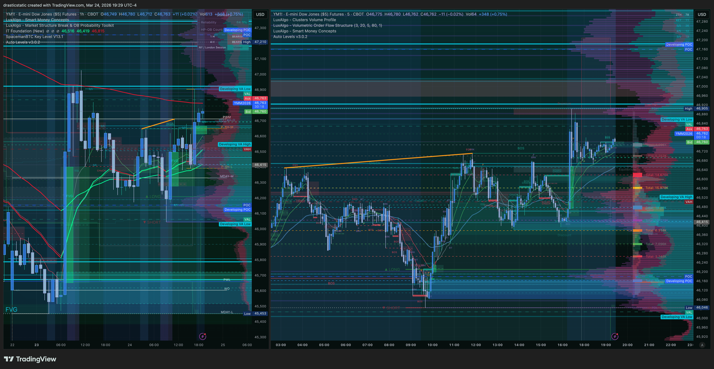
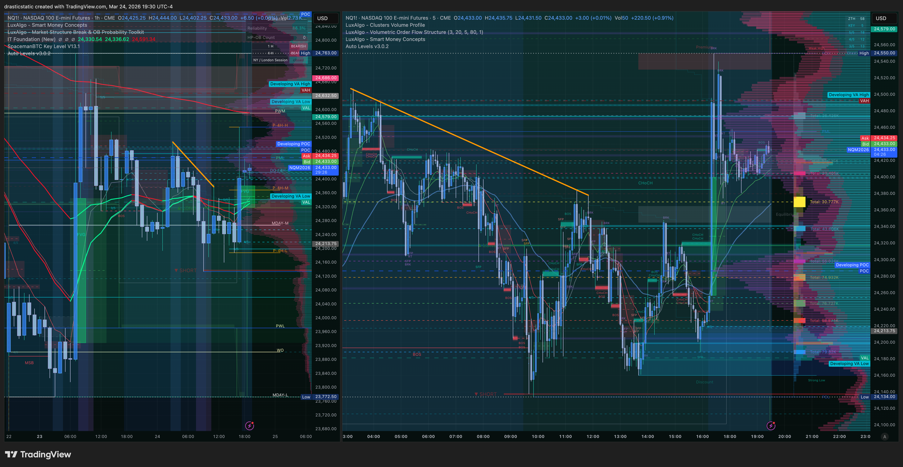
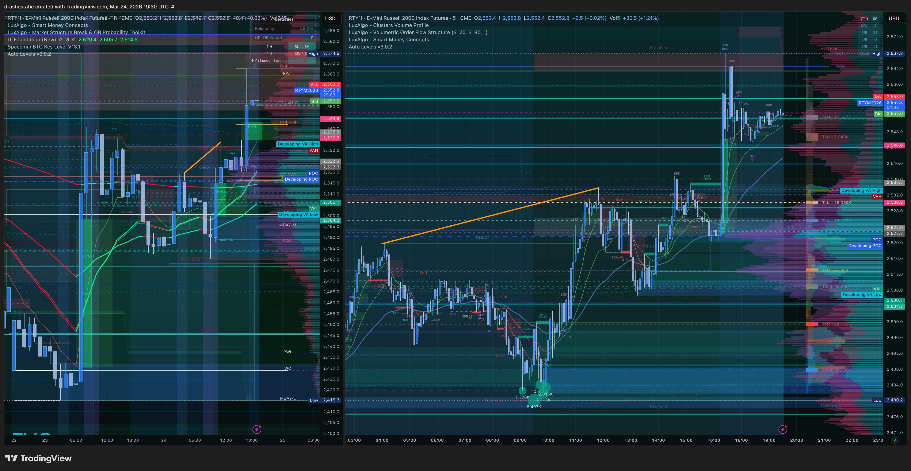
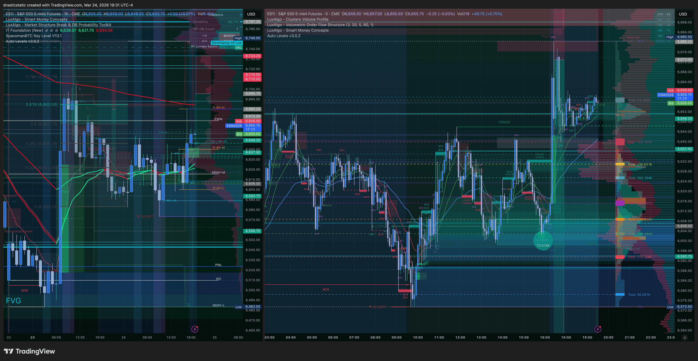
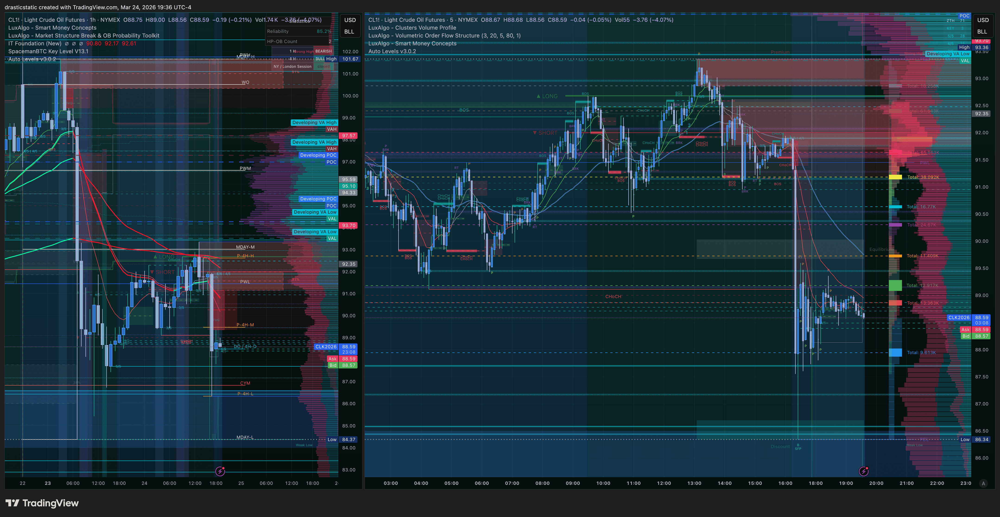
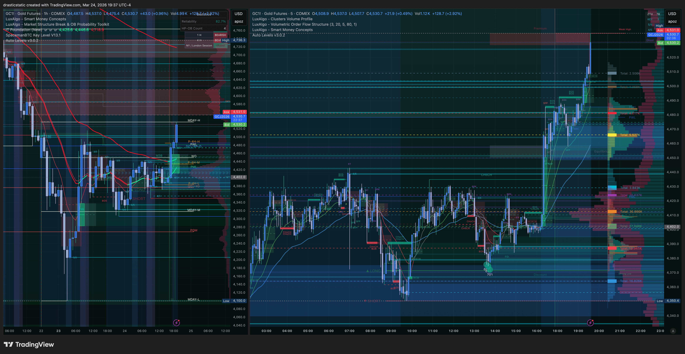
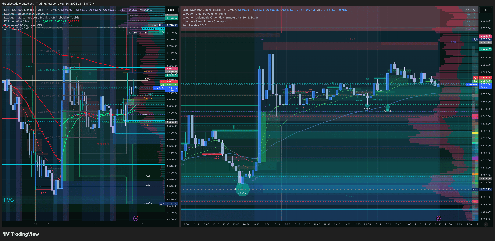
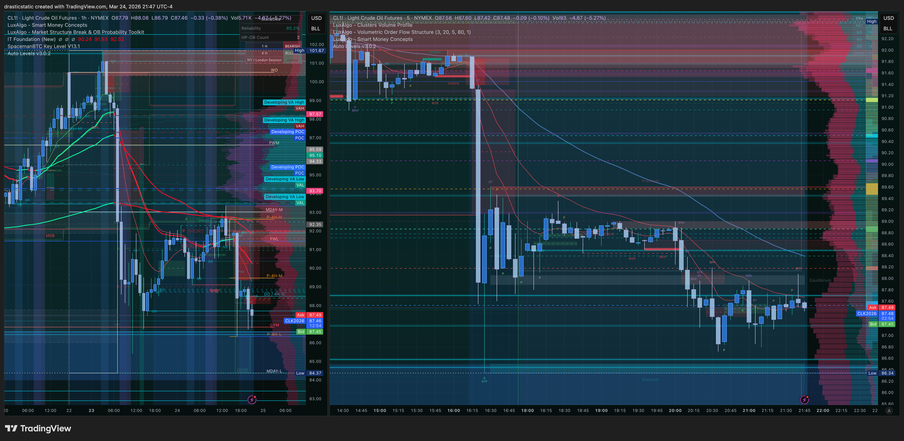

# Evening Session Summary — Tuesday, March 24, 2026
#### Fortuna — Wealth Warden | Claude Code CLI
#### Instruments: ES (primary) · CL (divergence) · GC (safe-haven confluence) | Session: NY PM / ETH

---

## Session Dashboard

| Field | Value |
|-------|-------|
| Date | Tuesday, March 24, 2026 |
| Session | NY PM / ETH — Live observation |
| Primary Account | APEX-484839-06 (100K Eval) |
| Day P&L (closed) | **+$1,221.90** (ES short +$1,225 via AutoLiq) |
| Eval Balance (approx) | **~$103,252.84** |
| Drawdown Floor | **$100,629.39** |
| Eval Gap Remaining | **~$2,747** to target |
| Open Positions | None |
| Working Orders | None (MCL sell limit canceled at session close) |

---

## Day Context — Into the ETH Session

RTH session closed with ES short +$1,225 — APEX deadline day trade captured via overnight sell limit set with patience. AutoLiq closed the position at 16:59 ET before the TP at 6588.75 was reached.

**Key structural context going into ETH:**
- Macro downtrend intact — HTF EMAs red on all four equity indices
- Daytime short captured the first leg of the macro bear structure
- Four indices showed V-recovery off RTH close lows at the 18:00 ET ETH open
- Orange descending resistance lines (lower highs) drawn on NQ/ES/YM — macro bear wedge forming
- CL retracing UP while ES retracing DOWN — inverse correlation active
- GC still elevated vs. session open — safe-haven bid intact

**Christopher's read:** *"Remain hopeful for one last bullish push to our entry before continuing to the downside."* — watching for potential retest of the RTH sell zone before macro continuation.

---

## 19:29–19:37 ET — ETH Open · V-Recovery + Descending Bear Wedge

All four indices opened ETH with a V-recovery off RTH close lows. Orange descending resistance lines visible across NQ/ES/YM — each bounce making a lower high vs. the previous session. Macro bear wedge structure tightening. CL inverse correlation continuing — selling off while indices recover. GC still elevated, safe-haven bid intact. No trade — observation only with no working orders.

---

## 21:46–21:47 ET — ES + CL Update

ES retracing DOWN. CL retracing UP. Inverse correlation persists. Structure developing within the macro bear wedge — ES testing lower within the wedge while CL bounces toward supply. Watching for alignment signal before any entry consideration.

<!-- appended as session develops -->

---

## Evening Game Plan

**Thesis:** One more bullish push on ES/indices to retest the overhead supply zone (former sell limit area ~6673+) before macro downtrend continuation.

**Entry consideration (not yet triggered):**
- Structural short at a FVG or ZTH pivot level in the resistance zone
- All four equity indices aligned (Scenario A)
- IT Foundation EMAs confirming red dominant on 1hr
- CL confirming with turn lower from supply (inverse = indices pushing up briefly then reversing)

**Scenario C (current state):** Mixed signals, divergence active (ES down, CL up). No trade.

**Rules:**
- No position open — no pressure, bonus session after +$1,221.90 day
- Pattern 9 compliance: any time away from desk, cancel all orders first
- SL discipline applies at full force regardless of deadline passing

---

## SmartTraderAI Evening Copy-Paste Fields

**Date:** 2026-03-24 (evening continuation)
**Session:** NY PM / ETH
**Instrument:** ES (primary) | CL (divergence) | GC (safe-haven)
**Account:** APEX-484839-06 | 100K Eval

**CONTEXT:**
Day session closed +$1,221.90. APEX deadline day trade hit — ES short via overnight sell limit, AutoLiq exit. Eval gap ~$2,747 remaining. ETH session opened with V-recovery on all four indices. Macro bear wedge with descending resistance lines visible. CL inverse correlation active (ES down, CL up at 21:46-21:47 ET). No open positions, no working orders.

**ES BIAS:** Bearish macro. ETH bounce possible toward prior sell zone before continuation lower.
**CL DIVERGENCE:** Inversely correlated — CL retracing up while ES retracing down.
**GC CONFLUENCE:** Safe-haven bid intact.

**SCENARIO:** No active trade. Watching for Scenario A SHORT setup if indices push back toward supply zone.

---

*Produced with 🙏🏼 Fortuna — Wealth Warden | Claude Code CLI*
*Pre-Market Analysis · 0324 EVENING SESSION · Mar 25, 2026*
*Evening session analysis: 19:29–19:37 ET + 21:46–21:47 ET, March 24, 2026*
