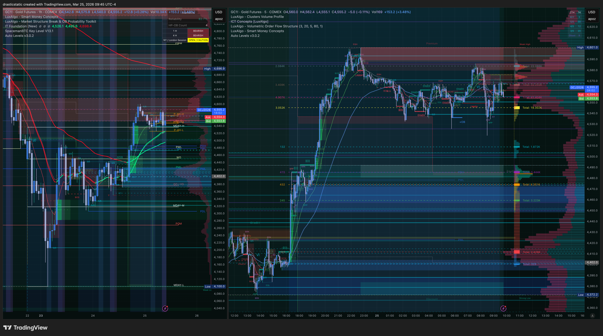
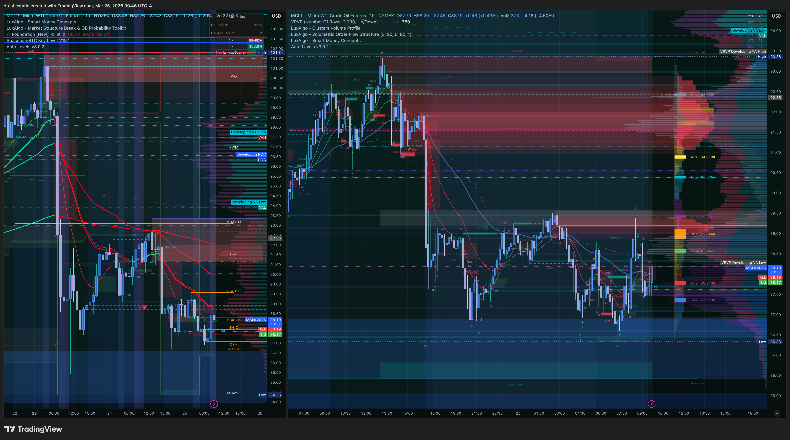
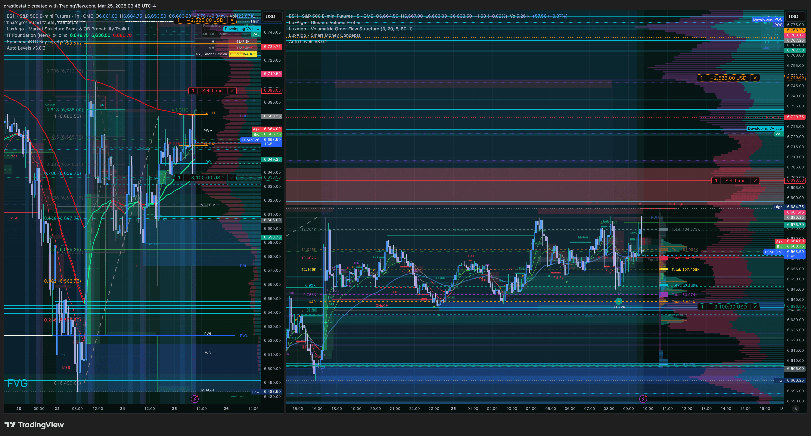

# Pre-Market Summary — March 25, 2026
### Wednesday · APEX-06 Day 6/7 · TPT Day 1 · ES Sell Limit Still Working · SOL/BTCC Voucher Active

[Jump to 🤖 SmartTraderAI Copy-Paste ↓](#smarttraderai-copy-paste)

---

## 📋 Session Dashboard

| Account | Status | Gap | Notes |
|---------|--------|-----|-------|
| APEX-484839-06 | ✅ Active | ~$2,747 | **Day 6 of 7 minimum trading days** |
| TPT 50K | ✅ Active | ~$3,000 | **DAY 1 — first trading day today** |
| BTCC SOL/USDT | ✅ Live | — | Voucher trade live @ 92.4686 (20x, 06:04 ET) |

**Working orders (carry-forward):**
- Sell ESM6 — sell limit — [Working] ✅ (carried from Mar 23 overnight — patience arc)
- TPT account: bracket order set up in Tradovate for same ES trade idea

**Primary instruments:** ES · NQ · YM · RTY · CL (MCL) · SOL/USDT (BTCC)
**Metals on Apex:** ❌ Halted (GC, SI, HG, MGC) — GC for confluence only
**Session type:** Wednesday — EIA window 10:15–10:45 AM ET (no CL entries in that window)

---

## ⚠️ Session Risk Alert

- **APEX-06 Day 6 of 7.** Account remains active. Deadline cleared — now in minimum-day completion arc. Two more trading days after today are required. No pressure — just show up and honor the process.
- **TPT Day 1.** TPT requires 5 minimum trading days. Starting today. Same trade setup exists in Tradovate for TPT — practice the platform, execute the plan identically.
- **Pattern 9 compliance.** Sell limit left intentionally while resting (deliberate, bracket in place, prayer said — same as Mar 24). This is the controlled variant, not the accidental Pattern 9.
- **SOL voucher active.** BTCC voucher trade in play — 20x leverage. Let the voucher exhaust itself like Feb 25. No premature close.
- **EIA Wednesday:** 10:15–10:45 AM ET — no new CL/MCL entries in that window.

---

## 🌙 Overnight / Pre-Market Context

**Overnight structure (ETH continuation from Mar 24):**

The macro bear wedge established in the Mar 24 ETH session continued developing overnight. Price action ranged and consolidated through the London session open — no significant directional break. Then at ~04:00 ET another bullish push appeared on all four indices — higher high attempt, consistent with the thesis of reaching for buy-side liquidity from Monday's highs.

**RTY/YM vs NQ/ES divergence:**
- RTY and YM: making higher highs, pivoted cleanly off their respective ZTH levels at the 04:00 bullish push
- NQ and ES: ranging — NQ has a LVN just above current price (expect to "soar through" once it fills)
- ES entry: just outside its own LVN — the limit is positioned to catch the pop through the LVN

**CL inverse correlation active:**
CL testing a ZTH level above its recent FVG — if CL pops to that ZTH zone, expect indices to push up in inverse (additional bullish momentum). When CL eventually reverses lower, expect indices to follow the same inverse relationship and sell off.

**STB snapshot: Neutral across the board.** No directional edge from the STB signal system — consistent with the ranging/consolidation structure.

**SOL/BTCC:**
SOL entered @ 92.4686 at 06:04:54 ET — 20x leverage market order, voucher. Retraced 3% from entry, then ran to +15% before pulling back. As of 07:45 ET sitting at +7.5%. Christopher is letting the voucher exhaust itself.

---

## 🌤️ At the Open

**FCR candle at 9:30.** STB snapshot is neutral — open could go either direction. The sell limit is positioned above current price. The thesis remains: one more bullish push through the LVN zones → ES reaches the sell limit → fill confirmed → macro downtrend continues.

**ZTH coach:** Looking for break-and-retest LONG entries on NQ. NQ breaking through its LVN would be the trigger.

**STB coach:** Identified "D" shape on the volume profile — sitting the session out. Sharing psychological wisdom. Conservative read from STB today — do not force a secondary entry.

**If ES sell limit fills:** TPT bracket simultaneously. Both accounts execute the same trade idea.
**If ES doesn't fill:** Zero is acceptable. Pattern 9: if stepping away, cancel all orders first.

---

## 🔗 SMT Divergence Scenarios

**Pre-market read:**
- **RTY/YM leading higher.** Higher highs in place. ZTH levels serving as pivot points.
- **NQ/ES ranging.** LVN resistance just above — once through, expect rapid move.
- **CL inversely correlated.** CL testing ZTH above its FVG → if fills → more bullish push on indices → sell limit fill opportunity.

**Scenario A SHORT watch** — all four indices align to ES sell limit zone with FCR displacement above FCR HIGH. Sell limit fills — entry active. Both APEX-06 and TPT brackets trigger.

**Scenario B SHORT** — NQ leads, breaks LVN, YM/RTY confirm, IT EMA gate red dominant.

**Scenario C (current as of pre-open)** — RTY/YM bullish, NQ/ES ranging. No entry until alignment clears.

---

## 📅 Economic Calendar

| Time (ET) | Event | Notes |
|-----------|-------|-------|
| 9:30 AM | Regular open | FCR candle — neutral STB snapshot, direction TBD |
| 10:00 AM | Possible data | Watch for Richmond Fed / CB Consumer data |
| **10:15–10:45 AM** | **EIA (Wednesday)** | **No new CL/MCL entries in this window** |

---

## 🎯 Priority Instruments

**Primary:** ESM6 — sell limit working. Same structural setup from Mar 23 overnight. Patience has been the edge. Two-account execution (APEX-06 + TPT) when filled.

**Secondary:** MCL — watching CL structure for ZTH level test → inverse signal.

**Watch:** SOL/BTCC — voucher trade live. Letting it run. No intervention until voucher exhausts.

**Reference:** GC — safe-haven confluence. Still elevated.

---

## 🧠 Mental State

*"Patience and stillness seem to be my edge — most of my anxiety in trading comes from thinking the market is going to develop faster than it does."* — Christopher

The market has been volatile enough to actually help the structure develop. The sell limit has been waiting through overnight → London → pre-market. Most traders would have adjusted, chased, or abandoned by now. Staying anchored to the structural thesis and letting price do the work is the Pattern 7 clean pass continuing.

**Matthew 7:8 continues to apply.** The limit is the ask. The plan is the knock.

---

## ⏱️ Live Session Updates

**09:45–09:46 ET — ES, GC, MCL check**

Indices and crypto correcting down as of 9:45. CL pushing up inversely — pattern holds. SOL sitting around +7.5% at this time. Market showing another retrace after a higher high — ES made equal highs, NQ breached its local high, YM/RTY did not make new local highs. Potential sweep of the high before continuation or reversal. 8:30 candle key watch. TPT position using full SL drawdown with more conservative entry as precaution.

Buyers stepping in on indices/crypto/metals. Sellers on CL. Structure holding with the macro narrative.

STB coach: "D" volume profile shape — sitting session out, sharing psychological wisdom. ZTH coach: break-and-retest longs on NQ. Indices retracing down again with CL pushing up — the inverse relationship continues to look like liquidity grabs before real moves.

<!-- appended as session develops -->

---

## 🤖 SmartTraderAI Pre-Market Copy-Paste Fields

---

**1. What news releases today?**

Wednesday, March 25. EIA Crude Oil Inventories at 10:30 AM ET — **no new CL/MCL entries 10:15–10:45 AM ET**. Possible 10:00 AM data (Richmond Fed Manufacturing or CB Consumer Confidence). No FOMC. End-of-month/quarter positioning active — elevated volatility possible. March 31 approaching.

---

**2. What are the expected figures? What effect has this event had on the markets before?**

EIA: crude inventory data can cause sharp CL moves of 1-2% in minutes. A draw (less inventory than expected) = bullish CL spike. A build = CL sell-off. Given the current CL/index inverse correlation, an EIA surprise on CL could temporarily amplify or counter equity index direction. Avoid active CL/MCL positions during the window. The ES sell limit is unaffected by EIA directly unless the CL move cascades into equity index volatility.

---

**3. List both your HTF bias and key levels**

**HTF bias: BEARISH** — macro downtrend intact. Overnight/London push is a corrective bounce within the macro bear. Higher highs being made by RTY/YM are within the context of the weekly/daily downtrend. No higher high of significance vs the macro structure has been made.

Key levels:
- ES sell limit (working) — the target entry zone, above current price
- LVN on NQ just above current price — expect rapid fill once breached
- ES LVN zone — sell limit positioned just outside it
- Monday's highs — buy-side liquidity pool drawing price up
- ZTH levels on RTY/YM — confirmed pivot support
- CL ZTH level above recent FVG — watching for CL pop → inverse index push

---

**4. List your Intraday bias and levels**

**Intraday bias: SHORT-WATCH with bullish acknowledgment.** STB snapshot neutral. ZTH coach looking for break-retest LONG on NQ first — consistent with the LVN breakout scenario. The plan is: price pushes through LVNs, ES reaches sell limit → short entry. Or ZTH longs trigger first as price breaks higher.

Two-account execution ready: APEX-06 (sell limit in Tradovate via TradingView bracket) + TPT (same bracket set up directly in Tradovate terminal for platform practice).

Key intraday levels:
- ES sell limit — fill = short entry; exit rules pre-written
- NQ LVN just above — breakout = acceleration signal
- FCR HIGH and LOW from 9:30 first 15-min candle
- 10:15–10:45 ET — EIA blackout on CL
- SOL/BTCC voucher — live, no SL, letting it run

---

**5. Expectations for the day?**

The ES sell limit has been working since Mar 23 overnight — a 36+ hour patience arc. RTY/YM strength combined with NQ LVN just above current price suggests one more push higher is structurally likely before the macro bear resumes. If the fill happens today, both APEX-06 and TPT execute the same trade. If not, zero is acceptable — the structure is intact and the limit stays until filled or cancelled. SOL voucher running in the background. EIA window respected.

---

> Full pre-market summary: https://github.com/drasticstatic/trading-assistant/blob/main/smarttrader-ai/analysis/premarket/2026/03-Mar/premarket_20260325_summary.md

*Produced with 🙏🏼 Fortuna — Wealth Warden | Claude Code CLI*
*Pre-Market Summary · Mar 25, 2026*
