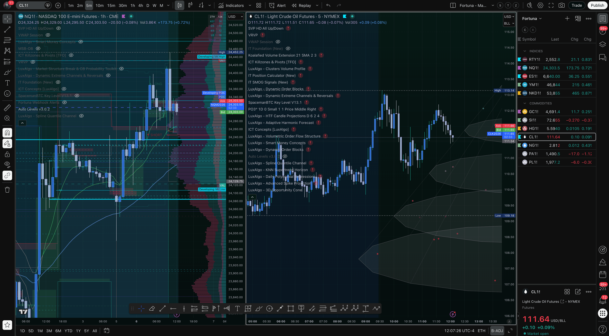
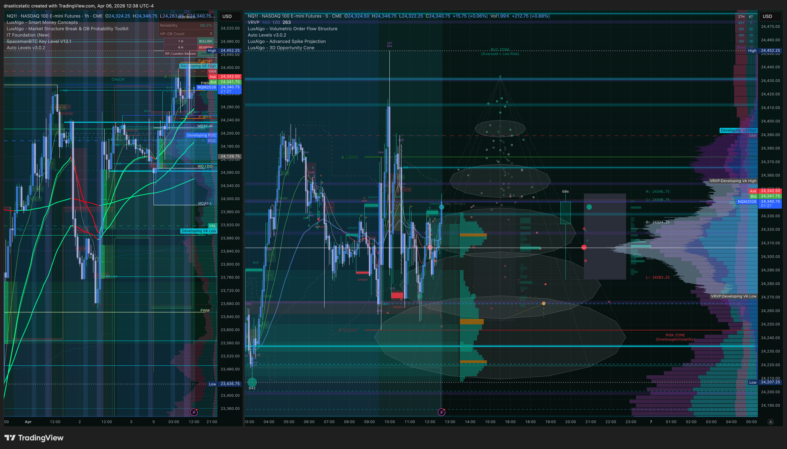
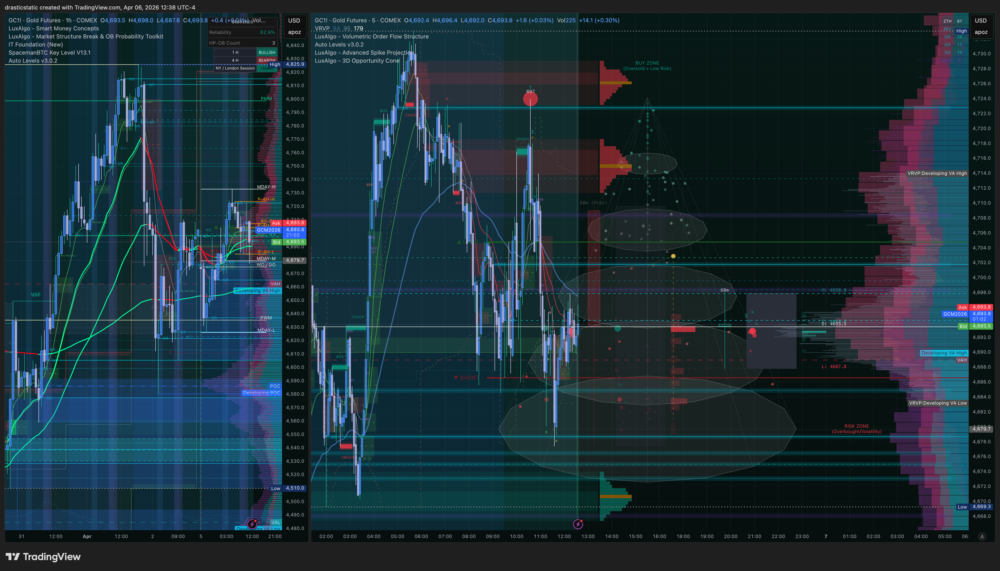
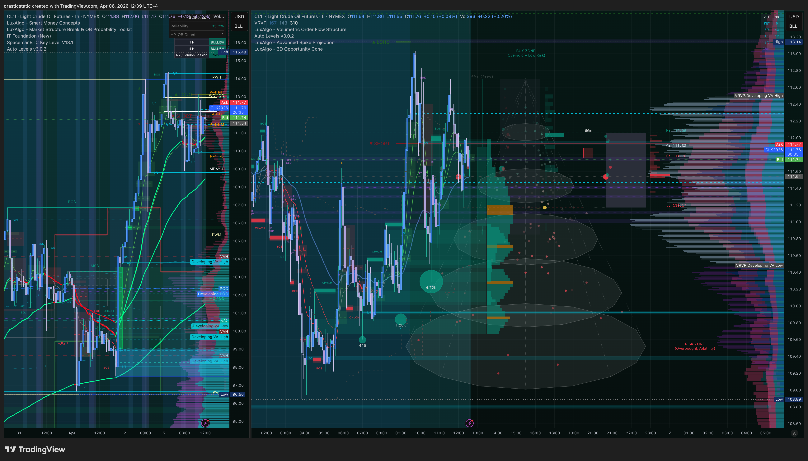

# Pre-Market Summary — Monday April 6, 2026
**First Trading Day Post-Good Friday + Easter Weekend**
*Generated by Fortuna via TradingView MCP (first live run) · Saturday Apr 5 ~8 PM ET*

> **Note:** This summary was generated Saturday evening using weekend/overnight futures data via the newly activated TradingView MCP. FCR levels cannot be set until the 9:30 AM Monday first candle. Re-run `morning_brief` Monday pre-market for updated levels. Data reflects the first-ever live pull from `tradingview-mcp-jackson` — treat any gaps as calibration points.

[Jump to SmartTraderAI Copy-Paste](#smarttraderai-copy-paste)

---

## 📋 Dashboard

### Saturday (Pre-Session) Snapshot — Apr 5, 2026 ~9 PM ET
*Original data at time of writing — kept for reference*

| | MNQ | ES | YM | RTY | CL | SOL |
|---|---|---|---|---|---|---|
| **Last** | 24,132.25 | 6,603.75 | 46,629 | 2,531.7 | 112.06 | 80.65 |
| **vs VWAP** | -43 ❌ | -8.5 ❌ | -50 ❌ | -3.8 ❌ | +3.04 ✅ | -0.06 ❌ |
| **HTF Bias** | BEARISH | BEARISH | BEARISH | BEARISH | BULLISH | NEUTRAL |

---

### Live Dashboard — Apr 6, 2026 ~9:30–10 AM ET
*Fortuna-Master watchlist pull via TradingView MCP · quotes only for correlated instruments*

| Symbol | Last | Change | Change % | vs PDC | Bias |
|---|---|---|---|---|---|
| **NQ1!** | **24,399.75** | +270.00 | +1.12% | **+270 above PDC 24,129** ✅✅ | **BULLISH** |
| **ES1!** | **6,642.75** | +39.00 | +0.59% | Above PDC | ✅ BULLISH |
| **YM1!** | **46,731** | +102 | +0.22% | Above PDC 46,806 ⚠️ | Lagging |
| **RTY1!** | **2,548.1** | +16.4 | +0.65% | Above PDC 2,544 ✅ | BULLISH |
| NKD1! | 53,850 | +460 | +0.86% | — | BULLISH |
| **GC1!** | **4,701.6** | +21.9 | +0.47% | ATH zone | BULLISH |
| **CL1!** | **112.13** | +0.59 | +0.53% | Above PDC 111.54 ✅ | BULLISH |
| SI1! | 72.830 | — | — | — | — |
| HG1! | 5.6135 | +0.030 | +0.54% | — | — |
| NG1! | 2.839 | +0.039 | +1.39% | — | — |
| PA1! | 1,494.5 | — | — | Apex halted ❌ | — |
| PL1! | 1,981.4 | — | — | Apex halted ❌ | — |

**Triple-index SMT read:** NQ +1.12% · ES +0.59% · YM +0.22% · RTY +0.65% — all green, NQ leading, YM lagging. NQ/ES/RTY confirming bullish. YM diverging slightly (weakest). Watch for SMT divergence signal if YM continues to lag NQ.

**HTF Bias: BULLISH REVERSAL** — Complete flip from Saturday's bearish read. All 4 equity indices above PDC. NQ has broken well above PDH (24,255). Gold holding ATH zone. CL maintaining weekend gap levels.

---

## ⚠️ Risk Alert

**THREE-DAY HOLIDAY ACCUMULATION — ELEVATED VOLATILITY RISK**

### Holiday Close Schedule — Why This Weekend Is Different

Each market closed at a different time, creating a staggered information gap heading into Monday:

| Market | Last Close | Notes |
|---|---|---|
| **NYSE / NASDAQ (cash equity)** | Thursday Apr 2, 4:00 PM ET | Closed all day Good Friday |
| **ES, NQ, YM, RTY futures** | Friday Apr 3, ~10:15 AM ET | CME Good Friday partial session — equity futures halted mid-morning |
| **CL (WTI crude) — NYMEX** | Friday Apr 3, ~1:30 PM ET | ~3 hours more trading than equity futures |
| **GC (Gold) — COMEX** | Friday Apr 3, ~1:30 PM ET | Same extended window as energy |
| **All markets resume** | Sunday Apr 6, 6:00 PM ET | Electronic open — first simultaneous pricing since Thursday |

**What this means:** CL and GC had approximately **3 extra hours of trading on Friday afternoon** that equity futures did not. Whatever macro event drove CL +$12 and GC to $4,702 ATH — commodities partially priced it in on Friday while equities were already closed. Equity futures (ES/NQ) reopened Sunday evening and are now catching up.

**Monday 9:30 AM — the key divergence watch:**
- **CL holds $112 + equities continue lower** → macro fear confirmed, commodity-equity divergence is real, Scenario A SHORT has legs on NQ/ES
- **CL fades + equities bounce** → profit-taking on the Friday commodity spike, potential short-squeeze on equity open — be careful fading strength
- **CL holds + equities reverse higher** → macro narrative may have already been fully priced; look for Scenario C / no trade

### Risk Items

1. **CL gap +$11.94 (+11.9%) from Thursday close** — extraordinary move. EMA3 at 99.45 (from Run 2) confirms where crude was recently — the spike to 112 is real and happened fast. Verify macro news before 9:30.

2. **GC at $4,702 — all-time high territory** — gold surging alongside crude while equities weaken = classic risk-off. Safe-haven + energy bid simultaneously = macro fear event. GC tradeable on TPT when setup presents (Apex halted).

3. **Gap risk at Monday 9:30 open** — 3+ days of news accumulation since equity futures last traded meaningfully. FCR first candle may be wide and volatile. Wait for full 9:30–9:45 ET candle to close before reading displacement.

4. **Metals halted on Apex** (since Feb 6) — No GC, SI, MGC, HG, PL, PA, QI, QO on Apex. GC only on TPT.

---

## 🌙 Overnight / ETH

**Weekend futures data (Saturday evening):**

- All 4 equity index futures trading below Thursday's close
- YM -177 from PDC, RTY -12.3 from PDC — consistent weakness
- MNQ and ES VWAP bands suggest current price sitting just above Lower Band 1 support:
  - MNQ: price 24,132 · LB1 24,118 → only 14 points of cushion
  - ES: price 6,603 · LB1 6,596 → only 7.25 points of cushion
- Any further selling overnight would break below Lower Band 1 on both — watch for potential Lower Band 2 test at Monday open (MNQ 24,061 / ES 6,581)

---

## 🌤️ At the Open (9:30 ET — Monday Apr 6)

**FCR setup — cannot pre-set levels.** Levels are drawn from the 9:30 first 15-min candle HIGH and LOW wicks.

**Given current bearish lean, bias scenario heading into open:**
- **Scenario A SHORT** is the primary watch — if all three NQ/ES/YM displace BELOW FCR LOW
- Counter-trend LONG requires strong reversal evidence and all five layers confirmed
- **Scenario C (no trade)** is likely if holiday-weekend volatility creates mixed index action at open

**EMA gate reminder (Scenario B):**
- If NQ leads with Red dominant IT Foundation EMAs → Scenario B SHORT valid
- If NQ leads with Green dominant → Scenario B LONG valid
- No counter-trend without confirmed dominant color

---

## 🔗 SMT Scenarios

| Scenario | Condition | Bias | Notes |
|---|---|---|---|
| **A** | NQ + ES + YM all displace BELOW FCR LOW | SHORT | Primary watch Monday |
| **A** | NQ + ES + YM all displace ABOVE FCR HIGH | LONG | Counter to current overnight lean |
| **B SHORT** | NQ leads, IT Foundation EMAs Red dominant | SHORT | Outside NY AM only |
| **B LONG** | NQ leads, IT Foundation EMAs Green dominant | LONG | Outside NY AM only |
| **C** | Mixed signals | NO TRADE | Holiday volatility may create this |

**Energy SMT:** CL +12% vs equity weakness is an unusual divergence. Historically a CL gap-up of this size while indices are down suggests macro fear (energy as inflation hedge / geopolitical risk). Watch CL vs XBR for directional confirmation — divergence = CL signal. No new CL entries 10:15–10:45 ET (EIA window, Wednesdays only — N/A Monday).

---

## 📅 Calendar

| Time ET | Event | Impact |
|---|---|---|
| — | Easter Monday (some international markets closed) | Low US impact but reduced global liquidity early |
| TBD | Check economic calendar Monday pre-market | Verify any Monday data releases |

> **Action:** Pull economic calendar Monday morning before session. No confirmed high-impact US data known at time of writing.

---

## 🎯 Priority Instruments

1. **MNQ** (primary) — APEX-06 active, profit gap still needs to be met
2. **YM / RTY** (SMT confirms) — both showing EMA confirmation, useful for triple-index reads
3. **ES** (confirming) — watch alongside NQ/YM for Scenario A alignment
4. **CL** (energy SMT) — extraordinary overnight move demands attention; tradeable on Apex ✅
5. **SOL** — no active BTCC position; watch if ZTH setup presents

---

## 📊 MNQ — Micro E-mini Nasdaq-100

**Last:** 24,132.25 | **Exchange:** CME | **Session Vol:** 7,747

| Level | Price | Source |
|---|---|---|
| VWAP Upper Band 3 | 24,345.74 | VWAP |
| VWAP Upper Band 2 | 24,288.93 | VWAP |
| VWAP Upper Band 1 | 24,232.12 | VWAP |
| **VWAP** | **24,175.31** | **VWAP** |
| Current Price | 24,132.25 | Quote |
| VWAP Lower Band 1 | 24,118.50 | VWAP — 14 pts below current ⚠️ |
| VWAP Lower Band 2 | 24,061.68 | VWAP |
| VWAP Lower Band 3 | 24,004.87 | VWAP |

**Auto Levels:** Not returned this run (indicator may not be on active MNQ chart pane — calibration note for next session).

**Bias:** BEARISH — below VWAP, price compressing toward Lower Band 1 support.

---

## 📊 ES — E-mini S&P 500

**Last:** 6,603.75 | **Exchange:** CME | **Session Vol:** 3,579

| Level | Price | Source |
|---|---|---|
| VWAP Upper Band 1 | 6,627.76 | VWAP |
| **VWAP** | **6,612.22** | **VWAP** |
| Current Price | 6,603.75 | Quote |
| VWAP Lower Band 1 | 6,596.68 | VWAP — 7.07 pts below current ⚠️ |
| VWAP Lower Band 2 | 6,581.14 | VWAP |
| VWAP Lower Band 3 | 6,565.60 | VWAP |

**Bias:** BEARISH — below VWAP, tight to Lower Band 1.

---

## 📊 YM — E-mini Dow Jones

**Last:** 46,629 | **Exchange:** CBOT | **Session Vol:** 247

| Level | Price | Source |
|---|---|---|
| Prev Day High | 47,090 | Auto Levels |
| Prev Day Close | 46,806 | Auto Levels |
| VWAP | 46,679 | VWAP |
| **EMA Fast / Mid / Slow** | **46,645 / 46,645 / 46,647** | **Auto Levels** |
| Current Price | 46,629 | Quote |
| VWAP Lower Band 1 | 46,570 | VWAP |
| Prev Day Low | 46,492 | Auto Levels |
| VWAP Lower Band 2 | 46,460 | VWAP |

**Bias:** BEARISH — below VWAP, below all 3 EMAs (confirmed bearish stack). Well below PDC.

---

## 📊 RTY — E-mini Russell 2000

**Last:** 2,531.7 | **Exchange:** CME | **Session Vol:** 781

| Level | Price | Source |
|---|---|---|
| Prev Day High | 2,555.1 | Auto Levels |
| Prev Day Close | 2,544.0 | Auto Levels |
| VWAP | 2,535.5 | VWAP |
| **EMA Fast / Mid / Slow** | **2,532.2 / 2,532.7 / 2,533.1** | **Auto Levels** |
| Current Price | 2,531.7 | Quote |
| VWAP Lower Band 1 | 2,529.5 | VWAP |
| VWAP Lower Band 2 | 2,523.6 | VWAP |
| Prev Day Low | 2,467.8 | Auto Levels |

**Bias:** BEARISH — below VWAP, below all 3 EMAs (tight cluster, just barely). Confirming YM bearish read.

---

## 📊 CL — Crude Oil Futures

**Last:** 112.06 | **Exchange:** NYMEX | **Session Vol:** 1,499

| Level | Price | Source |
|---|---|---|
| Current Price | 112.06 | Quote |
| **EMA Fast / Mid / Slow** | **111.62 / 111.31 / 109.96** | **Auto Levels — BULLISH STACK** |
| VWAP Upper Band 1 | 109.28 | VWAP |
| **VWAP** | **109.02** | **VWAP** |
| Prev Day High (Thu) | 103.31 | Auto Levels |
| Prev Day Close (Thu) | 100.12 | Auto Levels |
| Prev Day Low (Thu) | 96.50 | Auto Levels |

**Bias: BULLISH** — Price above VWAP and above all 3 EMAs (bullish stack confirmed). Weekend gap of +$11.94 from Thursday close is extraordinary. This level of move suggests major macro catalyst. Watch for profit-taking gap fade at Monday open vs. continuation. **EIA window Wednesday 10:15–10:45 ET — no new CL entries during that window.**

---

## 📊 SOL — Solana / USD

**Last:** 80.65 | **Exchange:** Coinbase | **Session Vol:** 5,041

| Level | Price | Source |
|---|---|---|
| Prev Day High | 81.59 | Auto Levels |
| Prev Day Close | 80.83 | Auto Levels |
| VWAP Upper Band 1 | 80.90 | VWAP |
| **EMA Fast / Mid / Slow** | **80.77 / 80.81 / 80.71** | **Auto Levels** |
| **VWAP** | **80.71** | **VWAP** |
| Current Price | 80.65 | Quote |
| VWAP Lower Band 1 | 80.52 | VWAP |
| Prev Day Low | 79.59 | Auto Levels |

**Bias:** NEUTRAL / slight BEARISH — price just below VWAP and EMAs (extremely tight cluster, ~12 cents spread). No active BTCC position. ZTH setup could present if structure develops Monday.

---

## 🧠 Mental State

*Calibration session — testing the TradingView MCP live for the first time before Monday. No trading this session. Good Friday + Easter weekend is a natural reset point.*

**Pattern watch for Monday:**
- **Pattern 7** — No SL modifications after entry. Lock it and leave it.
- **Pattern 8** — Active exit decision required. Do not rely solely on resting TP or AutoLiq.
- **Pattern 9** — Cancel ALL orders before stepping away from desk.

**Account context:**
- APEX-06: Min days met. Profit gap still needs to be met — Monday is a live opportunity.
- TPT 50K: Reset Apr 1. Fresh eval, Day 1 still pending first trade.

---

## ⏱️ Live Updates

### ~9:29–9:45 AM ET — Morning Brief Run (Apr 6, live)

**TradingView MCP:** CDP connection was down at session start (original TV instance lacked debugging port). Killed + relaunched with CDP active. Connection restored via `tv_launch`. Dual-pane layout confirmed: **Pane 0 = NQ1! 1hr (left)** · **Pane 1 = CL1! 5min (right)**.

---

#### NQ1! — Pane 0 (1hr) — Live Readings

| Level | Value | Source |
|---|---|---|
| **Last** | **24,332.75** | quote_get |
| VWAP | 24,240.07 | VWAP |
| VWAP UB1 | 24,297.04 | VWAP |
| VWAP LB1 | 24,183.11 | VWAP |
| VWAP UB3 | 24,411.01 | VWAP |
| VWAP LB3 | 24,069.22 | VWAP |
| IT Foundation EMA1 | 24,251.03 | IT Foundation |
| IT Foundation EMA2 | 24,150.60 | IT Foundation |
| IT Foundation EMA3 | 24,052.68 | IT Foundation |
| Auto Levels EMA Fast | 24,299.78 | Auto Levels v3.0.2 |
| Auto Levels EMA Mid | 24,247.04 | Auto Levels v3.0.2 |
| Auto Levels EMA Slow | 24,150.54 | Auto Levels v3.0.2 |
| **Prev Day High** | **24,255.00** | Auto Levels v3.0.2 |
| Prev Day Low | 24,106.00 | Auto Levels v3.0.2 |
| Prev Day Close | 24,129.75 | Auto Levels v3.0.2 |

**NQ Bias: BULLISH REVERSAL**
- Price (24,332) **above VWAP** (24,240) +92 pts → ✅ bullish
- Price **above PDH** (24,255) → breaking above yesterday's high ✅
- IT Foundation EMA stack: EMA1 > EMA2 > EMA3 → **GREEN dominant** ✅
- Auto Levels EMA stack: Fast > Mid > Slow → bullish spread ✅
- Price above all EMA layers → full bullish alignment ✅

**Complete reversal from Saturday's bearish read.** All equity EMA gates have been reclaimed.

---

#### CL1! — Pane 1 (5min) — Live Readings

| Level | Value | Source |
|---|---|---|
| **Last** | **112.91** | quote_get |
| IT Foundation EMA1 | 111.39 | IT Foundation |
| IT Foundation EMA2 | 110.84 | IT Foundation |
| IT Foundation EMA3 | 110.69 | IT Foundation |
| Auto Levels EMA Fast | 112.01 | Auto Levels v3.0.2 |
| Auto Levels EMA Mid | 111.35 | Auto Levels v3.0.2 |
| Auto Levels EMA Slow | 110.84 | Auto Levels v3.0.2 |
| Prev Day High | 113.97 | Auto Levels v3.0.2 |
| Prev Day Low | 97.50 | Auto Levels v3.0.2 |
| Prev Day Close | 111.54 | Auto Levels v3.0.2 |

**CL Bias: BULLISH** — Price above PDC (111.54) and above all EMA layers. Next resistance: PDH 113.97.

---

#### CL1! — Pane 1 Auto Levels Pine Labels (FCR Signal Levels)

| Label | Price | Reading |
|---|---|---|
| ▲ LONG | 113.14 | FCR/signal LONG trigger |
| ▲ | 113.48 | Extended target / signal |
| ▼ SHORT | 111.93 | FCR/signal SHORT trigger |
| ▼ | 111.50 | Extended target / signal |

> CL current price ~112.56 is between the SHORT trigger (111.93) and LONG trigger (113.14). Price consolidating inside the FCR range — no displacement signal yet.

---

#### Live Scenario Update

| Scenario | Status |
|---|---|
| **Scenario A SHORT** | ❌ Off the table — NQ well above PDH and all EMAs |
| **Scenario B LONG** | ✅ Valid — IT Foundation GREEN dominant, price above EMA1 |
| **Scenario A LONG** | Watch — NQ/ES/YM all need to displace above FCR HIGH |
| **Scenario C** | Lower probability given strong bullish alignment |

**FCR — confirm your levels:** Mark the 9:30 first 15-min candle HIGH and LOW rays if not already done. With NQ at 24,332 and PDH at 24,255, price has gapped above yesterday's high at the open. FCR HIGH ray is the key level — sustained displacement above = A+ LONG signal.

**Pattern locks active:** Pattern 7 (no SL moves) · Pattern 8 (active exit required) · Pattern 9 (cancel orders before stepping away)

**Chart config note:** IT strategy bot indicators (TCL, TC1, G2, OG) removed from Fortuna tab 0. Dedicated IT tab to be set up separately — see PENDING-TASKS.md.

---

#### Screenshots

> **Morning brief screenshot standard (going forward):** 3 manual screenshots taken by Christopher — NQ both panes · CL both panes · GC both panes. Manual preferred so chart scale and indicator visibility are controlled. Fortuna embeds once provided.

**Fortuna MCP snapshot — Tab 0 at ~10 AM ET (NQ left, CL right)**


*Pane 0 (left): NQ1! 1hr — indicators toggled off during data read session. Pane 1 (right): CL1! 5min. Watchlist visible right sidebar.*

**NQ1! — Week open, ~12:38 PM ET**


**GC1! — Week open, ~12:38 PM ET**


**CL1! — Week open, ~12:39 PM ET**


---

## 🔄 Revised Morning Brief — Run 2
**1hr Chart · Correct Pane (Pane 0) · IT Foundation EMAs Live**
*Captured Saturday Apr 5, ~9:33 PM ET · rules.json updated: NQ1!, GC1!, BTC, ETH added*

> **What changed:** First run hit the wrong pane (5-min ES chart, different indicators). This run correctly targets the left pane (1hr) with IT Foundation EMAs, Auto Levels v3.0.2, and SMC visible. All 9 instruments now returning full IT Foundation data.

---

### Rapid-Fire Bias Table

| Symbol | Last | EMA1 | EMA2 | EMA3 | vs EMA1 | EMA Stack | Bias |
|---|---|---|---|---|---|---|---|
| **NQ1!** | 24,129.75 | 24,129.78 | 24,048.13 | 24,017.50 | -0.03 ⚠️ | Bullish spread | **DECISION POINT** |
| **ES1!** | 6,603.75 | 6,603.44 | 6,587.17 | 6,576.08 | +0.31 ✅ | Bullish spread | **MARGINALLY BULLISH** |
| **YM1!** | 46,629 | 46,633 | 46,569 | 46,452 | -4 ❌ | Bullish spread | **MARGINAL BEAR** |
| **RTY1!** | 2,531.7 | 2,531.0 | 2,521.7 | 2,509.6 | +0.7 ✅ | Bullish spread | **MARGINALLY BULLISH** |
| **CL1!** | 112.06 | 108.56 | 105.25 | 99.45 | +3.50 ✅✅ | Strong bullish | **STRONG BULLISH** |
| **GC1!** | 4,702.7 | 4,690.6 | 4,688.7 | 4,653.2 | +12.1 ✅✅ | Bullish | **BULLISH — ATH zone** |
| **SOLUSD** | 80.61 | 80.59 | 80.41 | 82.13 | +0.02 | EMA3 above ❌ | **BEARISH** |
| **BTCUSD** | 67,082 | 67,181 | 67,097 | 67,482 | -99 ❌ | EMA3 above ❌ | **BEARISH** |
| **ETHUSD** | 2,057.76 | 2,058.72 | 2,058.93 | 2,066.36 | -0.96 ❌ | EMA3 above ❌ | **BEARISH** |

---

### Key Readings — Instrument by Instrument

**NQ1! — Primary Analysis Instrument**
Price: 24,129.75 | EMA1: 24,129.78 — **literally -0.03 below the fast EMA.** This is the IT Foundation EMA gate in real time. NQ is sitting exactly on EMA1. EMA2 and EMA3 are well below (24,048 / 24,017), meaning the broader EMA structure is still technically bullish (EMA1 > EMA2 > EMA3) — but price needs to hold above EMA1 to keep that intact. Monday's first 1hr candle close is the verdict.

**ES1! — Confirming Index**
Price just above EMA1 by 0.31 — essentially the same story as NQ. All EMAs below price in bullish spread (EMA1 6,603 > EMA2 6,587 > EMA3 6,576). Barely holding the EMA gate.

**YM1! — Confirming Index**
The weakest of the three. Price 46,629 is 4 points BELOW EMA1 (46,633). Already through the fast EMA. EMAs still in bullish spread below, but YM is the first to crack the gate — watch for confirmation or divergence with NQ/ES at open.

**RTY1! — Confirming Index (non-primary but useful)**
Price barely above EMA1 (2,531.7 vs 2,531.0). EMA spread bullish. Holding but barely.

**CL1! — Energy / SMT**
Price 112.06 is $3.50 above EMA1 (108.56), which is $8.61 above EMA2, and EMA3 is all the way down at 99.45. **This confirms the CL "gap" question:** the EMA3 at 99.45 shows where crude was recently trading — the spike to 112 is a real, sharp macro-driven move well above the EMA stack. Not a data error. The EMs haven't caught up yet because the move happened fast (Easter weekend). CL is in full bullish breakout above all EMA levels.

**GC1! — Gold (macro context, Apex halted)**
Gold at $4,702.7. EMA1: 4,690 — price is above all three EMAs, EMAs in bullish spread. **Gold making all-time highs.** GC surging while equities are at their EMA gate = classic macro risk-off. Safe-haven bid (gold) + energy bid (CL) + equity weakness = market is pricing in a major macro event over the Easter weekend. No trade on Apex, but this is critical context.

**Crypto SMT — BTC / ETH / SOL**
All three showing the same structure: price below EMA1, AND EMA3 (slowest) is the highest EMA. That inverted EMA order (EMA3 > EMA1) is a bearish structure. No divergence between BTC/ETH/SOL — they're all confirming each other's bearish lean. No SMT opportunity within crypto, but the crypto-equity bearish alignment reinforces the macro risk-off read.

---

### Revised Macro Picture

The data tells a clear story heading into Monday:

> **Macro context:** Gold at $4,702 ATH + CL at $112 (well above EMA stack) + equity indices pinned at EMA1 decision points + all crypto below bearish EMA structure = **significant macro risk-off event occurred over the Easter weekend.** Markets are repricing something big.

**IT Foundation EMA Gate for Monday:**
- NQ/ES/YM/RTY are all within 4 points of their EMA1 — this is literally the line in the sand
- If Monday opens and NQ sustains **below EMA1 (24,129)** → IT Foundation EMAs go **RED dominant** → **Scenario B SHORT** valid outside NY AM
- If NQ holds **above EMA1** → monitor for bullish reclaim → potential LONG setup
- At 9:30 AM: FCR first candle overlays this — **Scenario A SHORT** if FCR LOW is displaced with NQ/ES/YM confirming below

**Crypto SMT Read:**
All three (BTC/ETH/SOL) below bearish EMA structure — consistent. No internal crypto SMT signal, but the uniform weakness confirms the macro. SOL specifically: EMA3 (82.13) overhead is resistance; price needs to reclaim 82+ to flip structure.

---

### Updated Scenario Table

| Scenario | Trigger | Bias | Instrument |
|---|---|---|---|
| **A SHORT** | NQ/ES/YM displace below FCR LOW at 9:30 | PRIMARY WATCH | MNQ (Apex) |
| **B SHORT** | NQ sustains below EMA1, IT EMAs RED dominant | Valid outside NY AM | MNQ (Apex) |
| **A LONG** | NQ/ES/YM displace above FCR HIGH at 9:30 | Requires reclaim above all EMAs | MNQ (Apex) |
| **C — No Trade** | Mixed index signals at open | SIT OUT | — |
| **CL continuation** | CL holds above EMA1 (108.56), no fade | BULLISH | CL (Apex ✅) |
| **GC macro read** | Gold holding ATH confirms risk-off | Context only | Apex halted ❌ |

---

### On-Chart Indicators Confirmed (1hr Pane)

| Indicator | Status |
|---|---|
| IT Foundation (New) — EMAs | ✅ Returning on all 9 instruments |
| Auto Levels v3.0.2 | ✅ Returning for NQ, ES, YM. RTY/CL/GC/Crypto: not outputting (instrument scope limitation in script) |
| Smart Money Concepts [LuxAlgo] | ✅ PlotCandle value (current price mirror) |
| VWAP | ⚠️ Weekend only — no live session bar. Returns values during live session. |
| MACD / RSI / StochRSI | ⚠️ Weekend only — sub-pane indicators require active bar to compute. Available during live session. |
| Visual overlays (ICT Concepts, Spline QR, Dynamic Extreme, etc.) | ℹ️ Chart visuals only — no numeric output to data window by design. |

---

## 🔧 Indicator Toggle Workflow — Calibration Notes

*First full toggle test run Apr 4-5, 2026. Key findings for future morning briefs.*

**The 5-indicator active slot limit (TradingView subscription tier):**
19 indicators are on the 1hr chart. Only 5 can be active at a time. The correct toggle sequence:

```
1. Turn OFF all indicators down to 0 active (or ≤5 already)
2. Turn ON only the batch you want to read (≤5)
3. sleep 4 seconds — let them calculate
4. data_get_study_values → capture readings
5. Turn OFF that batch → Turn ON next batch
6. Repeat until all target indicators read
7. Restore ALL indicators to original state
```

**Entity IDs — 1hr NQ chart (use for morning brief toggle routine):**

| Indicator | Entity ID | Outputs Numeric Values | Notes |
|---|---|---|---|
| Auto Levels v3.0.2 | `OKj7Th` | ✅ Always | EMA Fast/Mid/Slow, PDH/PDL/PDC |
| IT Foundation (New) | `mocpK4` | ✅ Always | EMA1/2/3 |
| Smart Money Concepts | `9aaD9n` | ✅ Always | PlotCandle (price) |
| VWAP | `kV94Xy` | ✅ Live session only | VWAP + 3 bands |
| MACD | `nxxMW3` | ✅ Live session only | MACD, Signal, Histogram |
| Stochastic RSI | `dLo120` | ✅ Live session only | K, D |
| RSI | `Iectq5` | ✅ Live session only | RSI value |
| Relative Volume | `8J7nYM` | ✅ Live session only | RelVol |
| Normalized Resonator | `6bA8d5` | ✅ Live session only | Oscillator values |
| Spline Quantile Regression | `pza4VB` | ❌ Visual only | — |
| Fortuna Webhook Alerts | `cx4GrT` | ❌ Visual only | — |
| Key Levels SpacemanBTC | `QE7MBc` | ❌ Visual only | — |
| ICT Concepts [LuxAlgo] | `vHkIY2` | ❌ Visual only | — |
| Dynamic Extreme Channels | `9SoG1R` | ❌ Visual only | — |
| MSB & OB Toolkit | `9IKfXW` | ❌ Visual only | — |
| Visible Range VP | `MR9jYH` | ❌ Visual only | — |
| ICT Killzones & Pivots | `TaTquh` | ❌ Visual only | — |
| Market Structure Break & OB | `4pskFq` | ❌ Visual only | — |
| Session Volume Profile HD | `keDDbA` | ❌ Visual only | — |

**Optimized morning brief batch plan:**
- **Batch 1** (already returns without toggling): Auto Levels + IT Foundation + SMC — always active, always reading
- **Batch 2** (live session): Turn off Batch 1 → Turn ON VWAP + MACD + RSI → sleep 4s → read → restore
- **Batch 3** (live session): Turn OFF Batch 2 → Turn ON StochRSI + RelVol + Normalized Resonator → sleep 4s → read → restore
- Visual overlays: turn OFF before any batch (free up all 5 slots), restore at end

**Auto Levels scope:** Returns for NQ, ES, YM (primary futures). Does not return for RTY, CL, GC, or crypto — the script may be scoped to the main 3 indices or those charts need separate Auto Levels config.

---

## 📊 Complete Auto Levels Data — Targeted Reads (Apr 5, 2026 ~9:30 PM ET)

| | NQ1! | ES1! | YM1! |
|---|---|---|---|
| **Current Price** | 24,129.75 | 6,603.75 | 46,629 |
| **Auto Levels EMA Fast** | 24,142.42 | 6,605.72 | 46,639 |
| **Auto Levels EMA Mid** | 24,127.60 | 6,603.04 | 46,631 |
| **Auto Levels EMA Slow** | 24,048.13 | 6,587.18 | 46,569 |
| **Prev Day High** | 24,266.75 | 6,644.50 | 47,090 |
| **Prev Day Low** | 23,666.00 | 6,503.50 | 46,492 |
| **Prev Day Close** | 24,218.00 | 6,622.25 | 46,806 |
| **vs PDC** | -88.25 ❌ | -18.50 ❌ | -177 ❌ |

**Key observation — NQ price sandwich:**
- Auto Levels EMA Fast: **24,142** ← resistance above
- IT Foundation EMA1: **24,129.78** ← at price
- Auto Levels EMA Mid: **24,127.60** ← support just below
- Current price: **24,129.75**

NQ is sitting in a 15-point EMA cluster (24,127–24,142). Multiple EMA layers converging at this exact level. Monday's first candle direction through this cluster is the key decision.

**Pane 1 — 5-min ES VWAP + Auto Levels:**

| Level | Value |
|---|---|
| VWAP | 6,611.77 |
| Upper Band 1 | 6,627.31 |
| Lower Band 1 | 6,596.24 |
| Auto Levels EMA Fast (5-min) | 6,604.17 |
| Auto Levels EMA Mid (5-min) | 6,605.70 |
| Auto Levels EMA Slow (5-min) | 6,606.25 |

**5-min EMA note:** On the 5-min chart, EMA Slow (6,606.25) > EMA Mid (6,605.70) > EMA Fast (6,604.17) — inverted order = **BEARISH** EMA structure on the short-term timeframe. Aligns with the 1hr bearish lean.

---

<a id="smarttraderai-copy-paste"></a>
## 🤖 SmartTraderAI Copy-Paste

---

**Q1: What is today's date and session context?**

---

Monday April 6, 2026 — first trading day after Good Friday + Easter weekend (3-day market closure). Weekend futures data captured Saturday evening via TradingView MCP (first live run). FCR levels set at 9:30 AM first candle.

---

**Q2: What major news or macro events are in play?**

---

CL (WTI crude) gapped +$11.94 (+11.9%) over the Easter weekend from Thursday's close of ~100.12 to 112.06. This magnitude of move suggests a significant macro catalyst — geopolitical event, OPEC+ action, or tariff-related energy impact. Equity indices are all showing weakness, diverging from crude strength. Easter Monday keeps some international markets closed — expect reduced global liquidity early session. Verify economic calendar before open.

---

**Q3: What are the key figures and their expected effect?**

---

No confirmed high-impact US data releases known at time of writing. CL gap is the dominant figure — +$11.94 overnight. Effect: elevated volatility at open, potential gap-fade vs. continuation decision on CL; equity index gap-down risk given 3 days of news accumulation. Watch for Monday open gap behavior on NQ/ES/YM to set the tone.

---

**Q4: What is the HTF bias and key levels?**

---

**HTF Bias: BEARISH (equities) / BULLISH (CL)**

All four equity index futures below VWAP and below Thursday's close:
- MNQ: 24,132 — VWAP 24,175 — Lower Band 1 support at 24,118
- ES: 6,603 — VWAP 6,612 — Lower Band 1 support at 6,596
- YM: 46,629 — VWAP 46,679 — EMAs 46,645-47 overhead resistance
- RTY: 2,531 — VWAP 2,535 — EMAs 2,532-33 overhead resistance

CL: 112.06 — above VWAP (109.02) and above EMA stack (bullish) — extraordinary weekend gap.

---

**Q5: What is the intraday bias and key levels to watch?**

---

**Intraday bias: SHORT-leaning** into Monday open. Triple-index (NQ/ES/YM) all below VWAP and below PDC — Scenario A SHORT is primary watch if FCR LOW is displaced at 9:30.

**Scenario A SHORT:** NQ + ES + YM all displace BELOW 9:30 FCR LOW → valid Scenario A SHORT.
**Scenario C risk:** Holiday weekend volatility may create mixed signals at open → no trade if indices don't confirm together.
**Counter-trend LONG:** Requires all five layers (FCR, IT Foundation EMAs green, FVG above, SMT, Golden Pocket) — do not force against bearish HTF backdrop.

Key levels to set at open: MNQ FCR HIGH ray + FCR LOW ray. Wait for full 9:30–9:45 candle before reading displacement.

---

**Q6: What are your expectations for the session?**

---

Holiday weekend gap + CL extraordinary strength = elevated volatility, wider spreads, potential fakeouts at open. Primary goal Monday: wait for clear Scenario A setup. If the open is choppy or indices split (Scenario C), sit out the first 30 minutes and look for ZTH setups after structure develops. APEX-06 profit gap is the priority — one clean A+ trade is worth more than two reactive B-grade fills. If no clear setup presents, protect capital and wait for next opportunity.

