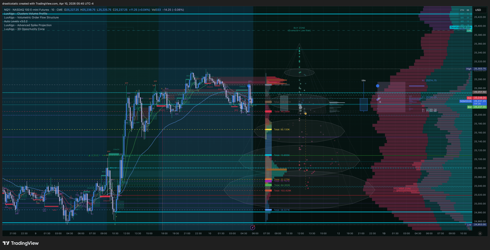
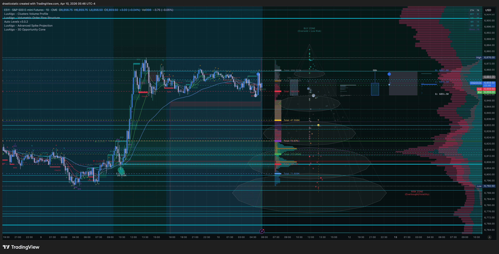
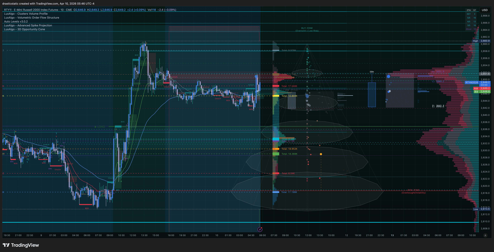
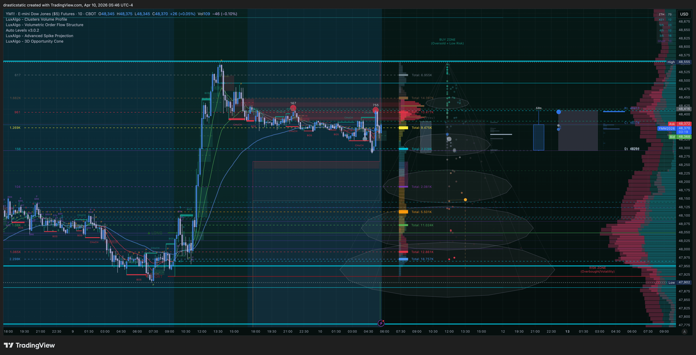
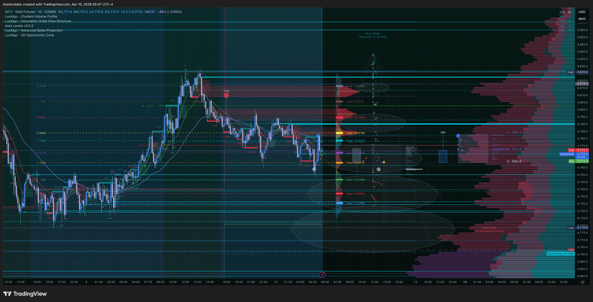
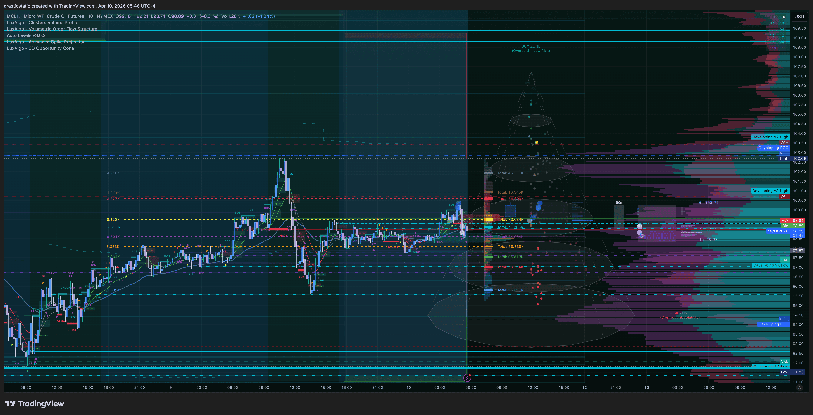
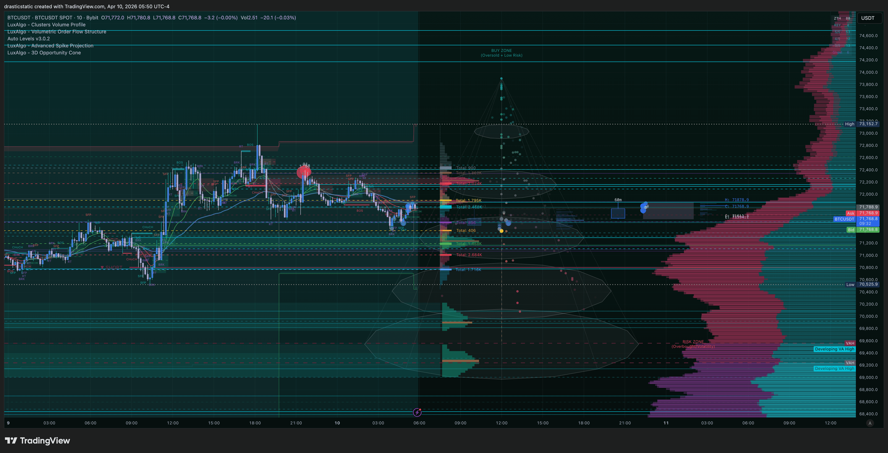

# 🌅 Pre-Market Summary — Friday, Apr 10, 2026
### Fortuna | STB + ZTH + Inevitrade Session | London Open

[Jump to 🤖 SmartTraderAI Copy-Paste ↓](#smarttraderai-copy-paste)

---

## 📋 Dashboard

| Field | Value |
|-------|-------|
| Date | Friday, April 10, 2026 |
| Time captured | ~5:58 AM ET (London session open) |
| Session | London OPEN / ONB active |
| Active call | STB London session |
| APEX-06 | ✅ Active |
| TPT 50K | ✅ Active |
| Chart layout | 2-pane horizontal: CL1! 1hr (left) · CL1! 5min (right) |
| NQ/ES quotes | ⚠️ Not captured — chart on CL both panes, did not disrupt during London call |

---

## ⚠️ Risk Alert

- **Friday** — reduced volume into close, increased spread risk. Avoid chasing late entries.
- **Global macro environment highly volatile** — tariff shock, geopolitical pressure. CL range over past 3 weeks: **$84.37–$117.63** ($33+ range). Treat every level as a potential trap zone.
- **EIA window:** Wednesday only — not a factor today.
- **No metals on Apex** (GC, SI, MGC halted Feb 6) — CL is the primary energy play.
- **Pattern 7/8 on alert:** Friday sessions have historically been where exits go passive. Pre-plan TP and honor it.

---

## 🌙 Overnight / ETH Context — CL1!

**1hr lookback — 314 bars (~3 weeks):**

| Metric | Value |
|--------|-------|
| Period open | $96.01 |
| Period high | $117.63 |
| Period low | $84.37 |
| Current | $98.57 |
| Net change | +$2.56 (+2.67%) |
| Avg hourly volume | 13,889 |
| Total range | $33.26 |

The 3-week macro picture tells the full story: CL was trading up near $117 before a massive sell-off drove it to the $84 lows — one of the largest sustained energy moves in recent memory. Price has since bounced to the $98–99 zone and is consolidating there. This is the **midpoint recovery zone** of that macro range.

**Last 5 × 1hr candles (overnight into London open):**

| Time (ET approx) | O | H | L | C | Read |
|------------------|---|---|---|---|------|
| ~1:00 AM | 98.93 | 99.24 | 98.33 | 98.61 | Bearish close off high |
| ~2:00 AM | 98.58 | 98.90 | 98.47 | 98.75 | Tight, bullish close |
| ~3:00 AM | 98.77 | 98.83 | 97.58 | 97.79 | **Bearish rejection** — $1.25 wick down |
| ~4:00 AM | 97.80 | 98.44 | 97.66 | 98.41 | Recovery — buyers absorbed the sell |
| ~5:00 AM (current) | 98.39 | 98.75 | 98.11 | 98.57 | Bullish lean, holding gains |

**Read:** 3 AM bearish candle tested ~$97.58, buyers held and recovered. Price back to $98.57. Short-term structure is constructive but still inside macro compression — not a breakout.

---

## 🌤️ At the Open — CL1! 5min (London Session)

**5min lookback — 301 bars (~26 hours):**

| Metric | Value |
|--------|-------|
| Session range | $95.25 – $102.70 |
| Total range | $7.45 |
| Net change | +$1.46 (+1.5%) |
| Avg 5min volume | 995 |
| Current | $98.58 |

**Last 5 × 5min candles (pre-market now):**

| Bar | O | H | L | C | Vol | Read |
|-----|---|---|---|---|-----|------|
| -4 | 98.24 | 98.42 | 98.21 | 98.37 | 178 | Compression |
| -3 | 98.39 | 98.75 | 98.31 | 98.64 | 428 | Volume spike — buyers |
| -2 | 98.64 | 98.66 | 98.54 | 98.65 | 142 | Holding |
| -1 | 98.63 | 98.67 | 98.45 | 98.54 | 166 | Slight fade |
| 0 (now) | 98.54 | 98.63 | 98.52 | 98.58 | 136 | Tight — waiting |

**Read:** Price is compressing in a ~$0.50 band ($98.11–$98.75) on the 5min. The 428-volume spike 3 bars ago was the largest in the window — buyers showed up. Currently holding above that bar's close. This is a coil — waiting for London to push a direction.

---

## 🔗 SMT Scenarios — CL1! (London)

**IT Foundation EMAs (from chart):**
- Red EMA dominant — bearish structure on 1hr
- Price is BELOW the bearish EMA cluster — short bias aligned on HTF
- Price bouncing but has not reclaimed the EMA — **no confirmed bullish flip**

**Scenario framework for CL today:**
| Scenario | Condition | Bias |
|----------|-----------|------|
| **Bearish continuation** | Price fails at $99–99.24 resistance (overnight high), EMA cap holds | SHORT aligned with IT structure |
| **Bull reclaim** | Price breaks and closes 1hr above red EMA + holds $99.50+ | LONG — structure flip |
| **Trap / chop** | Price whipsaws $97.50–$99.50 | No trade — Scenario C |

**NQ/ES:** Not captured this session (chart on CL during London call). Check NQ independently before NY open for triple-index SMT confirmation.

---

## 📅 Calendar — Apr 10, 2026 (Friday)

| Time (ET) | Event | Expected Impact |
|-----------|-------|----------------|
| 8:30 AM | **CPI (Consumer Price Index)** | 🔴 HIGH — major mover. Inflation read = direct CL + equity reaction |
| 8:30 AM | **Core CPI** | 🔴 HIGH — fed expectations driver |
| 10:00 AM | Michigan Consumer Sentiment | 🟡 Medium |

> ⚠️ **CPI at 8:30 AM is the dominant event today.** CL and indices both react sharply. Expect expansion in the 8:25–8:35 ET window. Do NOT enter ahead of the print. Wait for displacement and reset after the initial spike.

---

## 🎯 Priority Instruments

### CL1! — Primary (London active)

**Current:** $98.57 · Bearish 1hr EMA structure · Compressing at $98.11–$98.75

**Key levels (from auto-levels + chart read):**
- **Resistance:** $99.24 (overnight high / 1hr wick) · $102.70 (session high 26hr) · Red EMA zone
- **Support:** $97.58 (3 AM low) · $97.66 (4 AM candle low) · $95.25 (26hr low)
- **Macro:** $84.37 (macro swing low) · $117.63 (macro swing high) — midpoint ~$101

**Bias:** Bearish on 1hr (EMAs). Short-term bounce constructive. CPI at 8:30 will set direction.
- **Short setup:** Rejection at $99–99.24 + EMA cap + no breakout → SHORT toward $97.50
- **Long setup:** Only if price breaks above EMA + $99.50 confirmed hold on 1hr close

### NQ1! / ES1! — Check before NY open
Not visible on current chart layout. Switch pane or pull quote before 9:30 AM to confirm:
- Triple-index alignment (NQ/ES/YM) for Scenario A/B confirmation
- FCR setup at 9:30 — mark HIGH and LOW of first 15-min candle after open

---

## 🧠 Mental State

On the STB London call — learning environment active. Watching community process is a healthy part of building the pattern recognition muscle. Stay present, observe the setups coaches highlight, take notes on structure they're pointing to.

**Behavioral reminders for today:**
- CPI at 8:30 = no entries in the 8:25–8:40 window. Wait for dust to settle.
- Friday + volatile macro = smaller size if anything fires. Protect the eval.
- Pattern 8 pre-commitment: if a TP level is identified before entry, it's non-negotiable. Exit there.
- Pattern 7 lock: SL placed before entry does not move. Not for any reason.

---

## 🌐 Morning Brief — 4hr Instrument Scan (300 bars ≈ 50 trading days)

### NQ1!
| Period O | 50d High | 50d Low | Current | Net |
|----------|----------|---------|---------|-----|
| 26,214 | 26,243.25 | **22,961.50** | **25,259.75** | -954 (-3.64%) |

**Last 4hr bars (London open ~5:45 AM ET):**

| Bar | Range | Close | Vol | Read |
|-----|-------|-------|-----|------|
| -4 (prior session high) | — | — | **237,000** | Institutional — largest bar in lookback |
| -3 to -1 | — | — | declining | Volume fade into overnight |
| 0 (London open) | 25,145–25,303 | **25,259.75** | **717** | Compression — coil |

70% recovery from the 22,961 flush. Macro bearish structure — below period open 26,214.

### ES1!
| Period O | 50d High | 50d Low | Current | Net |
|----------|----------|---------|---------|-----|
| 7,043.50 | 7,078 | **6,353.25** | **6,861.25** | -182 (-2.59%) |

**Last 4hr bars (London open ~5:46 AM ET):**

| Bar | Range | Close | Vol | Read |
|-----|-------|-------|-----|------|
| -4 (prior session) | — | — | **751,743** | Largest institutional bar — full session |
| -3 to -1 | — | — | declining | Overnight fade |
| 0 (London open) | 6,848–6,876 | **6,861.25** | **1,720** | Tight box — compression |

76% recovery from 6,353 low. Macro bearish — below period open 7,043.50.

### YM1!
| Period O | 50d High | 50d Low | Current | Net |
|----------|----------|---------|---------|-----|
| 49,428 | 50,916 | **45,052** | **48,356** | -1,072 (-2.17%) |

**Last 4hr bars (London open ~5:46 AM ET):**

| Bar | Range | Close | Vol | Read |
|-----|-------|-------|-----|------|
| -4 to -1 | — | — | minimal | Volume evaporated overnight |
| 0 (London open) | — | **48,356** | **123** | Dead volume — London ignoring YM |

Recovered ~3,300 pts from 45,052 lows. Macro bearish — below period open 49,428.

### RTY1!
| Period O | 50d High | 50d Low | Current | Net |
|----------|----------|---------|---------|-----|
| 2,673.60 | 2,736.60 | **2,409.40** | **2,645.30** | -28 (-1.06%) |

**Last 4hr bars (London open ~5:46 AM ET):**

| Bar | Range | Close | Vol | Read |
|-----|-------|-------|-----|------|
| 0 (London open) | 2,641.20–2,651.90 | **2,645.30** | **4,650** | Least recovery of all 4 indices |

Lagging recovery vs NQ/ES — smallest % recovery from lows. Canary for risk-off. Watch RTY vs NQ SMT divergence at NY open. Macro bearish — below period open 2,673.60.

### CL1!
| Period O | 50d High | 50d Low | Current | Net |
|----------|----------|---------|---------|-----|
| 63.97 | **118.80** | 60.37 | **98.37** | +34.40 (+53.78%) |

**Last 4hr bars (London open ~5:48 AM ET):**

| Bar | O | H | L | C | Vol | Read |
|-----|---|---|---|---|-----|------|
| -4 (prior session) | ~102.70 | 102.70 | 95.25 | ~96 | **143,941** | $7.45 range sell — massive institutional |
| -3 to -1 | — | — | — | — | declining | Overnight recovery |
| 0 (London open) | ~98.39 | 98.75 | 98.11 | **98.37** | **447** | Compressing — coil pre-CPI |

Sitting below $100. London started flat — then broke (see divergence section below).

### 🔗 SMT Read
All four indices net negative, all recovering from macro lows, all in sync overnight — **Scenario A alignment, no divergence.** Volume evaporated across the board (NQ: 717, ES: 1,720, YM: 123, RTY: 4,650). CPI at 8:30 breaks the coil. RTY lagging = mild bearish lean.

---

## 🌐 GC + Crypto Brief — 4hr, 300 bars

| Instrument | Period O | 50d High | 50d Low | Current | Net |
|-----------|---------|---------|---------|---------|-----|
| **GC1!** | 5,546.30 | 5,613.10 | 4,131.80 | **4,770.30** | -776 (-13.99%) |
| **BTC** | 66,469 | 76,013 | 62,525 | **71,759** | +5,290 (+7.96%) |
| **ETH** | 1,948.25 | 2,386.23 | 1,800.09 | **2,193.45** | +245 (+12.59%) |
| **SOL** | 81.21 | 97.70 | 75.63 | **83.40** | +2.19 (+2.70%) |

**GC1! — London bar (4hr, ~5:47 AM ET):**

| Bar | O | H | L | C | Vol | Read |
|-----|---|---|---|---|-----|------|
| 0 (London) | ~4,770.30 | **4,790.20** | **4,752.70** | 4,770.30 | **16,853** | Selling into London open — H barely above O, L -$17.60. Elevated vol. |

Corrected -13.99% from $5,613 highs to $4,131 low. Recovering at $4,770 but London session actively selling. Metals context only (Apex halt on GC/MGC since Feb 6).

---

**BTC/USDT — London bar (4hr, ~5:50 AM ET):**

| Bar | Range | Close | Vol | Read |
|-----|-------|-------|-----|------|
| Prior high | — | 73,159 | — | Session high — drifted from here |
| 0 (London) | 71,400–71,900 | **71,759** | low | Holding range, low vol — relative strength vs equities |

Net +7.96% vs period open 66,469. Watching BTC vs NQ SMT — BTC holding while NQ sells = bullish divergence signal.

---

**ETH/USDT — London bar (4hr, ~5:50 AM ET):**

| Bar | O | H | L | C | Read |
|-----|---|---|---|---|------|
| Prior rejection | — | **2,245** | — | — | Rejected here |
| 0 (London) | ~2,179 | — | — | **2,193** | Recovering — current bar bullish lean |

Strongest crypto this period (+12.59% vs period open 1,948.25). Range-bound between 2,179–2,245.

---

**SOL/USDT — London bar (4hr, ~5:50 AM ET):**

| Bar | H | L | C | Read |
|-----|---|---|---|------|
| Prior rejection | **85.90** | — | — | Rejected here |
| 0 (London) | — | **82.00** | **83.40** | Drifting $82–83 range |

Weakest crypto (+2.70% vs period open 81.21). Macro range: $75.63–$97.70. BTCC SHORT entry ($81.92 Apr 8) — current $83.40 = auto-liq confirmed right directional read (exit passivity was the failure, not the read).

---

## ⚡ CL vs Index Divergence — ~6:10 AM ET (London)

Comparing current 4hr bar vs read 15min ago:

| | Close Then | Close Now | High Now | Low Now | Vol Then | Vol Now |
|--|-----------|-----------|----------|---------|----------|---------|
| **CL** | 98.37 | **99.16** | **100.42** | 98.29 | 447 | **24,269** 🟢 |
| **NQ** | 25,259.75 | **25,230.50** | 25,274.75 | **25,202.75** | 717 | **24,019** 🔴 |
| **ES** | 6,861.25 | **6,856.75** | 6,867 | **6,850.50** | 1,720 | **47,537** 🔴 |
| **RTY** | 2,645.30 | 2,646.30 | 2,651.90 | 2,641.20 | 117 | 4,650 🔴 |

**CL broke $100** (H 100.42), volume 54x from 447→24,269. NQ -29pts, ES -4.50pts simultaneously with big volume. Classic **energy up / equities down = risk-off / inflation trade**. London pricing in hot CPI before the 8:30 print. If confirmed → CL $102+ target (yesterday's high), equities toward macro lows. If surprise cool print → CL reversal, equity relief rally.  **No entries pre-8:30 either side.**

---

## ⏱️ Live Session Updates

*Append here during session — keep brief. Full detail goes in daily review.*

- 5:58 AM ET: London OPEN. CL compressing $98.10–98.75. CPI in ~2.5hrs is the key catalyst.
- 6:10 AM ET: **CL broke $100** (H 100.42, vol 24K). NQ -29pts / ES -4.50pts simultaneously. Risk-off / inflation divergence active. London front-running hot CPI. No entries pre-8:30.
- ~6:15 AM ET: Full instrument scan complete — NQ/ES/YM/RTY/CL/GC/BTC/ETH/SOL all read on 4hr (500 bars ≈ 83 trading days). All indices macro bearish / recovering from lows. Scenario A alignment confirmed — no divergence between indices. CL held above $99 post-breakout. GC selling in London session. BTC showing relative strength vs equities.
- ~6:20 AM ET: Context window compacted — session continuity maintained. Pre-market and AGENT-SYNC updated to reflect full session state.
- **8:30 AM ET — CPI WINDOW:** CPI printed — significant market reaction. NQ/ES spiked then reversed. CL sold off from $98.65 high to $97.69 low (bearish 1hr candle, gave back the overnight ramp). Gold ripped +$30 to $4,811.50. Equities initially whipsawed both directions.
- **~9:30 AM ET — NY OPEN:** STB shorted NQ — stopped at break-even (valid read, market snapped back). ZTH longed ES — stopped at break-even (valid read, same chop). Both coaches moved to BE quickly — correct posture for current volatility environment.
---

### 📊 ~10:19 AM ET — Post-Open Instrument Scan (Fortuna morning_brief)

#### Price Movement: Pre-Market → Post-Open

| Symbol | Pre-Mkt | Now | Move | vs PDC | EMA Stack | Bias |
|--------|---------|-----|------|--------|-----------|------|
| **NQ1!** | 25,275 | **25,321** | +46 | +192 ✅ | All EMAs below ✅ | **BULLISH LEADER** |
| **ES1!** | 6,865.50 | **6,873** | +7.50 | +9.75 ✅ | All EMAs below ✅ | **BULLISH** |
| **YM1!** | 48,396 | **48,311** | -85 | **-105 ⚠️** | All EMAs below ✅ | **SMT DIVERGENCE** |
| **RTY1!** | 2,652.9 | **2,649** | -3.7 | -2.4 ⚠️ | Between Fast/Mid ⚠️ | **SOFT** |
| **CL1!** | 98.18 | **97.85** | -0.33 | -0.02 | All EMAs above ⚠️ | **BEARISH LEAN** |
| **GC1!** | 4,781 | **4,811.50** | **+30.50** | -6.50 | All EMAs below ✅ | **RIPPING (TPT only)** |
| **BTC** | 71,990 | **72,784** | **+794** | +972 ✅ | All EMAs below ✅ | **BULLISH** |
| **ETH** | 2,201 | **2,244** | **+43** | +54 ✅ | All EMAs below ✅ | **LEADING CRYPTO** |
| **SOL** | 83.41 | **84.71** | **+1.30** | +1.37 ✅ | All EMAs below ✅ | **BULLISH** |

#### IT Foundation EMAs — Post-Open

| Symbol | EMA Fast | EMA Mid | EMA Slow | Price | Status |
|--------|----------|---------|----------|-------|--------|
| ES1! | 6,866 | 6,858 | 6,827 | **6,873** | ✅ All below — green dominant |
| RTY1! | 2,650 | 2,647 | 2,635 | **2,649** | ⚠️ Between Fast/Mid |
| CL1! | 98.61 | 99.35 | 101.35 | **97.85** | ❌ All above — bearish |
| BTC | 72,197 | 71,996 | 71,564 | **72,784** | ✅ All below — green |
| SOL | 83.86 | 83.56 | 83.20 | **84.71** | ✅ All below — green |

#### SMT Status — Post-Open

| Pair | Read | Signal |
|------|------|--------|
| NQ / ES / YM | NQ +46, ES +7.50, **YM -85** | ⚠️ YM divergence confirmed + widening |
| NQ / ES / RTY | NQ leading, RTY soft | ⚠️ Small-cap not confirming |
| BTC / ETH / SOL | All 3 above PDC, all EMAs green | ✅ Full crypto confirmation |
| CL / Equities | CL bearish, equities bullish | ⚠️ Risk-off signal mixed in |

#### Scenario Status — Post-Open

| Scenario | Condition | Status |
|----------|-----------|--------|
| A LONG | All 3 indices above FCR HIGH | ❌ YM divergence prevents clean A |
| A SHORT | All 3 indices below FCR LOW | ❌ NQ/ES too strong |
| **B LONG** | NQ leads, IT Foundation green dominant | ✅ **Valid — active** |
| B SHORT | IT Foundation red dominant | ❌ Not valid |
| C — No Trade | Mixed / chopping | ⚠️ Applies to YM/RTY/CL |

#### NQ 5min — Post-Open Volume Structure

| Time (ET) | Close | Volume | Read |
|-----------|-------|--------|------|
| ~9:55 AM | 25,319 | 13,205 | Pre-news high |
| ~10:00 AM | 25,290 | **26,806** ⬆️ | News drop — volume spike |
| ~10:05 AM | 25,287 | 21,027 | Continued selling |
| ~10:10 AM | 25,323 | **30,566** ⬆️⬆️ | Buyer absorption — hard reversal |
| ~10:15 AM | 25,321 | 15,780 | Consolidating recovery |

> 30,566 volume bar at 10:10 = buyers absorbed the news sell-off hard. Market told the story fast.

---

- **~10:30 AM ET:** **ZTH — ES LONG 2R WIN** ✅ Re-entry after earlier BE stop. Confirmation entry on structure — caught the recovery. Quick BE first attempt → re-entry on confirmation = correct volatility process.
- **~10:30 AM ET — Christopher:** Conservative limit orders working on MCL, MES, RTY (APEX). Nothing filled. Sitting on hands with nerves = correct discipline for a volatile Friday tape.

---

## 📸 Charts

**5:58 AM ET — CL1! 1hr | London Open | Auto Levels v3.0.2 + IT Foundation EMAs**

---

**~5:45 AM ET — NQ1! 10min | Pre-London Context**

**~5:46 AM ET — ES1! 10min | Pre-London Context**

**~5:46 AM ET — RTY1! 10min | Pre-London Context**

**~5:46 AM ET — YM1! 10min | Pre-London Context**

**~5:47 AM ET — GC1! 10min | Pre-London Context**

**~5:48 AM ET — MCL1! (Micro CL) 10min | Pre-London Context**

**~5:50 AM ET — BTCUSDT 10min | Pre-London Context**

---

## 🤖 SmartTraderAI Pre-Market Copy-Paste Fields

---

**What news releases today?**

Friday, April 10, 2026. London session open ~5:58 AM ET — on STB London call. CL1! on both chart panes (1hr + 5min). NQ/ES not captured to avoid disrupting chart during call. CPI + Core CPI at 8:30 AM ET — dominant event of the session. Michigan Sentiment at 10 AM secondary. Global macro remains elevated volatility (tariff environment).

---

**What are the expected figures? What effect has this event had on the markets before?**

CPI is a high-impact inflation print. If CPI runs hot → CL sells, indices sell; if CPI cools → CL + indices bid. Historically: initial knee-jerk move at 8:30 is often reversed within 30 minutes — wait for displacement and reset before entering. No entries in the 8:25–8:40 ET window.

---

**List both your HTF bias and key levels**

CL1! 1hr: Bearish IT Foundation EMA structure. Price below red EMA cluster. 3-week macro range $84.37–$117.63, currently at $98.57 — below the midpoint ($101). HTF bias: BEARISH on CL.

Key levels — CL: Resistance $99.24 / $102.70 · Support $97.58 / $95.25 · Macro floor $84.37.

---

**List your Intraday bias and levels**

CL: Bearish bias. Short setup: rejection at $99–99.24 with EMA cap → target $97.50. Long only on confirmed EMA reclaim + $99.50 1hr close. 5min compression zone $98.11–$98.75 — coil building, directional break likely on CPI.

NQ: Pull independently before 9:30 — FCR setup at open. Triple-index SMT check needed for Scenario A/B verdict.

---

**Expectations for the day?**

CPI at 8:30 drives the first major move and sets the macro tone for the session. Post-CPI: look for FCR setup at 9:30 once macro direction confirms. Friday = reduced size — protect APEX-06 and TPT evals. Pattern 7/8 locks active — pre-plan TP and honor it.

---

> Full pre-market summary: https://github.com/drasticstatic/trading-assistant-public-preview/blob/main/smarttrader-ai/analysis/premarket/2026/04-Apr/premarket_20260410_summary.md

---

*Produced with 🙏🏼 Fortuna — Wealth Warden | Claude Code CLI*
*Pre-Market Summary · Apr 10, 2026 · London Open · CL1! Focus*
