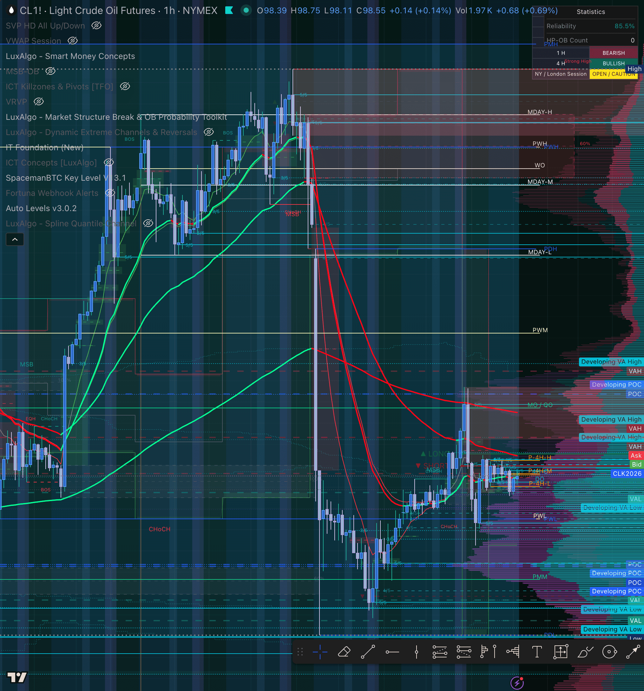

# 🌅 Pre-Market Summary — Friday, Apr 10, 2026
### Fortuna | STB + ZTH + Inevitrade Session | London Open

[Jump to 🤖 SmartTraderAI ↓](#smarttraderai-copy-paste)

---

## 📋 Dashboard

| Field | Value |
|-------|-------|
| Date | Friday, April 10, 2026 |
| Time captured | ~5:58 AM ET (London session open) |
| Session | London OPEN / ONB active |
| Active call | STB London session |
| APEX-06 | ✅ Active |
| TPT 50K | ✅ Active |
| Chart layout | 2-pane horizontal: CL1! 1hr (left) · CL1! 5min (right) |
| NQ/ES quotes | ⚠️ Not captured — chart on CL both panes, did not disrupt during London call |

---

## ⚠️ Risk Alert

- **Friday** — reduced volume into close, increased spread risk. Avoid chasing late entries.
- **Global macro environment highly volatile** — tariff shock, geopolitical pressure. CL range over past 3 weeks: **$84.37–$117.63** ($33+ range). Treat every level as a potential trap zone.
- **EIA window:** Wednesday only — not a factor today.
- **No metals on Apex** (GC, SI, MGC halted Feb 6) — CL is the primary energy play.
- **Pattern 7/8 on alert:** Friday sessions have historically been where exits go passive. Pre-plan TP and honor it.

---

## 🌙 Overnight / ETH Context — CL1!

**1hr lookback — 314 bars (~3 weeks):**

| Metric | Value |
|--------|-------|
| Period open | $96.01 |
| Period high | $117.63 |
| Period low | $84.37 |
| Current | $98.57 |
| Net change | +$2.56 (+2.67%) |
| Avg hourly volume | 13,889 |
| Total range | $33.26 |

The 3-week macro picture tells the full story: CL was trading up near $117 before a massive sell-off drove it to the $84 lows — one of the largest sustained energy moves in recent memory. Price has since bounced to the $98–99 zone and is consolidating there. This is the **midpoint recovery zone** of that macro range.

**Last 5 × 1hr candles (overnight into London open):**

| Time (ET approx) | O | H | L | C | Read |
|------------------|---|---|---|---|------|
| ~1:00 AM | 98.93 | 99.24 | 98.33 | 98.61 | Bearish close off high |
| ~2:00 AM | 98.58 | 98.90 | 98.47 | 98.75 | Tight, bullish close |
| ~3:00 AM | 98.77 | 98.83 | 97.58 | 97.79 | **Bearish rejection** — $1.25 wick down |
| ~4:00 AM | 97.80 | 98.44 | 97.66 | 98.41 | Recovery — buyers absorbed the sell |
| ~5:00 AM (current) | 98.39 | 98.75 | 98.11 | 98.57 | Bullish lean, holding gains |

**Read:** 3 AM bearish candle tested ~$97.58, buyers held and recovered. Price back to $98.57. Short-term structure is constructive but still inside macro compression — not a breakout.

---

## 🌤️ At the Open — CL1! 5min (London Session)

**5min lookback — 301 bars (~26 hours):**

| Metric | Value |
|--------|-------|
| Session range | $95.25 – $102.70 |
| Total range | $7.45 |
| Net change | +$1.46 (+1.5%) |
| Avg 5min volume | 995 |
| Current | $98.58 |

**Last 5 × 5min candles (pre-market now):**

| Bar | O | H | L | C | Vol | Read |
|-----|---|---|---|---|-----|------|
| -4 | 98.24 | 98.42 | 98.21 | 98.37 | 178 | Compression |
| -3 | 98.39 | 98.75 | 98.31 | 98.64 | 428 | Volume spike — buyers |
| -2 | 98.64 | 98.66 | 98.54 | 98.65 | 142 | Holding |
| -1 | 98.63 | 98.67 | 98.45 | 98.54 | 166 | Slight fade |
| 0 (now) | 98.54 | 98.63 | 98.52 | 98.58 | 136 | Tight — waiting |

**Read:** Price is compressing in a ~$0.50 band ($98.11–$98.75) on the 5min. The 428-volume spike 3 bars ago was the largest in the window — buyers showed up. Currently holding above that bar's close. This is a coil — waiting for London to push a direction.

---

## 🔗 SMT Scenarios — CL1! (London)

**IT Foundation EMAs (from chart):**
- Red EMA dominant — bearish structure on 1hr
- Price is BELOW the bearish EMA cluster — short bias aligned on HTF
- Price bouncing but has not reclaimed the EMA — **no confirmed bullish flip**

**Scenario framework for CL today:**
| Scenario | Condition | Bias |
|----------|-----------|------|
| **Bearish continuation** | Price fails at $99–99.24 resistance (overnight high), EMA cap holds | SHORT aligned with IT structure |
| **Bull reclaim** | Price breaks and closes 1hr above red EMA + holds $99.50+ | LONG — structure flip |
| **Trap / chop** | Price whipsaws $97.50–$99.50 | No trade — Scenario C |

**NQ/ES:** Not captured this session (chart on CL during London call). Check NQ independently before NY open for triple-index SMT confirmation.

---

## 📅 Calendar — Apr 10, 2026 (Friday)

| Time (ET) | Event | Expected Impact |
|-----------|-------|----------------|
| 8:30 AM | **CPI (Consumer Price Index)** | 🔴 HIGH — major mover. Inflation read = direct CL + equity reaction |
| 8:30 AM | **Core CPI** | 🔴 HIGH — fed expectations driver |
| 10:00 AM | Michigan Consumer Sentiment | 🟡 Medium |

> ⚠️ **CPI at 8:30 AM is the dominant event today.** CL and indices both react sharply. Expect expansion in the 8:25–8:35 ET window. Do NOT enter ahead of the print. Wait for displacement and reset after the initial spike.

---

## 🎯 Priority Instruments

### CL1! — Primary (London active)

**Current:** $98.57 · Bearish 1hr EMA structure · Compressing at $98.11–$98.75

**Key levels (from auto-levels + chart read):**
- **Resistance:** $99.24 (overnight high / 1hr wick) · $102.70 (session high 26hr) · Red EMA zone
- **Support:** $97.58 (3 AM low) · $97.66 (4 AM candle low) · $95.25 (26hr low)
- **Macro:** $84.37 (macro swing low) · $117.63 (macro swing high) — midpoint ~$101

**Bias:** Bearish on 1hr (EMAs). Short-term bounce constructive. CPI at 8:30 will set direction.
- **Short setup:** Rejection at $99–99.24 + EMA cap + no breakout → SHORT toward $97.50
- **Long setup:** Only if price breaks above EMA + $99.50 confirmed hold on 1hr close

### NQ1! / ES1! — Check before NY open
Not visible on current chart layout. Switch pane or pull quote before 9:30 AM to confirm:
- Triple-index alignment (NQ/ES/YM) for Scenario A/B confirmation
- FCR setup at 9:30 — mark HIGH and LOW of first 15-min candle after open

---

## 🧠 Mental State

On the STB London call — learning environment active. Watching community process is a healthy part of building the pattern recognition muscle. Stay present, observe the setups coaches highlight, take notes on structure they're pointing to.

**Behavioral reminders for today:**
- CPI at 8:30 = no entries in the 8:25–8:40 window. Wait for dust to settle.
- Friday + volatile macro = smaller size if anything fires. Protect the eval.
- Pattern 8 pre-commitment: if a TP level is identified before entry, it's non-negotiable. Exit there.
- Pattern 7 lock: SL placed before entry does not move. Not for any reason.

---

## ⏱️ Live Session Updates

*Append here during session — keep brief. Full detail goes in daily review.*

- 5:58 AM ET: London OPEN. CL compressing $98.10–98.75. CPI in ~2.5hrs is the key catalyst.

---

## 📸 Charts

**5:58 AM ET — CL1! 1hr | London Open | Auto Levels v3.0.2 + IT Foundation EMAs**

**5:58 AM ET — CL1! full layout view**

---

## 🤖 SmartTraderAI Pre-Market Copy-Paste

---

**Q1 — Today's date and session context:**

Friday, April 10, 2026. London session open ~5:58 AM ET. On STB London call. CL1! on both chart panes (1hr + 5min). NQ/ES not captured to avoid disrupting chart during call.

---

**Q2 — News / key events and expected effect:**

CPI + Core CPI at 8:30 AM ET — dominant event. High-impact inflation print. CL and indices will react sharply. No entries 8:25–8:40 ET window. Wait for displacement and reset. Michigan Sentiment at 10 AM secondary. Global macro remains elevated volatility (tariff environment).

---

**Q3 — Higher timeframe bias + key levels:**

CL1! 1hr: Bearish IT Foundation EMA structure. Price below red EMA cluster. 3-week macro range $84.37–$117.63, currently at $98.57 (below midpoint $101). Resistance: $99.24 / $102.70. Support: $97.58 / $95.25. Macro swing low $84.37 key floor.

---

**Q4 — Intraday bias + entry levels:**

CL: Bearish bias HTF. Short setup: rejection at $99–99.24 + EMA cap → target $97.50. Long only on confirmed EMA reclaim + $99.50 1hr close. Compressing $98.11–$98.75 5min — coil. NQ: Pull independently before 9:30 — FCR setup at open. Triple-index SMT check needed for Scenario A/B.

---

**Q5 — Expectations for the session:**

CPI drives the first major move. If inflation hot → CL sells, indices sell. If inflation cool → CL + indices bid. Post-CPI: look for FCR setup at 9:30 open once macro direction is confirmed. Friday = reduced size, protect APEX-06 and TPT evals. Pattern 7/8 locks active.

---

*Fortuna — Wealth Warden | Claude Code CLI*
*Pre-Market Summary · Apr 10, 2026 · London Open · CL1! Focus*
