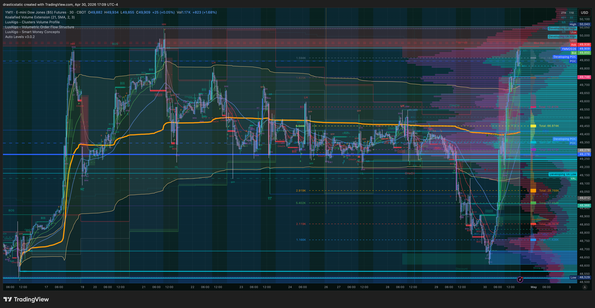
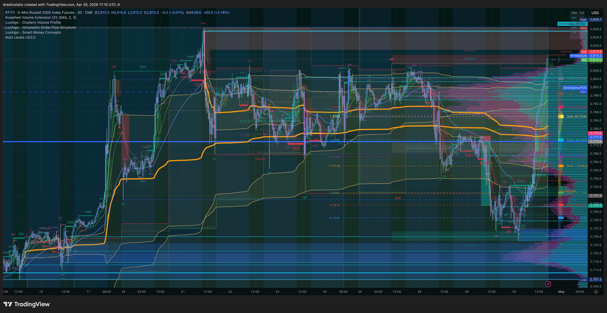
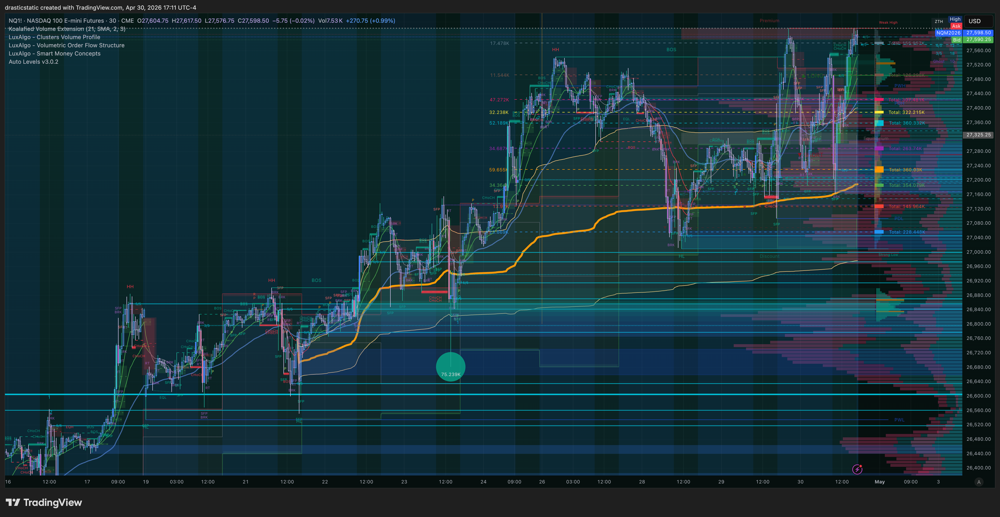
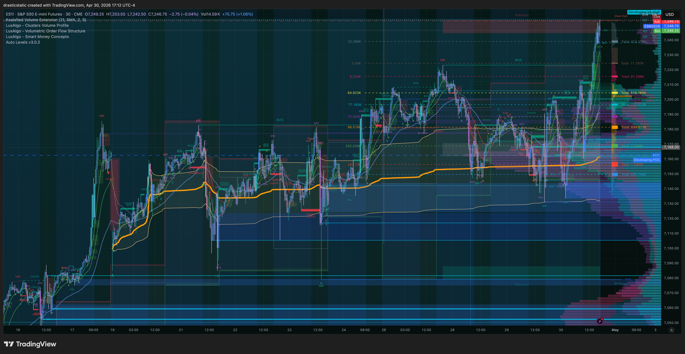
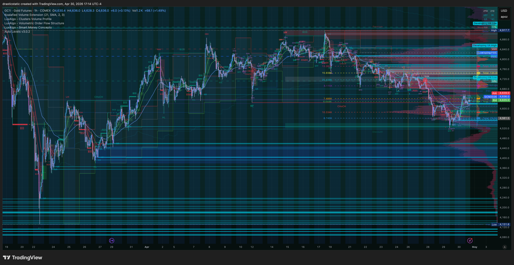
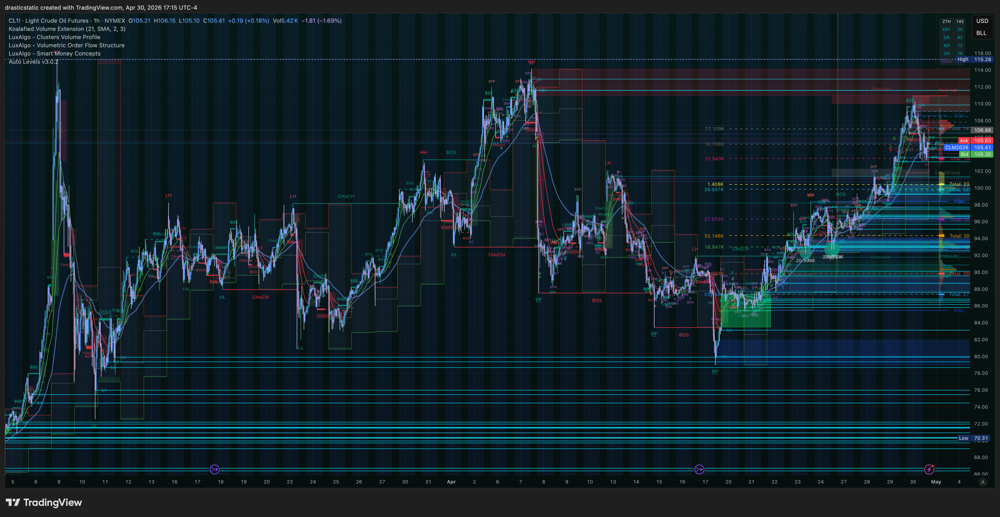

# 🌙 Evening Session Pre-Market — Thursday, April 30, 2026
### 18:00 ET Open · RTY Short Thesis · Post-RTH Consolidation Watch

[Jump to 🤖 SmartTraderAI Copy-Paste ↓](#smarttraderai-copy-paste)

---

## 📋 Session Dashboard

| Field | Value |
|-------|-------|
| **Date** | April 30, 2026 — Evening / Overnight |
| **Session open** | 18:00 ET (equity futures reopen) |
| **Session type** | ETH / overnight — Asia + London lead-in |
| **Primary instrument** | RTY (APEX-06) |
| **Confirming** | YM, NQ, ES |
| **Energy** | CL |
| **Metals** | GC (monitor only — metals halted on Apex) |
| **Account** | APEX-484839-06 (100K) — **only active eval** |
| **TPT status** | reset-3 blown Apr 30 — not active |
| **Session bias** | Cautiously bearish on RTY — watching for reversal from RTH highs |
| **Risk posture** | Conservative — APEX-06 is the only account; no reckless size |

---

## ⚠️ Session Risk Alert

**TPT reset-3 was blown today. APEX-06 is the only active evaluation account.**

Every decision this evening runs through one filter: does this protect APEX-06? The account floor and profit target must both be respected. No resting limits placed without a corresponding stop. No positions held through conviction alone — mechanical stops, placed before the position is live.

The RTH session was one-directional bullish for YM/RTY. Entering a short immediately into that momentum carries counter-trend risk. The plan is to wait for structure — a clear rejection at a level, not a front-run reversal bet.

---

## 🌙 Overnight / ETH Context — RTH Closeout

The RTH session closed with a pronounced index divergence that persisted all day:

| Index | RTH Change | Character |
|-------|------------|-----------|
| YM | +1.20% | Led all session — value rotation |
| RTY | +0.99% | Following Dow — small-cap strength |
| ES | +0.37% | Moderate — held up |
| NQ | +0.07% | Essentially flat — growth lagging |

This is a **value-rotation session** — Dow and small-caps outperformed growth by a significant margin. This pattern (YM/RTY leading while NQ lags) is associated with macro rotation into industrials, energy, and financials away from NASDAQ-heavy growth names. The coach confirmed live: larger consolidation range, macro/oil/volatility expected.

RTY rallied aggressively into the close. The question going into 18:00 ET is whether this was a displacement move that needs to be retraced, or the start of a broader continuation leg.

**17:09 ET RTH close charts — the full picture:**

**YM — RTH full session: how the day played out**

**RTY — RTH close: structure heading into evening open**

**NQ — RTH close: lagging throughout, structure at close**

**ES — RTH close: moderate strength, mid-range**

**GC — RTH close: metals context (monitor only — halted on Apex)**

**CL — RTH close: energy context**

---

## 🌤️ At the Open (18:00 ET)

The evening open is the first real-time read on whether RTH momentum carries or stalls. Key questions at 18:00:

- Does RTY gap up or consolidate into the open?
- Does YM's RTH strength extend into ETH or fade?
- Does NQ begin to catch up (risk-on broad rally) or remain flat (value rotation only)?

**RTY short thesis:** Christopher is watching for RTY to retrace from the RTH high zone. The entry level has been adjusted higher (more conservative) to account for the continued bullish candles into the close. The plan is not to front-run — it is to wait for a rejection signal at a defined level, then enter with a mechanical stop placed simultaneously.

**Critical discipline point:** After today's YM blow, the lesson is fresh. The RTY short will only be taken if:
1. A clear structural rejection level is identified
2. A stop is placed at entry — not "after the fill"
3. Size is appropriate for APEX-06's current floor distance

---

## 🔗 SMT Scenarios

### Scenario A — Broad reversal (favors RTY short)
All four indices (YM, RTY, NQ, ES) begin retracing from RTH highs in ETH. NQ joins the move lower. RTY pulls back to test a prior support / FVG level. Entry opportunity on RTY short with confirmation.

### Scenario B — Divergence continues (caution)
NQ starts to catch up to YM/RTY strength — growth joins value. This is a risk-on broadening, not a reversal. The RTY short thesis loses conviction in this scenario. Wait or stand aside.

### Scenario C — Continued one-directional YM/RTY strength (no trade)
YM and RTY continue pushing higher in ETH with no structural rejection. No short setup. Flat is a valid position. The next opportunity may be tomorrow's RTH session.

---

## 📅 Economic Calendar

| Time ET | Event | Impact |
|---------|-------|--------|
| 18:00 | Equity futures reopen | Session start — watch first 15 min for direction signal |
| Tomorrow AM | Any macro releases | Check before morning session |

> ⚠️ EIA window (if holding into Wed AM): 10:15–10:45 ET — no new CL entries during that window.

---

## 🎯 Priority Instruments

**Tier 1 — Active watch:**
- **RTY** — primary short candidate if structural rejection prints; APEX-06 only; conservative size
- **YM** — confirming instrument; watch for divergence vs RTY at the open

**Tier 2 — Confirming:**
- **NQ** — key divergence signal; if NQ starts catching up = Scenario B; if NQ stays flat = reversal possible
- **ES** — moderate hold; its behavior confirms or denies broad risk-off

**Tier 3 — Monitor only:**
- **CL** — macro context; energy strength earlier today contributed to the value rotation
- **GC** — halted on Apex; observe for macro risk sentiment signal only

---

## 📊 Per-Instrument Context

### RTY — Primary

RTY ran +0.99% through the RTH session in a sustained move, closely tracking YM. The daily structure is bullish from the session's perspective — but the question is whether this is a displacement leg or a genuine trend continuation. Christopher has moved the resting entry to a more conservative level after watching the aggressive RTH upside. The short thesis is a retracement play back into the move, not a trend reversal.

**Watch for:** Rejection candle at RTH high zone or above. Clean structure — not a front-run. Stop above the rejection high, defined before entry.

### YM — Confirming

The day's leader. Any weakness in YM that leads RTY lower is the cleanest SMT signal for the RTY short. YM reversing first while RTY lags = textbook ZTH Pivot signal.

### NQ — Divergence Signal

NQ was essentially flat (+0.07%) during a session where YM printed +1.20%. If NQ starts gaining ground in ETH, risk-on is broadening — not good for a short thesis on any index. If NQ stays flat or weakens, the value-rotation picture remains and RTY is the more vulnerable side.

### CL — Macro Context

Oil contributed to the value rotation today. Elevated CL = supports energy/industrial names = Dow-heavy components. If CL fades into the evening, one pillar of the YM/RTY strength may ease.

### GC — Risk Sentiment

Gold is a macro fear gauge. If GC rises into the evening, risk-off sentiment is building — supportive of an index short. Monitor only — halted on Apex.

---

## 🧠 Behavioral Reminder

Today was the hardest kind of session — a mechanical failure that cost a full account, after a green day yesterday that showed the growth. The momentum vs. reversal tension is real and it's been documented. The calibration work is specific and known.

For this evening:

**One rule above all others tonight: stop before position.** The RTY entry goes in only with a stop already in the system. If the platform requires a separate order, place both before walking away. If the stop can't be placed for any reason, the limit doesn't go in.

**Wait for structure.** The instinct after a blow is to recoup. That instinct will dress itself up as conviction and urgency. It is not. The setup will present itself clearly if it's there. A patient, protected entry on a clear rejection is worth infinitely more than an anxious entry on a hope.

**APEX-06 is everything.** One account, one opportunity. Treat every decision tonight with that weight.

The walk helped. Come back clear.

---

## ⏱️ Live Session Updates

*To be updated during the session.*

---

## 🤖 SmartTraderAI Pre-Market Copy-Paste Fields

---

**What news releases today?**

No major economic releases identified for the evening of April 30 or overnight into May 1. The primary macro context is the ongoing oil/energy-driven value rotation that characterized the RTH session. The Fed held rates steady in the 3.5–3.75% range recently — no immediate Fed catalyst. Monitor for any Asia session macro data (Japanese, Chinese, or European releases) that could move equity futures overnight.

---

**What are the expected figures? What effect has this event had on the markets before?**

No scheduled high-impact releases for this session window. The macro theme in play is energy strength + value rotation (Dow/small-caps over growth/NQ). Any surprise oil inventory data, geopolitical development, or Asia macro miss could accelerate or reverse the current rotation.

---

**List both your HTF bias and key levels**

**RTY (primary):**
- HTF bias: Bullish from RTH session — BUT extended from the day's range; watching for retracement
- RTH high zone: the level to watch for rejection
- Adjusted conservative short entry: moved up from yesterday's level after continued bullish candles into close
- SL: above the rejection high, defined at entry

**YM:**
- Closed as session leader (+1.20%) — confirming the Dow/small-cap rotation theme
- ETH behavior will indicate whether the move has continuation or is exhausting

**NQ:**
- Flat RTH session; divergence from YM/RTY was the day's primary SMT signal
- If NQ catches up in ETH = risk-on broadening = no short opportunity

**CL:**
- Energy strength supported today's value rotation; watch for any fade as a signal the rotation is cooling

---

**List your Intraday bias and levels**

- Bias: Cautiously bearish on RTY — watching for structural rejection from RTH high zone
- Scenario A: All indices reverse → RTY short with full conviction
- Scenario B: NQ joins strength → stand aside
- Scenario C: YM/RTY continue without rejection → flat, no trade
- Entry: RTY short only on clear rejection candle at defined level, stop placed simultaneously
- Size: Conservative — APEX-06 is the only active account

---

**Expectations for the day?**

I expect the 18:00 ET open to provide the first directional signal for the evening. The RTH session was aggressively bullish for YM/RTY on a value-rotation theme with NQ lagging. The question going in is whether that momentum carries into ETH or whether the displacement retraces. I am watching for RTY to reject at the RTH high zone and give a clean short entry with a mechanical stop. If the market continues straight up or if NQ begins catching up (Scenario B/C), I stand aside and wait for the morning session. The priority is protecting APEX-06 — one conservatively-sized, protected trade is the objective. No unattended resting limits. No position without a stop already in the system.

> Full pre-market summary: https://github.com/drasticstatic/trading-assistant-public-preview/blob/main/smarttrader-ai/analysis/premarket/2026/04-Apr/premarket_20260430_evening_summary.md

---

*Produced with 🙏🏼 Fortuna — Wealth Warden | Claude Code CLI*
*Pre-Market · April 30, 2026 · Evening Session*
