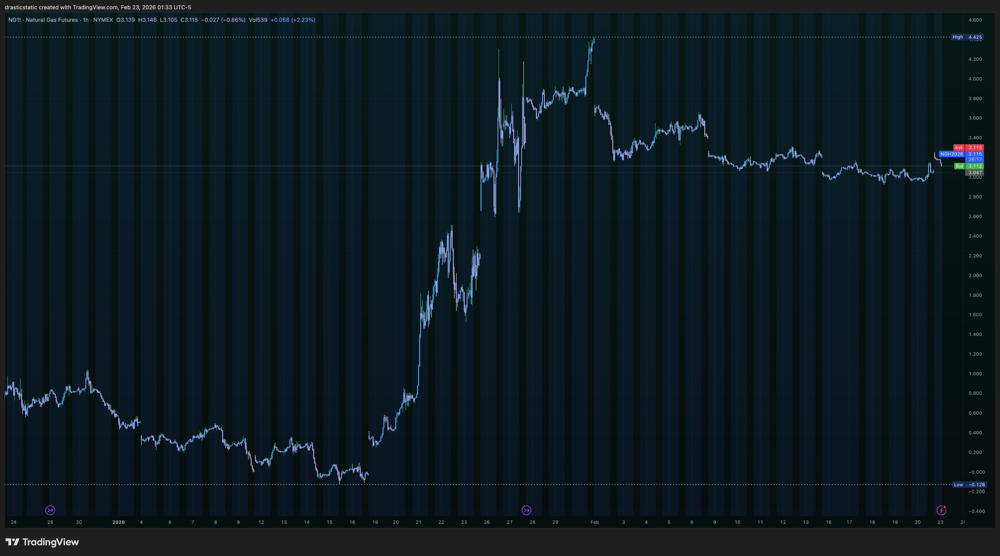
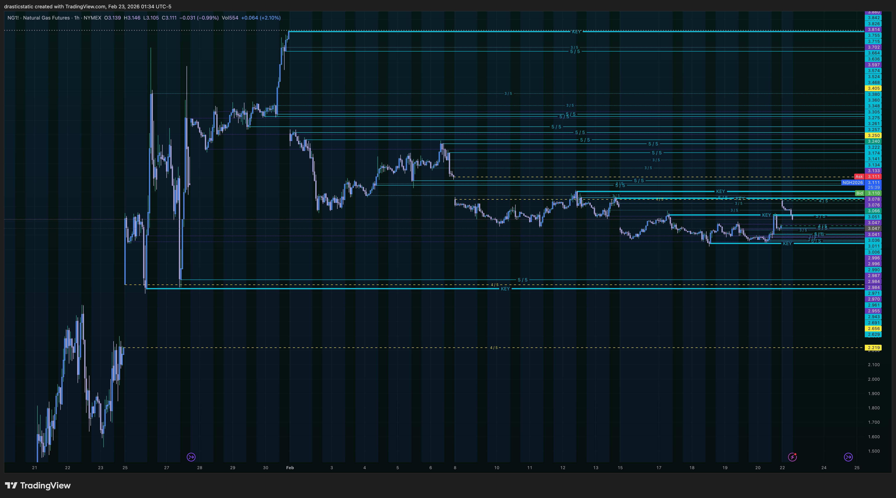
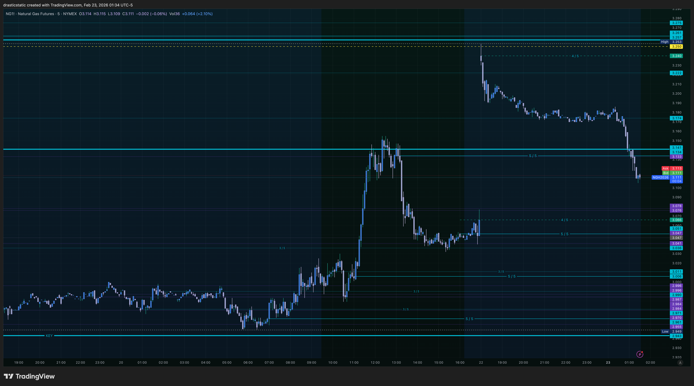
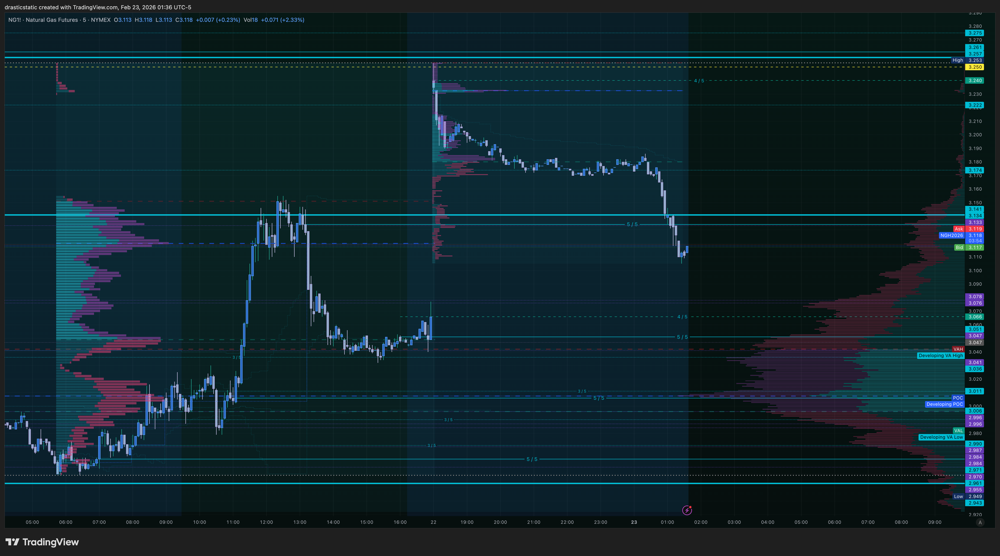
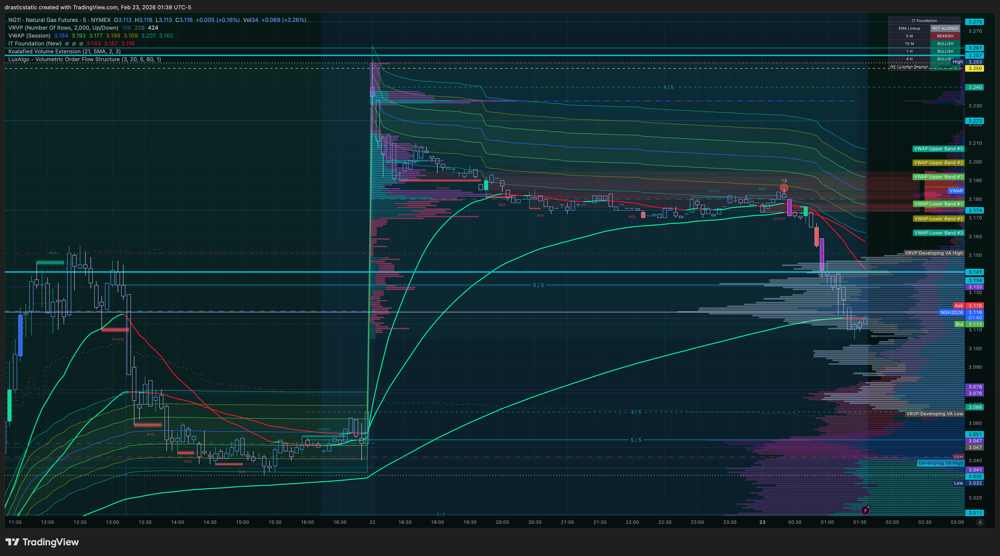

# 🔥 NG — Pre-Market Analysis
### Natural Gas Futures | Feb 23, 2026 | Fortuna

---

> 🎯 **Session bias: Bearish**
> 📉 **Structure: Post-spike distribution, EMA bearish**
> ⚡ **Note: NG analyzed independently — not a standard**
> **SMT divergence pair with other instruments in this**
> **session. Supply-driven, idiosyncratic price behavior.**

> ⚠️ **FCR rules (confirmed from E-Book):** First candle =
> 15-min close (9:30–9:45 EST). Mark HIGH → LONG from HERE,
> LOW → SHORT from HERE. Entry = limit order on FVG
> displacement break on 5-min. SL = candle 1 of FVG low.
> TP = 2:1 fixed R:R.

---

## 📊 Screenshots

### 1 — Macro View (Long-Term)


### 2 — 1hr with Full Level Stack


### 3 — 1hr Clean View


### 4 — 1hr + FRVP


### 5 — IT Foundation EMAs + Clusters VP + VRVP


---

## ⚡ Why NG Is Different

Before the analysis: Natural Gas is one of the most
volatile commodity futures. Its price is driven primarily
by **supply-side factors** — storage reports (EIA weekly),
weather (heating/cooling demand), LNG exports, production
data. These idiosyncratic drivers mean NG regularly makes
moves that have **no correlation** to equities or metals.

CL and NG do **not** form a standard SMT divergence pair.
NG is analyzed on its own structure only.

---

## 📐 Structure Analysis

### 🌍 Macro View (Long-Term)

The long-term chart tells NG's story clearly. This is a
commodity that has seen **extreme historical volatility**:
- Major price spikes (visible on the left) driven by
  supply shocks and weather events
- Each spike followed by an extended sell-off and
  mean reversion back toward lower structural levels

The current structure shows NG made **a major spike** —
likely driven by winter demand / cold weather event —
and is now in the **post-spike distribution and sell-off
phase.** This is the typical NG pattern after a weather
event passes: fast spike up, slow grind down.

Price is currently well below the spike high, in a
downtrend, working through the 5/5 levels created on
the way up as it sells off.

---

### 📐 1hr Structure — Level Analysis

**Screenshot 2** shows the full level inventory. This is
the most level-dense chart in today's pre-market session —
reflecting how many 1hr color flips NG generated during
both the spike up and the sell-off back down.

**Overhead resistance (5/5 and 3/5 levels):**
- The spike high created a cluster of 5/5 levels at the
  top that have since been tagged and demoted to 3/5
  (visible as cyan dotted lines) — these now form a
  stacked resistance ceiling above current price
- Multiple 3/5 (mitigated) levels throughout the range
  from the rapid descent — former support flipped
  resistance on any bounce attempt

**Current price position:**
- Price is near the bottom of the recent sell-off range,
  sitting at or near a 5/5 support level
- The yellow 4/5 (previous day levels) provide nearby
  reference anchors
- The structure is a clear downtrend: lower highs,
  lower lows with each attempted bounce rejected by the
  overhead 5/5/3/5 resistance layers

**1hr verdict: 🐻 Bearish. Resistance stacked above,**
**trend is down until a KEY level is reclaimed.**

---

### 📐 1hr Clean View (Screenshot 3)

Without the full indicator stack, the structure is
unmistakable:

- Sharp spike UP to the session highs (the big blue
  impulse candle)
- Immediate distribution and rejection at the top
- Steady waterfall sell-off through the level ladder
- Current price near the base of that sell-off range

The shaded right area (upcoming session) shows price
entering from a position of bearish structure. Any
rally attempt into the overhead 5/5 resistance would
be a potential short setup — not a long.

---

### 📦 Volume Profile — FRVP (Screenshot 4)

Two FRVP profiles visible:

**Left FRVP** (anchored to earlier range):
- Shows where volume traded during the pre-spike
  consolidation — the base the spike launched from
- POC from this profile is well below current price —
  this is the long-term value area NG left behind

**Right FRVP** (current session range):
- POC sitting **above current price** ← bearish
- Sellers have been transacting at higher prices;
  current price is below the dominant value zone
- Low volume below current price = potential fast
  continuation lower if support breaks
- High volume node (HVN) above = strong resistance
  on any rally attempt (where sellers are positioned)

**VP verdict: 🐻 POC above price = sellers in control.**

---

### 📈 IT Foundation EMAs (Screenshot 5)

This is the starkest contrast to the metals session:

- ❌ IT Foundation EMAs: **BEARISH configuration**
  — the bearish EMA is above the bullish EMA
- ❌ EMAs are angling **downward**
- ❌ Price is **below** the EMA stack — not approaching
  it from above (like GC/SI), but trapped under it

The EMA picture on NG is the inverse of the metals.
Where GC and SI show price pulling back TO the EMA
for a potential long, NG shows price **repelled by**
the EMA stack on any bounce — the EMAs are acting as
a ceiling, not a launching pad.

**LuxAlgo Clusters VP** and **VRVP** in screenshot 5
are consistent with this read — volume distribution
confirms the bearish EMA narrative.

---

## 🎯 Scenarios for NY Open

---

### 🔴 Scenario A — Continuation Short *(Primary Bias)*
**Trend-aligned | Bearish setup**

```
Price remains below the EMA stack and 5/5
overhead resistance at 9:30 open
→ 15-min first candle close at 9:45
→ If first candle closes BEARISH below its
  midpoint, or rejects the overhead 5/5:
  Mark LOW as SHORT from HERE
→ Wait for FVG displacement below on 5-min
→ Limit entry on FVG
→ SL: candle 1 of FVG pattern high
→ TP: 2:1 fixed R:R toward next 5/5 support
```

Confluence checklist:
- [ ] Price below EMA stack at 9:30 open
- [ ] First 15-min candle closes bearish
- [ ] FVG displacement below first candle low
- [ ] No major EIA storage report this session
      (check calendar — NG is news-sensitive)

---

### 🟢 Scenario B — Reclaim Long *(Lower Probability)*
**Counter-trend | Requires strong confirmation**

```
Price spikes above EMA stack + KEY 5/5 level
→ 1hr bullish color flip confirmed at EMA
→ First 15-min candle closes ABOVE EMA stack
→ FVG displacement above first candle high
→ Limit entry on FVG
→ SL: candle 1 of FVG pattern low
→ TP: 2:1 toward next overhead 5/5 level
```

> This requires ALL conditions — a weak break of the
> EMA with no FVG is not enough. NG is notorious for
> false breakouts. The EMA reclaim must be convincing.

---

### ⚪ Scenario C — Choppy Range / No Setup

```
Price churns between support 5/5 and EMA overhead
No clean 15-min first candle direction
No valid FVG displacement
→ Stay flat. NG chop is expensive.
   There is no trade today on this instrument.
```

> NG can be choppy and punishing when it lacks
> directional conviction. Scenario C is not a failure
> — it's the right read on a difficult session.

---

## ⚠️ NG-Specific Risk Reminders

```
1. EIA Natural Gas Storage Report
   → Released Thursdays 10:30 AM ET
   → Can cause violent 10-30%+ intraday moves
   → CHECK the economic calendar BEFORE trading NG
   → If report is today: no FCR trade on NG

2. Weather events
   → Cold snaps / heat waves drive NG independently
   → Can invalidate any technical setup instantly

3. Volatility
   → NG is one of the most volatile futures contracts
   → Size appropriately vs NQ/ES — wider stops needed

4. No SMT pairing
   → NG is not cross-referenced with CL or any other
      instrument for divergence in this session
   → It stands alone on its own structure
```

---

## 🎯 Pre-Session Checklist — NG

```
[ ] Check economic calendar for EIA storage
    report (Thursdays 10:30 AM ET)
    → If today = skip NG entirely
[ ] Confirm NG is below EMA stack at open
[ ] Note which 5/5 level price is sitting at
    and which is the nearest overhead resistance
[ ] 9:45 ET: first 15-min candle CLOSES
    → Note candle color and position vs EMA
    → Mark HIGH = LONG from HERE (ref only)
    → Mark LOW = SHORT from HERE (primary)
[ ] Switch to 5-min chart
    → Wait for FVG displacement
    → FVG valid: any of 3 candles closes OUTSIDE
      first 15-min candle H/L range
    → Enter LIMIT ORDER on the FVG
    → SL = low of candle 1 of FVG (for short:
      high of candle 1 of FVG)
    → TP = 2:1 fixed R:R
[ ] Mental state check (1–10) before session
[ ] Out of all trades by 4:00 PM ET
```

---

*🙏🏼 Fortuna — Wealth Warden | Claude Code CLI*
*Anthropic claude-sonnet-4-6 | Feb 23, 2026*
