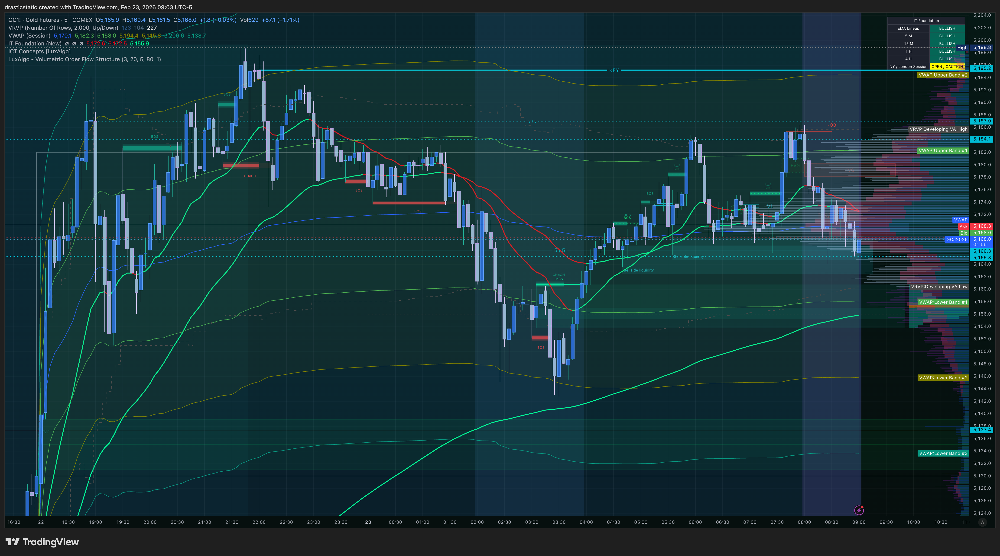
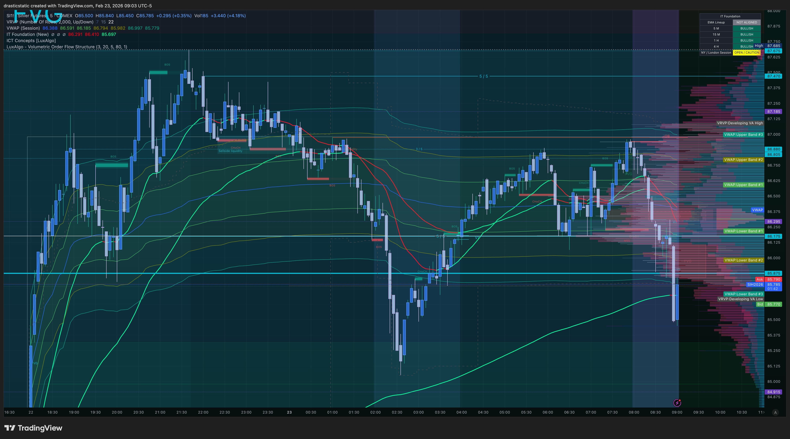
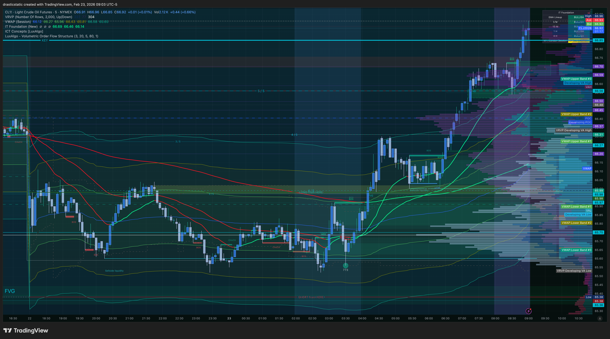
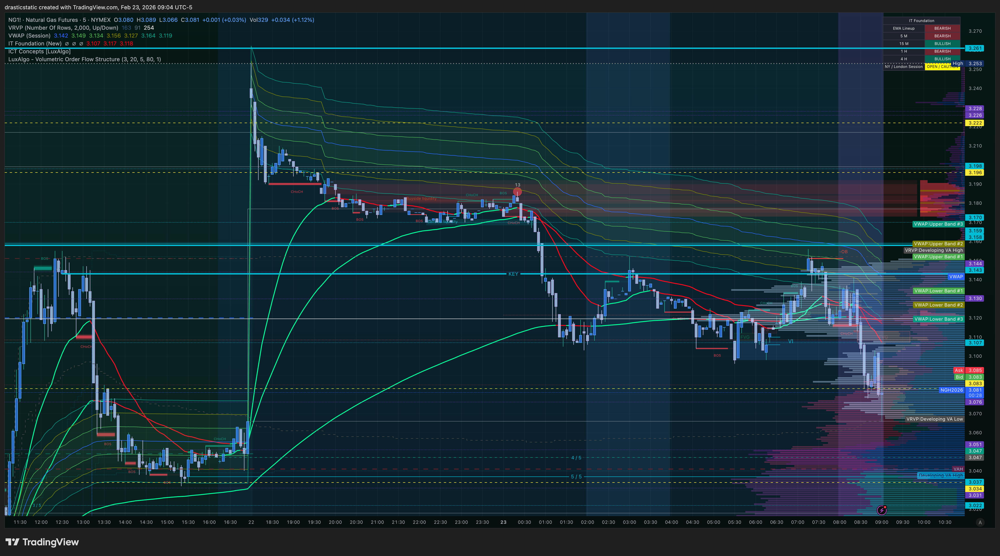

# 🗓️ Pre-Market Session Summary
### Feb 23, 2026 — NY Open | Fortuna

---

> ⏰ **Screenshots taken: 8:45–9:04 AM ET**
> 🔔 **NY Open: 9:30 ET | FCR First Candle closes: 9:45 ET**
> 🧠 **One clean trade is a complete trade.**

---

## 📋 Session Dashboard

| Instrument | Bias | Primary Setup | Overnight Change | EIA Risk |
|-----------|------|--------------|-----------------|---------|
| 🥇 GC | 🐂 Bullish | Scenario A — EMA pullback LONG | ✅ Pulling back to EMA — setup developing | None today |
| 🥈 SI | 🐂 Bullish | Scenario A — EMA pullback LONG | ✅ Tracking GC, no divergence | None today |
| 🛢️ CL | ⚠️ REASSESS | Wait for 9:45 first candle | 🚨 Overnight BULLISH reversal — thesis flipped | Wed 10:30 |
| ⛽ NG | 🐻 Bearish | Scenario A — continuation SHORT | ✅ Bearish structure intact | Thu 10:30 |
| 💻 NQ | 🐻 Bearish | Scenario A — continuation SHORT | 📍 Bearish from close of week | None today |
| 📊 ES | 🐻 Bearish | Scenario A — continuation SHORT | 📍 Bearish, tracking NQ | None today |
| 🏛️ YM | 🐻 Bearish | Scenario A — FVG SHORT | 📍 FVG pre-annotated by Christopher | None today |

---

## 🌙 Overnight Updates

*Screenshots taken 9:03–9:04 AM ET — ~27 minutes before open*

---

### 🥇 GC — Scenario A Is Alive



**Status: ✅ Original analysis confirmed. Setup developing.**

Exactly as forecast in `premarket_20260222_GC.md`:
price has pulled back from the ATH area toward the
IT Foundation EMA stack overnight. The EMAs remain
in **bullish configuration** — green dominant, steeply
angled. Price is at or near the EMA zone.

This is **Scenario A territory**: EMA pullback +
potential LONG from HERE at the 9:45 first candle close.

```
Watch at 9:45: Does first candle close BULLISH
at or above the EMA stack?
→ YES: Mark HIGH as LONG from HERE
   Wait for FVG displacement above on 5-min
→ NO: Reassess — is SI still in sync?
```

**SMT watch:** SI must be tracking GC. Any divergence
(one makes a new low, the other doesn't) changes the read.

---

### 🥈 SI — Confirming GC, No Divergence



**Status: ✅ Tracking GC. No SMT divergence detected.**

SI overnight picture mirrors GC — same EMA pullback
setup, same Scenario A territory. Both metals are
moving in sync.

The lack of divergence at this stage is **bullish
confirmation**: when GC and SI track proportionally
into the open, it means institutional flows are
consistent across the metals complex — not a trap.

```
Watch: SI must participate if GC makes a new high
→ GC sweeps ATH, SI also moves higher = continuation
→ GC sweeps ATH, SI LAGS or fails = SMT trap on GC
   → Short signal, not a long
```

---

### 🛢️ CL — ⚠️ OVERNIGHT REVERSAL — ORIGINAL THESIS CHALLENGED



**Status: 🚨 SIGNIFICANT CHANGE from Feb 22 analysis.**

The `premarket_20260222_CL.md` established a **bearish**
bias for today's session based on Sunday evening charts.

**What happened overnight:**
CL has made a substantial upside move overnight. The
IT Foundation EMAs on the 9:03 AM chart show the green
(bullish) EMA surging strongly. Price is now **materially
higher** than where it was when the bearish analysis was
written Sunday evening. The bearish setup has been
challenged.

**This does NOT mean chase a long.**

The FCR rule is the safeguard here:

```
9:45 ET — First 15-min candle closes:

If BULLISH → original SHORT thesis is invalidated
  → Mark HIGH as LONG from HERE
  → Wait for FVG displacement ABOVE on 5-min
  → Limit entry, SL below, TP 2:1

If BEARISH → overnight move is fading at open
  → SHORT from HERE may re-activate
  → Watch for FVG displacement BELOW

If CHOPPY / NO DIRECTION → No trade. CL is
  trapped between the overnight high and
  the prior bearish structure. Stay flat.
```

> ⚠️ The overnight reversal on CL means the
> original SHORT bias is **SUSPENDED**, not
> inverted. The first candle at 9:45 decides.
> Do not enter CL before 9:45 either direction.

---

### ⛽ NG — Bearish Structure Intact



**Status: ✅ Original analysis confirmed. Bearish.**

NG's overnight chart shows no major structural change.
The IT Foundation EMAs remain in bearish configuration —
red EMA is still dominant above the green. Price has
not made any meaningful recovery. The distribution
pattern identified in `premarket_20260223_NG.md` is intact.

```
NG plan unchanged:
→ 9:45: first 15-min candle closes BEARISH?
   → Mark LOW as SHORT from HERE
   → FVG displacement below → limit entry
   → SL: FVG candle 1 high | TP: 2:1

⚠️ Check: Is today Thursday?
   → No: it's Monday. No EIA storage report today.
   → Next EIA risk: Thursday Feb 26 at 10:30 AM ET
```

---

## 📈 Index Setup — NQ / ES / YM

*All three indices are in the same directional structure.*

---

### Structure State (Pre-Open)

All three are entering the session from a **bearish**
post-peak sell-off. The level ladders on NQ, ES, and YM
are all stacked with 5/5 overhead supply from the descent.
Volume profiles (FRVP + VRVP) confirm: POC above price
on all three instruments.

**YM has a pre-annotated FVG visible on the chart —
Christopher identified this imbalance zone during prep.
This is the limit entry zone to watch.**

---

### The FCR Plan — Indices

```
9:30 ET — Markets open
  → Observe all three. Do not trade.
  → Note which instrument is weakest/strongest

9:45 ET — First 15-min candle CLOSES
  → If ALL THREE close bearish:
     Mark LOW on each as SHORT from HERE
     → Strongest signal = all three in sync

  → If one diverges (holds higher, closes bullish):
     That instrument may be the SMT divergence signal
     See scenarios below

  → Switch to 5-min chart on your primary entry instrument
     → Wait for FVG displacement below first candle LOW
     → Enter LIMIT ORDER on the FVG zone
     → SL: high of FVG candle 1
     → TP: 2:1 fixed R:R — set it, leave it

  → Choose ONE instrument to trade. Not all three.
```

---

## 🔗 SMT Divergence Scenarios

### Metals: GC + SI

| Scenario | GC | SI | Signal | Action |
|---------|----|----|--------|--------|
| 🟢 Sync | New high | New high | Continuation LONG | FCR LONG per Scenario A on both |
| 🔴 GC trap | Sweeps ATH | Fails to follow | Liquidity sweep on GC | SHORT from HERE at ATH level on GC |
| 🔴 SI trap | Rallies | Sweeps its high, GC lags | SI exhaustion signal | SHORT from HERE on SI |
| ⚪ Chop | Range-bound | Range-bound | No setup | Stay flat |

### Indices: NQ + ES + YM

| Scenario | NQ | ES | YM | Signal | Action |
|---------|----|----|-----|--------|--------|
| 🔴 All bearish | New low | New low | New low | Continuation | SHORT from HERE on any/all |
| 🟡 NQ weak | New low | Holds | Holds | NQ trap | ES LONG from HERE setup |
| 🟡 YM strong | Drops | Drops | Holds | Dow defense | YM LONG if ES/NQ confirm reversal |
| ⚪ Chop | Range | Range | Range | No setup | Stay flat |

---

## 📅 Economic Calendar — Feb 23, 2026

```
TODAY (Monday):
→ No EIA crude oil report (CL) — Wednesday risk
→ No EIA gas storage report (NG) — Thursday risk
→ Check for any Monday 10 AM / 2 PM releases
   (manufacturing data, Fed speakers, etc.)
→ Look for anything that would create a spike
   in the first 15-min candle on NQ/ES/YM

WEEK AHEAD:
→ Wednesday 10:30 AM ET: EIA Crude Oil Inventory → CL
→ Thursday 10:30 AM ET: EIA Natural Gas Storage → NG
```

---

## 🎯 Today's Priority Instruments

Based on the full session picture, the clearest setups
going into the open are:

**Tier 1 — Cleanest structure:**
1. **NQ/ES/YM SHORT** — all three in sync, bearish
   structure, defined level stack, YM has pre-identified FVG
2. **GC/SI LONG** — Scenario A developing overnight,
   EMA pullback to support in a strong bull trend

**Tier 2 — Wait and reassess:**
3. **CL** — overnight reversal requires 9:45 confirmation
   before any directional bias

**Tier 3 — Monitor only:**
4. **NG** — structure intact but check if any news
   catalyst changes the picture before open

> If you can only trade ONE instrument today,
> the index trio (Scenario A SHORT) or the metals
> (Scenario A LONG) represent the highest-probability
> setups with the most confluence.

---

## 🧠 Pre-Session Mental State

Before you open a position today, answer honestly:

```
1. Mental state (1–10): _____
   → Below 7: trade size down or observe only

2. Is there any unfinished emotional business from
   the last session?
   → Yes: acknowledge it before the open

3. Which scenario are you hoping to see? (Be honest)
   → If you have an emotional stake in a direction,
     that's the direction to be most skeptical of

4. What is your maximum loss today?
   → Know the number before 9:30, not after

5. What does a perfect session look like?
   → One setup. One clean execution. Out by 2pm.
   → Not three setups. Not revenge trades after a loss.
```

> *"I should have been more grateful for securing
> my profits and regrouped / composed myself."*
> — Christopher, reflecting on Feb 13

One clean win is a complete session. 🙏🏼

---

## ⏱️ Session Time Sequence

```
NOW → Review this document. Mental state check.

9:15 → Final chart check. All 7 instruments visible.
        Note overnight gaps, pre-market moves.
        Confirm levels are still valid.

9:30 → Markets open. OBSERVE. Do not trade.
        Watch the first 5min candles for direction.
        Note which instruments are strongest/weakest.

9:45 → First 15-min candle CLOSES.
        THIS is the FCR trigger moment.
        Mark the HIGH and LOW on your chosen instrument.
        Note candle color and body size vs wicks.

9:50+ → 5-min chart. Wait for FVG displacement.
         Only enter if the FVG forms clearly.
         Limit order placed ON the FVG.
         SL and TP set immediately on fill.

10:00+ → Either in a trade with stops set,
          or watching for a late FVG if no early one.
          No chasing. No "close enough" entries.

2:00 PM → Begin considering position management
           if still in a trade.

4:00 PM → All positions closed. No overnight holds
           unless explicitly planned before session.
```

---

*🙏🏼 Fortuna — Wealth Warden | Claude Code CLI*
*Anthropic claude-sonnet-4-6 | Feb 23, 2026*
*Built on Claude Code CLI by Anthropic*
