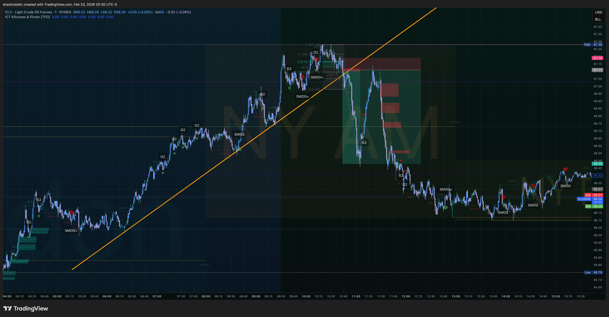
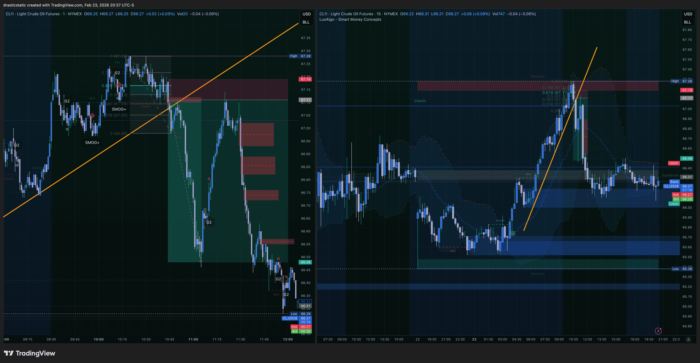
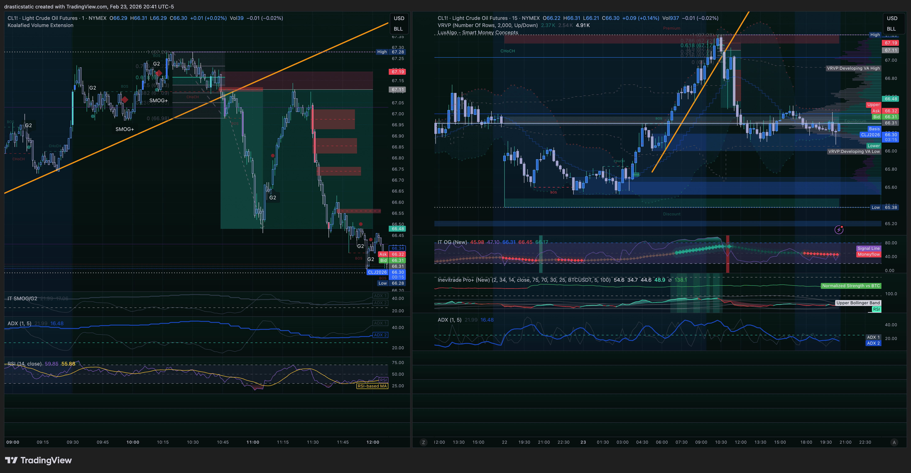
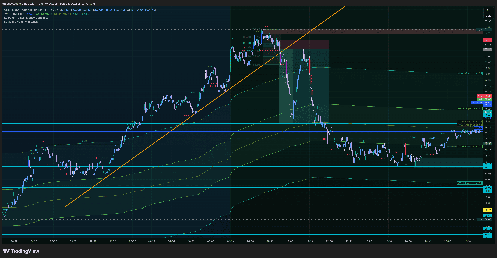

# CL SMOG Setup Analysis — Feb 23, 2026
#### Crude Oil Futures | Inevitrade SMOG Strategy Cross-Examination
#### Prepared by Fortuna (Claude Code CLI — Wealth Warden)
#### Reference: IT Bootcamp SMOG Breakdown (Feb 9, 2026) + Session 4A (Feb 23, 2026)

> **Purpose:** Cross-examine today's CL price action against the SMOG strategy
> criteria as taught by Allen. Submitted to IT coaches for verification.
> Christopher's question: *"Is this a valid SMOG setup? I see it entering at
> the .618 but appearing to miss, dump, retrace back for a second touch,
> then continue to TP."*

---

## Screenshots — Feb 23, 2026

| Time (ET) | File | What It Shows |
|-----------|------|---------------|
| ~3:30 PM | `CL1!_2026-02-23_20-30-08_5a701.png` | Full context — ascending trendline + breakdown |
| ~3:37 PM | `CL1!_2026-02-23_20-37-44_f63dd.png` | Dual panel — setup construction with Fibonacci |
| ~3:41 PM | `CL1!_2026-02-23_20-41-45_d6f8f.png` | Dual panel — Fib levels + oscillator detail |
| ~4:24 PM | `CL1!_2026-02-23_21-24-50_6e1b9.png` | Clean 1H view — Keltner + SMC FVG box visible |






---

## SMOG Strategy Reference — From Bootcamp Notes

*Per Allen's Feb 9, 2026 SMOG Breakdown session.*

### The Required Checklist (ALL must be present for A+ SMOG)

```
MACRO LEVEL (15-min chart)
[ ] Session sweep — previous session H/L swept and rejected
[ ] OG oscillator signal within 2hr window before session
[ ] No entry into opposite 15-min FVG

TRIGGER LEVEL (1-min chart)
[ ] ADX at 25 or below (1-min AND/OR 5-min)
[ ] OG oscillator buy/sell symbol printed at ADX <= 25
[ ] Change of Character (CHoCH) confirmed
    — Uptrend: HH/HL sequence → lower high → lower low
    — Must be decisive, not small wicks
[ ] Fair Value Gap (FVG) produced in the retracement
[ ] FVG is in the SMOG Zone: 50% or 61.8% Fibonacci
    — Fibonacci drawn: HIGH → LOW (for shorts)
    — Lower levels (23.6%, 38.2%) = lower probability
[ ] Underside retest of broken trendline before entry

ENTRY + RISK
[ ] Entry: limit order at FVG midpoint or 61.8% level
[ ] Stop loss: outside 78.6% Fibonacci level
[ ] Minimum 1.5R from entry to break of structure
```

### The SMOG Zone — Visual Reference

```
HIGH (of the swing being faded)
  |
  |  0%
  |
  |  23.6%  ← too high, lower probability
  |
  |  38.2%  ← marginal
  |
  |  50.0%  ← SMOG ZONE — A+ entry ✅
  |
  |  61.8%  ← SMOG ZONE — A+ entry ✅
  |
  |  78.6%  ← STOP LOSS goes outside this level
  |
  |  100%
LOW (of the swing)
```

### Trade Management (from bootcamp)

```
Partial profit method (recommended):
  → Take 50% at break of structure
  → Move SL to breakeven
  → Trail remainder via:
     (A) FVG method: trail stop to nearest major FVG
     (B) Heiken Ashi method (recommended):
         5-min HA candles, adjust stop every 4:30 min
         to high of closed HA candle

Fixed method: 4R target, full position
```

---

## CL Price Action Breakdown — What the Charts Show

### The Setup Structure

From the four screenshots, the following price sequence is visible:

**Phase 1 — The Ascending Structure (pre-breakdown)**
```
CL had been trending higher in an ETH/overnight bullish move.
An ascending diagonal trendline (orange line, Christopher's
markup) captures the entire upward leg. This trendline served
as the structural boundary for the entire bullish phase.
```

**Phase 2 — The Breakout Top + Initial Breakdown**
```
Price reached a session high (visible in the 20:30 screenshot
as the peak before the large bearish candle). A significant
bearish move followed — this is the potential CHoCH event.
The breakdown appears decisive based on candle body size visible
in the charts.
```

**Phase 3 — The Retracement to SMOG Zone**
```
After the initial breakdown, price retraced upward. Christopher
identifies this retracement reaching approximately the 61.8%
Fibonacci level of the swing high → swing low.

The key observation from Christopher:
"It enters at the .618 fib but actually misses entry and then
dumps and actually retraces back up for a 2nd touch of entry
before going down to take profit a second time."
```

**Phase 4 — The Interesting Price Action (Double Touch)**
```
Sequence:
1. Price retraces to ~61.8% zone
2. Does NOT hold — dumps through the entry zone
3. Recovers BACK up to the same ~61.8% level (second touch)
4. Price then reverses and moves lower to TP

This is the phenomenon Christopher flagged as unusual.
```

**Phase 5 — TP Reached**
```
After the second touch of the entry zone, price moves
decisively lower toward the TP target.
The clean 1H view (21:24 screenshot) confirms the full
swing is visible with the FVG box marked in the retracement.
```

---

## SMOG Criteria Cross-Examination

### Criterion-by-Criterion Assessment

| Criterion | Status | Notes |
|-----------|--------|-------|
| **CHoCH confirmed** | Likely PRESENT | Decisive breakdown visible. Trendline broken with large candle(s). Requires coach confirmation on structure specifics. |
| **FVG produced in retracement** | Likely PRESENT | FVG boxes are visible in the screenshots at the retracement zone. |
| **FVG at 50% or 61.8% Fibonacci** | UNCERTAIN | Christopher identifies 61.8% area. Fibonacci placement accuracy requires coach verification — this is the most critical question. |
| **ADX <= 25 (1-min or 5-min)** | INDICATOR PRESENT | `ADX (1,5)` visible in left pane below the 1-min chart. ADX1 = 1-min TF, ADX2 (blue line) = 5-min TF. Values appear low in the relevant zone but exact reading at signal time needs coach verification. |
| **OG Oscillator signal** | CONFIRMED PRESENT | `IT OG (New)` oscillator visible in right pane (15-min chart). Christopher confirmed a red sell signal printed at approximately 11 AM — within the valid 2-hour pre-session window. |
| **Trendline break + underside retest** | PARTIAL | Trendline break is visible. Whether an underside retest occurred before entry is not clearly shown in the available screenshots. |
| **15-min session sweep** | UNCERTAIN | CL had an overnight BULLISH reversal that was flagged in pre-market analysis as overturning the Sunday bearish thesis. This overnight move may represent a session sweep scenario — but needs 15-min chart analysis. |
| **No entry into opposite FVG** | UNCERTAIN | Needs 15-min chart review to confirm no overhead bearish FVG at entry. |
| **SL outside 78.6%** | UNKNOWN | Fibonacci placement needed to verify SL location. |
| **Minimum 1.5R to BoS** | LIKELY MET | The move from the SMOG zone to the prior swing low appears to offer sufficient distance for 1.5R+ if Fibonacci is correctly placed. |

---

## The Double-Touch Phenomenon — What's Happening Institutionally

This is the most interesting aspect of today's CL price action and
worth a dedicated section.

### What Christopher observed:
```
First touch at ~61.8%: entry zone reached → price dumps
  (entry missed or stopped prematurely)
Price recovers to the same ~61.8% zone: second touch
  → price reverses from second touch → TP hit
```

### Three possible explanations:

**Explanation 1: Fibonacci Placement Was Slightly Off**
```
If the Fib was drawn from a slightly incorrect high or low,
the true 61.8% zone could sit above where the first touch
occurred. The "dump" through the first touch area was price
actually sweeping a liquidity pool just below the true entry
zone, then recovering to fill the actual SMOG zone on the
second touch.

Implication: The Fib may need reanchoring. Coach feedback
on the exact high/low used for placement will resolve this.
```

**Explanation 2: Institutional Stop Hunt Below Entry**
```
Smart money is well aware of where SMOG traders place entries
at the 61.8%. A common institutional move is to:
  1. Push price just below the entry zone (stop hunt)
  2. Absorb the sell orders placed by retail at 61.8%
  3. Drive price back up to the entry zone
  4. Then distribute and reverse hard

The second touch represents the actual distribution point
after the stop hunt cleared the weak hands.

Implication: This is a known SMOG behavior. Allen has noted
in sessions that "missed entries" can walk away if the new
low makes the 61.8% fall below the FVG. If price came back
to the same zone — this may be the intended entry.
```

**Explanation 3: SMOG Plus Scenario**
```
From the bootcamp notes: "SMOG Plus: Cherry on top, not
primary setup criteria — represents failed G2 setups."

If the initial SMOG entry failed (price dumped through), and
then price recovered to retest, this could be a SMOG Plus
scenario where the failed G2 creates the secondary entry.

This is a more advanced setup and would need explicit coach
confirmation to classify correctly.
```

### The Bottom Line on the Double Touch:
```
All three explanations are consistent with the price action
described. Explanation 1 (Fib placement) is the most likely
for a trader still calibrating Fibonacci anchoring on CL.
Explanation 2 is the most institutionally accurate.

Either way: the second touch produced a valid-looking
reversal and TP was reached. The SETUP WORKED even if the
ENTRY TIMING was imperfect.
```

---

## Overall Verdict — SMOG Setup Grade

### What this appears to be: **B+ / Likely Valid SMOG — Pending ADX Confirmation**

```
Elements PRESENT:
  ✅ CHoCH (decisive breakdown from ascending structure)
  ✅ FVG produced in retracement
  ✅ Price action reached ~61.8% zone
  ✅ Reversal from entry zone → TP reached
  ✅ Ascending trendline broken (structural context)
  ✅ Interesting "second touch" behavior (SMOG-consistent)
  ✅ OG Oscillator red sell signal confirmed ~11 AM (15-min)
  ✅ ADX (1,5) indicator present on chart (1-min + 5-min)

Elements UNCONFIRMED (need coach eyes):
  ? ADX exact value at signal time — indicator present,
    reading needs verification (ADX1=1-min, ADX2=5-min)
  ? Fibonacci placement accuracy (high/low anchoring)
  ? Underside trendline retest before entry
  ? 15-min FVG context (no entry into opposite FVG)

What would make this A+ SMOG:
  → ADX confirmed at or below 25 on 1-min AND/OR 5-min
  → OG Oscillator printed buy/sell symbol at that reading
  → Fibonacci anchored precisely (coach verification)
  → FVG midpoint sitting clearly between 50-61.8%
  → 15-min chart shows no overhead bearish FVG above entry
  → Underside retest of broken trendline visible on 1-min
```

### Christopher's intuition is directionally correct.
The structural components (CHoCH, FVG, price reaching the SMOG
zone, reversal, TP) are all present. The unknowns are the
indicator-based gatekeepers (ADX, OG) which require the actual
chart with indicators active at the time of the signal. This is
exactly why having the coach review a drawn chart is the right
next step.

---

## Questions for IT Coaches

The following are specific questions for Allen/Craig based on
the setup analysis:

**1. Fibonacci Placement**
```
Where exactly should the Fibonacci be anchored on this CL
move? Specifically:
  HIGH anchor: the session high of the parabolic move?
  LOW anchor: the first significant swing low after CHoCH?
  Or: should the Fib be re-drawn after the first BoS?
```

**2. ADX Verification**
```
The ADX (1,5) indicator is visible on the 1-min left pane:
  ADX1 = 1-min timeframe
  ADX2 (blue line) = 5-min timeframe
The values appear low in the zone around the CHoCH/signal,
but exact readings are not clearly legible in the screenshots.
Question for coach: At the time the OG oscillator printed the
11 AM sell signal, were ADX1 and/or ADX2 at or below 25?
If yes — this upgrades from B+ to a confirmed A-grade SMOG.
```

**3. The Double-Touch Behavior**
```
When price reached the ~61.8% zone, dumped through it, then
recovered for a second touch before reversing to TP — is this:
  (A) Fibonacci placement error (true 61.8% was at the
      second touch level)
  (B) Normal institutional stop hunt behavior at the
      SMOG zone (expected, tradeable on second touch)
  (C) A SMOG Plus scenario (failed G2 recovery)
  (D) Something else entirely?
```

**4. Session Timing**
```
Today's bootcamp notes indicate avoiding entry within 30 min
of NY open (before 10:00 AM) and preferring 10:00 AM–2:00 PM
window. This CL setup appears to have formed during the NY
session but the overnight move context is significant.
Is the timing of this CL setup within the preferred SMOG
execution window? CL's session dynamics differ from equity
index futures.
```

**5. 15-Minute Context**
```
The pre-market analysis flagged CL as "REASSESS" today due to
an overnight BULLISH reversal that challenged the prior day's
bearish thesis. Does this overnight reversal represent a valid
session sweep scenario for SMOG purposes — and if so, which
direction does it bias the 15-minute SMOG setup?
```

---

## Confluence With Other Frameworks

For context, how this setup aligns with the other strategies
in Christopher's stack:

| Framework | Read on This CL Move |
|-----------|---------------------|
| **STB/ICT** | CHoCH + FVG = core ICT mechanics. The FVG produced in the retracement is the same FVG concept used in FCR. Fully consistent. |
| **ZTH** | The breakdown from the ascending trendline aligns with a B&R (Break & Retest) setup concept — price broke the trendline structure, retraced to retest it, then continued. ZTH and SMOG agree on direction. |
| **SMOG** | See full analysis above. ADX + OG gating is the distinguishing variable between "it looks like SMOG" and "it IS SMOG." |

All three frameworks point the same direction (SHORT from the
retracement into the breakdown). This cross-framework alignment
is meaningful — it confirms the directional read was correct.
The SMOG-specific criteria are what determine whether this
qualifies as a SMOG entry or simply a good directional read
that happened to respect SMOG-like price levels.

---

## Next Steps

```
1. Share this document with IT coaches for ADX/OG/Fib review
2. Await coach feedback on:
   - ADX values at signal time
   - Fibonacci placement correction if needed
   - Double-touch classification
3. Once coaches respond, update this file with their verdict
4. If confirmed as B-grade or better SMOG — add to backtesting
   log for CL SMOG setups
5. Begin building CL-specific SMOG intuition per bootcamp
   recommendation: 300-400+ backtested trades per pair
```

---

*Fortuna — Wealth Warden | Claude Code CLI*
*Anthropic claude-sonnet-4-6 | Feb 23, 2026*
*Cross-referenced: IT Bootcamp SMOG Breakdown (Feb 9, 2026)*
*Cross-referenced: IT Bootcamp Session 4A (Feb 23, 2026)*
