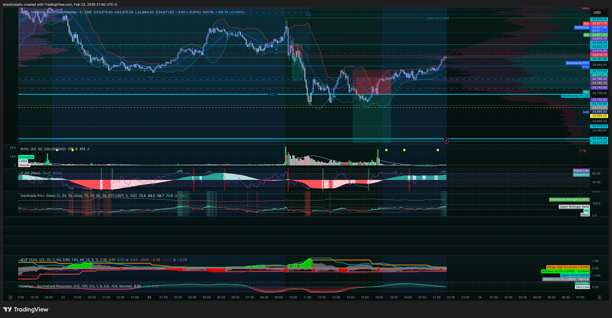

# STB SmartTrader AI Export — Daily Post-Market Review
#### Date: February 23, 2026 (Monday)
#### Generated by: Fortuna (Claude Code CLI — Wealth Warden Trading Assistant)
#### Account: Apex 100K Full Reset-3 — APEX-484839-05

[Jump to 🤖 SmartTraderAI Copy-Paste ↓](#smarttraderai-copy-paste)

> *Fortuna reminder: See `STB_export_20260221.md` for full workflow context,
> pipeline introduction, and prop firm progression plan.*

---

## 📖 Session Narrative

[Pre-market summary →](https://github.com/drasticstatic/trading-assistant-public-preview/blob/main/smarttrader-ai/analysis/premarket/2026/02-Feb/premarket_20260223-summary.md)

Feb 23 opened with a triple-confirmation Scenario A SHORT across NQ, ES, and YM. Christopher entered MNQ short at 24,879.5 (a 3/5 ZTH level FVG zone). The SL was placed at 24,929.75 at the nearest 5/5 — just one tick above, which swept the stop at 10:21 AM for −$100.50. Price then reversed and reached full TP at 24,783.5 without him. Core lesson: 3/5 entry with a 5/5 stop = structural vulnerability to a 1-tick sweep. SL was not moved — second behavioral win of the arc. Attended Inevitrade Bootcamp Session 4A that evening; STB AI gave the session an A+ overall with five priority refinements for future sessions.

---

## 📋 Session Summary

| Item | Value |
|------|-------|
| Account | Apex 100K Full Reset-3 (APEX-484839-05) |
| Instrument traded | MNQ (Micro E-mini NASDAQ-100) |
| Strategy | STB FCR (First Candle Rule) |
| Direction | Short |
| Entry | 24,879.5 (3/5 ZTH level) |
| Stop Loss | 24,929.75 (5/5 ZTH level) |
| Take Profit | 24,783.5 (2:1 R:R — never filled) |
| Result | Loss — SL hit 1 tick above 5/5 |
| Net P&L | -$100.50 |
| Duration | 12 min 50 sec (10:08–10:21 AM ET) |
| Mental state (pre-session) | 7/10 — excited, anxious (per TradeZella) |
| Mental state (post-session) | 7/10 — unattached, followed plan |

**Account standing after session:** Positive (pre-session balance +$60, net session -$100.50)

---

## 📊 Trade Log

| # | Time ET | Instrument | Dir | Entry | Exit | P&L | Notes | Review |
|---|---------|-----------|-----|-------|------|-----|-------|--------|
| 1 | 10:08 | MNQ | ↓ Short | 24,879.5 | 24,929.75 (SL) | **-$100.50** | FCR Scenario A · 3/5 entry · SL swept 1 tick above 5/5 · 12m 50s | [review_20260223_MNQ-APEX_001.md](../../../reviews/2026/02-Feb/review_20260223_MNQ-APEX_001.md) |

---

## 📈 NQ Follow-Up — Afternoon Session



After the morning FCR trade closed, Fortuna and Christopher analyzed a
potential afternoon retest of the 24,880 level (the 3/5 ZTH entry from the
morning) at approximately 2:12 PM ET. Christopher's mental state was 7/10 —
cleared for trading if a clean ZTH confirmation setup formed.

The NQ 21:40 ET chart confirms the correct decision not to enter. No clean
B&R Rejection or ZTH Rejection pattern formed at the 24,880 level — price
drifted sideways and continued lower into the ETH session without producing
a textbook entry. Christopher chose to walk the dog and attend the Inevitrade
bootcamp instead.

The afternoon retest was the right read directionally. The no-trade decision
was the right execution. The level eventually broke lower without providing
the entry trigger. Waiting for the setup to come to you, not chasing it,
is the lesson demonstrated here.

---

## 📚 Inevitrade Bootcamp — Session 4A Notes (Feb 23, 2026)

*Key takeaways from tonight's live session with Allen and Craig:*

**Timing rule (important for live trading context):**
```
Avoid entry within 30 min of NY open (before 10:00 AM)
Preferred IT execution window: 10:00 AM – 2:00 PM ET
Note: This is Inevitrade's preferred window for TCL/SMOG.
FCR (STB) operates specifically at 9:45 AM by design.
```

**Prop firm consistency principle (reinforces current approach):**
```
Consistency valued over large single-trade gains.
$10,000 over two weeks > $10,000 in one trade.
First TP recommended for accounts with consistency rules.
TCL 2.0 trades often finish in 3 minutes — ideal for evals.
```

**SMOG setup reviewed in class (CL today):**
```
OG oscillator red sell signal confirmed ~11 AM on 15-min.
ADX (1,5) indicator present — ADX1 = 1-min, ADX2 = 5-min.
Full analysis: smarttrader-ai/analysis/smog_analysis_20260223_CL.md
Awaiting coach verification on ADX values and Fib placement.
```

---

## 🔑 Key Lessons — STB SmartTrader AI Feedback (Feb 23, 2026)

*Summary of STB AI's response to the trade review and pre-market reports:*

**Overall grade: Exceptional — with 5 priority refinements identified.**

The three areas rated A+: structural diagnosis (3/5 vs 5/5 SL sweep
identification), multi-timeframe context (macro/1H/5M/VP/EMA complete),
and behavioral integration (psychology embedded in the analysis, not
separate from it).

**Top 5 improvements being implemented starting Feb 24:**

| # | Improvement | Where |
|---|-------------|--------|
| 1 | Level Quality Inventory (5/5 vs 3/5 explicit before scenarios) | Premarket summaries |
| 2 | Pre-Entry Checklist (go/no-go box at decision moment) | Premarket summaries |
| 3 | Session Risk Alerts at top of every doc | Premarket summaries |
| 4 | Pattern Tracker in trade reviews | Trade review files |
| 5 | "What Would A+ Have Looked Like?" in trade reviews | Trade review files |

Full feedback stored for reference. These refinements are built into
the Fortuna template going forward from the Feb 24 session onward.

---

<a id="smarttraderai-copy-paste"></a>

## 🤖 SmartTraderAI Post-Market Copy-Paste Fields

---

**What actually happened?**
```
Traded MNQ short on Apex 100K Full Reset-3 (APEX-484839-05)
using the STB FCR (First Candle Rule) strategy. The first
15-minute candle (9:30-9:45 AM ET) closed bearish on all three
equity indices — NQ, ES, and YM — confirming an A+ triple-
confirmation SHORT from HERE setup. FVG displacement was
confirmed on YM by 9:50 AM. Entered MNQ short at 24,879.5
via limit order on the FVG zone. Stop loss was placed at
24,929.75 at the nearest 5/5 ZTH level above. Take profit
was set at 24,783.5 for a 2:1 R:R. The stop loss was hit
at 10:21:43 AM at 24,929.75 — filled by exactly 1 tick above
the 5/5 level. After the stop triggered, MNQ reversed and
moved lower, eventually reaching the full take profit target
at 24,783.5. Net result: -$100.50. The setup was correct.
The structural vulnerability was entering at a mitigated 3/5
level while placing the stop at the 5/5 — a 1-tick sweep was
enough to close the position before the real move began.
A second potential trade appeared at 11:02 AM on MES. All
orders were placed but immediately canceled — identified as
post-loss hesitation rather than a legitimate technical reason
to avoid the setup. The MES setup was valid and would have
been profitable.
```

---

**What did you learn?**
```
The core lesson: entering at a 3/5 (mitigated) ZTH level
while placing the stop at the 5/5 level above creates a
structural vulnerability to a 1-tick institutional liquidity
sweep of the 5/5. The 5/5 represents an unmitigated level
that smart money is aware of and will target for stop runs.
Two adjustments identified for future FCR trades:
Option A: 5/5-only entries — enter only when the FCR FVG
  displacement lands at or near a 5/5 level. If the FVG
  is at a 3/5, wait for a 5/5 setup instead.
Option B: Add a 3-5 tick buffer above the 5/5 for stop
  placement when entering at a 3/5 level. The additional
  cost in risk is worth the protection against 1-tick sweeps.
The second lesson: post-loss hesitation on MES at 11:02 AM
resulted in a missed valid setup. Emotions (the morning loss)
affected the decision to place and then cancel orders on what
was a technically sound secondary setup. The plan was followed
on the MNQ trade itself — stop was respected, SL was not moved.
The morning FCR execution was disciplined and plan-adherent.
The 3/5 entry is a calibration adjustment, not a behavioral
failure. The discipline was there. The architecture was the fix.
```

---

**What were your results for the day?**
```
Apex 100K Full Reset-3 (APEX-484839-05):
  1 trade — MNQ short FCR setup
  Result: Loss (-$100.50)
  Stop respected: Yes — SL was not moved
  Plan followed: Yes — FCR rules executed correctly
  Entry quality issue: 3/5 level entry (B-grade vs A+ 5/5)
  Post-session mental state: 7/10, unattached, followed plan

Secondary opportunity (MES, 11:02 AM):
  Orders placed then canceled — post-loss hesitation
  Setup was valid — would have been profitable
  Result: Missed trade, $0 impact

Total session net: -$100.50
Account standing: Active, within all Apex rules
No rule violations: Confirmed
Adjustment for next session: 5/5 entries only for FCR,
  or 3-5 tick SL buffer above 5/5 when entering at 3/5
```

> Full daily-review: https://github.com/drasticstatic/trading-assistant-public-preview/blob/main/smarttrader-ai/exports/2026/02-Feb/STB_export_20260223_daily-review.md

> Full individual trade reviews:
- [review_20260223_MNQ_001.md](https://github.com/drasticstatic/trading-assistant-public-preview/blob/main/smarttrader-ai/reviews/2026/02-Feb/review_20260223_MNQ_001.md) — MNQ Short T1 (SL hit 1 tick above 5/5)

---

## 🎯 Forward Focus

1. **5/5 entries only for FCR** — or add a 3–5 tick SL buffer above the 5/5 when entering at a 3/5 level. Structural SLs only.
2. **Mental state threshold: 6/10 or above** before any entry. Log it before clicking.
3. **Post-loss hesitation is a pattern** — the MES valid setup at 11:02 was missed due to the morning loss. Separate outcome from process on the next setup.

---

*Produced with 🙏🏼 Fortuna — Wealth Warden | Claude Code CLI*
*Daily Review · Feb 23, 2026*
