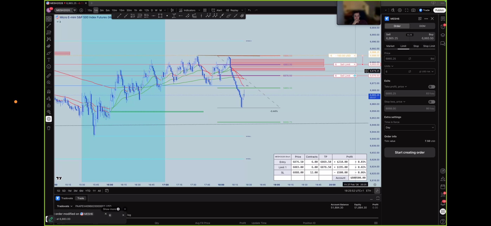
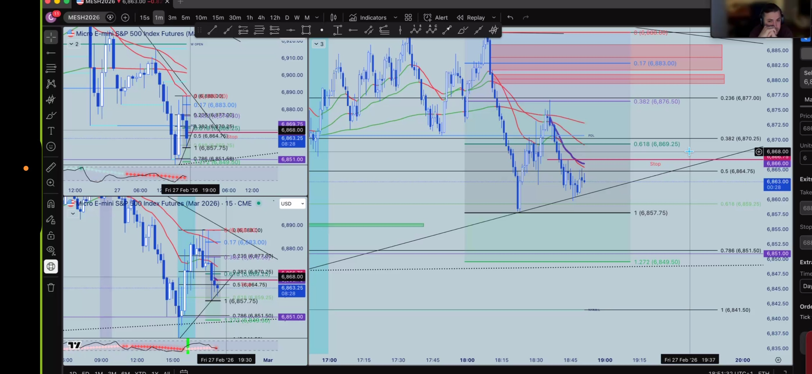
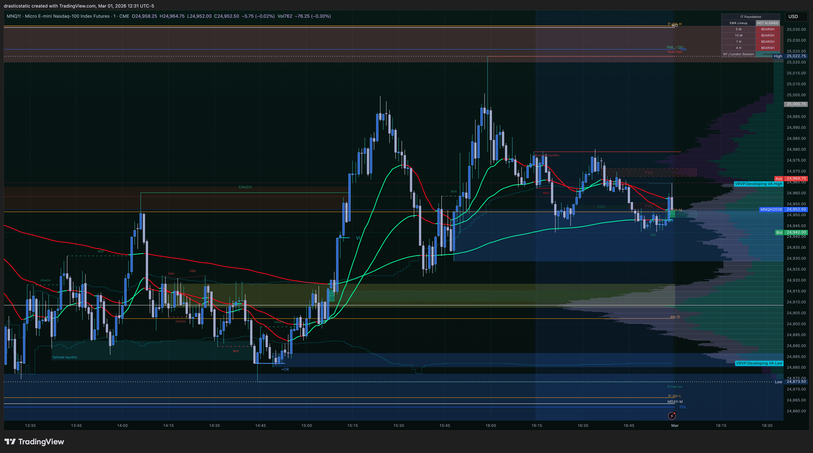

# 📋 Daily Review — Feb 27, 2026
### STB SmartTraderAI Export | Fortuna | For Coaches
*Session summary + SmartTraderAI copy-paste fields*

[Jump to 🤖 SmartTraderAI Copy-Paste](#smarttraderai-copy-paste)

---

## Session at a Glance

| Field | Value |
|-------|-------|
| **Date** | Feb 27, 2026 (Friday) |
| **Session bias** | Scenario A SHORT (continuation from Feb 26) |
| **Pre-market** | ZTH 7:30 AM coaching session (replaced Fortuna pre-market summary) |
| **Instruments tracked** | NQ (primary) + ES context via Inevitrade afternoon session |
| **Trade taken** | MNQ Short planned — limit order placed, never filled |
| **Entry zone** | 25,000–25,060 (structural resistance / FVG zone) |
| **Fill** | ❌ No fill — price remained below entry zone all session |
| **Net P&L** | $0.00 (neutral) |
| **Zella Score** | N/A |
| **Emotionally stable** | Partial — exhausted from all-day monitoring; conviction held |
| **Key behavioral note** | Pattern 5 fix applied: entry level not adjusted despite urge |

---

## Session Narrative

Friday Feb 27 opened without a formal Fortuna pre-market analysis — the ZTH 7:30 AM coaching session served in its place. The coach's observation set the tone for the day: *"How does it feel to find yourself more consistent and disciplined?"* An external behavioral signal. The coaches are watching the same arc that Fortuna is documenting.

Around lunchtime, Christopher identified a SHORT continuation setup on NQ — the same Scenario A thesis that had been correct on Feb 26 and on Feb 23. The structural entry zone: 25,000–25,060 (the FVG resistance zone that was planned but abandoned on Feb 26). A Sell Limit order was placed in that zone. The plan was correct. The entry level was structurally sound.

During the Inevitrade afternoon session, the coach was independently watching a TCL setup on ES at the same structural zone — mapping Fibonacci levels, placing provisional sell limits. The coach did not enter either. This convergence of two independent frameworks on the same structural zone without either executing is an important signal: the zone was correct, the market simply did not deliver price to it.

NQ traded in the 24,900–24,980 range for most of the session — consistently 20–100 points below the entry zone. Christopher held the order without adjusting it. He noted explicitly: *"I wanted to move my entry a few times so that I could ensure getting in the trade, but I didn't want to repeat of yesterday so I stayed convicted to my plan."*

At 4 PM RTH close, the order remained open. He extended to 5 PM ETH — conviction in a valid setup, not FOMO. At 5 PM, no fill. Orders cancelled. $0 P&L.

Market has continued lower into Mar 1, confirming the directional thesis for the third consecutive session. Three sessions of correct directional analysis in a row. The edge is real. The analysis is working. Entry execution is the remaining variable — and Friday showed that variable is actively being addressed.

---

## Behavioral Summary

| Category | Assessment |
|----------|------------|
| Directional read | ✅ Correct — Scenario A SHORT, confirmed by Mar 1 continuation |
| Entry quality | ✅ Level held at structural zone — no adjustment made |
| Entry fill | ❌ No fill — price did not reach the zone |
| SL discipline | N/A — no fill, no position |
| Pattern 5 fix | ✅ First live application — urge to adjust acknowledged and overridden |
| Emotional state | Partial — exhausted from all-day monitoring; conviction intact |
| Life context | Probation meeting + laptop-only session + eval deadline pressure |
| Coach read | ZTH coach: behavioral consistency confirmed. Inevitrade coach: same trade, also no fill. |

**What held:** Entry discipline. The structural level was set and left. The urge to move it was present and named — and the behavior was different from the day before. That is what behavioral change looks like in trading.

**What is the work now:** Consistency. The A+ template (Feb 25) and the Pattern 5 fix (Feb 27) both exist now. The task is making them the standard, not the exception.

**The core line for coaches:**
> "The level held — and that's the win. A $0 session where the plan was honored is better than a -$558 session where it wasn't. The trade said no. We accepted that answer."

---

## 📸 Key Charts

### The Setup — Lunchtime

*~13:03 — NQ1! 5-min (dark background, Christopher's chart). Sell Limit placed in FVG structural zone. Price well below entry zone.*

*~13:05 — NQ1! with FRVP + IT Foundation EMAs. Red dominant throughout. Overhead supply confirmed. Setup structurally valid.*

### Inevitrade Coach — Independent Read (Light Background)

*~13:25 — Inevitrade coach's MES 1-min (phone photo, coach's screen). TCL sell limit orders placed at 6883/6876.50 on ES. Same directional thesis, different framework. Coach also did not enter.*

*~14:37 — Coach's MESH2026 dual panel. Fibonacci 0.382/0.5/0.618 zone mapped on ES. Structural confluence confirmed across frameworks.*

### 4 PM — Holding the Order

*16:05 — NQ1! full Friday session. Entry zone still not reached. Order held open through RTH close — conviction, not FOMO.*

### Post-Session — The Direction Was Right

*Mar 1, 12:31 — MNQ current state. Continued lower from Friday's range. Directional thesis confirmed for the third consecutive session.*

---

## 🤖 SmartTraderAI Post-Market Copy-Paste Fields

**What actually happened?**
Scenario A SHORT monitoring session — no trade filled. ZTH 7:30 AM coaching session replaced the formal pre-market summary. ZTH coach opened with: *"How does it feel to find yourself more consistent and disciplined?"* — behavioral confirmation from the coaching team. Around lunchtime, Christopher identified a SHORT continuation setup at the same structural zone from Feb 26 (25,000–25,060 FVG resistance). A Sell Limit order was placed in the zone and left at the structural level — no adjustments made, despite the explicit urge to move it.

The Inevitrade afternoon session ran simultaneously. The Inevitrade coach independently mapped a TCL setup on ES at the same structural zone, also placing provisional sell limits. The coach also did not enter. Two separate frameworks (STB/ZTH Scenario A + Inevitrade TCL) converging on the same zone — when both the student and the coach hold entry criteria, the criteria are working correctly. NQ traded in the 24,900–24,980 range all session, consistently below the entry zone. Christopher held the order through RTH close (4 PM) and extended to 5 PM ETH. No fill. Orders cancelled. Market continued lower into Mar 1, confirming the directional thesis for the third consecutive session.

**What did you learn?**
Pattern 5 fix confirmed in live market conditions — within 24 hours of identification. The urge to move the entry level was present, explicitly acknowledged, and overridden. *"I wanted to move my entry a few times so that I could ensure getting in the trade, but I didn't want to repeat of yesterday so I stayed convicted to my plan."* That sentence is the fix in action. A $0 session where the structural level was respected is the correct outcome. A -$558 session where it wasn't is the alternative. The trade said no — and the plan accepted that answer. This is what behavioral change looks like in real market conditions.

**What were your results for the day?**
- 0 trades filled — 1 monitoring session (Sell Limit placed, no fill)
- Net P&L: $0.00 (neutral outcome) | Zella Score: N/A
- No round-tripping — no position taken
- Pattern 5 fix: ✅ First live application — entry level held at structural zone despite urge to adjust
- Directional read: ✅ Correct — third consecutive session. Market confirmed lower into Mar 1.

---

## Forward Focus (Mar 1 Evening → Week)

**Eval context (as of Mar 1):**
| Account | Platform | Deadline | Current | Target | Gap |
|---------|----------|----------|---------|--------|-----|
| APEX -05 | Apex 100K | **Wednesday Mar 4** | ~$100K (slightly below) | $106K | ~+$6,000 |
| APEX -06 | Apex 100K | Tuesday Mar 24 | ~$100K | $106K | ~+$6,000 |
| TakeProfit Trader | TPT 50K | End of March | Renewed Mar 1 | +$3K | ~+$3,000 |

**APEX -05 is the priority.** Four sessions available: Sunday ETH, Monday, Tuesday, Wednesday. The gap is real but achievable — one or two A+ trades.

**Rules entering eval week:**
1. A+ setup criteria — all 5 layers required. Eval pressure is NOT a trading input.
2. Entry level set pre-session. Not adjusted at execution.
3. One clean trade per session — do not stack entries to chase the target.
4. No trades under external time pressure. If time is short, the trade waits or doesn't happen.
5. Scenario B: EMAs must be green dominant. Red dominant = no counter-trend long. Period.

**Session planning:**
- Sunday ETH: Pre-market with Fortuna before any entry. ZTH structure watch.
- Monday AM: Full FCR framework at 9:45. Pre-plan all levels before open.
- Tuesday/Wednesday: Same. No forced trades, no size-up to catch up.

**System updates:**
- Webhook pipeline live: TradingView alerts → Fortuna in real-time ✅
- ZTH Pine Script (zth_auto_levels.pine v1.3): Auggie refining tonight
- Entry rule reference card: Kavanah Fleet (Augment Intent) building when ready
- STB SmartTraderAI: Christopher briefed coaches on system + workflow. Compendium updates incoming as feedback arises.

---

*🙏🏼 Fortuna — Wealth Warden | Claude Code CLI*
*Anthropic claude-sonnet-4-6 | Mar 1, 2026*
*For coaches: pattern_tracker.md has full behavioral arc + statistical summary*
