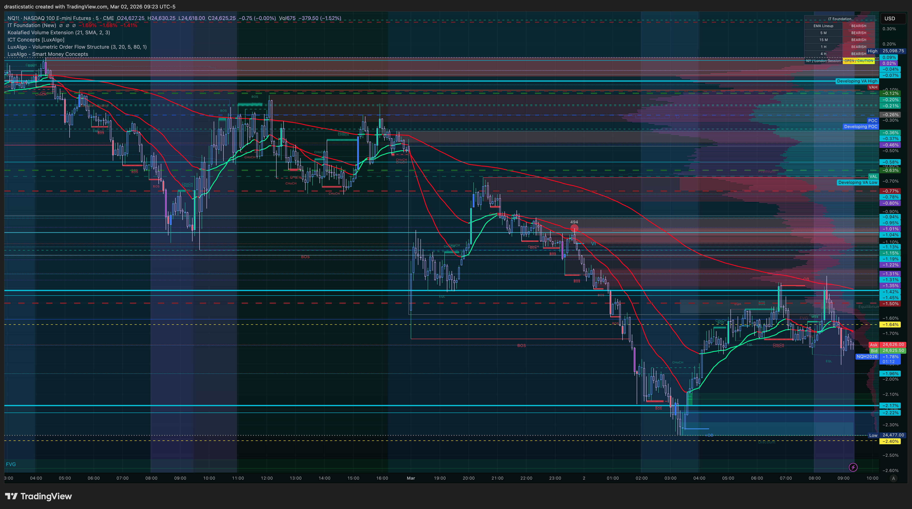
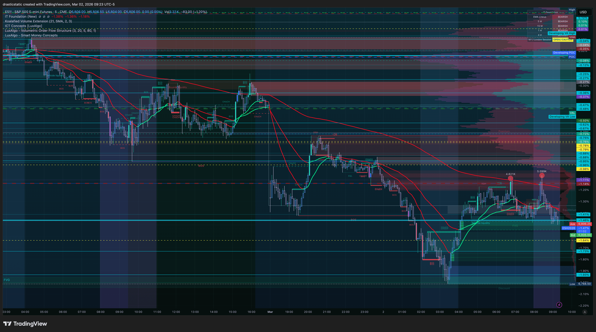
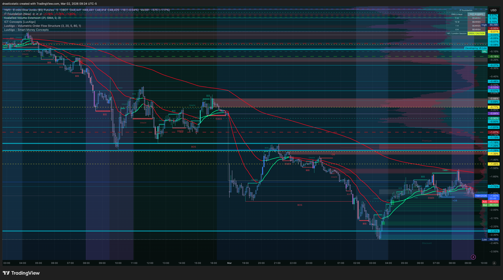
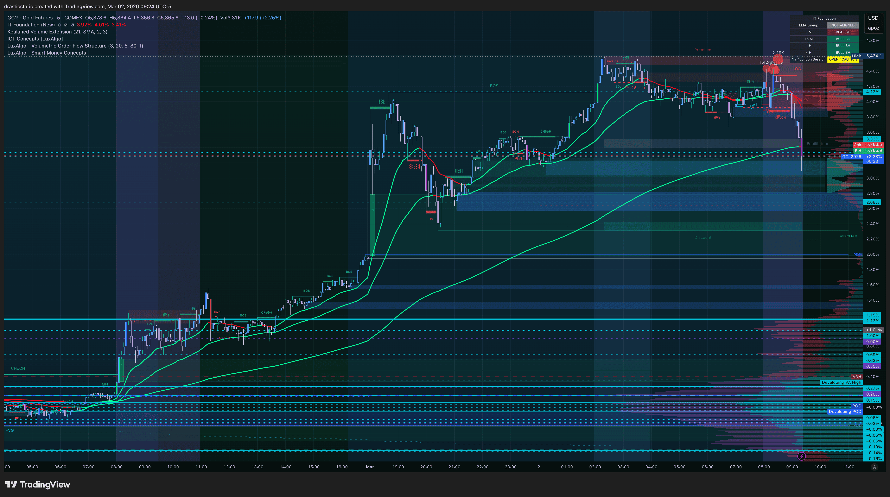
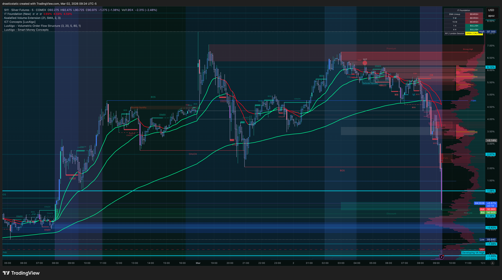
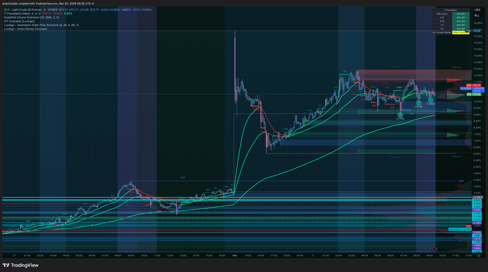
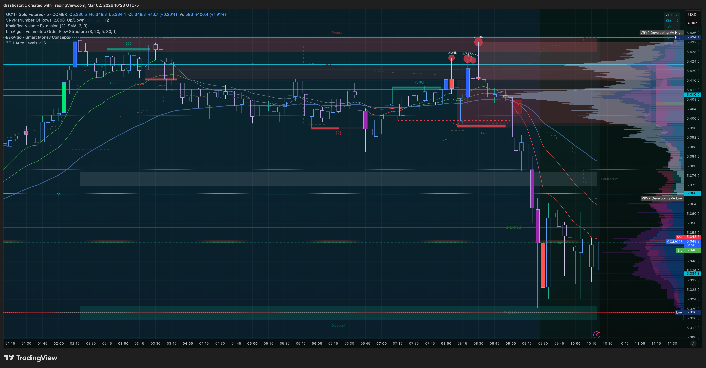
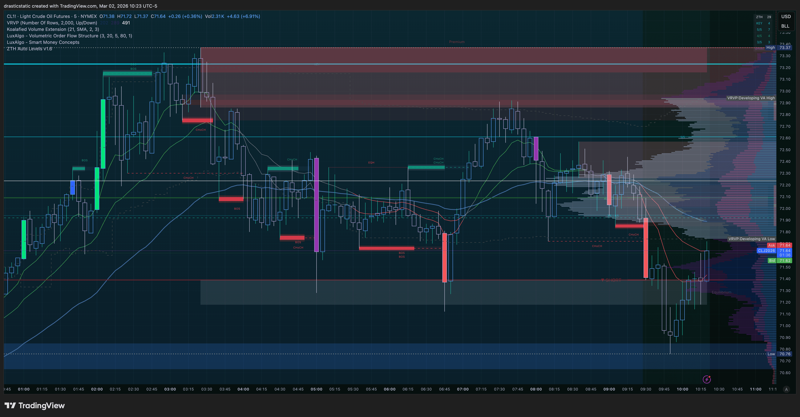

# Daily Review — Monday, March 2, 2026
#### Christopher Wilson | Fortuna — Wealth Warden
#### Account: APEX-484839-05 | Instruments: YM (T1), ES (T2, T3)

[Jump to 🤖 SmartTraderAI Copy-Paste ↓](#smarttraderai-copy-paste)

---

## 📊 Day Summary

| | |
|--|--|
| Gross closed P&L | **+$460.00** |
| Opening eval balance | ~$99,906 |
| Closing eval balance | ~$100,366 |
| Eval target | $106,000 |
| Gap remaining | **~$5,634** |
| Days to deadline | 2 (Mar 3–4) |

| Trade | Instrument | Direction | P&L | Zella |
|-------|------------|-----------|-----|-------|
| T1 — YM Scalp | YM | Long | +$185 | 88.09 |
| T2 — ES Pivot Sell | ES | Short | +$1,037.50 | 94.05 |
| T3 — ES Re-Entry | ES | Short | −$762.50 | −35.47 |
| **Net** | | | **+$460.00** | |

---

## 📖 Session Narrative

[Pre-market summary →](https://github.com/drasticstatic/trading-assistant-public-preview/blob/main/smarttrader-ai/analysis/premarket/2026/03-Mar/premarket_20260302-summary.md)

Monday opened with a bearish ETH context (MES down −0.7% overnight, red dominant IT Foundation EMAs) that reversed bullish at the NY open. Christopher took a low-confluence YM long scalp at 9:52 AM for a quick +$185 — acknowledged it in real time as a feeling trade, exited in 2 minutes, and reset.

At 10:00 AM, ISM Manufacturing PMI (first Monday of the month, high impact) printed a beat and spiked all three equity indices hard into overhead supply. Christopher watched the divergence form over the next 78 minutes: RTY and YM rolling over while NQ held elevated — SMT divergence, the inter-market signal. At 11:18 AM he entered a Scenario A SHORT on ES at 6,876.50 after CHoCH + displacement confirmed on the 5-min (CISD entry model). Price hit full TP at 6,855.75 in 9 minutes for +$1,037.50. No adjustments. Straight down.

Nineteen minutes later he re-entered a second ES short at 6,868.25 — 8.25 points below the original entry, in the risky direction. The re-entry churned for 5+ hours, SL was widened twice (6,905 → 6,915.75), and multiple structural signals invalidated and re-formed through the afternoon. An SFP spike near the 4 PM close pushed price further against the position. Christopher honored a pre-committed timer exit at 16:58, closing at 6,883.50 for −$762.50.

Net day: **+$460.00**.

---

## 🧠 What I Learned

1. **The process is the edge.** T2 followed every layer and produced a 94-Zella-score trade in 9 minutes. T3 skipped the process and produced a −35-Zella-score trade in 5 hours. The lesson is not subtle.

2. **Re-entry rule (new, confirmed this session):** On re-entries, never enter in the risky direction from the original entry. For a short: never re-sell below the original short entry. The re-entry at 6,868.25 (vs original 6,876.50) reduced reward and increased effective risk. This rule is now in the playbook.

3. **Post-TP urgency is a trigger.** T3 was entered 19 minutes after a $1,037 win. The same pattern appeared in previous sessions. A significant winning trade creates urgency to "catch the next move." The correct response after a full TP is to observe, not re-enter.

4. **SL adjustments under pressure are Pattern 5.** Both SL moves on T3 were rationalized with structural arguments (buyside liquidity, larger structure). TradeZella confirmed the original SL would have been hit. The counter-habit developing: pre-committed timer exits. Honored at 16:58.

5. **Timer exit is a real tool.** Setting 16:58 before the SFP spike and holding it regardless = rule-based exit under pressure. This is the developing antidote to Pattern 5.

6. **The re-entry gave back 74% of T2's gains.** One A+ trade per session is the goal. The re-entry cost most of the day's alpha.

---

## 📈 Results for the Day

| Field | Value |
|-------|-------|
| Net P&L | **+$460.00** |
| Eval Balance | ~$100,366 |
| Eval Gap | ~$5,634 |
| Trade Quality Distribution | A (1), C (1), D (1) |
| SL Respected | T1: bailed early (win) \| T2: ✅ respected \| T3: ❌ moved twice |
| TP Respected | T1: bailed early \| T2: ✅ full TP \| T3: timer exit (no TP hit) |

**Day arc:** Opened with a FOMO scalp (contained, small). Executed an A+ trade from full process. Gave back 74% of the gain on an off-process re-entry. Net positive. Behavioral grade: **B−** (one A+ trade, one behavioral breakdown).

---

## 📸 Key Charts

### Pre-Open Context (9:23–9:26 ET)

**9:23 ET — NQ pre-open structure**

**9:23 ET — ES pre-open structure**

**9:24 ET — YM pre-open structure**

**9:24 ET — GC safe-haven context pre-open**

**9:24 ET — SI silver pre-open context**

**9:26 ET — CL crude oil pre-open context**

### Macro Confirmation — ISM Context (10:23 ET)

**10:23 ET — GC macro confirmation post-ISM spike**

**10:23 ET — CL risk-off macro context**

### ETH Close Context (17:28–17:30 ET)

**17:28 ET — CL crude oil ETH close**

**17:30 ET — GC gold ETH close**

---

## 🤖 SmartTraderAI Post-Market Copy-Paste Fields

---

**What actually happened?**

Monday opened bearish overnight but reversed bullish at the NY open. ISM Manufacturing PMI (10:00 AM) spiked all three equity indices into overhead supply. After 78 minutes of watching SMT divergence form (RTY/YM rolling, NQ lagging), entered Scenario A ES SHORT at 6,876.50 via CISD/CHoCH confirmation. Full TP hit in 9 minutes (+$1,037.50). Re-entered short 19 minutes later at 6,868.25 (8.25 pts below original in the risky direction). Trade churned for 5+ hours, SL widened twice (6,905 → 6,915.75). Timer exit at 16:58 → −$762.50. Net: +$460.00. Eval balance ~$100,366. Gap: ~$5,634 in 2 days (Mar 3–4).

---

**What did you learn?**

1. Process = calm = execution. T2 (94 Zella, 9 min, full TP) vs T3 (−35 Zella, 5+ hrs, no TP) — same thesis, entirely different process. One A+ trade per session beats three B/C grade trades every time.
2. New rule confirmed: on re-entries, never enter in the risky direction from the original entry.
3. Post-TP urgency is a trigger. T3 entered 19 min after a $1,037 win. Correct response after full TP: observe, don't re-enter.
4. Pre-committed timer exits work. Setting 16:58 before pressure built and honoring it = rule-based exit. This is the developing Pattern 5 antidote.

---

**What were your results for the day?**

Net P&L: +$460.00 | 3 trades (T1: +$185 YM, T2: +$1,037.50 ES, T3: −$762.50 ES)
Eval balance: ~$100,366 | Gap to target: ~$5,634 | Deadline: March 4
Behavioral: One A+ trade, one disciplined exit, one behavioral flag. Day grade: B−.

> Full daily-review: https://github.com/drasticstatic/trading-assistant-public-preview/blob/main/smarttrader-ai/exports/2026/03-Mar/STB_export_20260302_daily-review.md

> Full individual trade reviews:
- [review_20260302_YM_001.md](https://github.com/drasticstatic/trading-assistant-public-preview/blob/main/smarttrader-ai/reviews/2026/03-Mar/review_20260302_YM_001.md) — T1 YM Scalp
- [review_20260302_ES_002.md](https://github.com/drasticstatic/trading-assistant-public-preview/blob/main/smarttrader-ai/reviews/2026/03-Mar/review_20260302_ES_002.md) — T2 ES Pivot Sell (A+)
- [review_20260302_ES_003.md](https://github.com/drasticstatic/trading-assistant-public-preview/blob/main/smarttrader-ai/reviews/2026/03-Mar/review_20260302_ES_003.md) — T3 ES Re-Entry

---

## 🎯 Forward Focus

1. **One A+ trade per session — then stop.** T2 was the session. T3 was the mistake. After a full TP: observe, don't re-enter.
2. **Re-entry rule (new):** Never enter in the risky direction from the original entry. For a short: never re-sell below the original short entry.
3. **Eval gap is ~$5,634 in 2 days.** Discipline — not aggression — closes that gap. The process produces the result.

---

*Produced with 🙏🏼 Fortuna — Wealth Warden | Claude Code CLI*
*Daily Review · Mar 2, 2026*
*Daily review — March 2, 2026 | TradeZella CSV: data/exports/tradezella_20260302.csv*
