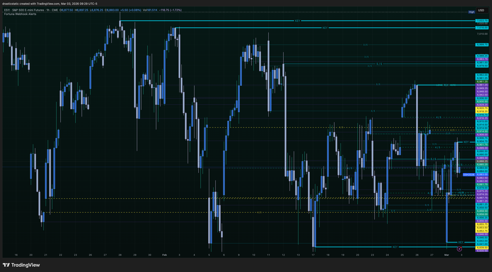
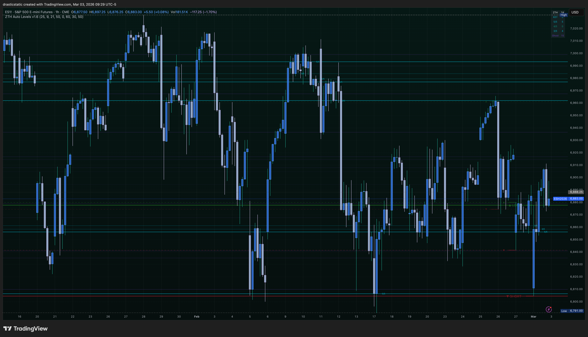
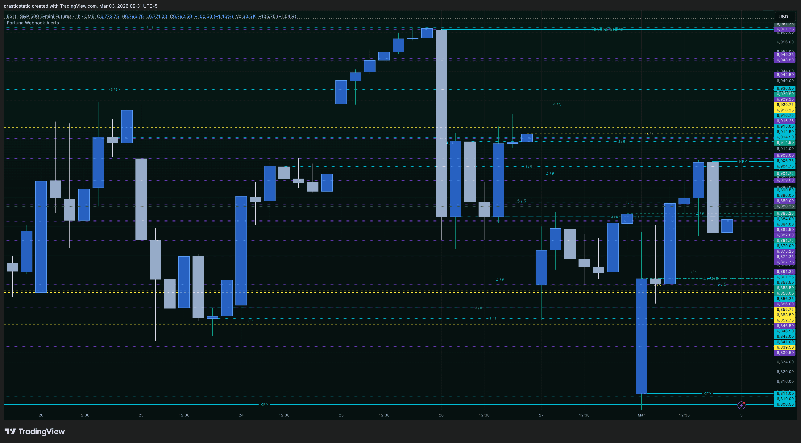
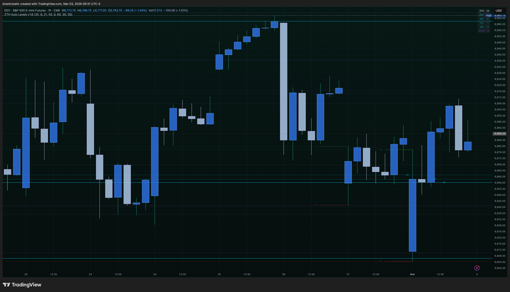

# Daily Review — March 3, 2026
#### Fortuna — Wealth Warden | Claude Code CLI
#### Account: APEX-484839-05 | APEX 100K Legacy (BLOWN)

[Jump to 🤖 SmartTraderAI Copy-Paste ↓](#smarttraderai-copy-paste)

---

## 📋 Session Summary

| Field | Value |
|-------|-------|
| Date | Tuesday, March 3, 2026 |
| Account | APEX-484839-05 (100K Legacy) |
| Opening Balance | ~$100,366 |
| Day P&L | **−$2,285** |
| Closing Balance | ~$98,070 (auto-liquidated) |
| Trailing Drawdown Floor | $98,130.50 |
| Breach Amount | ~−$60 |
| Eval Status | **BLOWN — Auto-liquidated 11:43 AM ET** |
| Instruments Traded | ES (×2), CL (×1) |
| Total Trades | 3 |
| Winners | 0 |
| Losers | 3 |

---

## 📊 Trade Log

| # | Time | Instrument | Dir | Entry | Exit | P&L | Zella | SL | Review |
|---|------|-----------|-----|-------|------|-----|-------|----|--------|
| T1 | 09:43–09:44 | ES | Long | 6,765.25 | 6,757.75 | **−$375** | −93.75 | ✅ Respected | [review_20260303_ES-APEX_001.md](../../../reviews/2026/03-Mar/review_20260303_ES-APEX_001.md) |
| T2 | 11:04–11:43 | ES | Short | 6,757.25 | 6,786.25 (AutoLiq) | **−$1,450** | −84.06 | ❌ Cancelled → AutoLiq | [review_20260303_ES-APEX_002.md](../../../reviews/2026/03-Mar/review_20260303_ES-APEX_002.md) |
| T3 | 11:31–11:43 | CL | Long | 76.38 | 75.92 (AutoLiq) | **−$460** | −45.10 | ✅ Respected (AutoLiq) | [review_20260303_CL-APEX_003.md](../../../reviews/2026/03-Mar/review_20260303_CL-APEX_003.md) |

**Day total: −$2,285**

---

## 📖 Session Narrative

[Pre-market summary →](https://github.com/drasticstatic/trading-assistant-public-preview/blob/main/smarttrader-ai/analysis/premarket/2026/03-Mar/premarket_20260303-summary.md)

March 3 was the second-to-last day of the APEX eval — a gap of ~$5,634 remained at open. The premarket brief correctly identified eval pressure as the primary behavioral risk. All three trades reflected that pressure in different ways.

**T1 (ES Long — 9:43 AM):** Counter-trend long 13 minutes into the open with ES confirmed red dominant. FCR candle had not yet closed. Scenario B LONG was explicitly vetoed. Lasted 86 seconds. SL held. Lesson: eval urgency produced the exact error the premarket warned against.

**T2 (ES Short — 11:04 AM):** FCR trade conceptually correct but executed with two critical errors: (1) FCR rays were manually drawn at candle open/close instead of HIGH/LOW — shifting the entry reference from 6,794 (FCR High) to 6,757.25 (midpoint); (2) SL cancelled at 11:25 AM citing eval deadline pressure. Account auto-liquidated at 11:43 at 6,786.25 when trailing drawdown breached. ES wicked to 6,791.75 (MAE) then ran further to 6,807.75 post-close before eventually correcting — the bearish thesis was not wrong, the structure was.

**T3 (CL Long — 11:31 AM):** Setup was process-correct — green dominant, pullback entry, SL in place, TP at 77.99. TradingView was frozen; Christopher could not cancel the SL (accidental protection). Auto-liq closed at 75.92 — 8 ticks better than the SL of 75.84. After close, CL crashed to ~73.50–74.00 (2+ additional points). The SL saved approximately $2,000–$3,000 in further losses.

**How the account breached:** The ES short briefly showed unrealized profit as price dipped below 6,757.25 — this moved the trailing drawdown floor upward to $98,130.50. Then ES reversed hard. Combined with the CL loss, equity fell below the floor. The margin was $60.14.

---

## 📸 Key Charts

### Pine Script Development — FCR Ray Comparison (9:29–9:31 ET)

Before the session opened, Christopher and Auggie captured side-by-side comparisons of the manually drawn levels vs. the indicator output. This work directly revealed the FCR ray placement error that contributed to T2's structural flaw — the indicator was drawing FCR correctly (HIGH/LOW), while Christopher on this particular high-pressure eval day mentally reverted to drawing them at open/close. The ZTH Auto Levels ZTH levels were still largely inaccurate (Bugs 8+9 — under-detection + full-width lines), so Christopher could not rely on the indicator as a live reference, leaving him working off stale manually drawn markup with older levels still on the chart.

**9:29 ET — ES Christopher's manually drawn ZTH levels**

*Christopher's manually drawn ZTH levels — the reference for what the script should produce. Note: FCR rays drawn at open/close this session (one-day mental revert on a high-pressure eval day); the script's FCR output was the accurate reference.*

**9:29 ET — ES Auggie's script output**

*Auggie's script output — FCR rays at HIGH/LOW ✅ (working correctly). ZTH levels: ~2 visible vs Christopher's ~12–15 (Bugs 8+9 — under-detection + full-width extension).*

**9:31 ET — ES Christopher's ZTH levels zoomed**

*Christopher's ZTH levels zoomed — correct reference cluster for this range.*

**9:31 ET — ES Auggie's plot zoomed**

*Auggie's plot zoomed — single full-width line (Bug 8: extends both directions; Bug 9: near-zero detection). FCR rays still accurate ✅.*

> The indicator development work this session had a real cost: without a reliable auto-levels reference, Christopher was trading off manually drawn levels with stale markup from prior sessions still on the chart. The FCR ray error was not operator carelessness — it was the kind of error that happens when you can't cross-check your work against a trusted tool. Getting the indicator accurate is directly connected to trading performance.

---

## 📈 What CL and ES Did After Auto-Liq

| Instrument | Direction | What Happened |
|-----------|-----------|---------------|
| CL | Continued LOWER | Crashed from ~75.92 to ~73.50–74.00 (−2.4 pts / ~−$2,400 additional) |
| ES | Continued HIGHER | Ran from 6,786 to 6,807.75 before beginning correction |

> "Again like yesterday, maybe if I respected my stops I could move on to another trade idea after we saw the market's hand as it displaced." — Christopher, March 3, 2026.

This observation is exactly right. The pattern from March 2 T3 applies here: a stop-out reveals direction. A fresh entry in the aligned direction, post-displacement, is often the better trade.

---

## 🧠 Behavioral Grade: D+ / Improvement Area

| Metric | Grade | Notes |
|--------|-------|-------|
| Pre-session preparation | A | Premarket brief accurate — STB snapshot, CL green dominant, ES red dominant, eval risk flagged |
| Entry filter (T1) | F | Counter-trend long, red dominant, pre-FCR |
| Entry filter (T2) | C | Correct direction, wrong structural level (FCR midpoint vs High) |
| Entry filter (T3) | B+ | Process-correct setup — green dominant, pullback |
| SL discipline (T1) | ✅ | Respected — hit and moved on |
| SL discipline (T2) | ❌ | Cancelled under eval pressure — Pattern 7 |
| SL discipline (T3) | ✅ | Respected (accidental) — TradingView frozen |
| Emotional management | D | Eval pressure → urgency → T1 FOMO → T2 SL cancellation |
| Post-session reflection | A | Clear-headed return, honest documentation, learning extracted |

---

## 🔑 Key Lessons — March 3

1. **FCR rays = HIGH and LOW of the first candle.** Not open and close. Verify against the Auggie indicator before using manually drawn levels.
2. **SL cancellation is the same as SL movement.** The eval deadline is never a reason to remove account protection. Pattern 7 added.
3. **CL SL is non-negotiable.** CL regularly moves 2–3 full points without recovery. A SL on CL is the difference between a managed loss and account destruction. Today proved this with a live 2+ point crash post-close.
4. **After a stop-out, see the market's hand.** Both instruments showed their true direction after auto-liq. A disciplined re-entry after displacement — in the market's revealed direction — would have been the real trade.
5. **Eval pressure is not a trading input.** The premarket said this. The session confirmed it from the inside.

---

## 🤖 SmartTraderAI Post-Market Copy-Paste Fields

---

**What actually happened?**

Three trades, all losses, account auto-liquidated at 11:43 AM ET. Net day: −$2,285.

T1 (ES Long, 9:43): Counter-trend long, red dominant environment, pre-FCR candle close. Lasted 86 seconds. SL held. −$375.

T2 (ES Short, 11:04): FCR trade with two errors — FCR rays manually drawn at open/close instead of HIGH/LOW (true FCR High = 6,794, entered at midpoint 6,757.25), and SL cancelled at 11:25 AM citing eval deadline pressure. Auto-liquidated at 6,786.25 when trailing drawdown breached. −$1,450.

T3 (CL Long, 11:31): Process-correct green dominant pullback entry. Auto-liq closed at 75.92 (8 ticks better than SL). CL crashed 2+ points further post-close — SL saved ~$2,000–$3,000 in additional losses. −$460.

Account APEX-484839-05 breached trailing drawdown floor ($98,130.50) by $60.14 and was auto-liquidated. Eval cycle complete.

---

**What did you learn?**

FCR levels must use candle HIGH and LOW — not open and close. Manual drawing introduced an error that shifted the entire entry reference frame. The Auggie pine script draws FCR correctly; verify against it before using manually drawn levels.

The SL is the system. Cancelling it under eval pressure is the same error as moving it under loss pressure (Feb 13). Today introduced Pattern 7: SL Cancellation Under Eval Pressure. The eval deadline is not a trading input.

CL's volatility is structural, not anomalous. The wick that triggered auto-liq was immediately followed by a 2+ point crash. A SL on CL is non-negotiable.

The market shows its hand after a stop-out. Both CL and ES revealed direction post-auto-liq. A disciplined re-entry after displacement — after the market's hand is visible — is the better trade. Christopher identified this himself: "maybe if I respected my stops I could move on to another trade idea after we saw the market's hand as it displaced."

---

**What were your results for the day?**

Day P&L: −$2,285. Account blown — trailing drawdown breached by $60.14. Eval cycle for APEX-484839-05 complete.

Despite the outcome: SL discipline partially held (T1 and T3 respected). Pre-market preparation was strong — STB snapshot read correctly, CL green dominant identified, ES red dominant confirmed, eval pressure flagged as primary behavioral risk. The errors were execution errors (FCR ray placement, SL cancellation) — not analysis errors.

Next step: evaluate Apex renewal vs new account options. STB $50 voucher to verify. One A+ trade at a time.

> Full daily-review: https://github.com/drasticstatic/trading-assistant-public-preview/blob/main/smarttrader-ai/exports/2026/03-Mar/STB_export_20260303_daily-review.md

> Full individual trade reviews:
- [review_20260303_ES_001.md](https://github.com/drasticstatic/trading-assistant-public-preview/blob/main/smarttrader-ai/reviews/2026/03-Mar/review_20260303_ES_001.md) — ES Long T1
- [review_20260303_ES_002.md](https://github.com/drasticstatic/trading-assistant-public-preview/blob/main/smarttrader-ai/reviews/2026/03-Mar/review_20260303_ES_002.md) — ES Short T2
- [review_20260303_CL_003.md](https://github.com/drasticstatic/trading-assistant-public-preview/blob/main/smarttrader-ai/reviews/2026/03-Mar/review_20260303_CL_003.md) — CL Long T3

---

## 🎯 Forward Focus

1. **Evaluate Apex renewal options.** APEX-06 (deadline Mar 24, ~+$6K gap) and TPT 50K (end of March, ~+$3K gap) are the active accounts. One A+ trade at a time.
2. **FCR rays = HIGH and LOW of the first candle.** Verify against the Auggie indicator before using manually drawn levels. No more midpoint entries.
3. **The SL is the system.** The eval deadline is not a trading input — ever. Pattern 7 is now in the playbook.

---

*Produced with 🙏🏼 Fortuna — Wealth Warden | Claude Code CLI*
*Daily Review · Mar 3, 2026*
*March 3, 2026 | APEX-484839-05*
