# 🗓️ Daily Review — Wednesday, March 4, 2026
### Observation + Infrastructure Day | No Trades

[Jump to 🤖 SmartTraderAI Copy-Paste ↓](#smarttraderai-copy-paste)

---

## 📖 Session Narrative

[Pre-market summary →](https://github.com/drasticstatic/trading-assistant-public-preview/blob/main/smarttrader-ai/analysis/premarket/2026/03-Mar/premarket_20260304_summary.md)

Today was a deliberate no-trade session following the Mar 3 account liquidation (APEX-05 blown, Patterns 6+7). The intent was to sit out the volatile open, attend all three coaching calls (STB, ZTH, Inevitrade), and build pattern recognition without capital at risk. That objective was fully achieved.

---

## 9:30–10:00 AM — Volatile Open / FCR Fakeout → V-Recovery

All three indices closed the 9:30 first candle bearish — Middle East geopolitical risk driving risk-off tone. CL (crude oil) surged in ETH then reversed sharply. Rather than a SHORT signal, this was a news-driven fakeout: price displaced ABOVE the FCR "long from here" rays on NQ, ES, and YM. FCR LONG confirmed. STB coaches entered long and took profits. ZTH coach took a rejection short at session highs.

**CL ETH move (9:45 AM):**

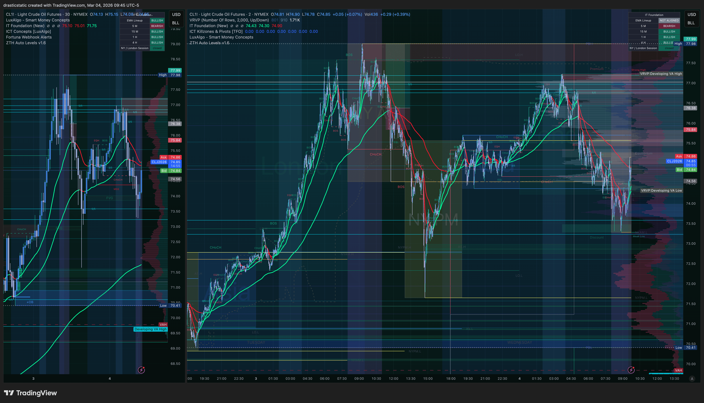

---

## 10:17–10:32 AM — All Four Indices: NQ Leading, Divergence Beginning

**10:17 ET — ES V-recovery underway**
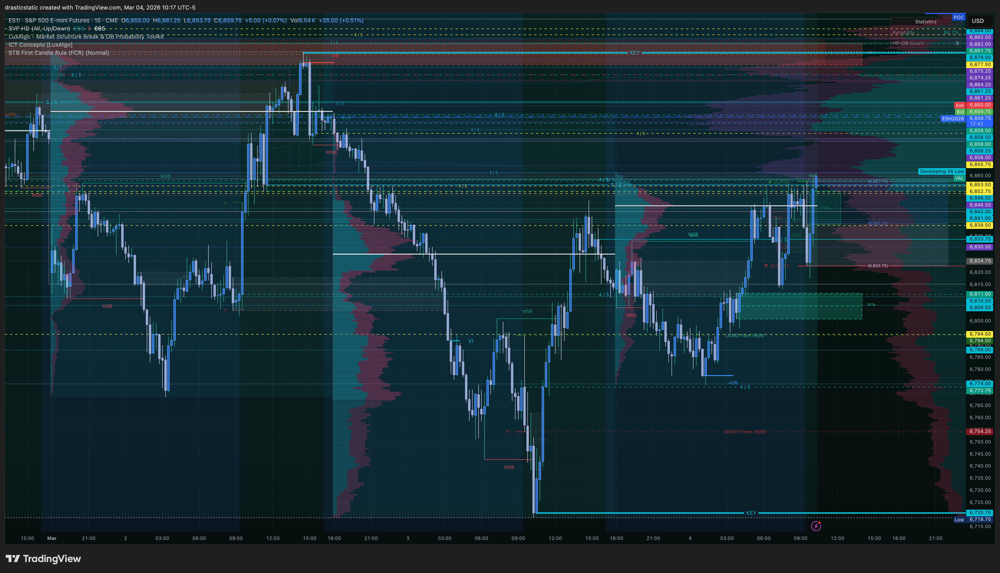

**10:19 ET — ES above FCR ray confirmed**
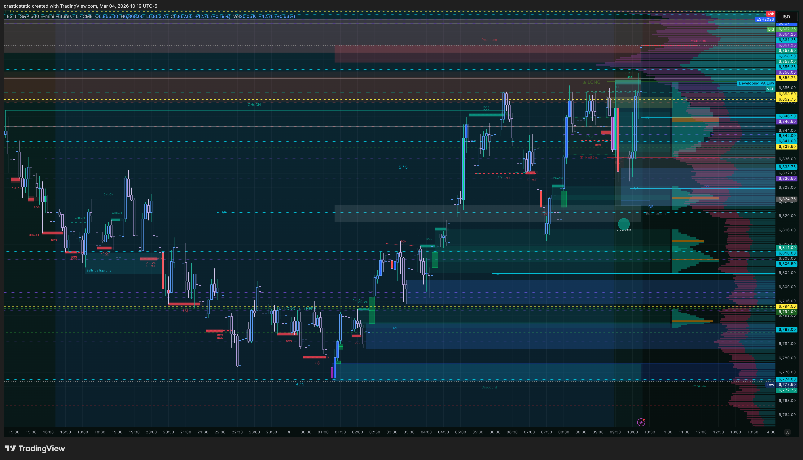

**10:31 ET — NQ strong bullish, leading**
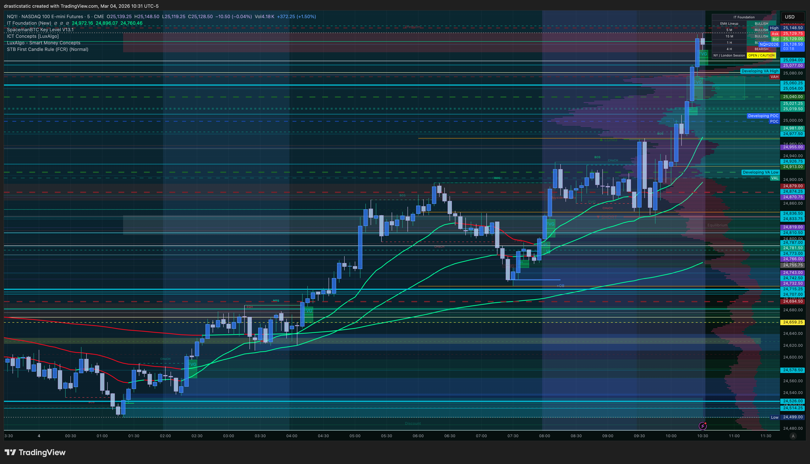

**10:30 ET — ES above FCR ray, transitioning**
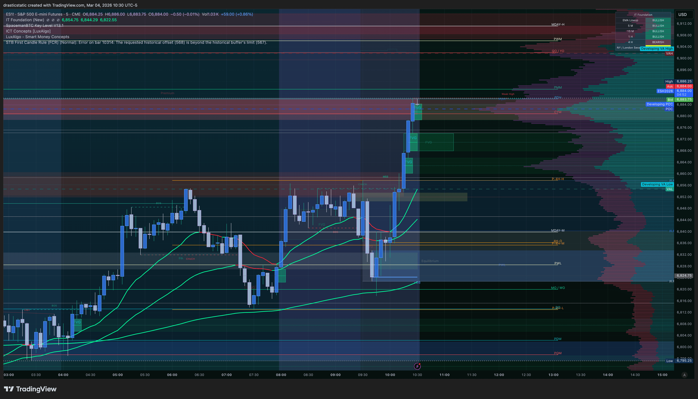

**10:31 ET — YM weakest, briefly under FCR ray**
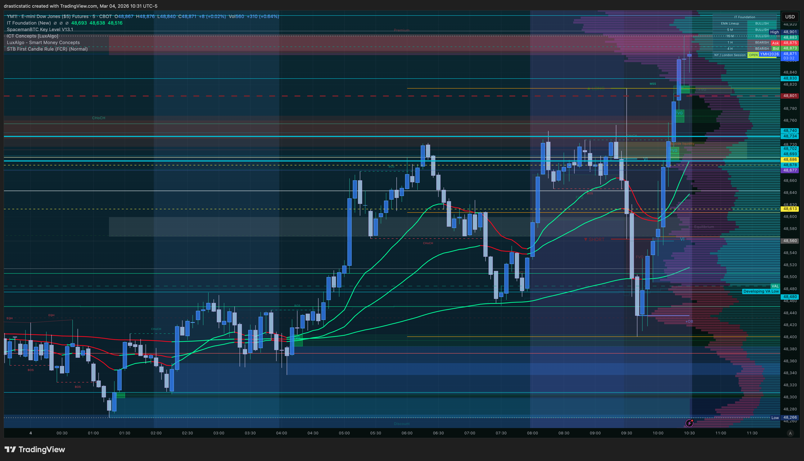

**10:32 ET — RTY volatile recovery, participating**
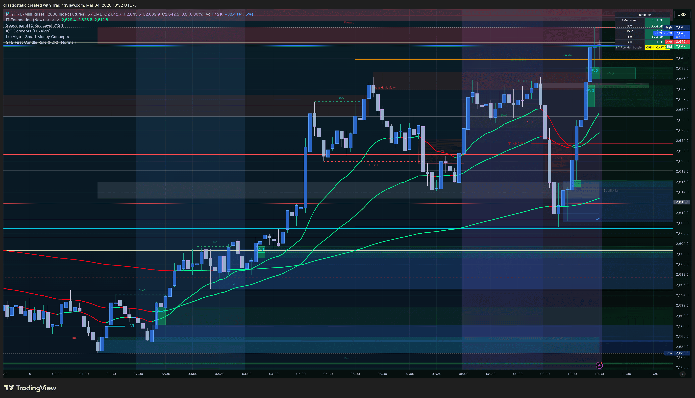

NQ was the clear leader — IT Foundation EMAs green and fanned. YM was the weakest, briefly trading back under the FCR ray before recovering. RTY participating. This NQ/YM divergence would become the short thesis later in the session.

---

## 10:56–10:58 AM — 15-Min Timeframe: FCR Ray Context

**10:56 ET — NQ 15-min far above FCR ray**
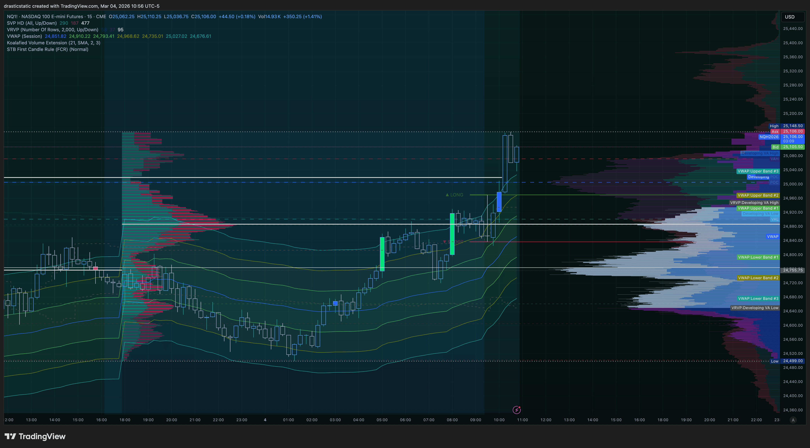

**10:57 ET — ES 15-min qualified bullish continuation candle**
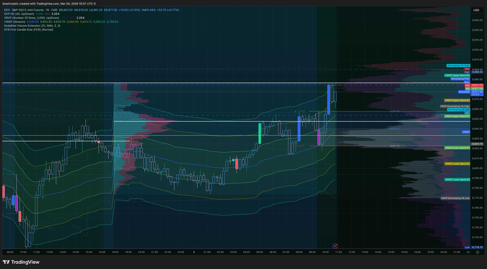

**10:58 ET — YM 15-min weakest of the three**
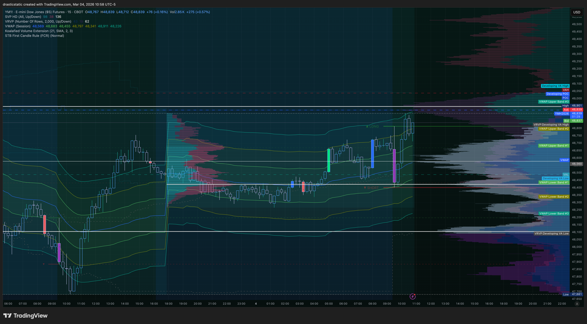

NQ still far above its FCR ray on the 15-min. ES showed a qualified bullish continuation candle after the 9:30 reversal — textbook FCR confirmation. YM the laggard. All three still above their respective "long from here" rays by this point.

---

## 11:51 AM — MNQ/MES SMT Divergence (Inevitrade TCL Context)

MNQ printed a new session high (25,158.25). MES failed to confirm — SMT divergence clearly marked on both charts via the TCL Helper. This was the first structural signal pointing toward a short directional bias. Not actionable as a primary entry on the 15-sec chart, but directionally meaningful — and it pointed to the correct thesis that developed through the afternoon.

---

## 1:12 PM — ES Manipulation Bubbles at Session Highs

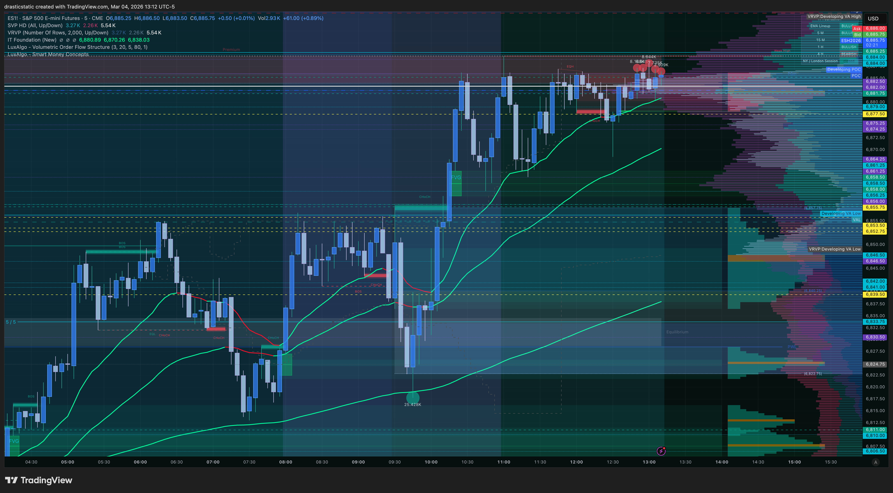

Manipulation bubbles clustering at the session highs — institutional order flow selling into retail longs. Volume profile on the right confirms clear HVN resistance at that zone. IT Foundation EMAs (green) still ascending at this point — Scenario B SHORT not yet valid (5-min EMA gate not confirmed red dominant). Short thesis built; entry conditions not yet met.

---

## 1:25 PM — ES Trade Projection: Short at 6,910.75

**Planned entry:** 6,910.75 (just above ZTH KEY level, past high-value node)
**Stop loss:** 6,922.75 (beyond next HVN) · **Risk:** ~$600

Confluence at time of setup:
- MNQ/MES SMT divergence ✅
- YM + RTY making lower highs while NQ pushed ✅
- Manipulation bubbles at highs ✅
- 1hr EMAs beginning to roll red ✅
- ZTH KEY level at entry zone ✅
- 5-min EMAs indecisive — not yet confirmed red dominant ⚠️

---

## 1:28 PM — ES 1-Hour Chart: EMAs Rolling Red

The 1hr view shows the broader context: the morning run into the highs, and the EMAs beginning to roll over. This is the longer-timeframe EMA gate — when fully red dominant, it validates Scenario B SHORT. The slow development of this crossover is precisely why the short was a plan, not yet an entry. The structural case was strong; the EMA confirmation was not yet complete.

**Price never pushed to 6,910.75.** Session range: 6,861–6,892. 4 PM wick: 6,866. No fill. Entry held all session without adjustment. Correct outcome.

---

## 7:46 PM ETH — Continuation Short Thesis

The ETH session shows the same thesis continuing to develop. IT Foundation EMAs on the right side of the chart are rolling red dominant — the gate that was incomplete during the day session. The peak formed during the day session is clearly visible; price has not pushed back to that high in ETH. The structural case (LVN above session high, manipulation bubbles, SMT divergence, EMAs rolling red) has not resolved.

**Continuation thesis:** Same short at 6,910–6,922 zone if price pushes there with red dominant 5-min EMAs — A+ Scenario B SHORT setup. Christopher monitoring during DappU class (8 PM ET). No ETH entry taken yet.

---

## Trade Setup Summary — No Fill

| Field | Value |
|-------|-------|
| Instrument | ES (MNQ entry on Apex) |
| Direction | SHORT |
| Planned Entry | 6,910.75 |
| Stop Loss | 6,922.75 |
| Risk | ~$600 |
| Session High | ~6,892 |
| 4 PM Wick | 6,866 |
| Fill | ❌ No fill |
| Pattern 5 triggered | ❌ No — entry held all session |

---

## FCR Case Study — Documented

- **Setup:** Bearish first candles 9:30 → FCR rays established
- **Signal:** Displacement ABOVE "long from here" rays → FCR LONG confirmed
- **Outcome:** Full V-recovery. Coaches took profits. ZTH rejection short at highs.
- **Key rule reinforced:** FCR = displacement signal, not first candle color
- *→ `strategies/smarttradingblueprint/analysis/fcr_case_study_tracker.md`*

---

## Session Discipline

| Check | Result |
|-------|--------|
| Pre-session plan written | ✅ Short at 6,910.75 / SL 6,922.75 |
| Entry adjusted intraday | ❌ No — held all session |
| SL respected | ✅ N/A (no fill) |
| Pattern 5 guarded | ✅ Two sessions in a row |
| Coaching calls attended | ✅ STB + ZTH + Inevitrade |
| Intentional calm session | ✅ Correct after Mar 3 |

---

## 🤖 SmartTraderAI Post-Market Copy-Paste Fields

---

### 1. What actually happened?

Wednesday March 4, 2026. No trades taken — deliberate observation session following Mar 3 account liquidation (APEX-05 blown).

Market opened with bearish first candles across NQ, ES, YM driven by Middle East geopolitical risk and tariff pressure. Price displaced above FCR "long from here" rays on all three — FCR LONG confirmed. Full V-recovery. STB coaches took profits; ZTH coach took a rejection short at highs. Christopher sat out — correct given volatile environment and emotional recovery context.

Mid-session: MNQ/MES SMT divergence observed (MNQ new high, MES failure to confirm). Afternoon: manipulation bubbles at session highs, YM + RTY making lower highs while NQ held up, 1hr EMAs beginning to roll red. Short planned at ES 6,910.75 (SL: 6,922.75, ~$600 risk). Price never reached entry — ranged 6,861–6,892, wicked to 6,866 at 4 PM. No fill. ETH session showing continued bearish development — same short thesis active.

---

### 2. What did you learn?

FCR case study confirmed: the first candle's color is irrelevant — signal comes from displacement outside the rays only. Today's bearish first candle was a news-driven fakeout that fully reversed.

SMT divergence (MNQ new high / MES failure) is a valid directional filter even when too granular for primary entry. It pointed to the correct short bias well before the afternoon setup developed.

The 5-min EMA gate is the final confirmation layer that was missing today. Patience to wait for all layers — including EMA confirmation — separates a B-grade "thesis is right" trade from an A+ entry.

Holding the structural entry level all session without adjustment: two sessions in a row (Feb 27 + Mar 4). Pattern 5 becoming a non-issue.

---

### 3. What were your results for the day?

**Trades:** 0 | **P&L:** $0 | **Fills:** 0

No fill on the planned short. Price never reached entry. No adjustment made. Correct outcome — "if it doesn't fill at the structural level, the trade said no." Short thesis continues into ETH and potentially tomorrow.

Behavioral result: Deliberate calm session achieved. Three coaching calls attended. Pattern recognition built without capital at risk. APEX-06 and TPT accounts fully preserved.

> Full daily-review: https://github.com/drasticstatic/trading-assistant-public-preview/blob/main/smarttrader-ai/exports/2026/03-Mar/STB_export_20260304_daily-review.md

---

## 🎯 Forward Focus

1. **Continue monitoring the ES short thesis at 6,910–6,922 zone.** EMAs need to confirm red dominant on the 5-min before entry. If they do, this becomes an A+ Scenario B SHORT setup.
2. **APEX-06 and TPT accounts are clean.** One A+ trade at a time — no urgency, no forcing.
3. **TCL is for confluence only** until ready for live DCA on APEX 100K. SMOG first, then TCL when the framework is solid.

---

*Produced with 🙏🏼 Fortuna — Wealth Warden | Claude Code CLI*
*Daily Review · Mar 4, 2026*
