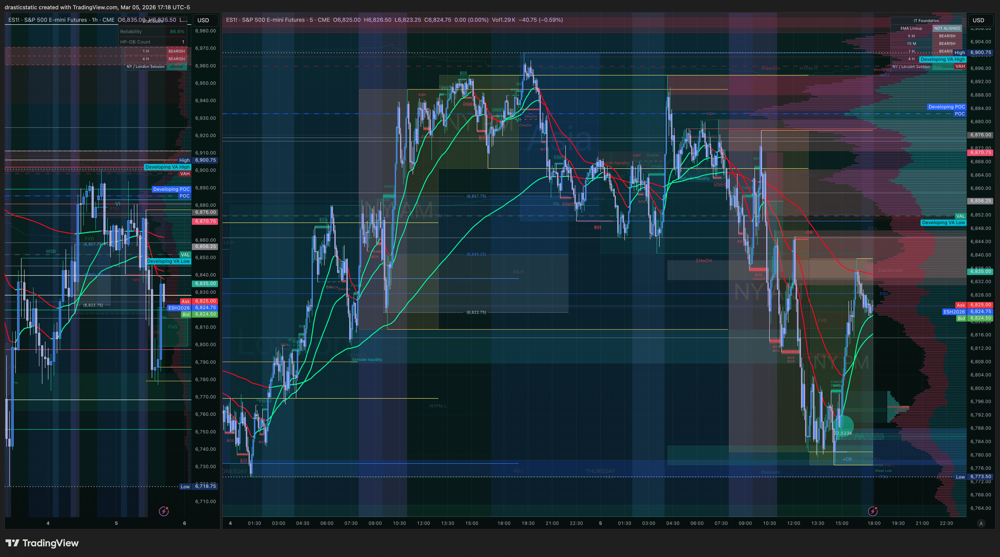

# 🗓️ Daily Review — Thursday, March 5, 2026
#### Fortuna — Wealth Warden | Claude Code CLI
#### Architecture + Education Day | No Trades

[Jump to 🤖 SmartTraderAI Copy-Paste ↓](#smarttraderai-copy-paste)

---

## 📋 Session Summary

| Field | Value |
|-------|-------|
| Date | Thursday, March 5, 2026 |
| Session type | Infrastructure + Education — no trades |
| Instruments traded | None |
| Day P&L | $0.00 |
| Active accounts | APEX-484839-06 (100K) · TakeProfitTrader 50K |
| APEX-06 eval gap | ~$6,000 · Deadline: March 24 |
| TPT eval gap | ~$3,000 · Deadline: End of March |

---

## 📖 Session Narrative

> Pre-market plan: https://github.com/drasticstatic/trading-assistant-public-preview/blob/main/smarttrader-ai/analysis/premarket/2026/03-Mar/premarket_20260305-summary.md

March 5 was a deliberate step back from the markets — the right call following three consecutive high-pressure sessions (Mar 2 net +$460, Mar 3 blown account, Mar 4 observation). The session was designated architecture and education before it began.

**Infrastructure recovered:** A power outage had disrupted the development environment. ngrok was repaired, Augment Intent (auggie) was reinstalled on Node v22 LTS as the system-wide standard across all agents (Fortuna, Auggie, Kavanah). The tunnel is confirmed live.

**Repo document sweep completed:** Every Feb–Mar daily review, trade review, premarket summary, and weekly review now has:
- Correct GitHub links (no more wrong repo names or backtick-format paths)
- `🎯 Forward Focus` section (standardized heading, consistent across all daily reviews)
- `[Jump to 📝 Notes for Coaches](#notes-for-coaches)` jump link at the top of every individual trade review
- `` anchor before every Notes for Coaches section
- `🤖 SmartTraderAI` copy-paste sections only in daily and premarket summaries (removed from individual reviews)
- `📖 Session Narrative` in all individual reviews
- Pattern tracker blockquote links with correct relative paths

**Custom 404.html** created in repo root for GitHub Pages — users who hit stale or restructured URLs are redirected to a navigation page instead of GitHub's default 404.

**FORTUNA_WORKFLOW.md updated:** Individual review sections now have a defined order (9 sections), jump link standard documented, Forward Focus added as required section for daily reviews.

---

## 📸 Key Charts

**ES ETH — end-of-day context (17:18 ET)**

*ES ETH 17:18 ET — bearish continuation of the descending channel structure. ES short thesis from Mar 4 still active heading into Mar 6.*

---

## 🧠 Behavioral Notes

| Metric | Grade | Notes |
|--------|-------|-------|
| Decision to sit out | ✅ A | Correct response to three consecutive high-pressure days |
| Infrastructure repair | ✅ A | ngrok + auggie restored; environment stable |
| Document quality | ✅ A | Full repo sweep — all documents now navigable and consistent |
| Market FOMO | ✅ None | No checking charts, no paper trades — full offline session |
| Pattern 5 | ✅ Not triggered | No entries to place, therefore no levels to abandon |

---

## 🔑 Key Takeaways

1. **Architecture is trading.** A clean, navigable repo means coaches can review sessions efficiently, SmartTraderAI gets accurate context, and Fortuna can build the next session faster. Today's work directly supports tomorrow's execution.
2. **Env standardization matters.** Node v22 LTS as the system default eliminates the version-mismatch failures that disrupted this session. All three agents (Fortuna, Auggie, Kavanah) now run on the same foundation.
3. **Recovery days prevent pattern escalation.** After Mar 3 (blown account, Pattern 7 — SL cancellation), a forced rest and infrastructure session breaks the urgency cycle before it compounds.

---

## 🤖 SmartTraderAI Post-Market Copy-Paste Fields

---

**What actually happened?**

No trades taken — deliberate architecture and education day. Power outage recovery: ngrok tunnel repaired, auggie CLI reinstalled on Node v22 LTS. Full repo document sweep across all Feb–Mar daily reviews, trade reviews, and premarket summaries: GitHub links fixed, Forward Focus sections standardized, Notes for Coaches jump links added to all 12 individual trade reviews, SmartTraderAI placement corrected. Custom 404.html created. FORTUNA_WORKFLOW.md updated with new section order and jump link standard.

---

**What did you learn?**

Architecture days are part of the trading process. A navigable, consistent repo means faster session prep, accurate AI context, and cleaner coach communication. Node v22 LTS standardized across all agents eliminates environment friction. The infrastructure is now ready to scale.

---

**What were your results for the day?**

Trades: 0 | P&L: $0.00 | Fills: 0

APEX-06 and TPT accounts intact and preserved. Environment stable. Repo fully standardized. Ready for the next live session with a clean slate.

> Full daily-review: https://github.com/drasticstatic/trading-assistant-public-preview/blob/main/smarttrader-ai/exports/2026/03-Mar/STB_export_20260305_daily-review.md

---

## 🎯 Forward Focus

1. **Return to full five-layer process on the next live session.** FCR at 9:45, scenario confirmed, all layers checked before entry. No urgency from APEX-05 blowup — that account is closed.
2. **APEX-06 priority.** ~$6,000 gap, deadline March 24. Three weeks of runway. One A+ trade per session closes that gap without pressure.
3. **Check ES short thesis at open.** 6,910–6,922 zone remains the planned short from Mar 4. Confirm 5-min EMA gate at the next session before considering entry.

---

*🙏🏼 Fortuna — Wealth Warden | Claude Code CLI*
*Anthropic claude-sonnet-4-6 | March 5, 2026*
