# 📋 Daily Review — March 6, 2026
### STB SmartTraderAI Export | Fortuna | For Coaches
*Session summary + SmartTraderAI copy-paste fields*

[Jump to 🤖 SmartTraderAI Copy-Paste ↓](#smarttraderai-copy-paste)

---

## 📋 Session Summary

| Field | Value |
|-------|-------|
| **Date** | Friday, March 6, 2026 |
| **Session type** | Monitoring + analysis only — afternoon desk arrival |
| **Account** | APEX-484839-06 (100K active) · TPT 50K (active) |
| **Net P&L** | $0.00 (neutral) |
| **Trades taken** | 0 |
| **Instruments monitored** | ES (primary) · CL · NQ · RTY · YM (SMT) |
| **Setup identified** | ES short — ZTH 5/5 + 3/5 confluence + FVG layering + red dominant EMAs (10-min) |
| **Fill** | ❌ No fill — market sold lower without sufficient retracement to entry zone |
| **Directional read** | ✅ Correct — ES closed bearish, confirmed lower into ETH |
| **Behavioral grade** | ✅ Correct stand-down — no forced Friday trade |

---

## 📖 Session Narrative

> Pre-market plan: *No formal pre-market for March 6 — STB live coaching session served as morning brief. Desk arrival ~13:45 ET. See [premarket_20260306_summary.md](https://github.com/drasticstatic/trading-assistant-public-preview/blob/main/smarttrader-ai/analysis/premarket/2026/03-Mar/premarket_20260306_summary.md) for carry-forward analysis.*

Friday March 6 was not a normal desk day — and that is part of the record.

The morning was occupied by an STB live coaching session and a vet appointment (dog bloodwork). Desk arrival came at approximately 13:45 ET. The session window was compressed: roughly two and a half hours to RTH close, external pressure at its peak, and a week's worth of difficult circumstances in the rearview mirror. The analysis was still built methodically. That is the note worth making.

The session opened with a review of ES and CL. CL had already made new highs during the morning session and was selling off hard — a bearish projection setup was noted at the prior high breakdown zone, consistent with the "oil creating new highs with air underneath" thesis Christopher had identified before arriving at the desk. ES showed a clear descending channel intact on the daily/weekly view, HTF bearish structure confirmed for the fourth consecutive session this week.

The afternoon work focused on building an ES short case. A ZTH 5/5 + 3/5 confluence zone was identified at a structural resistance level — two independent ZTH signals agreeing at the same location. FVG layering was added: a smaller FVG nested within larger FVGs at the same zone, providing a tighter entry window with additional confluence. The initial EMA read came from the 1-min chart (not valid for this type of trade) — caught and corrected during the session. The 10-min chart confirmed RED DOMINANT IT Foundation EMAs. A conservative short entry was planned with SL above the 8:30 AM local candle wick and outside the high value node on the volume profile. B+ setup quality.

The problem: the market had already sold off significantly during the morning session that Christopher wasn't at the desk for. The afternoon bounce was not sufficient to reach the limit order. By 3:25 PM, the SMT picture across all four indices came back mixed — NQ and RTY confirming bearish, but YM carrying upward momentum that hadn't resolved toward resistance. Scenario C with 35 minutes to close.

Stand-down called at 3:25 PM. The right decision: insufficient time, unresolved YM divergence, Friday afternoon short-covering risk. After RTH close, ES continued lower into ETH, confirming the directional thesis. The entry never triggered — but the direction was right for the third consecutive monitoring session.

**The broader context for coaches:** This was not a normal week. Christopher worked through car trouble that made attendance at his machinist job unsafe (he was written up as a result), attended every coaching call, built two full days of documentation infrastructure with the agent team, made it to the vet, and arrived at the desk in the afternoon with the discipline to analyze properly and stand down correctly when conditions weren't there. The financial picture is the most difficult it has been — obligations to courts, domestic relations, the IRS, coaching payments owed — and he is managing all of it while sleeping on his mom's couch during a divorce that he did not initiate. He has named these pressures clearly, not as excuses, but as context. The $0 sessions with correct process under these conditions are building something real.

---

## 📊 Trade Log

| # | Instrument | Direction | Entry | Exit | P&L | Grade |
|---|-----------|-----------|-------|------|-----|-------|
| — | ES | SHORT (planned) | Limit — not reached | — | $0.00 | N/A |

No trades executed. Monitoring session only.

---

## 📸 Key Charts

### CL — 13:55 ET | New Highs + Sell-Off in Progress

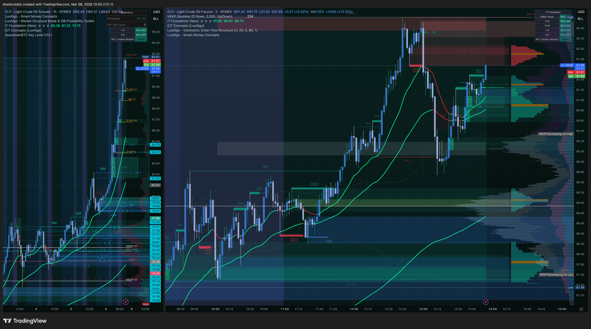
*CL1! at 13:55 ET. Spike to new highs visible followed by sharp intraday sell-off. Projection: short at resistance retest of breakdown zone. "Air underneath" structure noted before desk arrival — confirmed on chart.*

---

### ES — 13:59 ET | HTF Bearish Channel Confirmed

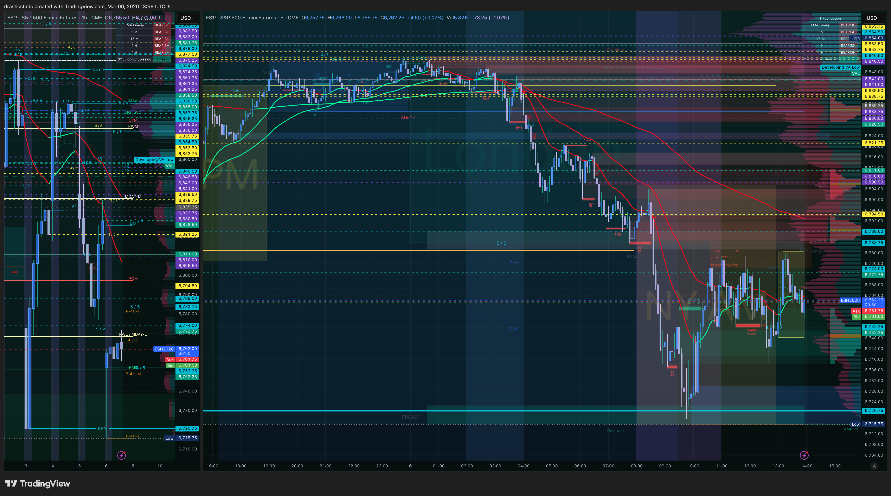
*ES1! daily view at 13:59 ET. Clear descending channel with multiple lower highs across the week. Bearish structure intact. Green support zone at lows. Bears controlling the weekly close.*

---

### ES 5-Min — 14:16 ET | ZTH Setup Identified

*ES 5-min at 14:16 ET. ZTH 5/5 + 3/5 confluence at resistance zone. Conservative short entry marked. SL above 8:30 AM local wick + outside HVN on volume profile. Note: EMAs visible here are from the 1-min — corrected on next chart.*

---

### ES 10-Min — 14:23 ET | EMA Gate Confirmed, FVG Refined

*ES 10-min at 14:23 ET. IT Foundation EMAs confirmed RED DOMINANT on correct timeframe. Smaller FVG identified nested within larger FVGs at the ZTH confluence — entry and SL adjusted slightly upward. Setup grade: B+.*

---

### CL Projection — 14:30 ET

*CL1! at 14:30 ET. Short projection idea: fail at resistance retest of prior highs breakdown zone confirms second leg down. CL bouncing from lows back into that zone. IT Foundation EMAs still green on this timeframe — complex structure.*

---

### Four-Index SMT Review — 15:25 ET

**15:25 ET — YM bounced harder than peers, testing descending channel resistance**
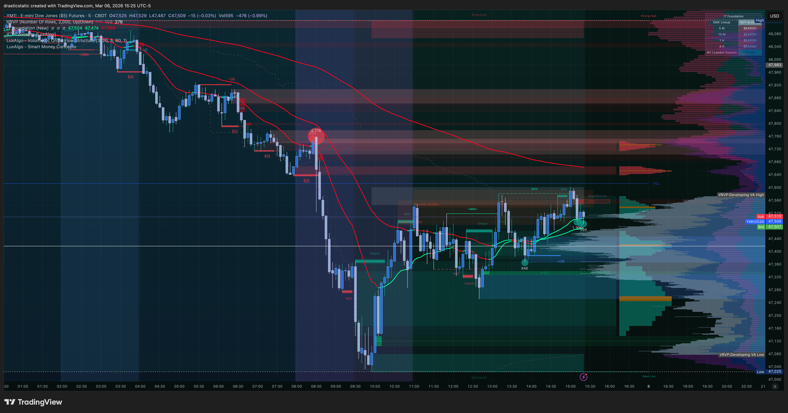

**15:25 ET — NQ clear bearish descending channel, bounce stalling at resistance**
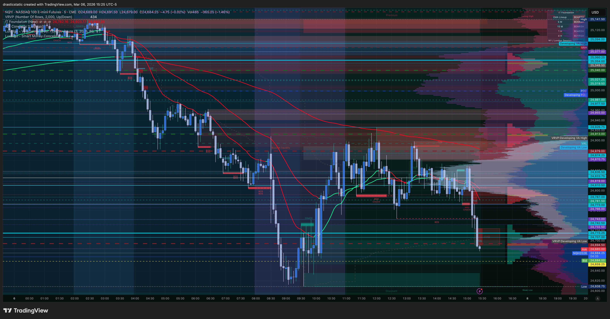

**15:25 ET — RTY bearish channel, red dominant EMAs, short thesis confirmed**
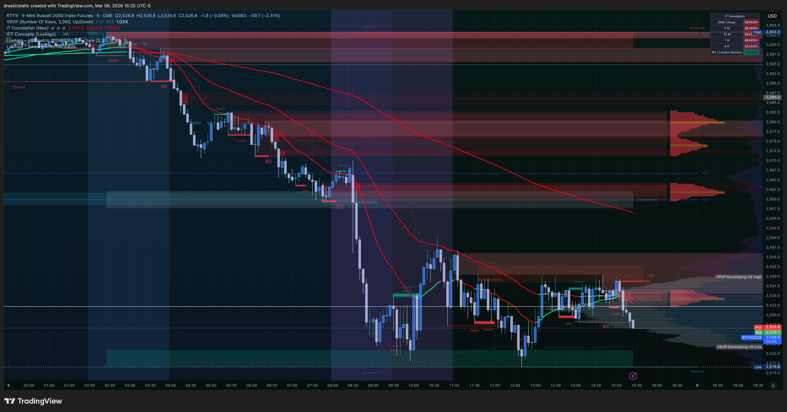

**15:26 ET — ES at FVG/ZTH resistance zone, entry zone reached**
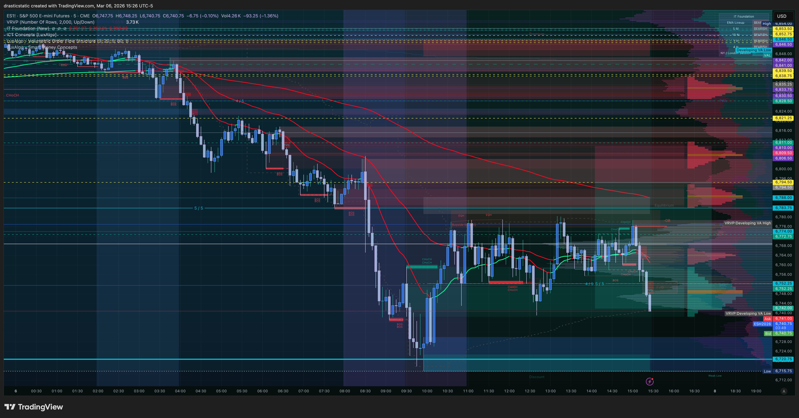

*15:25 ET — NQ ✅ bearish · RTY ✅ bearish · ES ⚠️ at decision · YM ❌ diverging up. Scenario C. Stand-down confirmed.*

---

### CL — 15:26 ET

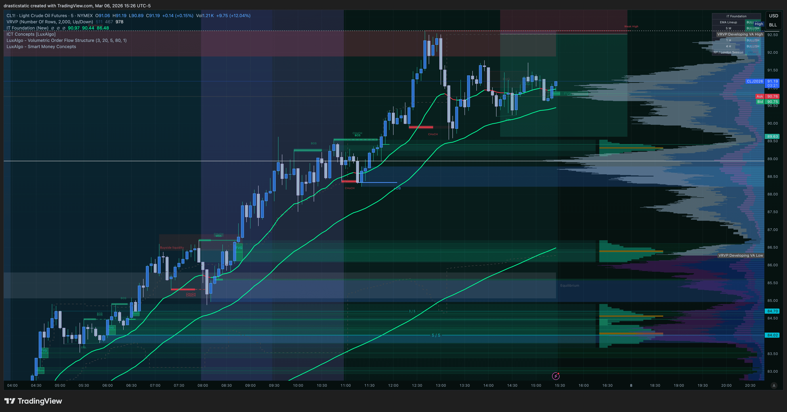
*CL1! at 15:26 ET. Uptrend EMAs still intact (green). Projection short at resistance retest — clean fail signal did not materialize during the session window.*

---

### End of Week — ETH Close (ES + CL)

**19:54 ET — CL ETH bounced and complex, short thesis at resistance retest still active**
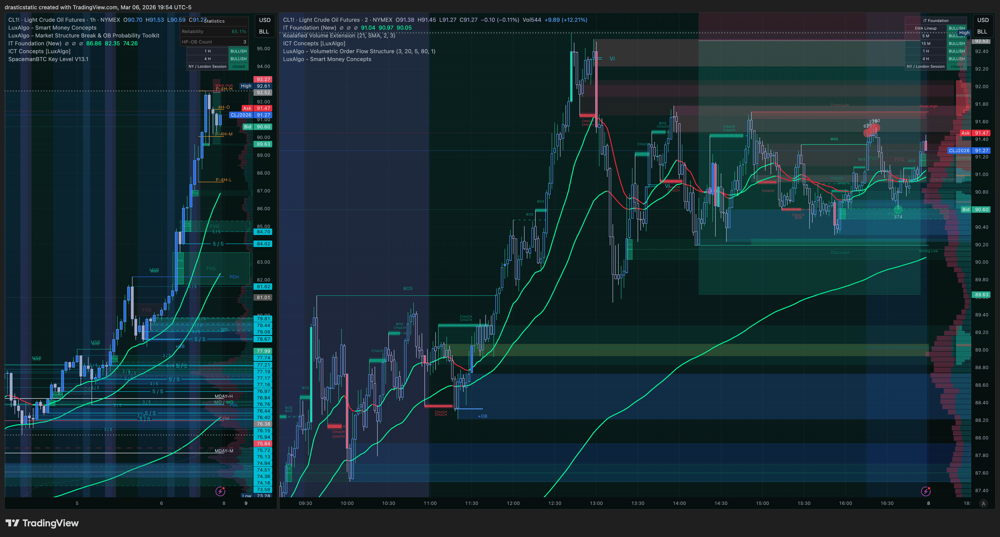

**20:06 ET — ES full week view, bearish descending channel dominant**
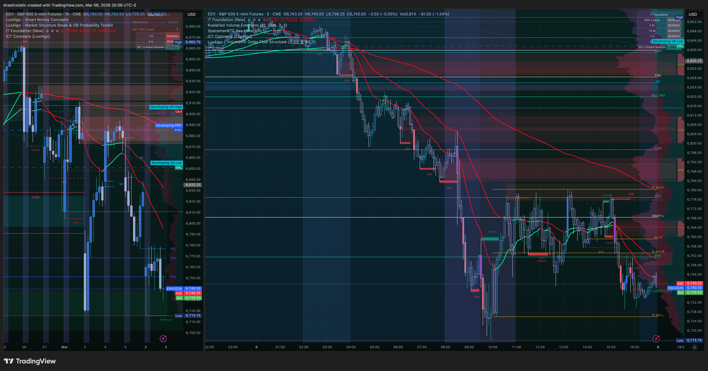

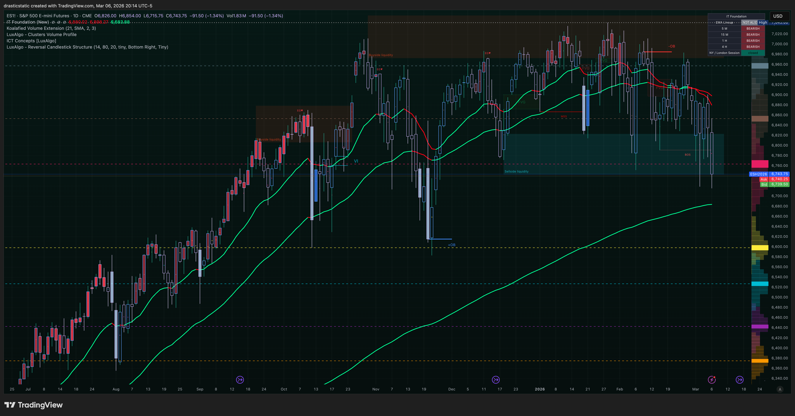
*ES 20:14 ET — FVG structure and week close. ES sold lower from the identified resistance zone into the close and through ETH. Directional thesis confirmed — entry never triggered.*

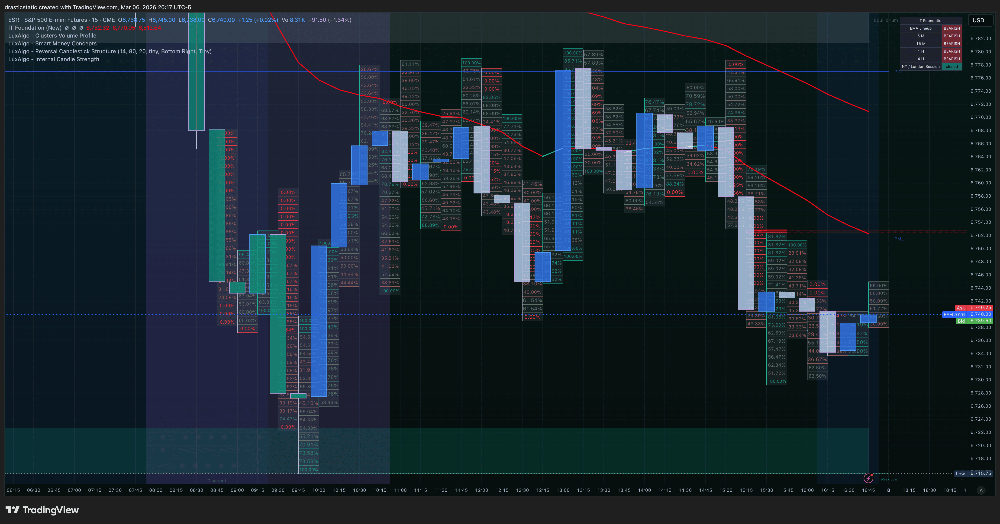
*ES 20:17 ET — ETH continuation lower. Red descending trendline intact. Bears closing the week in control. Bearish bias carries into next week.*

---

## 🧠 Behavioral Notes

| Category | Assessment |
|----------|------------|
| Directional read | ✅ Correct — ES bearish, confirmed lower through ETH close |
| Setup identification | ✅ ZTH confluence + FVG layering + 10-min EMA gate — all correctly identified |
| EMA gate correction | ✅ Caught 1-min vs 10-min error mid-session and corrected |
| SMT read | ✅ YM divergence correctly identified as Scenario C disqualifier |
| Stand-down decision | ✅ Correct — 3:25 PM, YM unresolved, 35 minutes to close, Friday compression |
| Entry fill | ❌ No fill — market did not retrace to entry zone during available window |
| Pattern 5 | ✅ Entry level set and not chased downward to force a fill |
| External pressure | Maximum — car, work write-up, financial obligations, personal circumstances |
| Emotional state | Under significant stress — disciplined at the desk regardless |

**What held:** Every layer of the decision-making process worked correctly today. The setup was built methodically — initial 5-min pass, 10-min EMA timeframe correction, FVG refinement, four-index SMT review, time-of-day check. Each step applied in sequence. The stand-down was driven by analysis, not by fear.

**The external context:** This week Christopher navigated: a car that is unreliable and unsafe (broken defroster, overheating engine, transmission problems, misfiring, broken door handles) which made work attendance genuinely dangerous in cold wet weather; a formal write-up from his employer; a vet visit; mounting financial obligations to courts, domestic relations, and the IRS — the institutions he names as the ones that can result in imprisonment; coaching payments owed while coaches continue to support without hesitation; and all of this while sleeping on his mother's couch during a divorce he did not choose. He still showed up to every coaching call this week. He completed two full days of infrastructure work with the agent team. He documented every session. He sat out when conditions were wrong. He did not abandon the process when the pressure was highest. That is the data point.

**What the coaches should know:** The psychological load here is not just about trading. It is about maintaining process clarity under conditions most traders never encounter. The STB trading psychologist's observation — that trading and full-time labor simultaneously is genuinely taxing, especially physically demanding CNC work — is accurate and understated given everything else in the picture. The $0 sessions with correct discipline are not failures. They are the foundation being laid. The people in Christopher's life who call this path foolish are not seeing what the coaches are seeing: a person building a system while the weight of an entire life crisis is on his shoulders.

---

## 🔑 Key Lessons

1. **EMA timeframe specificity matters.** 1-min EMAs are noise for this type of trade. 10-min is the signal. Catching and correcting this mid-session is the right behavior — but it should be the first check, not a correction.

2. **SMT divergence is a quality filter, not just a signal.** YM's upward momentum today wasn't inconvenient — it was the market communicating that the short thesis wasn't fully aligned. When one index diverges significantly, that is information. Friday afternoon into the close is the wrong time to override it.

3. **Friday afternoon has its own risk profile.** A B+ setup at 3:25 PM on Friday is a different trade than a B+ setup at 10:00 AM Monday. Time compression changes the equation. This is now confirmed twice (Mar 4, Mar 6) — stand-down is the right call when the window is gone.

4. **Three consecutive correct directional reads, no fill.** Feb 27, Mar 4, Mar 6 — correct analysis, no entry triggered. The analytical edge is confirmed. Entry execution conditions are the remaining variable. The standard remains: right conditions or no trade.

5. **The hardest days produce the clearest data.** Today's session was built under maximum external pressure with a compressed time window. The analysis was still methodical and correct. This is the proof that process is becoming habit — it runs even when everything else is falling apart. That is the work.

---

## 🤖 SmartTraderAI Post-Market Copy-Paste Fields

---

**What actually happened?**

Friday March 6 was an afternoon-only monitoring session — morning occupied by STB live coaching session and a vet appointment for Christopher's dog (bloodwork). No formal pre-market built. Desk arrival ~13:45 ET. Analysis focused on ES and CL. ES setup identified and built in stages: ZTH 5/5 + 3/5 confluence at structural resistance, FVG layering (smaller FVG nested within larger FVGs for refined entry), IT Foundation EMAs confirmed RED DOMINANT on the 10-min chart (initial 1-min read caught and corrected mid-session). Conservative short entry planned with SL above local 8:30 AM wick outside the high value node. CL showed a bearish projection setup at the resistance retest of the morning's spike high.

Market sold lower through the session but without enough retracement to reach the ES short entry zone. By 3:25 PM, four-index SMT review returned: NQ and RTY confirming bearish, YM still diverging with upward momentum, ES at the decision zone but time compressed to 35 minutes. Scenario C read. Stand-down called. After RTH close, ES continued lower into ETH confirming the directional thesis for the third consecutive monitoring session. No trades taken.

---

**What did you learn?**

EMA gate requires the correct timeframe — 1-min is noise, 10-min is the signal. Caught and corrected mid-session. SMT divergence (YM) correctly identified as a quality disqualifier with 35 minutes to close on a Friday. Stand-down driven by analysis, not fear — the setup was real but the conditions for executing it were not there. Three consecutive monitoring sessions (Feb 27, Mar 4, Mar 6) with correct directional reads and no fill confirms the analytical edge is working. Entry execution conditions remain the variable.

The deeper lesson: today's session was built under the highest external pressure of this entire recovery arc — car unreliable and unsafe, work write-up received, financial obligations mounting, personal circumstances ongoing. The analysis was still methodical. The process ran. That is the data point worth carrying forward: the system works even when everything else is difficult. That is what we are building.

---

**What were your results for the day?**

- 0 trades filled — monitoring session only
- Net P&L: $0.00 | Zella Score: N/A
- Directional read: ✅ Correct — ES bearish confirmed through ETH close
- Behavioral grade: ✅ Correct stand-down, no forced Friday trade
- Setup quality: B+ identified, conditions for entry not met (YM SMT + Friday compression)
- Week close: bearish structure intact on ES, NQ, RTY — setup carries to Monday

> Full daily-review: https://github.com/drasticstatic/trading-assistant-public-preview/blob/main/smarttrader-ai/exports/2026/03-Mar/STB_export_20260306_daily-review.md

---

## 🎯 Forward Focus

1. **Monday: pre-market before the open.** Not in the afternoon. The ES bearish structure and ZTH/FVG setup carry forward — but levels need fresh verification at the open before any entry. Do not trade on stale carry-forward levels.

2. **APEX-06 is the priority.** Mar 24 deadline, ~+$6,000 gap. One clean A+ trade per session builds it. No size-up, no forcing, no eval pressure as a trading input.

3. **Weekend plan:** Pine Script work with Auggie, STB course study, master mind coaching calls. Come in Monday rested, studied, and with the levels pre-planned. The week ahead has to start stronger than this one — and it can.

---

*🙏🏼 Fortuna — Wealth Warden | Claude Code CLI*
*Anthropic claude-sonnet-4-6 | March 6, 2026*
*For coaches: pattern_tracker.md has full behavioral arc + statistical summary*
