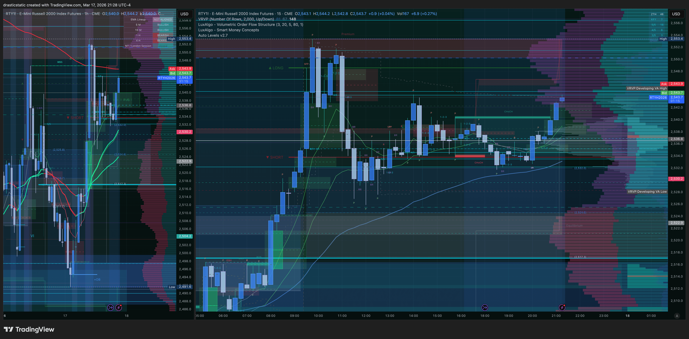

# Daily Review — March 17–18, 2026
#### Fortuna — Wealth Warden | Claude Code CLI
#### Session type: PM + Overnight Asia/London | One trade carried overnight

[Jump to 🤖 SmartTraderAI Copy-Paste ↓](#smarttraderai-copy-paste)

---

## 📋 Session Summary

| Field | Value |
|-------|-------|
| **Date** | March 17–18, 2026 |
| **Session type** | PM entry + overnight carry · Asia + London |
| **Account** | APEX-484839-06 (100K) |
| **APEX-06 gap** | ~$4,478 remaining · Deadline: March 24 (6 days) |
| **Day P&L** | **+$963.00** |
| **Trades taken** | 1 |
| **Instrument** | MNQM6 (Micro E-mini NASDAQ-100) |

---

## 📖 Session Narrative

No pre-market summary written today. Session began in the PM hours with an all-day structural read.

NQ/MNQ had already broken below its March 12 7:40 session high (5/5 level), while YM and RTY were still traveling to test their equivalent peaks — classic SMT divergence confirming short bias. RTY was sitting exactly at the March 12 7:40 peak — resistance confluence. The structural read was clean and correct all day.

Multiple bracket attempts were built and cancelled through the afternoon. After a web3 class ran until approximately 21:00, Christopher returned to his screen to find the TradingView projection had silently dropped its limit orders. Rather than treating that as a signal to pause, the bracket was rebuilt quickly and a short entry placed at 25,095.50.

Price moved favorably to MFE 24,869.25 before compressing through the Asia session — ultimately trading through the original SL at 25,144.75 to a MAE of 25,210.75. The stop was moved wide to 25,416 to avoid being taken out by Asia noise. Christopher stayed up through the STB London session, worked on the Auto Levels indicator, read ACIM Lesson 77 — *"I am entitled to miracles"* — on day 77 of the year, and eventually lay down accepting whatever outcome awaited.

TP filled at 24,935.00 at 08:42:56 ET March 18. The alarm was the fill notification.

---

## 📊 Trade Log

| # | Time ET | Instrument | Dir | Entry | Exit | P&L | Notes |
|---|---------|-----------|-----|-------|------|-----|-------|
| 1 | 21:03 Mar 17 | MNQM6 | ↓ Short | 25,095.50 | 24,935.00 | **+$963.00** | ZTH Pivot · SMT divergence · carried overnight |

---

## 📸 Key Charts

**~20:56 ET — Pre-entry context**

**~21:10 ET — Entry live: RTY + MNQ**

**~21:29 ET — RTY at March 12 confluence**

**~21:36 ET — TP placed**

**March 18 — Full arc: entry → Asia compression → London reversal → TP**

---

## 🧠 Behavioral Notes

**The structural read was right. The execution was not.** The divergence between NQ leading weakness while YM/RTY lagged at resistance was as clean a setup as this framework produces. The entry thesis was sound. What degraded the execution was the re-entry sequence: returning after a web3 class to find a bracket had dropped orders, then rebuilding under time pressure rather than pausing.

**The rushed entry is a known pattern.** Web3 class running late → scramble to rebuild bracket → price already moving → FOMO entry → stop not yet placed. This is Pattern 8 territory. Exit efficiency of 58.1% versus an MFE of $1,357.50 reflects the cost of a reactive entry rather than a clean one.

**Stop movement: calculated, not disciplined.** Moving the SL from 25,144.75 to 25,416 during Asia session was a bet — the thesis was intact, Asia noise was compressing rather than reversing. It worked because the structural read was correct. This should not become habitual. The gap between "it worked" and "it was right" is worth holding clearly.

**Surrender enabled the outcome.** The combination of journaling, ACIM Lesson 77, and genuine acceptance of outcome — including loss if it came — allowed Christopher to rest. The TP filled while he slept. That inner release is not separate from the edge. It is part of it.

---

## 🔑 Key Lessons

1. **Setup infrastructure failure = pause signal.** When brackets drop and orders disappear at the moment you go to enter, that is the market offering distance. A 5-minute reset would have changed nothing except execution quality. Honor the pause.

2. **Stop movement is a thesis question.** The only valid reason to widen a stop mid-trade is a clearly documented structural argument that existed before entry — not a comfort decision made in real time. Write the thesis first; if it doesn't change, the stop doesn't move.

3. **Surrender and acceptance are part of the edge.** Releasing attachment to outcome after doing the structural work and managing the risk honestly — that is not weakness. It is the practice that lets the trade complete itself.

---

## 🤖 SmartTraderAI Post-Market Copy-Paste Fields

---

**What actually happened?**

MNQ short trade carried overnight from a March 17 evening entry. The thesis was a ZTH Pivot short at resistance — NQ/MNQ had already broken below the March 12 7:40 session high (5/5) while YM and RTY were still traveling to their equivalent peaks, confirming SMT divergence. Entry was at 25,095.50 after a rushed bracket rebuild following a web3 class. Price compressed against in Asia session through the original SL zone. Stop was moved wide to survive overnight noise. TP at 24,935 (ZTH level) filled at 08:42 ET March 18. Net: +$963.00. The trade was structurally correct and behaviorally imperfect — a genuine win on both a P&L level and a growth level.

---

**What did you learn?**

When the setup infrastructure fails at the moment you go to enter — limit orders dropping, having to rebuild a bracket under time pressure — that is a pause signal, not a fix-and-proceed signal. The setup had been watched all day. A 5-minute delay to reset calmly would have changed nothing except the quality of the execution. The failure of the projection to hold its orders was the market giving distance. Next time: honor that distance.

Stop movement is a real decision with real consequences in both directions. It worked here because the structural thesis was correct and Asia noise resolved. It should not become a habit — only used when the thesis is still clearly intact and the adverse move is consistent with known noise patterns, not with actual thesis failure.

Surrender and rest are not the same as giving up. After moving the stop, journaling, reading the lesson, and lying down — the trade ran to its target. The acceptance of outcome, including the loss if it came, freed the trade to complete itself.

---

**What were your results for the day?**

| Metric | Value |
|--------|-------|
| Trades | 1 |
| Win Rate | 100% |
| Net P&L | +$963.00 |
| Points | 160.5 pts |
| Contracts | 3 MNQ |
| MAE | 25,210.75 (−$691.50) |
| MFE | 24,869.25 (+$1,357.50) |
| Exit Efficiency | 58.1% |
| Rating | 2.5 / 5 |
| APEX-06 Gap | ~$4,478 remaining · Deadline March 24 |

> Full daily-review: https://github.com/drasticstatic/trading-assistant-public-preview/blob/main/smarttrader-ai/exports/2026/03-Mar/STB_export_20260317_daily-review.md

> Full individual trade reviews:
> - [review_20260317_MNQ_001.md](https://github.com/drasticstatic/trading-assistant-public-preview/blob/main/smarttrader-ai/reviews/2026/03-Mar/review_20260317_MNQ_001.md) — MNQ Short, 3 contracts, +$963.00

---

## 🎯 Forward Focus

1. **Order framework failure = hard pause.** Next time a bracket drops or orders disappear at entry, that is a no-entry signal until fully reset without urgency.
2. **APEX-06 gap ~$4,478, deadline March 24.** Structurally correct entries with clean execution quality — not reactive ones — close this gap efficiently.
3. **Overnight carries are valid when the thesis is intact.** The Asia compression was noise; London resolved it. Trust the read, define the risk honestly, and let it complete.

---

*Fortuna — Wealth Warden | Claude Code CLI*
*Anthropic claude-sonnet-4-6 | March 18, 2026*
