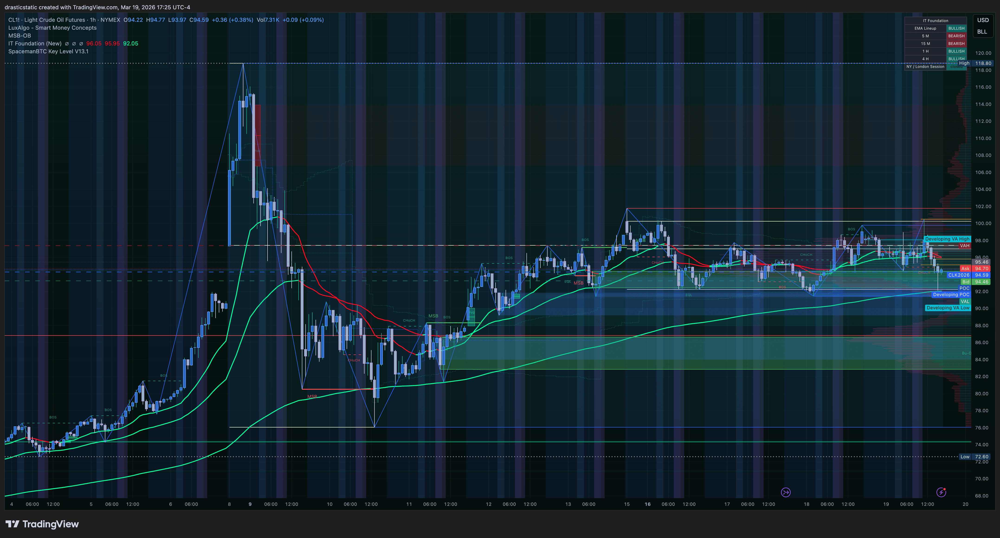
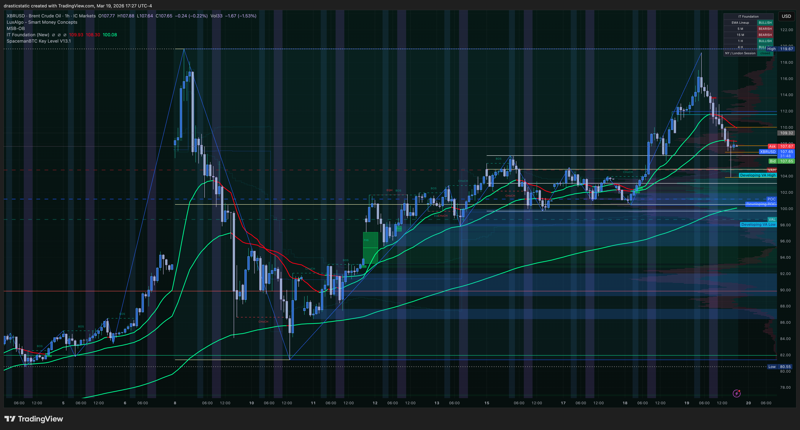
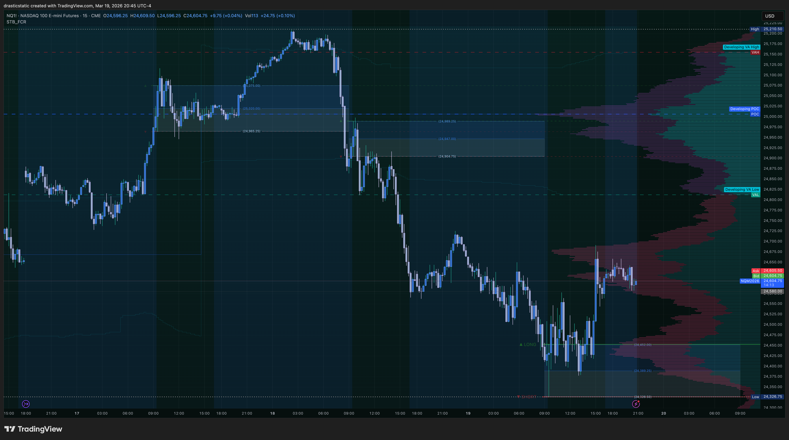
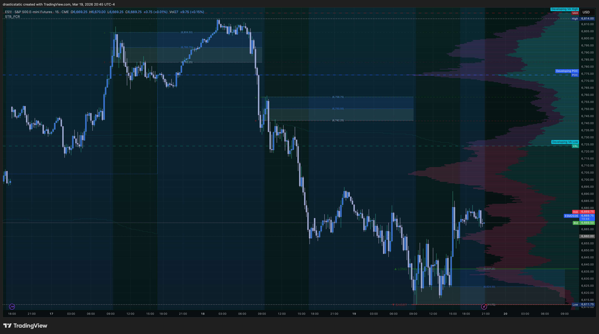
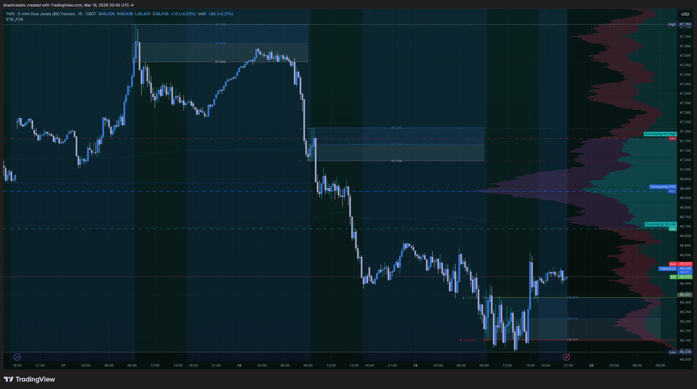
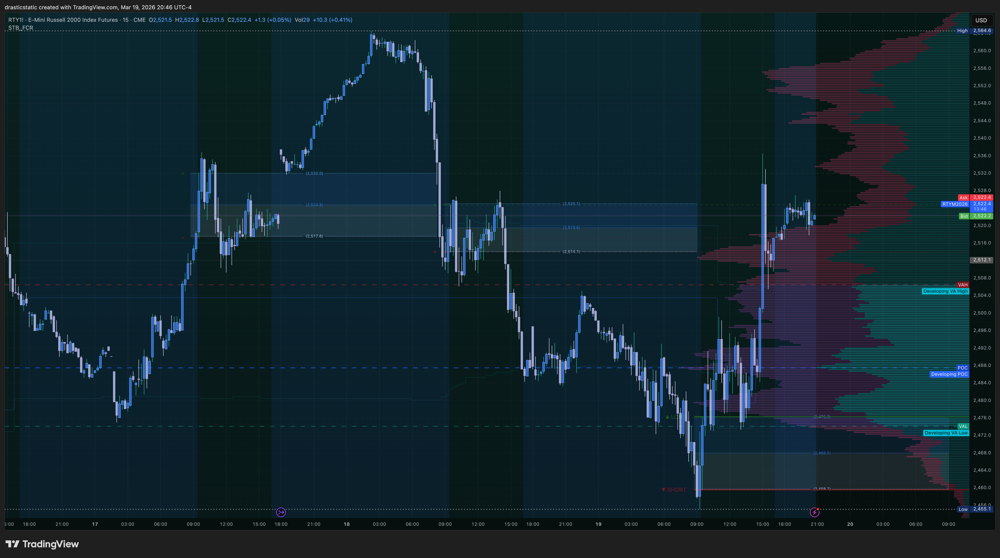

# Daily Review — March 19, 2026
### Post-FOMC · No Trades · Observation + Decompression Session

[Jump to 🤖 SmartTraderAI Copy-Paste ↓](#smarttraderai-copy-paste)

---

## 📋 Session Summary

| | |
|---|---|
| **Date** | March 19, 2026 (Thursday) |
| **Account** | APEX-484839-06 + TPT 50K |
| **P&L** | $0 — no trades taken |
| **Instruments watched** | NQ, ES, YM, RTY, GC, CL, XBR |
| **Trade count** | 0 |
| **Session type** | Post-FOMC observation · personal reset · conservative hold |

---

## 📖 Session Narrative

> Pre-market plan: see `premarket_20260319_summary.md` (written at ~15:00 ET — no formal morning session)

Christopher began the day making a deliberate choice: rest over trading. The morning involved personal and legal matters — unemployment filing (following correct procedure after being let go from prior employer), an attorney bill, and a PETITION FOR MODIFICATION OF AN EXISTING SUPPORT ORDER from domestic relations regarding child support arrears. Rather than trading through that stress, Christopher handled each item directly, called domestic relations to explain the situation, and cleared the space before coming to the desk. This sequence is exactly what the psychologist and coaches have been reinforcing.

The ZTH 1-on-1 coaching session was cancelled (coach under the weather). Christopher joined the Inevitrade live call via phone during a dog walk — absorbing market analysis and decompressing simultaneously before returning to the desk with a clear head.

**Market context:** This was Day 1 post-FOMC. The March 18 FOMC announcement had resolved the pre-meeting uncertainty that kept coaches on the sidelines during Mar 17. The afternoon session showed a strong post-FOMC risk-on response — a Scenario A bull push across all four equity indices (NQ, ES, YM, RTY) that looked compelling from the desk.

**The decision at the close:** The market stalled at the RTH close after the afternoon bull push. Christopher correctly read the hesitation (YM flashing a red dot rejection signal at the session high) and chose dinner and STB course material over forcing an ETH entry. This is the right call — a stalling market at 16:00 ET is not a signal, it's the absence of one.

**ETH development:** By 20:45 ET the post-FOMC bull push had fully reversed. All four indices sold back off from their RTH close levels — YM hardest, NQ most resilient. The macro downtrend reasserted. The screenshots taken at 20:45 ET were added directly to the FCR case study tracker as Day 1 of a 3-day observation window (Mar 20–24).

**XBR added:** Christopher introduced XBR (Brent Crude) as a CL SMT companion instrument — XBRUSDT.P (Gate.io perpetual) noted as the preferred reference for cleaner level marking. First documentation of the CL/XBR SMT pair framework, now saved to memory and workflow.

**Inevitrade call key takeaway:** The call reinforced the value of prop firm capital vs. real capital. A TCL setup that goes wrong costs drawdown percentage on the eval — painful but recoverable. The same mistake with real capital is wealth destruction. Risk management is not just a rule — it is the nature of the business itself. This reframe matters for how to approach the March 24 eval deadline.

---

## 📊 Trade Log

| # | Instrument | Direction | Entry | Exit | P&L | Grade |
|---|------------|-----------|-------|------|-----|-------|
| — | — | No trades taken | — | — | $0 | — |

*The absence of a trade is the result. In a post-FOMC session with a stalling market at RTH close and eval pressure building, $0 is a disciplined outcome.*

---

## 📸 Key Charts

**16:16 ET — NQ at RTH close: Scenario A bull push documented**

**16:17 ET — ES at RTH close: confirming NQ**

**16:18 ET — YM at RTH close: red dot rejection signal at session high**

**16:17 ET — RTY at RTH close: quad confirmation of afternoon move**

**16:18 ET — GC: post-FOMC knife catch retrace (TPT scope)**

**17:25 ET — CL + XBR SMT pair: first documentation**

**17:27 ET — XBR (Brent Crude): lockstep with WTI, no divergence**

**20:45 ET — NQ ETH: post-FOMC bull push fully reversed**

**20:45 ET — ES ETH: same sell structure**

**20:45 ET — YM ETH: hardest drop**

**20:46 ET — RTY ETH: confirming group direction**

---

## 🧠 Behavioral Notes

**What went right:**
- Recognized personal/legal stress in the morning and addressed it before approaching the desk — this is the psychologist's framework in action
- Joined the Inevitrade call during a dog walk — productive decompression
- Returned to the desk with a clear head and made clean observations
- Read YM's rejection signal at the RTH close correctly and did not force an ETH entry
- Named the observation without needing a trade to validate the session

**Pattern 8 (exit passivity) watch:** No entry was taken, so Pattern 8 was not triggered. But the pre-session discipline of defining the exit rules before entering — partial TP + scratch condition + 16:00 ET hard close — continues to be the forward protocol.

**Eval pressure:** The $3,515 gap with 5 days remaining (as of March 19) is creating real anxiety. This is the first session where the deadline pressure was consciously named as a factor in the decision not to trade. That naming is healthy — it means the analytical process is not being corrupted silently.

---

## 🔑 Key Lessons

1. **Post-FOMC false displacements are documented pattern** — the afternoon bull push looked like Scenario A and was. But the macro trend context (all four still in daily downtrend) meant the catalyst was temporary. The overnight reversal confirmed: structure beats catalyst.

2. **Clearing emotional space before trading is a trading decision** — it directly affects execution quality. The morning sequence (handle the stress, don't avoid it) is itself a risk management action.

3. **CL/XBR SMT pair established** — XBR (Brent Crude) added as the CL companion instrument for divergence reads. XBRUSDT.P preferred for level reference. This framework is now in memory and will be applied going forward.

4. **$0 is a valid and correct session result** when no A+ setup materializes. The eval clock ticking does not change the entry rules.

---

## 🤖 SmartTraderAI Post-Market Copy-Paste Fields

---

**1. What actually happened?**

Post-FOMC observation session. No trades taken. Christopher cleared personal/legal space in the morning (unemployment filing, domestic relations, attorney correspondence), joined the Inevitrade live call during a dog walk, and returned to the desk with a clear head. The market produced a Scenario A post-FOMC bull push in the afternoon across all four equity indices — a real-looking broad-based move. Christopher correctly read the stalling at RTH close (YM rejection signal) and did not force an ETH entry. By 20:45 ET the bull push had fully reversed in ETH, confirming the macro downtrend. The FCR case study was updated with the Mar 19 entry (Post-FOMC False Displacement pattern) and a 3-day observation window (Mar 20–24) was opened.

---

**2. What did you learn?**

The post-FOMC catalyst drove a real-looking Scenario A bull push, but macro structure (all four indices in daily downtrend) overrode it within hours. The lesson: when macro is bearish, even a broadly confirmed intraday catalyst move needs to be managed tightly — the catalyst is temporary, the structure is durable. Also: clearing emotional space before trading is not a delay, it is a preparation. The Inevitrade call insight on prop firm capital — absorbing learning costs vs. real capital destruction — is a meaningful reframe for how to hold the eval pressure.

---

**3. What were your results for the day?**

No trades taken. $0 P&L. APEX-06 gap remains ~$3,515 with 5 days to March 24 deadline. TPT gap remains ~$3,000 with end of March deadline. The session was used for observation, market documentation, and FCR case study updates. The post-FOMC ETH reversal was captured and logged.

> Full daily-review: https://github.com/drasticstatic/trading-assistant-public-preview/blob/main/smarttrader-ai/exports/2026/03-Mar/STB_export_20260319_daily-review.md

---

## 🎯 Forward Focus

1. **March 20 (today):** Quadruple witching Friday. Pre-market: strong bearish NQ/ES, neutral YM. Watch for Scenario A SHORT if YM loses ZTH support at the open. CL ZTH support bounce possible. No trade if five-layer confirmation is incomplete.
2. **HTF vs LTF:** The two timeframes are aligned, not conflicting — both are bearish. If "noise" is felt, it is the eval pressure looking for permission to act, not genuine chart ambiguity. Trust the structure.
3. **APEX-06 deadline March 24:** One clean A+ trade is the target across the remaining sessions. Forced entries damage the eval faster than patience does.

---

*Fortuna — Wealth Warden · March 19, 2026*
