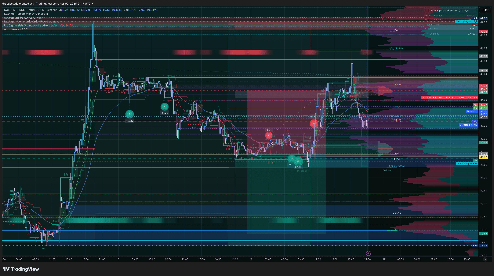
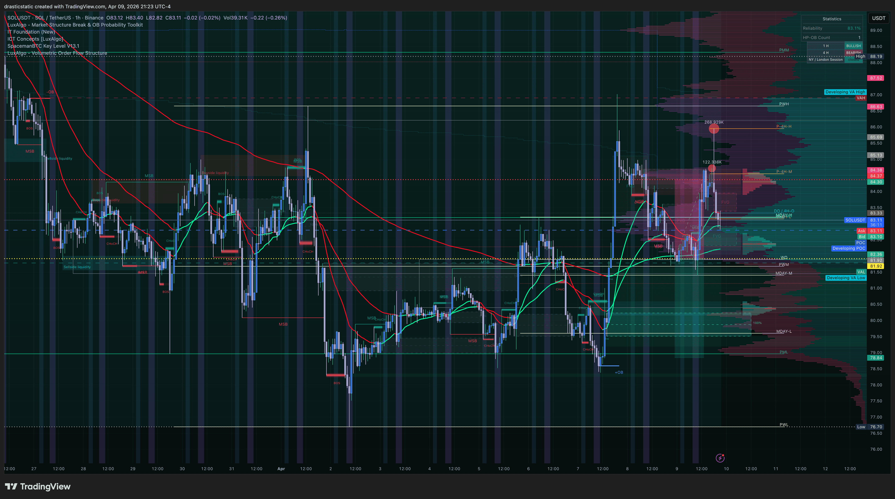

# 🗓️ Daily Review — Wednesday, April 8, 2026
### SOL Short · BTCC Voucher · AutoLiq | ~-$22

[Jump to 🤖 SmartTraderAI Copy-Paste ↓](#smarttraderai-copy-paste)

---

## 📋 Session Summary

| Field | Value |
|-------|-------|
| Date | Apr 8, 2026 (session ~11:00–11:30 PM ET) |
| Platform | BTCC (voucher) |
| Instrument | SOLUSDT perpetual |
| Trades Taken | 1 |
| Net P&L | ~-$20 to -$24 (auto-liquidation) |
| Eval Accounts | Not involved — BTCC voucher only |
| APEX-06 | Active — not touched |
| TPT 50K | Active — not touched |
| Emotional State | Exhausted, stressed, high external pressure |

---

## 📖 Session Narrative

No formal pre-market plan on file for this session.

Late Wednesday night, with a BTCC voucher expiring at 11:30 PM ET, Christopher entered a SHORT on SOLUSDT at $81.92 with 20x leverage. The trade briefly moved in his favor — a profit window appeared — but no exit action was taken. Price reversed and auto-liquidated the position for approximately $20–$24 loss.

The week was heavy before the trade opened. Financial pressure, competing priorities across trading, web3, and personal obligations, and a stretch of sessions without filled orders on the prop firms. The voucher trade was the only executable opportunity, and the deadline shaped the entry timing.

The directional read was not wrong — SOL had been in a downtrend and the SHORT was structurally aligned. But the entry was deadline-motivated rather than signal-driven, and the exit reflex — still not trained to automatic — let a brief profit become an auto-liquidation.

This did not affect the eval accounts. That protection held.

---

## 📊 Trade Log

| # | Instrument | Direction | Entry | Exit | P&L | Notes | Review |
|---|-----------|-----------|-------|------|-----|-------|--------|
| T1 | SOLUSDT (BTCC) | SHORT | $81.92 | Auto-liq ~$86 | ~-$22 | 20x · 6 contracts · voucher · Pattern 8 | [review_20260408_SOLUSDT-BTCC_001.md](../../../reviews/2026/04-Apr/review_20260408_SOLUSDT-BTCC_001.md) |

**Session net: ~-$22**
**Eval accounts: $0 (not involved)**

---

## 📸 Key Charts

**Apr 9, 9:17 PM ET — SOLUSDT broader view with IT strategy signals (post-trade context)**

**Apr 9, 9:23 PM ET — SOLUSDT IT Foundation EMAs — SOL recovery to ~$107 zone**

---

## 🧠 Behavioral Notes

- **Pattern 8 (exit passivity):** Consciously considered exiting at profit. Did not act. Auto-liquidation took the trade. Fourth consecutive trade with passive exit.
- **Pattern 9/10 echo:** Voucher expiration created artificial urgency — entry at 11:29 PM was deadline-driven, not signal-driven.
- **Pre-entry directional whiplash:** Almost reversed to LONG at the last second. Held SHORT. The brief doubt at execution (strong enough to consider flipping) is worth tracking — may signal that conviction wasn't fully there.
- **Emotional context:** Exhausted, under real financial and logistical pressure. Week felt like sustained losses even without filled orders on evals. This weight was present at the desk.

---

## 🔑 Key Lessons

1. **The exit thought is the signal.** "Should I get out here?" is not a question — it's a trade instruction. Pattern 8 will keep recurring until the reflex is trained. Next BTCC rep: if the exit thought arrives, act on it.
2. **Voucher deadlines are their own kind of pressure.** Not eval pressure, but still external urgency shaping entry timing. Keep using them as reps — but notice when the clock is running the trade instead of the signal.
3. **The dollar loss was small. The emotional weight was large.** That gap matters — it means the losses are accumulating in the nervous system faster than the dollars. Managing the internal ledger is part of the process too.
4. **Prop firm capital protected.** APEX-06 and TPT untouched. That is the job, and it was done.

---

## 📓 Apr 9 Evening Update

**Class session attended.** Watched others in the community work through the same struggles — recognizing this as a healthy and necessary part of the learning process. The mind is being trained to see structure; that training is visible in others and confirms the path. The desire to eventually share auto-levels with the community to help them on their journey reflects what this whole effort is for.

**Coach feedback — auto-levels:** ZTH coach reviewed the auto-levels indicator and has ideas. Getting back with specifics. Noted in PENDING-TASKS.

**Architecture expansion — Apr 9:**
- Lewis Jackson's `claude-tradingview-mcp-trading` repo reviewed and cleared (no malicious code). BitGet HMAC signing pattern (`placeBitGetOrder()`) is directly reusable for a BitGet MCP. Railway cloud deployment architecture noted for future 24/7 bot execution.
- **Exchange roster confirmed:** BTCC (active) · BitGet (CEX + Web3 wallet, VPN required for US) · Coinbase · Robinhood. All in PENDING-TASKS for phased MCP integration.
- **DEX arbitrage bot:** Code complete on Arbitrum. Waiting on ETH wallet funds for deployment + gas.
- **Fortuna automation vision documented:** Discord feed, Telegram channel, Railway cloud execution — the infrastructure picture is clear. Executing in phases as access unlocks.

**Sponsor reminder:** Focus on recovery first. Seek first the Kingdom. Everything else follows. This is the foundation the rest is built on.

---

## 🤖 SmartTraderAI Post-Market Copy-Paste Fields

---

**What actually happened?**

Late-night BTCC voucher SHORT on SOLUSDT at $81.92 with 20x leverage, entered at 11:29 PM ET before voucher expiration. Trade briefly profitable, no active exit taken, auto-liquidated near $86 for ~$20–$24 loss. Pattern 8 (exit passivity) recurring. Pre-entry indecision noted — briefly considered reversing to long. Eval accounts not involved.

---

**What did you learn?**

The exit thought is the trade instruction — when it arrives consciously, act. Deadline pressure (voucher, eval, legal, financial) shapes entries in ways that signal pressure does not. These are different stressors that can look similar at execution. The ability to read structure is not the gap; the gap is in the moment of commitment and the moment of exit. Both are trainable.

---

**What were your results for the day?**

| Metric | Value |
|--------|-------|
| Trades | 1 |
| Wins | 0 |
| Losses | 1 |
| Net P&L | ~-$22 (BTCC voucher) |
| Eval P&L | $0 (not involved) |
| Pattern 8 | Recurred |
| Prop firm status | APEX-06 active · TPT active · both protected ✅ |

> Full daily-review: https://github.com/drasticstatic/trading-assistant-public-preview/blob/main/smarttrader-ai/exports/2026/04-Apr/STB_export_20260408_daily-review.md

> Full individual trade reviews:
> - [review_20260408_SOLUSDT-BTCC_001.md](https://github.com/drasticstatic/trading-assistant-public-preview/blob/main/smarttrader-ai/reviews/2026/04-Apr/review_20260408_SOLUSDT-BTCC_001.md) — BTCC SOL SHORT $81.92 · 20x · AutoLiq ~$86 · ~-$22 · Pattern 8

---

## 🎯 Forward Focus

1. **Pattern 8 remediation** — paper trade or next BTCC rep: exit when the thought arrives. The thought is the instruction.
2. **Pre-entry conviction check** — if the direction flip crosses your mind at the moment of entry, that is a signal to wait, not to flip. A confident entry feels like conviction, not a coin toss at 11:29 PM.
3. **Eval accounts are the priority** — BTCC reps are supplemental learning. Keep the hierarchy clear.

---

*Produced with 🙏🏼 Fortuna — Wealth Warden | Claude Code CLI*
*Daily Review · Apr 8, 2026 · BTCC SOLUSDT Voucher Session*
*Daily Review · Apr 8, 2026 · Updated Apr 9*
