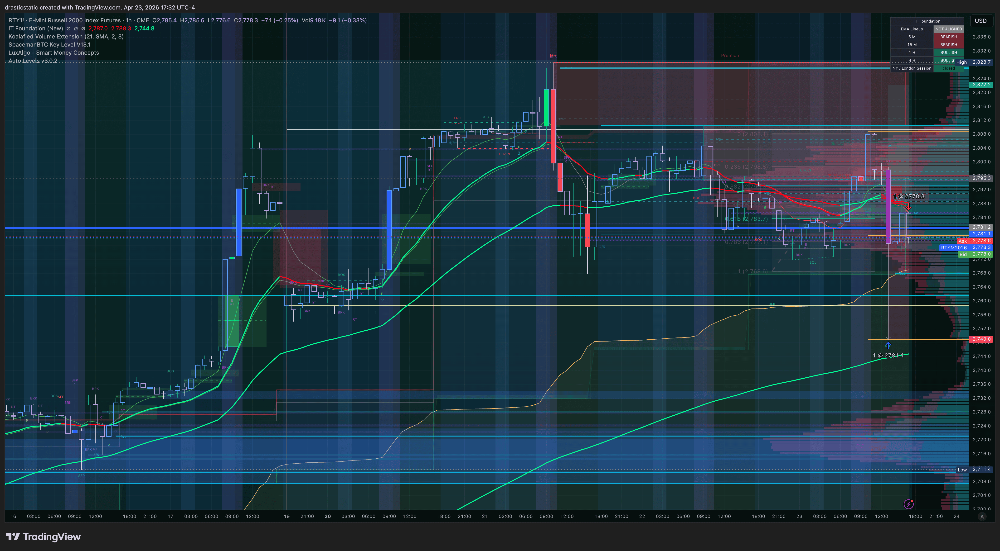
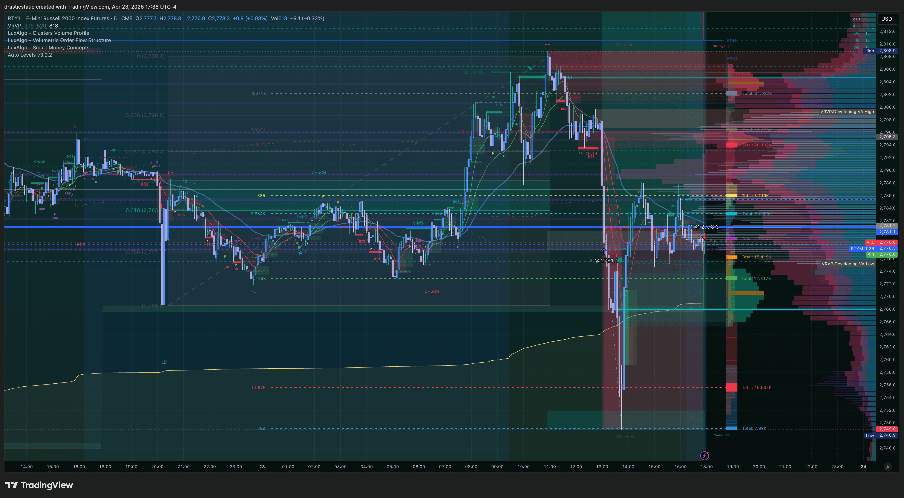
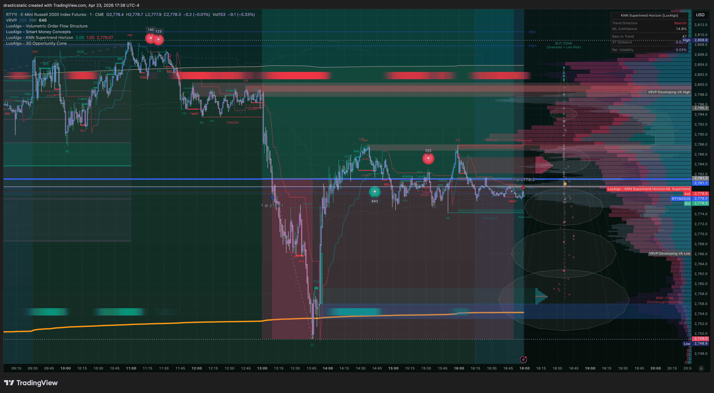

[Jump to 🤖 SmartTraderAI Copy-Paste ↓](#smarttraderai-copy-paste)

---

# Daily Review — April 23, 2026
### STB Export · APEX-484839-06 · Net +$955

---

## 📋 Session Summary

| Field | Value |
|-------|-------|
| Date | April 23, 2026 |
| Account | Apex Trader Funding — APEX-484839-06 |
| Session P&L | **+$955** (RTY -$140 · YM +$1,095) |
| Instruments | RTY, YM (MCL orders set — no fills) |
| Trade Count | 2 filled trades |
| Account Status | Active — APEX-06 · min days met · profit target in progress |

---

## 📖 Session Narrative

No formal pre-market plan on file for this session.

April 23 was a high-volatility session consistent with the recent macro environment — large intraday sweeps, aggressive liquidity grabs, and sharp reversals. Christopher entered the day with a bracket strategy already in place: limit orders sitting at key ZTH SFP levels on RTY (2781.1), YM (49122), and MCL (multiple levels) — all set the prior session or overnight. The approach reflects the swing-bracket methodology he has been developing: sitting on his hands, not chasing, and letting manipulation sweeps come to the orders rather than adjusting into them.

Both equity index longs filled in the same session window:
- **RTY long at 2781.1** filled at 13:09 ET during an aggressive move lower
- **YM long at 49122** filled at 13:42 ET, 33 minutes later, as the same sweep continued

For a brief period both positions were simultaneously in significant adverse territory — RTY at a -$1,610 MAE, YM at -$430 MAE. Christopher described this as the moment he thought the APEX account was going to blow. He held both, watched CL divergence as a directional read, and stayed in the positions as the reversal came.

YM closed cleanly at a modified TP of 49341 (+$1,095, 11 min duration). RTY ran through the afternoon with multiple bracket rebuilds, a removed SL, and no final resting TP — closing via AutoLiq at 16:59 ET for -$140.

The cross-instrument dynamic is the defining feature of this session. Both RTY and YM swept to ZTH SFP levels simultaneously and reversed together — a structure Christopher noted felt like a cross-instrument TCL (Trap Candle Long). This is consistent with ZTH + Inevitrade TCL methodology applied across index pairs.

The session net of +$955 extends the winning streak and adds meaningfully to the APEX-06 P&L arc. The behavioral story is split: the YM trade showed clean execution (95.22 Zella, exit at modified TP), while the RTY trade ended on Pattern 7 (SL canceled) + Pattern 8 (AutoLiq exit).

---

## 📊 Trade Log

| # | Instrument | Dir | Entry | Exit | P&L | Grade | Review |
|---|-----------|-----|-------|------|-----|-------|--------|
| 001 | RTY (E-Mini Russell 2000) | Long | 2,781.1 | 2,778.3 (AutoLiq) | **-$140** | 2.5/5 · Zella -8.70 | [review_20260423_RTY-APEX_001.md](../../../reviews/2026/04-Apr/review_20260423_RTY-APEX_001.md) |
| 002 | YM (E-Mini Dow $5) | Long | 49,122 | 49,341 (TP) | **+$1,095** | 4.0/5 · Zella 95.22 | [review_20260423_YM-APEX_002.md](../../../reviews/2026/04-Apr/review_20260423_YM-APEX_002.md) |

---

## 📸 Key Charts

**17:32 ET — RTY full move context (post-trade)**

**17:36 ET — RTY entry zone detail**

**17:38 ET — RTY sweep, MFE, and AutoLiq**

**14:49 ET — YM entry zone and TP fill**

**14:51 ET — YM sweep and full move context**

---

## 🧠 Behavioral Notes

**YM (T002):** Closest to A+ in recent sessions. Patient limit entry (2.5 hr wait), clean reversal, TP filled. Emotionally stable throughout. TP modification from sweep target down to 49341 is a soft Pattern 7 expression — pressure-driven rather than plan-driven, but not account-threatening. Zella 95.22 reflects the quality of entry and structure adherence.

**RTY (T001):** Pattern 7 and Pattern 8 both active. SL at 2725.2 was canceled 38 minutes after entry — the standard rationalization ("swing trade idea"). No final resting TP at any point during the 3h49m hold. MFE of +$350 appeared and passed without action. AutoLiq at 16:59 was the exit mechanism — identical to Mar 10, Mar 20, Mar 24.

**Cross-instrument observation:** Holding simultaneous adverse positions on two indices and not panic-closing either is notable composure. The account-blow fear was real and acknowledged — the correct response was to trust the structural thesis, not act on the emotion. That part worked.

**Pattern summary for this session:**

| Pattern | RTY | YM |
|---------|-----|-----|
| P7 — SL/TP modification | 🔴 SL canceled 13:47 | 🟡 TP modified (softer) |
| P8 — Exit passivity | 🔴 AutoLiq exit | ✅ TP hit actively |
| P9 — Order hygiene | ⚠️ Multiple bracket rebuilds | ✅ N/A (11 min trade) |

---

## 🔑 Key Lessons

1. **The bracket approach is working for entries — not yet for exits.** Both fills came from patient, pre-placed limit orders at key ZTH SFP levels. That discipline produced two valid entries. The exit side remains the open problem: one clean TP capture, one AutoLiq default.

2. **Cross-instrument sweeps amplify both reward and stress.** When RTY and YM fill simultaneously during a manipulation move, the account exposure doubles and the emotional pressure is acute. Pre-planning both entries as a dual scenario (not as independent trades) would allow pre-defined joint risk management rather than reactive bracket tinkering.

3. **A TP modification driven by account pressure is a Pattern 7 variant.** Lowering the TP to "be grateful for the win" is emotionally identical to raising the SL to "let it breathe" — both are in-flight changes motivated by comfort. The YM trade ended well, but the pattern is the same as its harder forms.

4. **Watching CL divergence ≠ having an exit plan.** Active analysis is not the same as active execution. The RTY hold was informed (CL divergence read was coherent) but still passive. A coherent thesis is not a substitute for a resting exit order.

---

## 🤖 SmartTraderAI Post-Market Copy-Paste Fields

---

**What actually happened?**

April 23 was a manipulation sweep session. Two pre-placed ZTH SFP limit orders filled during an aggressive intraday move lower — RTY long at 2781.1 (13:09 ET) and YM long at 49122 (13:42 ET). Both positions were briefly in significant adverse territory simultaneously, with RTY at -$1,610 MAE and YM at -$430 MAE. The reversal came sharply. YM reached +$1,150 MFE and the TP was modified down to 49341, filling at 13:53 (+$1,095, 11 min). RTY held through the afternoon with no active exit in place, closing via APEX AutoLiq at 16:59 at 2778.3 (-$140). Net session: +$955. MCL orders on the book throughout — no fills.

---

**What did you learn?**

The entry methodology is working. Patient pre-placed limits at key ZTH SFP levels, sitting on my hands while price manipulates toward the orders — that approach produced two valid fills today. The breakdown is still exits: one active TP capture (YM), one AutoLiq default (RTY). Holding through simultaneous adverse positions without panic-closing was a composure test passed. The cross-instrument dynamic — RTY and YM sweeping to key levels together and reversing together — felt like a cross-instrument TCL structure, consistent with ZTH + IT methodology applied to index pairs. That needs to be flagged pre-session when multiple indices are near key levels simultaneously. CL divergence was a coherent read in-session but it is not a substitute for a resting exit order. Watching the market and watching it with an exit plan are two different things.

---

**What were your results for the day?**

Net +$955 (RTY -$140 · YM +$1,095). APEX-484839-06 active, profit target in progress. Two fills on pre-placed ZTH SFP limits — both valid structural entries. YM closed on active TP, RTY closed on AutoLiq. Pattern 7 and Pattern 8 both present on RTY; YM was the cleanest exit of the recent arc. Running P&L update: APEX-06 approximately +$2,234 cumulative since activation.

> Full daily-review: https://github.com/drasticstatic/trading-assistant-public-preview/blob/main/smarttrader-ai/exports/2026/04-Apr/STB_export_20260423_daily-review.md

> Full individual trade reviews:
> - [review_20260423_RTY-APEX_001.md](https://github.com/drasticstatic/trading-assistant-public-preview/blob/main/smarttrader-ai/reviews/2026/04-Apr/review_20260423_RTY-APEX_001.md) — RTY Long -$140 · AutoLiq · Pattern 7+8
> - [review_20260423_YM-APEX_002.md](https://github.com/drasticstatic/trading-assistant-public-preview/blob/main/smarttrader-ai/reviews/2026/04-Apr/review_20260423_YM-APEX_002.md) — YM Long +$1,095 · TP filled · Zella 95.22

---

## 🎯 Forward Focus

1. **Pre-market: flag cross-instrument sweep scenarios.** When RTY and YM are both near ZTH key levels, note the dual-fill possibility and define the combined risk before session start.
2. **Every limit order gets a resting TP at placement time.** Not after the fill. Not during the session. At placement.
3. **Personal hard stop: 16:00 ET.** No open positions without an active exit order past 16:00. AutoLiq is not an exit plan.

---

*Daily Review — Fortuna · April 23, 2026*
