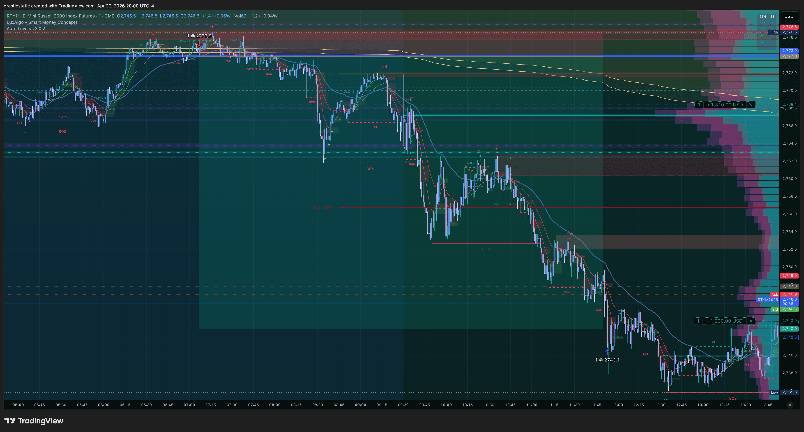
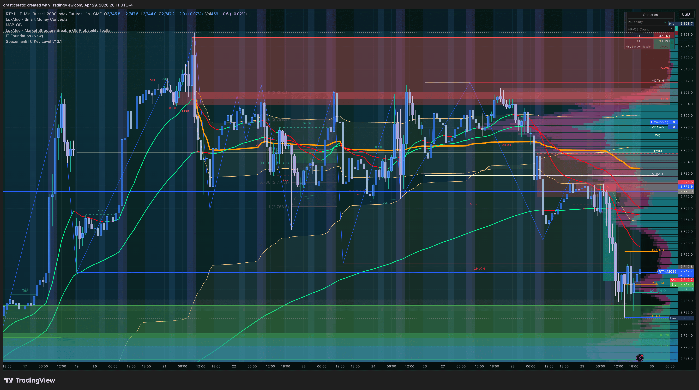
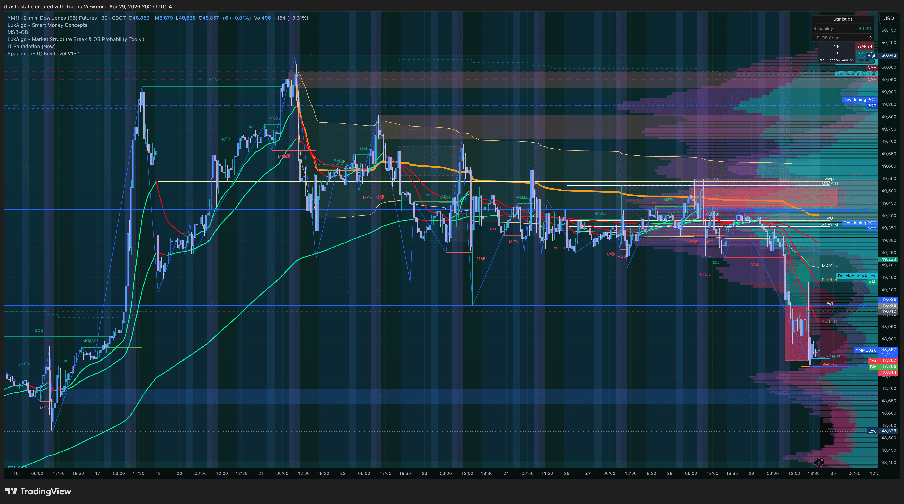
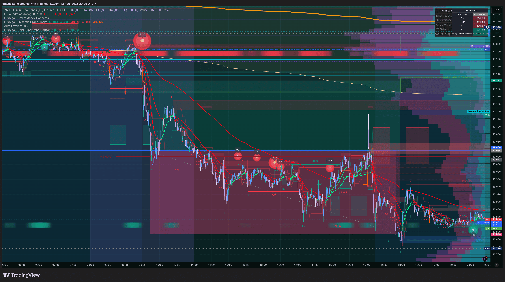
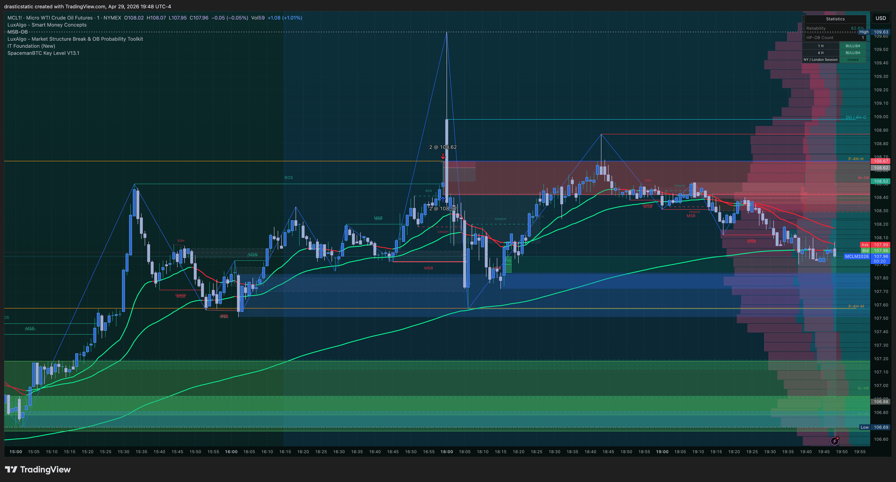
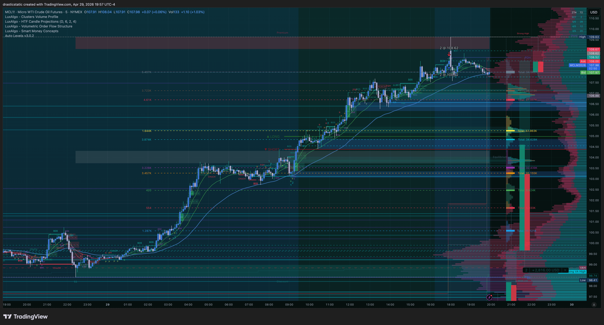

[Jump to 🤖 SmartTraderAI Copy-Paste ↓](#smarttraderai-copy-paste)

---

# Daily Review — April 29, 2026
### STB Export · TPT 50K reset-3 · Net +$355

---

## 📋 Session Summary

| Field | Value |
|-------|-------|
| Date | April 29, 2026 |
| Account | TakeProfitTrader 50K — TAKEPROFIT558167553 (reset-3) |
| Session P&L | **+$355** (RTY +$1,540 · YM −$1,205 · MCL +$20) |
| Instruments | RTY, YM, MCL |
| Trade Count | 3 filled trades |
| Account Status | Day **3/5** complete · deadline May 1 · running P&L +$391 on reset-3 |

---

## 📖 Session Narrative

A volatile session marked by macro news flow and sharp intraday moves across all major indices. Three trades filled across a full session — pre-market short through mid-morning, a counter-trend long held most of the day, and a last-minute revenge short at the close.

**RTY SHORT (T001) — the standout trade of the day.** Pre-market entry at 07:07 EDT at 2773.9 — before the NY session had confirmed anything. Christopher doubted the entry almost immediately and considered exiting. He stayed in. The trade ran for nearly 5 hours, producing +$1,540 on a 30.8-point move. He cut the position mid-trade to comply with TPT's consistency rule and still collected more than originally targeted. Exit at 11:53 was an *active decision* — not AutoLiq, not a resting TP passively hit, but a deliberate exit at a reasonable structural level. For a trader who has been working on Pattern 8 (exit passivity), this was a genuine process win.

**YM LONG (T002) — the session's wound.** Entered at 09:44 EDT at 49036 while RTY was still running — long, into a confirmed downtrend. The charts show bearish EMA structure throughout the session; the bias field in TradeZella reads "downtrend" with entry side "long." Price reached +$670 MFE around 10:00 ET. Christopher saw the opportunity, had his hand on the trigger, and did not act. The position bled for the rest of the session. A significant liquidity sweep candle near the close gave one final window — he watched it and stayed. Manual close at 16:59 at 48795 for −$1,205.

The YM loss did not break the day or the account. Because TPT uses a static (non-trailing) drawdown structure, the RTY profits remained on the balance sheet as a buffer. The session finished green.

**MCL SHORT (T003) — 44 seconds at market close.** Frustration from YM's outcome drove a last-minute short on MCL at 16:59:10 — 50 seconds before the session ended. Christopher identified this as a revenge trade in real-time. The trade closed profitable (+$20) 44 seconds later. The win changes nothing about what it was.

A thread connecting all three trades: **no mechanical stops were set on any position today.** RTY and YM were both framed as swing trade ideas; MCL had no plan at all. On a prop firm account with a hard $48,000 minimum balance floor, the absence of stops across every single trade introduces existential account risk — even on days that end green.

---

## 📊 Trade Log

| # | Instrument | Dir | Entry | Exit | Duration | P&L | Grade | Review |
|---|-----------|-----|-------|------|----------|-----|-------|--------|
| 001 | RTY (E-mini Russell 2000) | Short | 2,773.9 | 2,743.1 | ~4h 46m | **+$1,540** | 4/5 · Zella 85.56 | [review_20260429_RTY-TPT_001.md](../../../reviews/2026/04-Apr/review_20260429_RTY-TPT_001.md) |
| 002 | YM (E-mini Dow) | Long | 49,036 | 48,795 | ~7h 15m | **−$1,205** | 2/5 · Zella −97.97 | [review_20260429_YM-TPT_002.md](../../../reviews/2026/04-Apr/review_20260429_YM-TPT_002.md) |
| 003 | MCL (Micro Crude Light) | Short | 108.62 | 108.52 | 44 sec | **+$20** | 1.5/5 · Zella 71.43 | [review_20260429_MCL-TPT_003.md](../../../reviews/2026/04-Apr/review_20260429_MCL-TPT_003.md) |

---

## 📸 Key Charts

**20:00 ET — RTY 5-min: full bearish day structure**

**20:11 ET — RTY 1hr: EMA stack and resistance rejection**

**20:17 ET — YM 1hr: counter-trend entry, MFE window, late wick**

**20:25 ET — YM entry detail: displacement candle, IT signals**

**19:48 ET — MCL: strong uptrend, spike wick context**

**19:57 ET — MCL longer timeframe: levels and session structure**

---

## 🧠 Behavioral Notes

**RTY — Pattern 8 improvement confirmed.** The trade that mattered most behaviorally was not the biggest winner. It was the decision to stay in through doubt and exit at a self-directed moment rather than waiting to be pushed out. That is the skill being built. The MFE was $1,800; the actual exit was $1,540. The $260 left on the table is irrelevant relative to the fact that a *decision* was made and executed. This is meaningfully different from every Pattern 8 instance in the recent record.

**YM — the cost of exit passivity in dollar terms: $1,875.** From MFE (+$670) to actual exit (−$1,205), the difference between acting and not acting was $1,875 on a single position. The hard number matters because Pattern 8 often feels abstract in the moment — it feels like patience, like conviction, like "letting it breathe." Today's YM trade makes the cost concrete. The entry direction (long into a downtrend) was the first error. The failure to exit at the profit window was the second. Both will be isolated in the weekly review.

**No stops on any trade — this is the session's systemic issue.** Three trades. Zero mechanical stops. Two framed as "swing trade ideas"; one with no plan at all. The consistency rule cut on RTY shows rule-awareness, yet there was no catastrophic stop protecting the minimum balance floor. The irony: RTY was profitable, so no stop was needed. But the risk was fully present regardless. The answer going forward is not that swing trades don't need stops — it's that every open position on a prop account needs a level below which the position is closed without human involvement.

**MCL — the journal opens before the order panel.** After the YM result, Christopher walked the dog and came back calmer. The MCL entry happened in the gap between the YM close and the walk. Next time, when frustration is present and a trade idea is forming: journal first, walk second if needed, no new entries until the emotional state is neutral. The fact that MCL was profitable is exactly the wrong lesson to take from it.

---

## 🔑 Key Lessons

1. **Active exits are learnable.** RTY showed it today. The skill exists; it just needs to transfer to all instruments and time horizons.

2. **Counter-trend entries require extra justification, not less.** When the daily bias is downtrend and the entry is long, every confluence requirement should double — and if they don't all check out, the trade doesn't happen.

3. **MFE recognition without execution is not composure — it is Pattern 8 with extra steps.** Seeing the profit, naming it, and still not taking it is exactly the pattern. Pre-defined rule: if price reaches the planned TP window and the signal is visible, the order goes in immediately.

4. **A prop account without a catastrophic stop is not a prop account — it's a lottery ticket.** Even on swing trade ideas, a level below which the position is closed must be defined and placed before entry.

5. **Green days can hide serious structural problems.** Today was +$355 net. The session would have looked very different if RTY had gone against Christopher instead of YM. The behavioral problems present today — no stops, counter-trend entry, revenge trade — are not corrected by the green outcome. They are just hidden by it.

---

## 🤖 SmartTraderAI Post-Market Copy-Paste Fields

---

**What actually happened?**

Volatile session — April 29, 2026 — three fills across a full day on TPT reset-3. I entered RTY short pre-market at 07:07 EDT at 2773.9. I doubted the entry immediately and considered exiting early but stayed in. The trade ran for nearly 5 hours in my favour, printing +$1,540 on a 30.8-point move. I cut the position mid-trade to comply with TPT's consistency rule and still collected more than I intended. I made an active exit decision at 11:53 — not AutoLiq, not a passive TP. That was a genuine Pattern 8 improvement.

While RTY was running, I entered YM long at 09:44 at 49,036 — against a confirmed downtrend. YM worked against me for most of the session. Around 10:00 ET, I saw +$670 MFE, recognized the moment, and did not act. The position held through the full session, through a significant manipulation wick near the close, and I manually closed it at 16:59 for −$1,205 before TPT's 17:00 rule triggered. The RTY profits buffered the account because TPT uses a non-trailing drawdown structure — the day still closed green at +$355 net.

At 16:59:10, frustrated with the YM outcome, I entered a short MCL position on 2 contracts at 108.62 with 50 seconds to market close. It closed 44 seconds later at +$20. I identified it as a revenge trade in real time. No stops were set on any of the three trades today.

---

**What did you learn?**

I learned that active exits are learnable — I did it on RTY today. The same skill that failed on YM showed up and worked on RTY, which tells me it's not a capability I lack; it's a consistency I haven't locked in yet. I also learned what Pattern 8 costs in hard dollars: on YM, the gap between acting at MFE (+$670) and not acting (−$1,205) was $1,875 in a single session. That number is not abstract. Counter-trend entries require more justification, not less — when the daily bias is downtrend and I'm going long, every single confluence layer needs to confirm or the trade doesn't happen. I also logged the revenge trade honestly. I knew it was a revenge trade when I entered it. The correct sequence after a frustrating result is: journal, then walk, then return — not journal, enter, then walk.

---

**What were your results for the day?**

Net +$355 for the session. Three trades on TPT 50K reset-3 (TAKEPROFIT558167553): RTY short +$1,540 (Zella 85.56, 4/5, active exit) · YM long −$1,205 (Zella −97.97, 2/5, Pattern 8, counter-trend entry) · MCL short +$20 (Zella 71.43, 1.5/5, revenge trade, 44 seconds). Day 3 of 5 minimum trading days complete. TPT reset-3 running P&L: +$391 (Apr 27 +$22 · Apr 28 +$14 · Apr 29 +$355). Deadline for 5/5 days: May 1. Two trading days remain. No stops set on any position today — flagged as systemic for weekly review.

> Full daily review: https://github.com/drasticstatic/trading-assistant-public-preview/blob/main/smarttrader-ai/exports/2026/04-Apr/STB_export_20260429_daily-review.md

> Individual trade reviews:
> - [review_20260429_RTY-TPT_001.md](https://github.com/drasticstatic/trading-assistant-public-preview/blob/main/smarttrader-ai/reviews/2026/04-Apr/review_20260429_RTY-TPT_001.md) — RTY Short +$1,540 · active exit · Pattern 8 improved · Zella 85.56
> - [review_20260429_YM-TPT_002.md](https://github.com/drasticstatic/trading-assistant-public-preview/blob/main/smarttrader-ai/reviews/2026/04-Apr/review_20260429_YM-TPT_002.md) — YM Long −$1,205 · counter-trend · Pattern 8 · Zella −97.97
> - [review_20260429_MCL-TPT_003.md](https://github.com/drasticstatic/trading-assistant-public-preview/blob/main/smarttrader-ai/reviews/2026/04-Apr/review_20260429_MCL-TPT_003.md) — MCL Short +$20 · revenge trade · 44 seconds · Zella 71.43

---

## 🎯 Forward Focus

1. **Every position gets a catastrophic stop before entry** — not a trailing stop, not a "plan" to exit manually, but a hard resting stop order. On TPT with a $48,000 minimum balance floor, the number is calculable. Place it before the trade goes live.

2. **When MFE is reached and named, the order goes in immediately.** Pre-plan the TP window before entry. If price reaches it and the signal is visible, execute. Not "wait for confirmation." Not "maybe a little more." The order executes.

3. **Journal opens before the order panel when frustrated.** If today's trades were reversed in order — MCL first, then YM — the revenge trade might have been identified before the damage. After any position closes in frustration, the sequence is: close TradeZella export → journal entry → then and only then consider the next setup.

---

*Daily Review — Fortuna · April 29, 2026*
*Produced with 🙏🏼 Fortuna — Wealth Warden | Claude Code CLI*
