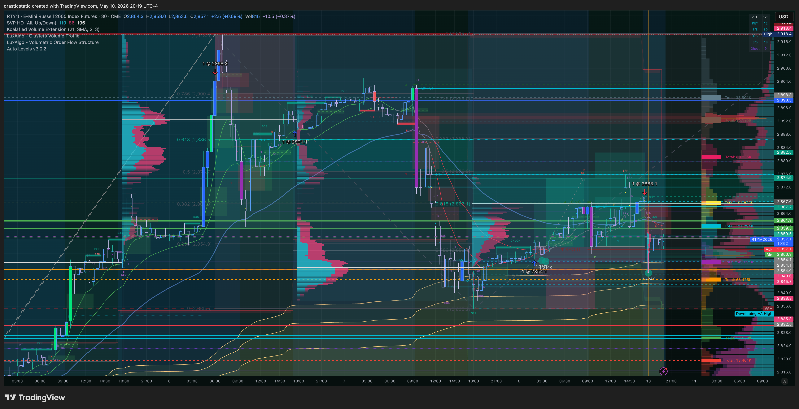
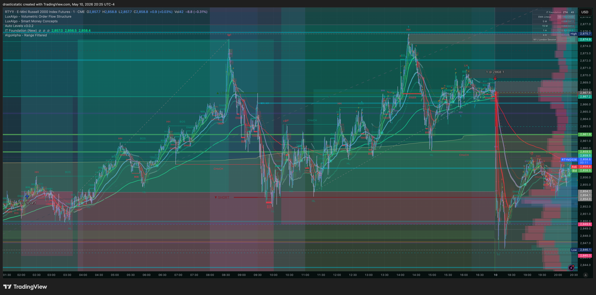
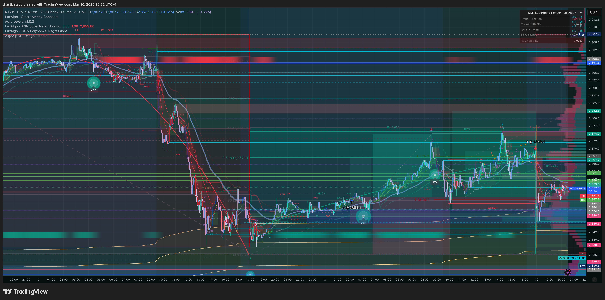

# 📅 Weekly Review — Week of May 5–11, 2026
### APEX-06 active · Pattern 8 cluster · Infrastructure sprint | +$1,060 futures

[Jump to 🕊️ Spiritual Lens ↓](#spiritual-lens) · [Jump to 📊 SmartTraderAI Response ↓](#smarttraderai-response) · [Jump to 🤖 Final STB Submission ↓](#smarttraderai-copy-paste)

---

## 📊 Week at a Glance

| Day | Session | Trades | Instrument | P&L | Account | Review |
|-----|---------|--------|------------|-----|---------|--------|
| Mon May 4 (eve) | ETH | — | SOL BTCC SHORT still open | — | BTCC | [partial](../../../reviews/2026/05-May/review_20260502_SOL-BTCC_001.md) |
| Tue May 6 | Pre-mkt + RTH | 1 futures + 1 BTCC | RTY Short · SOL liquidated | +$360 futures · unknown BTCC loss | APEX-06 · BTCC | [001](../../../reviews/2026/05-May/review_20260506_RTY-APEX_001.md) · [BTCC partial](../../../reviews/2026/05-May/review_20260502_SOL-BTCC_001.md) |
| Wed May 7 | Monitor | 0 | — | $0 | — | — |
| Thu May 8 | ETH + RTH | 1 | RTY Long | +$700 | APEX-06 | [001](../../../reviews/2026/05-May/review_20260508_RTY-APEX_001.md) |
| Fri May 9 | Monitor | 0 | — | $0 | — | — |
| **WEEK NET (futures)** | | | | **+$1,060** | | |
| **WEEK NET (BTCC)** | | | | **unknown loss** | | |

**Account Status:**

| Account | Status at Week End | Notes |
|---------|--------------------|-------|
| APEX-484839-06 (100K) | ✅ Active | Profit target open · +$3,294 cumulative since Mar 24 restart |
| TPT reset-4 (50K) | ✅ Active · 0/5 days | Renewed May 1 · No fills yet this period |
| BTCC | ⚠️ 2FA blocked | May 2–6 SOL SHORT liquidated — P&L unknown until 2FA restored |

---

## 📈 Week Arc — The Full Picture

This week can't be understood as a trading week alone. It was the most compressed week of the year so far — trades on Tuesday and Thursday, a court hearing landing on Sunday (tomorrow, May 12), an attorney call on Sunday afternoon, financial pressure from multiple directions, and a full-scale infrastructure sprint that ran in parallel to all of it. The APEX-06 account turned in two profitable RTY trades. The SOL short on BTCC was liquidated by a macro spike. And the agent ecosystem — skills library, AGENTS.md standard, graphify — was rebuilt from the ground up.

The trading results are positive on paper. +$1,060 in futures across two days. Both trades won. Both trades ended via AutoLiq at 16:59. Both had a TP placed at entry that was canceled mid-session. In both cases, the optimal exit window was at approximately 10:00 AM ET — and in both cases, Christopher held through that window without pulling the trigger, leaving $1,550 and $380 on the table respectively. The behavioral arc is clean, consistent, and — this week — sandwiched between two enormous external pressures. Understanding that context doesn't excuse the pattern. But it helps explain why awareness alone hasn't been enough to change it.

The infrastructure sprint deserves its own acknowledgment here, and it was substantial. Between May 5 and May 10, Alfred and Fortuna completed a **full ecosystem-level upgrade** across Christopher's entire agent suite — 17+ repositories, not just trading-assistant. The work touched:

- **Skills library** — 20 trading-assistant skills fully updated; the 4-skill session arc (startup → goodmorning → session-sync → goodnight) established as the canonical daily flow; `/startup` and `/prop-firm-status` created as new live skills; `/eval-progress` deprecated with full history in the deprecation log
- **prop-firm-progression.md** — new single source of truth at `setup/accounts/PropFirms/prop-firm-progression.md`, replacing scattered references across skills and the pattern tracker roster section
- **AGENTS.md standard** — open-standard AI agent config files deployed to all 14 active repos (trading-assistant, alfred, pir-devine-news, divorce-custody, wilson-lawn-ai-assist, TradeZella_STB, all dappu web3 repos, MCP forks). Each includes Agent Roster, NIM rules, Override System section with repo-specific use cases
- **AGENTS.override.md** — new template created in my-template for temporary task-specific instruction overrides; all CLAUDE.md files updated with pointers
- **CLAUDE.md files** — all active repos updated with AGENTS.md + override pointers; Alfred's CLAUDE.md fixed (stale path corrections, free-model sandbox path, NIM dual-mode section, graphify section, session log naming convention)
- **Graphify** — codebase knowledge graph tool security-reviewed (95% confidence safe); installed in the alfred repo (16 nodes, 13 edges, 4 communities) with a PreToolUse Claude Code hook; `.graphifyignore` template deployed to all 25 repos; trading-assistant is next in line
- **README badges** — workflow status badges added to all repos with GitHub Actions; broken badge in solidity_intensive fixed
- **FREE_MODEL_SETUP.md** — generalized and made public; linked from Alfred's README for any builder to use, not just this ecosystem

This was not maintenance work — it was architectural. The ecosystem is now operating at a level of documentation quality and cross-agent coordination that didn't exist six weeks ago. Fortuna's session work, Alfred's coordination role, Auggie's code builds, and Kavanah's spec-driven deployments all have explicit, consistent contracts across repos. That matters for the quality and continuity of every future session.

Building this under deadline pressure — with a court date on May 12 and financial stress running in the background — is worth naming explicitly. The discipline to do systematic work when the immediate environment is difficult is the same discipline that the trading requires. It showed up here.

The SOL liquidation added to the weight. A short established around May 2 was held through the May 5–6 tariff relief / CPI rally — one of the sharpest crypto moves of the year. Insufficient margin absorbed the spike. This is the fourth time in the arc that a BTCC voucher position has been closed by an involuntary mechanism (AutoLiq, liquidation). The pattern is identical to what plays out in futures but in a higher-volatility environment with no SL capability built into the voucher structure. The 2FA issue compounds everything: without account access, the true P&L won't be known until phone access is restored.

---

## 📊 Trade-by-Trade Summary

### Tue May 6 — RTY Short · APEX-06 · +$360 ✅ (futures) + SOL BTCC liquidation

**RTY Short:** Pre-market limit short at 2898.3 filled at 06:02 EDT — placed overnight after a period of studying Fibonacci projections on the 2900 area. The entry logic held: RTY did reject from 2900 and made its session low at 2860.1 (~10:00 AM ET). A resting TP at 2861.9 came within 0.2 points of being triggered at peak. Christopher then canceled the TP at 14:45 EDT, four hours after the optimal exit window had passed, and held the position to AutoLiq at 16:59. Result: +$360 of a $1,910 MFE. 18.85% exit efficiency. Emotionally heavy — "didn't want to look at a chart for a while."

**SOL BTCC:** Short entered approximately May 2. Held through the May 5–6 tariff relief / CPI rally. Liquidated due to insufficient margin. P&L unknown.

Full review: [review_20260506_RTY-APEX_001.md](../../../reviews/2026/05-May/review_20260506_RTY-APEX_001.md) · [review_20260502_SOL-BTCC_001.md](../../../reviews/2026/05-May/review_20260502_SOL-BTCC_001.md)

---

### Wed May 7 — No fills

Post-close review of Tuesday's RTY short. Screenshots taken (12:46–12:49 ET). Emotional processing day — Christopher had stepped away from charts following the May 6 experience. No setups qualified. Correct decision.

---

### Thu May 8 — RTY Long · APEX-06 · +$700 ✅

Market order long at 2854.1 placed at 02:11 EDT — in the early-morning hours, on the back of STB Team K's live bullish analysis. Entry quality was strong (MAE only $225, 4.5 pts). A TP was placed at 2882.5, then canceled at 07:18 EDT before RTH opened and before price tested it. RTY reached 2875.7 as its session high around 10:00 AM ET — the same approximate window as Tuesday's peak. AutoLiq at 16:59 exited at 2868.1. Result: +$700 of a $1,080 MFE. 64.81% exit efficiency. Christopher's own summary: "my exit passivity has been affecting me for way too long."

Full review: [review_20260508_RTY-APEX_001.md](../../../reviews/2026/05-May/review_20260508_RTY-APEX_001.md)

---

### Fri May 9 — No fills

Observation session. No qualifying setups. Correct.

---

### Sat May 10 – Sun May 11 — Infrastructure sprint

No trading. Alfred completed the skills library overhaul (sessions 1 and 2, May 9–10): 20 skills fully updated, /startup and /prop-firm-status new, prop-firm-progression.md created, graphify installed in alfred repo, AGENTS.md deployed across 14 repos. Weekly review produced May 11.

---

## 🧠 Behavioral Analysis — Week of May 5–11

### What held

Entry timing was well-executed on both RTY trades. The May 6 pre-market limit was placed with care during an overnight session — not a reactive open-bell entry. The May 8 market order at 2am, while not ideal in form, found a strong entry price (MAE only $225). In both cases, Christopher committed to the trade thesis through multiple hours of adverse or stagnant conditions without panic-closing. He documented both trades in TradeZella — including deeply honest emotional notes — despite the psychological weight of the week. The May 8 entry correctly identified and articulated the MFE limitation in real-time: "my exit passivity has been affecting me for way too long."

### What failed

Pattern 8 was the defining failure of the week, occurring in both filled trades with near-identical mechanics:

1. **TP placed** → 2. **TP canceled mid-session** → 3. **AutoLiq exits the position at hard close**

On May 6, the TP was within 0.2 points of the low when it was canceled — four hours after the optimal exit. On May 8, the TP was canceled before price even tested it — a preemptive removal of the exit plan in the pre-RTH quiet. The two forms represent Pattern 8 at different stages: one is failing to exit at the moment of truth; the other is removing the mechanism before the moment arrives.

No SL was set on either trade. The May 8 position was unprotected for nearly 15 hours, from 2am to 4:59pm. This compounds the behavioral risk significantly — both sides of the bracket were either absent or voluntarily removed.

The SOL liquidation on BTCC repeats the same underlying structure in a higher-volatility environment. No mechanical stop, large macro risk, held to forced exit.

### Convergence

All three positions this week exited via involuntary mechanisms: AutoLiq × 2 (futures), liquidation × 1 (BTCC). This is not a coincidence of market structure — it's a single pattern replicated across instruments and platforms. The week produced positive futures P&L while demonstrating zero voluntary exit decisions. This particular combination — behavioral failure co-occurring with positive outcomes — is one of the harder training environments, because the wins don't immediately demand a change.

---

## 📎 Full Reviews + Pattern Tracker

- [pattern_tracker.md](../../../reviews/pattern_tracker.md) — cumulative P&L, behavioral arc, compliance scores
- [review_20260502_SOL-BTCC_001.md](../../../reviews/2026/05-May/review_20260502_SOL-BTCC_001.md) — SOL Short BTCC · ~May 2–6 · liquidated · partial (2FA blocked)
- [review_20260506_RTY-APEX_001.md](../../../reviews/2026/05-May/review_20260506_RTY-APEX_001.md) — RTY Short APEX-06 · May 6 · +$360 · TP canceled at MFE · AutoLiq
- [review_20260508_RTY-APEX_001.md](../../../reviews/2026/05-May/review_20260508_RTY-APEX_001.md) — RTY Long APEX-06 · May 8 · +$700 · TP canceled pre-RTH · AutoLiq

---

## 🕊️ Spiritual Lens

*This section is Christopher's. Below is a starting frame — overwrite or expand from your session journal.*

This was a week where the weight was real. Court coming, bills pressing, body shaking at the desk, trying to hold a standard when the ground felt uncertain. And yet — work got done. Two trades filled, both won. An entire agent ecosystem was rebuilt and documented with care. The tools got sharper even when the hands were shaking.

Pattern 8 showed up again, and it will keep showing up until something changes. But this week also showed the entry read was there. The patience to hold through adverse conditions was there. The honesty to name the problem was there — in writing, to the coaches who are watching. That honesty is worth something. It's not the same as fixing it, but it's the prerequisite.

The hearing on May 12 and what comes after will find you either at the desk or away from it. The trading will be here when you come back. The account is intact. The arc is intact. You came back to the desk this week after not wanting to look at a chart. That's the practice — not the perfect exit, not the perfect entry, but coming back.

*[Add your own words here from the session journal. This is your section.]*

---

## 📊 Running Statistics — Updated Through May 8, 2026

| Metric | Value |
|--------|-------|
| Total futures fills (Feb 23–May 8) | 27 |
| Winners (futures) | 16 |
| Losers (futures) | 11 |
| Win rate (futures) | ~59% |
| Total P&L — APEX-06 (this period) | **+$3,294** |
| Total P&L — TPT (this period) | **-$170** |
| Total P&L — BTCC (this period) | ~-$15.50 USDT + unknown May 2–6 |
| This week — futures P&L | **+$1,060** |
| This week — BTCC | Unknown (2FA blocked) |
| SL placed this week | 0 of 2 futures trades |
| TP placed, then canceled | 2 of 2 futures trades |
| Exit efficiency (May 6 RTY) | 18.85% |
| Exit efficiency (May 8 RTY) | 64.81% |
| AutoLiq exits this week | 2 of 2 (futures) |
| Involuntary exits this week | 3 of 3 (futures × 2, BTCC × 1) |
| Active patterns | **Pattern 8** (dominant) · Pattern 9 |
| Pattern 7 this week | Not triggered — no SL set to modify |
| Best trade (week) | RTY LONG May 8 · +$700 |
| Worst trade (week) | SOL SHORT BTCC · unknown loss |
| Eval accounts blown (all-time) | 4 blown (APEX-05, TPT reset-0, 1, 2, 3) |
| Eval accounts active | 2 (APEX-06, TPT reset-4) |

---

## 📸 Screenshots — Week of May 5–11

<table><tr>
<td width="33%"> May 6 RTY Short — hourly context, entry at 2898</td>
<td width="33%"> May 6 RTY — macro structure and HTF levels</td>
<td width="33%"> May 6 RTY — Fibonacci projections (entry logic)</td>
</tr><tr>
<td width="33%"> May 8 RTY Long — intraday 14hr hold overview</td>
<td width="33%"> May 8 RTY — market structure shift from 2850</td>
<td width="33%"> May 8 RTY — entry annotated with SMT levels</td>
</tr><tr>
<td width="25%"> SOL BTCC — tariff relief rally (liquidation spike)</td>
<td width="25%"> SOL — Fibonacci and EMA structure at liquidation</td>
<td width="25%"> SOL — entry zone and spike context</td>
<td width="25%"> SOL — full move scope, overview</td>
</tr></table>

---

## 📊 SmartTraderAI's Response to Christopher's Weekly Submission

*[Stub — Christopher to submit the copy-paste fields to SmartTraderAI and return with the response for Fortuna to add here.]*

---

## 🤖 SmartTraderAI Weekly Copy-Paste Fields

---

**What trade setups/tactics worked this week?**

---

Two RTY trades won on Apex, both off directional reads that were correct. May 6: ZTH Pivot structure rejection from the 2900 area — pre-market limit short filled at 6am, price declined 38 points to the session low. May 8: Market structure shift long from 2854 on the back of STB Team K's analysis — price moved 21 points to session high. Both entries were well-timed (minimal MAE relative to MFE). The overnight/pre-market limit entry approach on May 6 worked well — the level was respected and the fill was clean.

---

**What didn't work this week?**

---

Exit discipline. Both trades won despite Pattern 8, not because of controlled exits. May 6: TP at 2861.9 was placed and came within 0.2 points of the session low before being manually canceled — held to AutoLiq at 16:59 with 18.85% of available MFE captured. May 8: TP at 2882.5 was placed post-fill and canceled before RTH even opened, before price reached the target — held to AutoLiq at 16:59 with 64.81% captured. No SL was set on either trade (10h57m and 14h47m of unprotected exposure). SOL short on BTCC was held through a major macro move (tariff relief + CPI rally) without a mechanical stop and liquidated on insufficient margin.

---

**What observable patterns did you see in the market this week?**

---

RTY showed a clear rejection from the 2900 structural zone on Tuesday. The tariff/CPI macro environment created a strong bullish bias in equities and crypto — the SOL spike on May 5–6 was one of the sharpest moves of the year. RTY held a constructive bid into Thursday, supporting the long on May 8. The session high on both days (May 6 and May 8) came within the same approximate 10:00 AM ET window — a consistent pattern in the current tape where early-session momentum runs establish the MFE before reversing toward close.

---

**What observable patterns did you see in your trades this week?**

---

Pattern 8 ran identically in both futures trades: TP placed at entry → TP canceled mid-session → AutoLiq exits at 16:59. On May 6, the TP was within 0.2 points of the actual low before cancellation. On May 8, the TP was removed before price even tested it. Both trades reached their MFE at approximately 10:00 AM ET and then gave back a portion. The emotional cycle was similar both times: calm at entry, nervous mid-session, oscillating conviction through the afternoon, grateful but disheartened at close. No voluntary exit was made across three positions this week (two futures, one BTCC).

---

**What mistakes did you make this week?**

---

Canceled both TPs — once near the optimal exit, once before price tested the target. Set no SL on either futures trade, leaving positions unprotected for 11–15 hours each. Entered May 8 via market order at 2am without a bracket in place (TP added post-fill, no SL ever). Held the SOL BTCC short through a macro risk week with known tariff/CPI catalysts without a protective stop, resulting in a margin liquidation. The result — two profitable weeks and one unknown BTCC loss — does not validate these decisions.

---

**What recurring problems are you seeing week over week?**

---

Pattern 8 has now appeared in every RTY trade in the recent arc (Mar 20, Apr 17, Apr 23, May 6, May 8) — always the same sequence: a TP that was either placed and canceled, or simply never executed voluntarily. The exits happen via AutoLiq or resting TP-fill without an active decision. The awareness of this pattern is fully present in real-time — "my exit passivity has been affecting me for way too long" was written mid-trade in TradeZella on May 8. Pattern 9 (pre-rest order hygiene) also recurred: 2am market order with no SL before sleeping.

---

**What solutions are you implementing to fix those problems?**

---

Rule established for next trade: TP placed at entry = non-cancelable unless the setup has structurally invalidated. Specifically: once a TP is within 10% of its target price, it stays. Cancellation requires a documented structural invalidation reason written in TradeZella before removal. Pattern 9 rule: before any position is held overnight or unattended, three things must be defined — entry price, SL level, TP target. All three must exist as placed orders before stepping away from the desk.

---

**Weekly Performance Questions (yes/no)**

---

- Did you trade your plan? No — May 8 entry was not pre-planned; May 6 overnight limit was pre-planned but exit was not.
- Did you follow your rules? No — no SL on either trade, both TPs canceled.
- Did you overtrade? No.
- Did you revenge trade? No.
- Did you hold a position too long? Yes — both trades held past the MFE window to AutoLiq close.
- Did you exit too early? No — the problem was the opposite.
- Did you move your stop loss? No — no SL was set to move.
- Did you add to a loser? No.
- Did you take profit too early? No — TPs were canceled, not triggered.

---

**This week my action steps are:**

---

1. Before placing any trade, write down all three: entry, SL (exact price and order type), TP (exact price). No entry without all three in the platform.
2. Once TP is placed, treat cancellation as a formal decision requiring a written reason in TradeZella Notes before removal — not a quiet click.
3. Review the May 6 and May 8 trade reviews before next session — specifically the Order Execution tables showing the TP cancellation timestamps.

---

**What I want to work on / improve / get better at:**

---

Making one voluntary exit decision per trade. Not AutoLiq. Not a resting TP filling while away from the desk. A conscious decision, at a planned price, executed while watching the chart. Just one. That's the target for next session.

---

**How I plan to study the market this week:**

---

ZTH sessions and live calls as available. Focus study on examples of Pattern 8 resolution — specifically coaches or peers who have described the moment of pulling the trigger when the original TP is close. Watch the 10:00 AM ET window specifically on RTY — that appears to be a consistent MFE window in the current market structure. If no live sessions available, review the Apr 29 RTY trade (+$1,540, Pattern 8 improvement) as a reference for what active exit looks like.

---

> Full weekly review: https://github.com/drasticstatic/trading-assistant-public-preview/blob/main/smarttrader-ai/exports/2026/05-May/STB_export_20260511_weekly-review.md

---

*Produced with 🙏🏼 Fortuna — Wealth Warden | Claude Code CLI*
*Weekly Review — Week of May 5–11, 2026 · APEX-06 active · +$1,060 futures*
