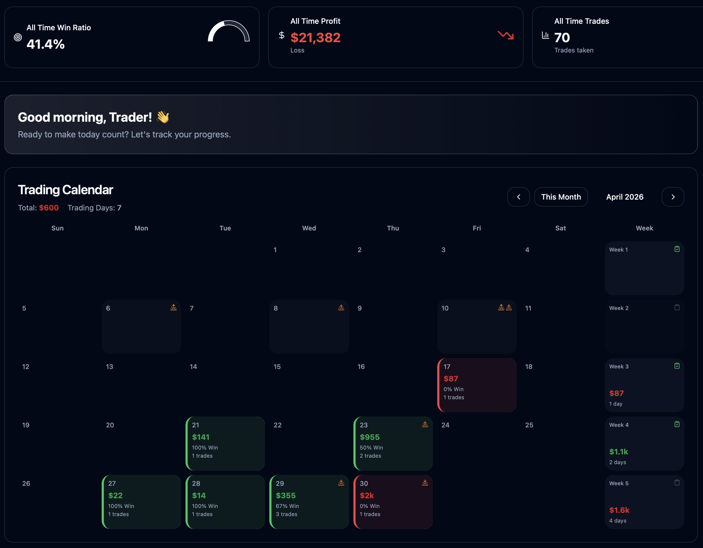
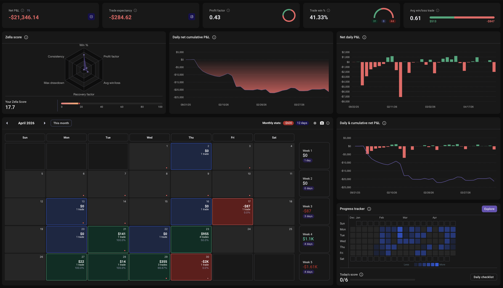
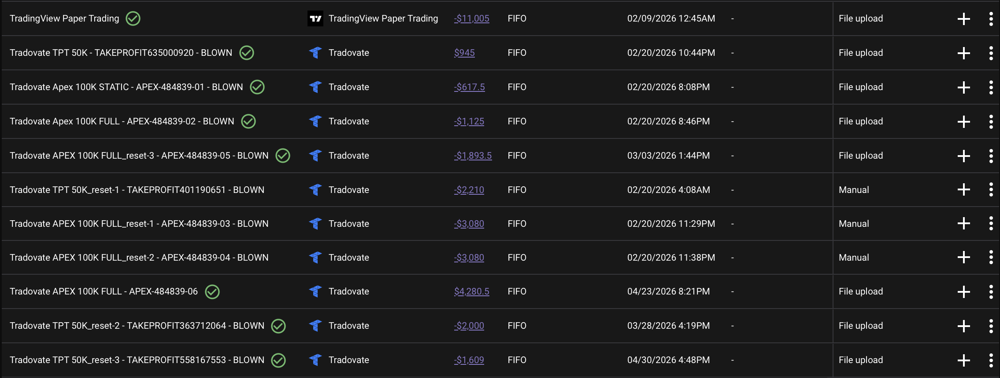

# 📅 Monthly Review — April 2026
### Pattern 8 Breakthrough · TPT reset-3 Blown · APEX-06 Active | -$622

*Written May 1, 2026 — The morning after the fourth TPT blow. May this month be the turning point.*

[Jump to 🤖 SmartTraderAI Reflection ↓](#smarttraderai-reflection)

---

## 📊 Monthly Dashboard

<table><tr>
<td width="50%"> SmartTraderAI — April 2026 Calendar</td>
<td width="50%"> TradeZella — April 2026 Analytics</td>
</tr></table>

<table><tr>
<td width="100%"> TradeZella — Full Account History (paper trading red is not real risk — it is early TradingView learning, before live eval accounts)</td>
</tr></table>

> **Note on the account history chart:** The early large red drawdown visible in TradeZella represents paper trading done for learning TradingView and the platform — no real capital at risk. The live prop firm trading began with the APEX accounts in February 2026. The recovery arc documented in this monthly review reflects the live trading history from that point forward.

---

## 📈 April Monthly Summary

| Metric | Value |
|--------|-------|
| **April net P&L (futures)** | **-$600** |
| **April net P&L (BTCC)** | **-$22** |
| **April total** | **-$622** |
| Active trading days | ~10 |
| Total fills | 11 futures trades (plus 1 BTCC) |
| Win rate | ~55% (6 wins / 5 losses) |
| Best trade | YM Apr 23 +$1,095 · Zella 95.22 |
| Worst trade | YM Apr 30 -$2,000 · AutoLiq · account blown |
| Accounts active | APEX-06 (100K) · TPT reset-3 (through Apr 30) |
| Accounts blown | TPT reset-3 blown Apr 30 |
| Accounts renewed | APEX-06 renewed Apr 25 · TPT reset-4 started May 1 |

---

## 🏦 Account Status — April 2026

| Account | Platform | Active Period | Final Status |
|---------|----------|---------------|-------------|
| APEX-484839-06 | Apex Trader Funding (100K) | Full month · renewed Apr 25 | ✅ Active · profit target still open |
| TAKEPROFIT558167553 (reset-3) | TakeProfitTrader 50K | Apr 1 – Apr 30 | ❌ Blown Apr 30 — AutoLiq YM -$2,000 · 4/5 days |
| TPT reset-4 (ID TBD) | TakeProfitTrader 50K | May 1 onward | ✅ Active — $50K · 0/5 days · deadline May 31 |

**Account note:** The TPT statement PDF confirms reset-3 completed only 4 of the required 5 minimum trading days before the account blow. Renewal would have been required regardless. The $50K/day discount renewal cost was the same as a fresh start — May now has a full month on reset-4.

---

## 🗓️ April 2026 — Week by Week

### Week 1 (Mar 30 – Apr 3): $0 — Patience Under Macro Pressure

No fills for the week. Conservative limit orders placed on MCL and MES at structurally valid levels — none triggered. The macro environment was volatile (political/economic news flow). No fills on conservative entries in a volatile environment is the strategy working correctly, not a failure.

**The ZTH coach's words this week:** *"I've been reading through your weekly reviews and your pattern tracker — it's impressive. You have a high IQ. I want to see you win. And maybe you're simply overcomplicating things. This should be fun and easy."*

The TradingView Desktop MCP (`tradingview-mcp-jackson`) was installed Apr 3 — a structural shift enabling Fortuna to read live chart state, indicator values, and levels directly rather than depending on screenshots.

Weekly review: [STB_export_20260403_weekly-review.md](STB_export_20260403_weekly-review.md)

---

### Week 2 (Apr 6 – 11): -$22 (BTCC) — CPI Friday, ZTH 2R Lesson

**Apr 8 — SOL/USDT Short · BTCC · ~-$22**

BTCC voucher SOL SHORT — profit window seen, no exit taken (Pattern 8), AutoLiq in the 11:30 PM ET session. Deadline pressure contributed. Another Pattern 8 instance — same as prior BTCC voucher losses.

**Apr 10 — CPI Friday**

No fills on planned futures setups. ZTH 2R lesson session: coach walked through the 2R rule (take partial profit at 2R, move stop to break-even, let rest run). The lesson landed on a day that could have been used to practice it with live positions — a signal that setup patience and exit rule pre-commitment need to operate together.

Daily reviews: [STB_export_20260408_daily-review.md](STB_export_20260408_daily-review.md) · [STB_export_20260410_daily-review.md](STB_export_20260410_daily-review.md)

---

### Week 3 (Apr 14 – 18): -$87 — M2K Overnight Unprotected

**Apr 17 — M2K Short · APEX-06 · -$87**

Overnight limit short at 2770.70. Filled at the open. SL and TP both canceled at fill — position ran unprotected. MFE +$44.50 at 9 AM. Held 8 hours. Exit at 16:59 due to time pressure alone for -$87. Pattern 8 (8-hour hold through profit window) and Pattern 9 echo (SL canceled at fill).

Broader context: deep financial pressure this week (phone suspended, bank account at risk, taxes). Cognitive bandwidth split. Sitting on hands Mon–Wed and Fri under that load is a genuine behavioral strength even when the one trade that fills is mishandled.

Weekly review: [STB_export_20260414_weekly-review.md](STB_export_20260414_weekly-review.md)

---

### Week 4 (Apr 19 – 26): +$1,096 — First Profitable Active Exit + ZTH SFP Day

**Apr 21 — MCL Short · APEX-06 · +$141**

ZTH Pivot. Active exit with 43% exit efficiency. **The first profitable active exit in the documented arc.** Small — imperfect — but the decision to close was Christopher's, not the prop firm's. This is the skill being built.

**Apr 23 — YM Long + RTY Long · APEX-06 · +$955 net**

Massive sweep day. ZTH SFP fills on both RTY and YM simultaneously. Both briefly deeply negative at the same time — composure held, structural thesis trusted.

- **YM Long: +$1,095 · Zella 95.22** — TP modified to be conservative, filled in 11 minutes. Best behavioral trade of the month.
- **RTY Long: -$140** — SL canceled post-fill (Pattern 7). AutoLiq at 16:59 (Pattern 8). The same session produced both the arc's best execution and a recurrence.

**Apr 25 — APEX-06 Renewal received**

The APEX evaluation cycle ended without hitting the profit target. Account renewed at lifetime subscriber pricing (40% discount from standard). A new evaluation cycle begins.

Weekly review: [STB_export_20260426_weekly-review.md](STB_export_20260426_weekly-review.md)

---

### Week 5 (Apr 27 – May 3): -$1,609 — Pattern 8 Win + Fourth TPT Blow

**The week's full narrative is in the weekly review:** [STB_export_20260503_weekly-review.md](05-May/STB_export_20260503_weekly-review.md)

Summary:
- Apr 27: MGC +$22 (Day 1 TPT) — TP in 41s, exit discipline under pressure ✅
- Apr 28: MGC +$14 (Day 2 TPT) — scared out 45s, 2% efficiency
- Apr 29: RTY +$1,540 (Day 3 TPT) — **Pattern 8 arc milestone: self-directed active exit** ✅
- Apr 29: YM -$1,205 (Day 3 TPT) — counter-trend, MFE +$670 not taken
- Apr 29: MCL +$20 (Day 3 TPT) — revenge trade, 44 seconds
- Apr 30: YM -$2,000 (Day 4 TPT) — resting limit, no stop, AutoLiq → **TPT reset-3 blown**
- May 1: TPT renewed as reset-4 ($50K · $48K min · $53K target · May 31 deadline)

---

## 📉 The Equity Curve Story — April

April's curve is not a straight line down or a straight line up. It is a series of spikes:

- Apr 23: +$955 in a day — the ZTH SFP approach producing real results
- Apr 29: +$355 net — strong RTY trade carrying the day
- Apr 30: -$2,000 — account blow

The problem is not that the edge isn't producing wins. The YM Apr 23 trade (Zella 95.22), the RTY Apr 29 trade (Zella 85.56), the MCL Apr 21 trade (active exit) — these are evidence that the approach works when conditions are right and execution is clean. The problem is that one stop omission can erase multiple winning sessions. The math is brutal: two good weeks and a single overnight resting limit erases the gain.

---

## 🧠 Behavioral Arc — April

### Pattern 7 (SL Modification / Omission)
**April status:** Active — end-of-month blow same root cause as all prior

The specific April manifestation was new in form but identical in mechanism: resting limit left overnight without a corresponding stop. The four TPT accounts all ended the same way. The dollar cost of not placing a mechanical stop has now been demonstrated across four separate account cycles.

**Progress:** Zero. The rationalization changes (structural alignment, swing thesis, "I'll set it after the fill") but the outcome is the same every time. The only possible next step is architectural — the stop goes in before the position is live, with no exception.

### Pattern 8 (Exit Passivity)
**April status:** Improving — two confirmed active exits

**April milestones:**
- MCL Apr 21: +$141, active exit, first profitable active exit in arc ✅
- RTY Apr 29: +$1,540, self-directed structural exit, 4h 46m hold ✅

The skill is demonstrably present. Two active exits in April vs. zero in the prior record. The conditions under which it fires: directional thesis confirmed, entry at structure, position moving in favour. The conditions under which it fails: counter-trend holds, resting limits held without exit authority.

### Pattern 9 (Pre-Rest Order Hygiene)
**April status:** Adjacent — resting limit without stop is the related form

The Apr 30 failure mode is Pattern 9's closest relative: a position left active and unattended without protective structure. The Apr 27 MCL trade (TP placed 41s post-fill) is Pattern 9 improving in the other direction — protective exit structure placed immediately.

### Momentum vs. Reversal Calibration
**New observation — April 30 confirmed**

Christopher documented a broader behavioral pattern this month: a career-long tendency to anticipate reversals while struggling with momentum trades. The YM short on Apr 30 was a reversal thesis entered into a session that became momentum bullish on value rotation. This is not a flaw unique to April — it is a calibration issue that spans the documented history.

The specific calibration work: when the session character (index divergence, pace, breadth) inverts against an open thesis within the first 30 minutes, the position gets reassessed immediately — not held to resolution.

---

## 🏗️ System and Infrastructure — April

| Component | Status in April |
|-----------|----------------|
| TradingView MCP (jackson) | Installed Apr 3 — direct chart reading live |
| Auto-levels Pine Script v3.0.2 | Active — dormant buffer architecture |
| Pattern tracker | Updated through Apr 30 |
| Weekly review cadence | All 5 weeks completed ✅ |
| SmartTraderAI pipeline | Active — daily/weekly exports submitted |
| APEX-06 | Renewed Apr 25 — eval cycle continues |
| TPT reset-3 | Blown Apr 30 — renewed May 1 as reset-4 |

The infrastructure that was built in February-March is fully operational in April. The gap is not the system — the gap is one behavioral rule applied consistently.

---

## 🔭 Looking Into May

**What is resolved entering May:**
- APEX-06 active (profit target alive)
- TPT reset-4 active (full month, May 31 deadline)
- Pattern 8 improvement confirmed (two active exits in April)
- System fully operational

**What is the work:**
- **Stop before position** — this is the only rule that if followed would have prevented every account blow in the record. It is the entire behavioral focus for May.
- **SMT divergence as live exit filter** — when session character inverts against an open position within 30 minutes, the position gets reassessed immediately
- **Counter-trend entry filter** — before any entry against the daily bias: all five layers must confirm; if daily bias is against the direction, the confluence requirement doubles

**The season:**
April was hard. The account blow on April 30 was the fourth identical pattern. The financial pressure is real. The feeling of "doomed trajectory" is also real and was named honestly.

And: the behavioral growth in April is documented and real. Pattern 8 improvement is not a story — it is two specific trades with specific Zella scores and specific exit times. The work is not starting from zero. It is building on what April produced.

May begins with two accounts, a clearer behavioral picture, and one rule to apply above all others: stop before position.

---

## 🤖 SmartTraderAI Monthly Reflection Fields

---

**What happened over this month?**

April 2026 was a month of documented contrast: the clearest behavioral improvement in the arc appeared in the same month as the fourth identical account blow. The improvement: two confirmed active exits — MCL April 21 (+$141) and RTY April 29 (+$1,540) — the first meaningful Pattern 8 progress since the tracker was created in March. The blow: YM April 30, resting overnight limit without a corresponding stop, AutoLiq at the account floor for -$2,000. The four TPT resets in this record have all ended the same way at the mechanical level: a position live without a stop, the account floor became the stop by default. April didn't change that pattern — it confirmed it one more time while also producing evidence that the other patterns are improving.

The best single trade of the arc to date came in April: YM Long April 23, +$1,095, Zella 95.22, TP filled in 11 minutes on a ZTH SFP setup. That trade and the RTY April 29 (+$1,540 active exit) represent what this approach produces when all five layers confirm and exit structure is in place.

April net: -$622 (futures -$600, BTCC -$22). APEX-06 survived the full month unaffected. TPT reset-4 begins May 1 with a full month available.

---

**What was learned?**

Three things carried from April into May:

**One:** The stop omission is the only thing that has ended accounts. Not entry quality, not instrument selection, not timing — the absence of a mechanical stop that forces exit before the account floor does. This has now been confirmed across four separate account cycles. It is not an accident; it is a pattern. The fix is one rule, placed before or simultaneously with every position, with no override.

**Two:** Active exits are learnable and demonstrating growth. April produced two. Both came from setups that were directionally aligned, entered at structure, with the position moving in favour. The conditions under which the exit fires are now identifiable — which means they can be protected and extended.

**Three:** When the live session character inverts against an open thesis — when the SMT divergence picture says the market is doing something different from what the trade assumes — that is an exit signal, not a hold signal. The YM April 30 data was visible in real time. The coach confirmed it. The decision to hold was not structural analysis; it was fear of acknowledging a wrong direction.

---

**What are the results going into May?**

April net: -$622. April cumulative from the start of the record: deeply negative — the weight of February still present in the all-time curve. But the month-over-month direction is more important than the absolute level: March was -$554, April was -$622, and both months produced far less damage than February's -$20,200. The floor is real even when the month is red.

The two active exits in April (MCL +$141, RTY +$1,540) are the clearest behavioral signal going into May. They prove the skill exists. They prove exit timing can be self-directed rather than forced by the prop firm. Extending that pattern — placing the exit rule in writing before every position opens — is the specific work that makes May different from April.

Two accounts active. Profit target on APEX-06 still alive. TPT reset-4 with a full month to build it correctly. The season is long. The work continues.

> Full monthly review: https://github.com/drasticstatic/trading-assistant-public-preview/blob/main/smarttrader-ai/exports/2026/04-Apr/STB_export_20260430_monthly-review.md

---

*Produced with 🙏🏼 Fortuna — Wealth Warden | Claude Code CLI*
*Monthly Review · April 2026*
