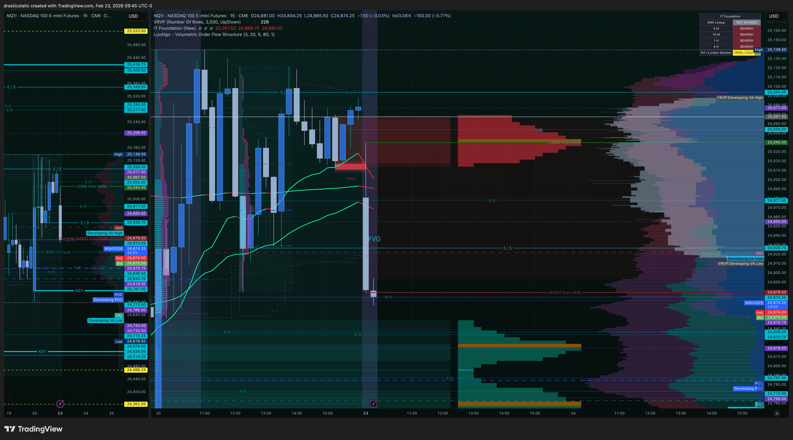
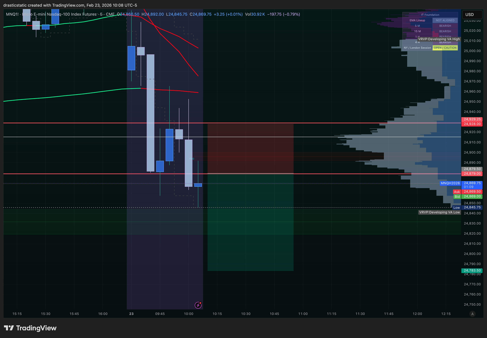
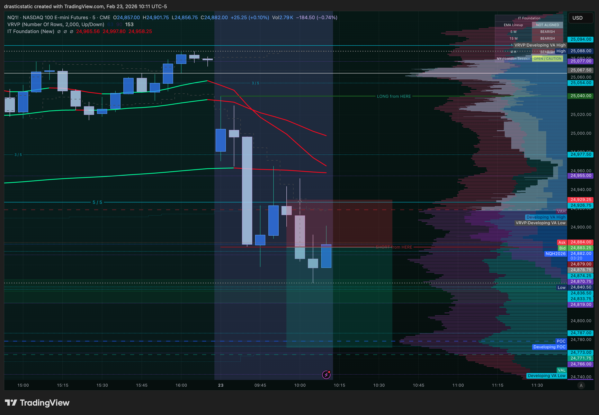
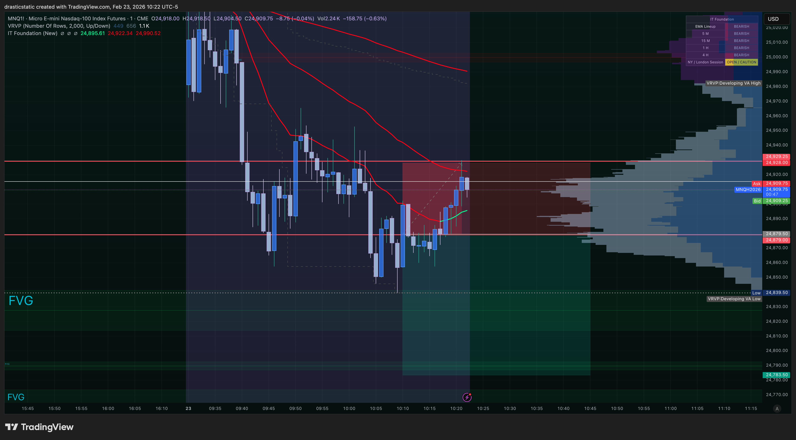
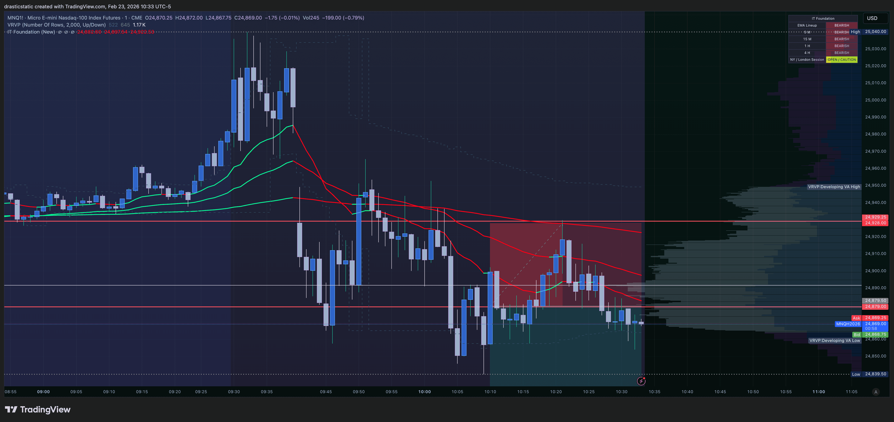
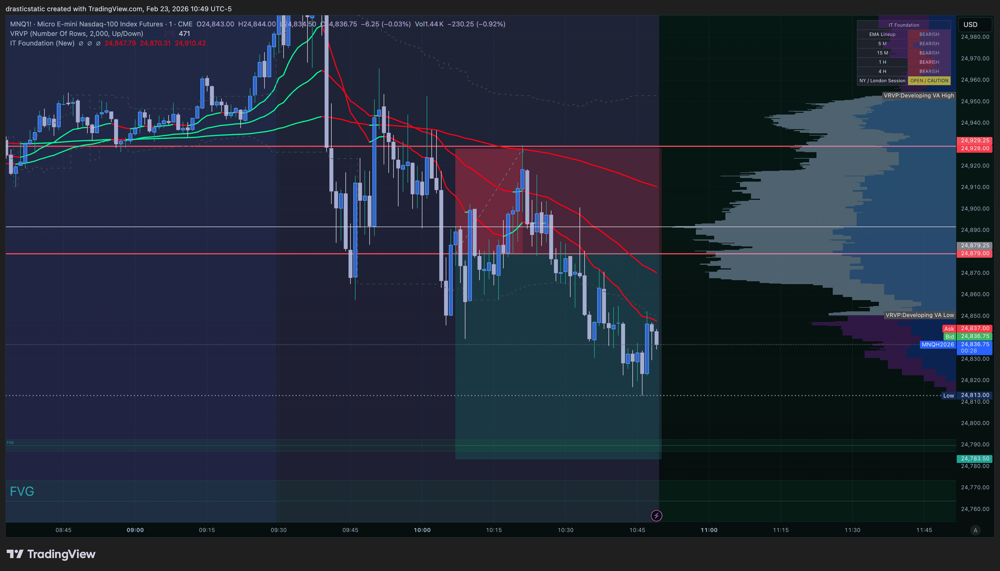
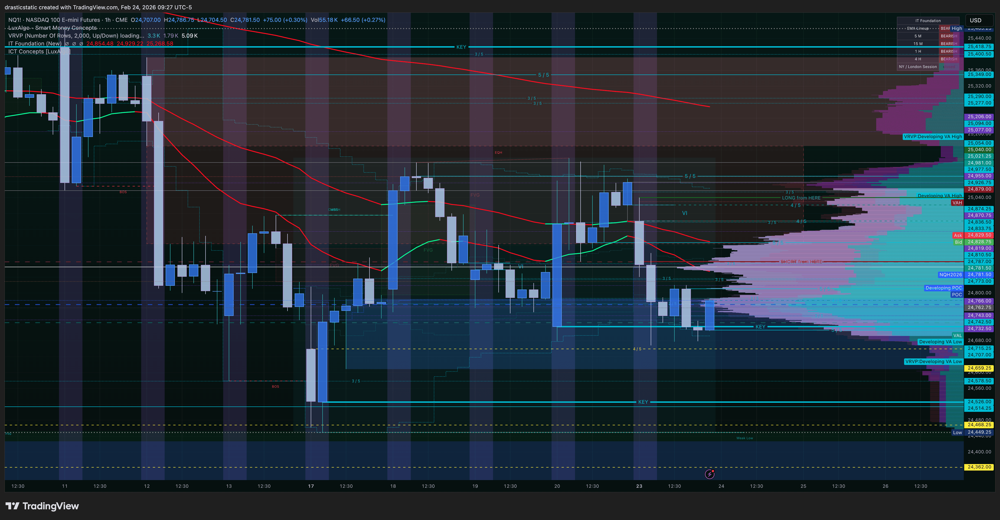
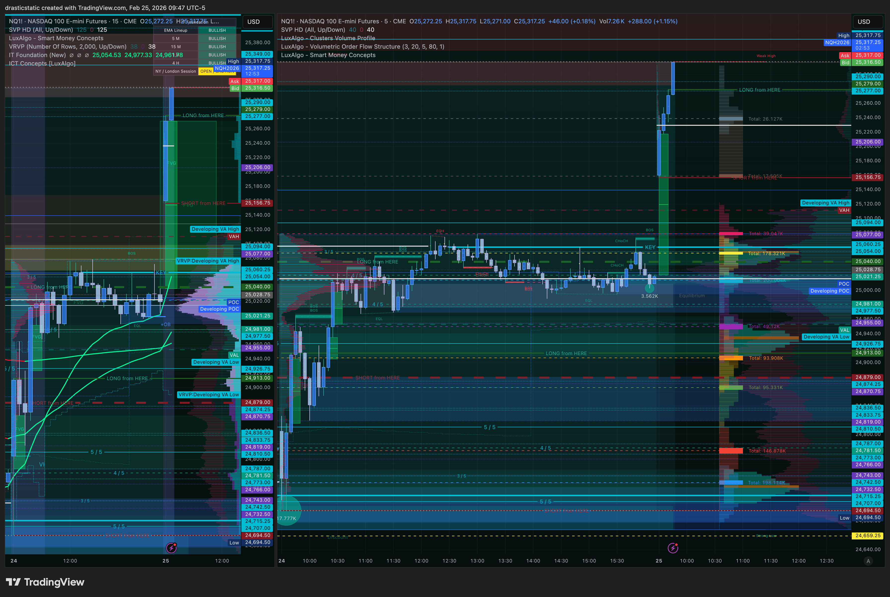
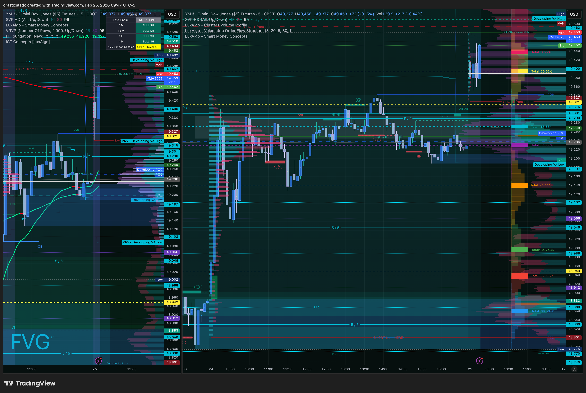
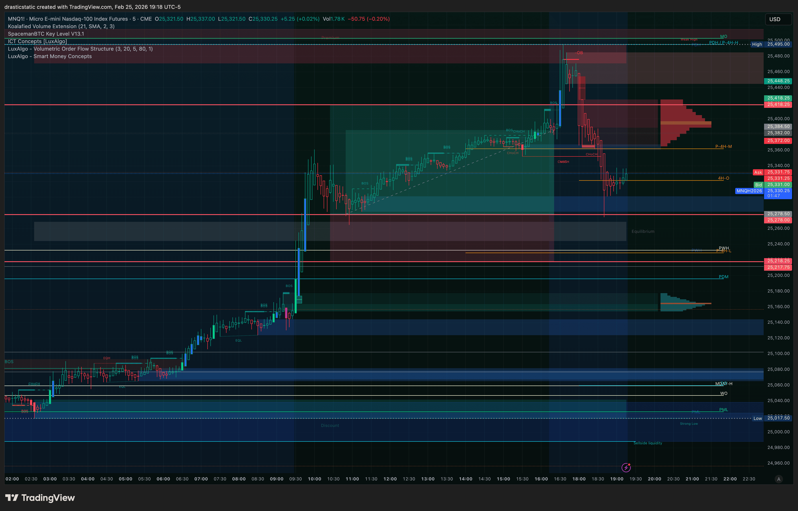

# 📊 Weekly Review — Feb 23–27, 2026
#### **Account:** APEX-484839-05 | MNQ (+ MES, SOL) | Apex Trader Funding
#### **Prepared by:** Fortuna (Claude Code CLI — Wealth Warden Trading Assistant)
#### **For:** STB SmartTraderAI · ZTH · Inevitrade coaches

---

## Week at a Glance

| Date | Instrument | Direction | Entry | P&L | SL | Entry Quality | Stable? |
|------|-----------|-----------|-------|-----|----|---------------|---------|
| Feb 23 | MNQ Short | ↓ Scenario A | 24,879.50 | -$100.50 | ✅ Held | ⚠️ B-grade (3/5 FVG) | No |
| Feb 24 | MES Long | ↑ Scenario B | 6,867.25 | -$35.00 | ✅ Held | ❌ EMA gate ignored | No |
| Feb 25 | MNQ Long | ↑ Scenario B | 25,278.75 | **+$565.00** | ✅ Never threatened | ✅ All 5 layers — A+ | **Yes** |
| Feb 25 | SOL Long | ↑ | — | **+$20.63** | ✅ | ✅ EMA + FVG | **Yes** |
| Feb 26 | MNQ Short | ↓ Scenario A | 25,000.5 | -$558.00 | ✅ Held | ❌ Entry moved off structure | No |
| Feb 27 | — | — | — | — | — | — | — |

**Running P&L (post-blowup):** -$108.87 &nbsp;|&nbsp; **SL Discipline:** 5/5 sessions ✅

---

## Feb 23 — "Right read, wrong level"

**Result: 🔴 -$100.50** &nbsp;|&nbsp; Scenario A SHORT confirmed at 9:45 &nbsp;|&nbsp; SL swept 1 tick, price resumed to full TP

The FCR bearish close was clean. Entry filled in the FVG on retrace. The structural flaw: the FVG was at a 3/5 mitigated level, not a live 5/5 — the SL was placed *at* the 5/5 above, exactly where retail stops cluster. Institutions swept it one tick, reversed, and drove to full TP. He logged it in real-time: *"not an a+ setup."* The awareness is there. The gap is acting on it before the entry.

<table>
<tr>
<td width="33%" align="center">

<br/><sub><b>9:45 AM</b> — FCR candle closes bearish. Scenario A SHORT locked.</sub>
</td>
<td width="33%" align="center">

<br/><sub><b>10:08 AM</b> — MNQ limit entry fills at 24,879.50 in FVG zone.</sub>
</td>
<td width="33%" align="center">

<br/><sub><b>10:11 AM</b> — NQ moves lower. Trade 42% to TP. Looking good.</sub>
</td>
</tr>
</table>

<table>
<tr>
<td width="33%" align="center">

<br/><sub><b>10:22 AM</b> — Retrace. 5/5 level swept 1 tick. SL fills at 24,929.75.</sub>
</td>
<td width="33%" align="center">

<br/><sub><b>10:33 AM</b> — After stop-out, price resumes lower. Direction was right.</sub>
</td>
<td width="33%" align="center">

<br/><sub><b>10:49 AM</b> — Price reaches the original TP at 24,783.50. Setup was valid end-to-end.</sub>
</td>
</tr>
</table>

> **Lesson:** A+ requires FVG entry at a live 5/5 level. 3/5 entry + SL at 5/5 = stop hunt target. If the FVG lands on a mitigated level — skip or add buffer above the 5/5.

---

## Feb 24 — "The veto exists for a reason"

**Result: 🔴 -$35.00** &nbsp;|&nbsp; Macro sell-off day &nbsp;|&nbsp; EMA gate ignored &nbsp;|&nbsp; 66-second trade &nbsp;|&nbsp; SL respected

Pre-market flagged a risk-off sell-off across all three indices. IT Foundation EMAs steeply red dominant. Pre-market plan was explicit: *"red EMA still steeply down at 9:45 = do NOT take this long."* 9:45 closed bearish (Scenario A confirmed). Counter-trend long taken anyway. Emotional state logged: *"anxious, fearful, stressed, greedy."* SL hit 66 seconds after fill. -$35. Floor held — no stop movement. The loss was small and contained. On Feb 13 the same emotional state led to moved stops and blown accounts. Feb 24: the rule held even when the scenario selection failed.

<table>
<tr>
<td width="33%" align="center">

<br/><sub><b>9:27 AM</b> — NQ pre-market. IT Foundation EMAs steeply red dominant. Scenario B gate: closed.</sub>
</td>
<td width="33%" align="center">

<br/><sub><b>9:54 AM</b> — MES counter-trend long order placed. EMA veto already in effect.</sub>
</td>
<td width="33%" align="center">

<br/><sub><b>9:56 AM</b> — SL fills 66 seconds after entry. -$35. No movement. Floor held.</sub>
</td>
</tr>
</table>

> **Lesson:** Red dominant EMAs = no counter-trend long. Hard stop. Both the EMA gate and the emotional threshold said no before this entry. When two independent filters both say no — that's the answer.

---

## Feb 25 — "What it looks like when everything is right"

**Result: 🟢 +$565.00** &nbsp;|&nbsp; Scenario B LONG &nbsp;|&nbsp; Five-layer confluence &nbsp;|&nbsp; 5h 33m &nbsp;|&nbsp; Zella Score: 100

Overnight ETH rally — structural, not a dead-cat bounce. VRVP POC forming in the upper half of the overnight range. 9:45: first candle closed bullish across NQ, ES, YM. IT Foundation EMAs flipped green on all three. Scenario B fully valid. FVG displacement confirmed. Order placed 10:08 — EIA at 10:30 came and went without fill. Post-EIA: ES retesting SHORT from HERE while YM closed above its own level — textbook SMT divergence. Fill at 25,278.75 at 10:53. Fibonacci golden pocket aligned precisely with the entry zone. Five layers. Then he went and worked the lathe.

TP at 25,420 filled at 16:26 — 2 ticks better than target. ZTH's continuation long level was 25,348. He was positioned at 25,278.75 before that level was even reached.

<table>
<tr>
<td width="33%" align="center">

<br/><sub><b>9:47 AM</b> — NQ EMAs flipped green. Scenario B gate: open.</sub>
</td>
<td width="33%" align="center">

<br/><sub><b>9:47 AM</b> — YM EMAs flipped + FVG labeled. All three confirmed.</sub>
</td>
<td width="33%" align="center">

<br/><sub><b>10:08 AM</b> — MNQ order placed in FVG zone. 45-min wait ahead through EIA.</sub>
</td>
</tr>
</table>

<table>
<tr>
<td width="33%" align="center">

<br/><sub><b>10:39 AM</b> — Post-EIA. Order approaching fill zone.</sub>
</td>
<td width="33%" align="center">

<br/><sub><b>11:09 AM</b> — Trade running. HA candles green. He was on the lathe.</sub>
</td>
<td width="33%" align="center">

<br/><sub><b>7:18 PM</b> — Full trade arc. TP hit at 16:26. +$565. SL never touched.</sub>
</td>
</tr>
</table>

> **Lesson:** The five-layer entry filter is the entire game. When all five are present — trust the levels, do other things. The framework did exactly what it was built to do.

---

## Feb 26 — "Right call, wrong address"

**Result: 🔴 -$558.00** &nbsp;|&nbsp; Scenario A SHORT &nbsp;|&nbsp; Correct direction, wrong entry level &nbsp;|&nbsp; SL respected

STB coach entered at 9:15 (OB + SMT, exited 4.44R). ZTH coach called the bounce long — it ran 38.2%–50% Fib. Christopher and Inevitrade members mapped the second retrace: 1-2-3 continuation SHORT at 25,060 with SL above 25,139 (structural first bounce high). The plan was right.

Under time pressure (needed to leave for work), he moved the entry from 25,060 to 25,000.5 to "guarantee the fill." Same SL at 25,093. Risk tripled from $198 to $558. Price peaked at 25,093.5 — the planned 25,060 entry with SL at 25,139 was never threatened. Price continued to 24,954 in ETH. Direction confirmed. Entry was the only error.

<table>
<tr>
<td width="33%" align="center">

<br/><sub><b>9:49 AM</b> — NQ Scenario A SHORT confirmed. STB coach entry visible.</sub>
</td>
<td width="33%" align="center">

<br/><sub><b>11:09 AM</b> — RTY lagging the bounce. SMT divergence = bearish continuation signal.</sub>
</td>
<td width="33%" align="center">

<br/><sub><b>11:22 AM</b> — Full trade plan mapped. Entry: 25,060. SL: 25,139. TP: 24,715. The plan was right.</sub>
</td>
</tr>
</table>

<table>
<tr>
<td width="33%" align="center">

<br/><sub><b>13:35</b> — Two minutes before the FOMO adjustment. Time pressure building.</sub>
</td>
<td width="33%" align="center">

<br/><sub><b>13:37</b> — Entry fills at 25,000.5. Not 25,060. Risk: $558 not $198.</sub>
</td>
<td width="33%" align="center">

<br/><sub><b>14:49</b> — SL fills at 25,093.5. At 25,060 entry / SL 25,139: this level was never reached.</sub>
</td>
</tr>
</table>

<table>
<tr>
<td width="50%" align="center">

<br/><sub><b>23:31</b> — Full RTH + ETH arc. Sell-off → bounce → continuation lower.</sub>
</td>
<td width="50%" align="center">

<br/><sub><b>23:17</b> — ETH: price reaches 24,954. Directional read confirmed. Entry was the work.</sub>
</td>
</tr>
</table>

> **Pattern 5 — Level Abandonment Under Pressure:** Entry is set pre-session in calm analysis. It is not adjusted at execution under time or emotional pressure. If the structural level doesn't fill — that's a neutral outcome. A -$558 loss is not neutral. The FOMO cost more than missing the fill would have.

---

## Feb 27 — Open (Friday)

*Session in progress. This section will be updated if a trade is taken today.*

| Field | Value |
|-------|-------|
| Session | Friday AM — ZTH 7:30 coach session |
| Scenario | TBD — pre-market read pending |
| Trade | None yet |
| P&L | — |

---

## Behavioral Arc — The Week in One View

```
Feb 23  Direction ✅  SL ✅  Entry ❌  (3/5 FVG, not 5/5)
Feb 24  Direction ❌  SL ✅  Entry ❌  (EMA veto ignored)
Feb 25  Direction ✅  SL ✅  Entry ✅  (All 5 layers — A+) → +$565
Feb 26  Direction ✅  SL ✅  Entry ❌  (Level abandoned under pressure)
```

**What is resolved:** Stop movement — 5/5 sessions, zero violations. This was the Feb 13 cause of account loss. It has not reappeared.

**What is the work:** Entry execution. Three different mechanisms (wrong level grade, wrong scenario, FOMO adjustment), same root cause — correct analysis built in calm pre-session work, then modified or overridden at the moment of execution under pressure. Feb 25 showed what's available when the plan is honored end-to-end. That session is the template.

---

## 📎 Full Reviews + Pattern Tracker

- [Pattern Tracker — all sessions, behavioral arc](../reviews/pattern_tracker.md)
- [Feb 23 — MNQ Short -$100.50](../reviews/review_20260223_MNQ_001.md)
- [Feb 24 — MES Long -$35.00](../reviews/review_20260224_MES_001.md)
- [Feb 25 — MNQ Long +$565.00](../reviews/review_20260225_MNQ_001.md)
- [Feb 26 — MNQ Short -$558.00](../reviews/review_20260226_MNQ_001.md)

---

*Built by Fortuna — Wealth Warden | Claude Code CLI*
*Anthropic claude-sonnet-4-6 | Feb 27, 2026 — updated as week progresses*
