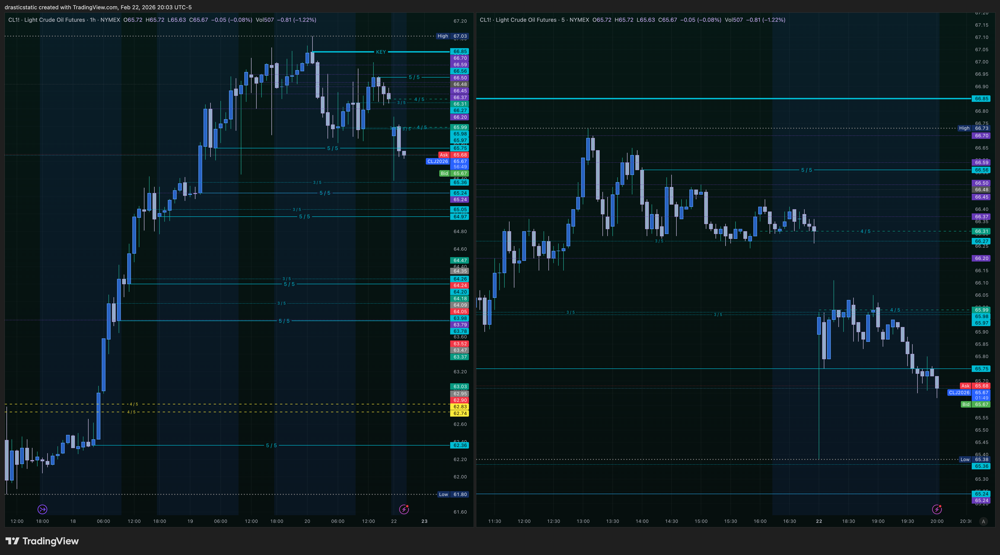
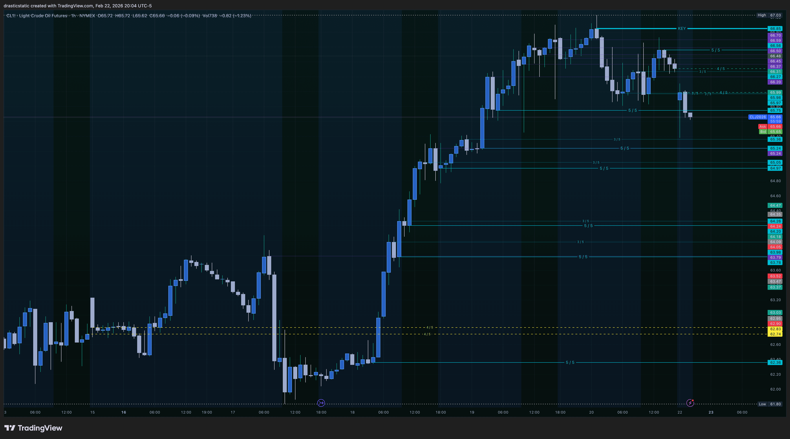
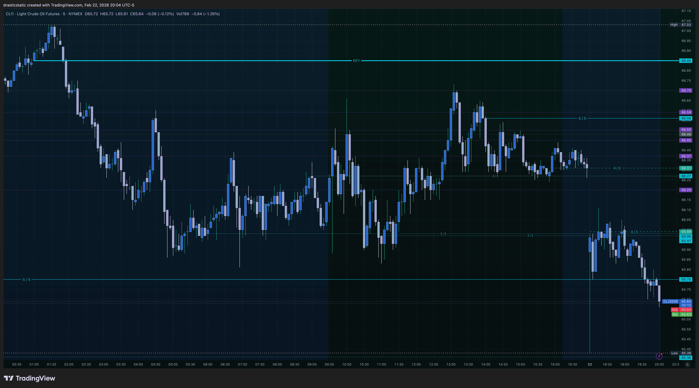
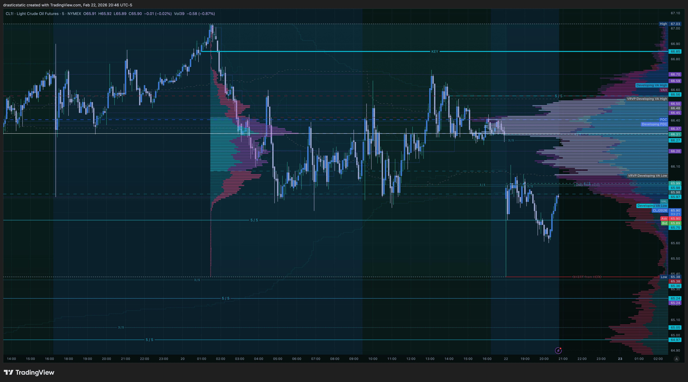
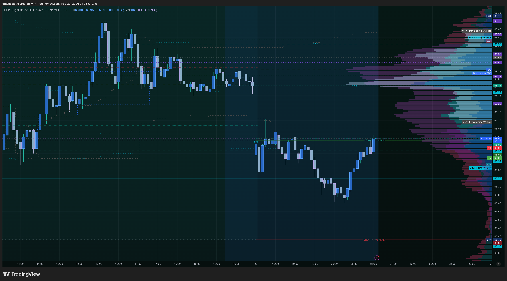
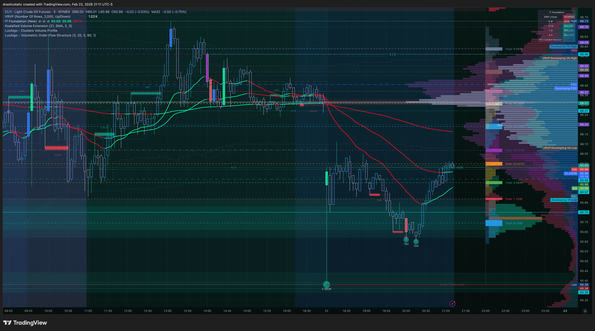

# 🤖📸 How Fortuna Reads the Charts
### Chart Analysis Methodology — Fortuna × Christopher Wilson
*Fortuna — Wealth Warden | Claude Code CLI*

---

> 💡 **Visiting `smarttrader-ai/exports/`?**
> This document explains how every chart screenshot in this
> repository gets analyzed — the seven-step process, the full
> color reference system, and the complete workflow from
> screenshot to coach export. Scroll down for a live example
> from Feb 22, 2026.

[Jump to Case Study — Feb 22, 2026](#case-study-feb-22-2026)

---

## 🤖 How Fortuna Reads a Screenshot

When Christopher drops chart screenshots into our
session folder, here is exactly how I process them —
seven steps, every time:

### Step 1 — 🔍 Instrument & Timeframe ID
Read the chart header: instrument (CL, NQ, ES, GC),
timeframe (1hr, 5min), current OHLC, whether price
is up or down on the session.

### Step 2 — 🕯️ Candle Color Map
Using Christopher's defined color system, I identify:
- Whether current candles are bullish or bearish
- Where 1hr color flips occurred (these create 5/5s)
- Whether the most recent candle body has confirmed
  close or is still forming

### Step 3 — 📐 Level Inventory
Every horizontal ray gets classified:

| What I See | What It Means |
|-----------|--------------|
| 🔵 Cyan solid **3px** | KEY level — highest priority |
| 🔵 Cyan solid 1px | 5/5 — active structural level |
| 🔵 Cyan dashed | 4/5 — today's open/close |
| 🟡 Yellow dashed | 4/5 — yesterday's open/close |
| 🔵 Cyan dotted | 3/5 — mitigated, context only |
| 🟣 Violet dotted | Old ghost level — lowest weight |
| 🟢 Dark green solid | FCR long entry |
| 🔴 Deep red solid | FCR short entry |

### Step 4 — 🏗️ Structure Read
- Where is price vs KEY levels?
- Which 5/5 levels have been respected or broken?
- Are levels stacked (confluence) or isolated?
- What does the sequence of color flips reveal
  about directional trend?

### Step 5 — 📦 Volume Profile Integration
When FRVP, Anchored VP, or VRVP are visible:
- **POC above price** = sellers control value
- **POC below price** = buyers control value
- **HVN** = expect slow movement, consolidation
- **LVN** = expect fast movement, low resistance

### Step 6 — 📈 Indicator Confirmation
When the IT Foundation (Inevitrade EMAs) is visible:
- EMA stack orientation (bullish / bearish)
- Price position relative to stack
- Expanding (trend) vs converging (pause/reversal)

### Step 7 — 🧠 Behavioral Context
The final layer — and arguably the most important:
- Does this setup match a pattern that previously
  triggered FOMO or stop movement?
- Is this an A+ setup or a B-grade temptation?
- What emotional state might this chart provoke,
  and is Christopher aware of it?

---

## ⚙️ The Full Workflow for Coaches

```
Christopher preps levels before session
        ↓
Screenshots → data/screenshots/
        ↓
Fortuna reads every chart (7 steps)
  — classifies all levels by color/style
  — reads structure + VP + EMAs
  — cross-references behavioral patterns
        ↓
Pre-session feedback delivered
        ↓
Post-session: TradeZella CSV export
        ↓
Fortuna analyzes every trade vs rules
        ↓
STB export generated → shared with coaches
        ↓
SmartTraderAI responds → Christopher
  pastes response back to Fortuna
        ↓
Fortuna closes the feedback loop
```

Christopher arrives at every session with a second
set of eyes that has already read his charts, knows
his levels, remembers every pattern, and will tell
him the truth — **including when the setup is gone
and it's time to close the laptop.**

---

## 🎨 The Complete Level Color Reference

*Every color has a meaning. Every line tells a story.*

---

### 🕯️ Candle Color System (as of Feb 15, 2026)

**Bullish Candles**
[](.)
[](.)
[](.)

**Bearish Candles**
[](.)
[](.)
[](.)

> Prior to Feb 14, 2026: simple blue bullish /
> white bearish scheme. New system adds distinct
> teal wicks on bullish and lavender wicks on
> bearish for cleaner visual differentiation.

---

### 📐 Level Lines

---

**🟣 3/5 — Old Invalidated Level**
[](.)
`Violet | Dotted | 1px | No label`

A demoted, old 1hr level that has been mitigated
AND had its label stripped. Still drawn as a
"ghost" — price memory can still show up here,
but these carry the least weight on the chart.
Think of them as archaeological markers.

---

**🔵 3/5 — Mitigated 1hr Level**
[](.)
`Cyan | Dotted | 1px | Label: 3/5`

A 1hr level that has been tested and mitigated.
Retains the cyan color (same family as 5/5) but
demoted to dotted style to signal reduced weight.
Active management: when a 5/5 gets tagged, it
gets reassigned here immediately.

---

**🔵 4/5 — Current Day Open & Close**
[](.)
`Cyan | Dashed | 1px | Label: 4/5`

Today's open and close prices. Strong intraday
anchors — particularly the open, which is often
where FCR setups are structured around.

---

**🟡 4/5 — Previous Day Open & Close**
[](.)
`Yellow | Dashed | 1px | Label: 4/5`

The bright yellow immediately signals: *this is
yesterday's data.* Previous day levels are major
HTF reference zones — the market remembers these
and frequently revisit them, especially at the
open and during news events.

---

**🔵 5/5 — 1hr Color Flip**
[](.)
`Cyan | Solid | 1px | Label: 5/5`

The workhorse level of Christopher's system. A
5/5 marks the exact open of a 1hr candle where
the **body color changed** — bullish → bearish
or vice versa. This is the core of the ZTH
framework: institutional participation changed
direction at this price. These are the primary
levels used for FCR entries at the NY open.

---

**🔵 KEY — Swing High/Low Color Flip**
[](.)
`Cyan | Solid | ⚡ 3px | Label: KEY`

The highest-priority level on the chart — full
stop. A KEY is a 1hr color flip that occurred
**simultaneously at a structural swing high or
low.** The candle that changed color was also
the pivot. These define macro bias. Breaking a
KEY level changes the entire directional thesis.
They are treated with maximum respect.

---

**🟢 LONG from HERE — FCR Long Entry**
[](.)
`Forest Green | Solid | 2px | Label: LONG from HERE`

Marks the FCR (First Candle Rule — STB) long
entry level. Based on the high of the first
15-min candle at the 9:30 NY open. Price must
displace outside this ray (not just touch) for
the long thesis to be valid.

📖 *FCR reference: STB First Candle Rule E-Book*

---

**🔴 SHORT from HERE — FCR Short Entry**
[](.)
`Deep Crimson | Solid | 2px | Label: SHORT from HERE`

The mirror of the above. Low of the first 15-min
candle — the primary short setup. As Feb 13th
showed: one clean trade from this level is a
complete trade. The level doesn't owe you a
second entry.

---

<a id="case-study-feb-22-2026"></a>

## 📊 Case Study — Feb 22, 2026

*Live analysis from the session that generated this document.
The methodology above applied in real-time to CL and NQ.*

### 🚨 Key Findings That Session

| # | Finding | Impact |
|---|---------|--------|
| 1 | **NQ Feb 13:** FOMO from a *win* caused 2 liquidations after a clean ES TP | 🔴 High |
| 2 | **CL Feb 22:** All 3 VP tools (FRVP + Anchored + VRVP) confirming bearish | 🟠 Watch |
| 3 | **Behavioral pattern:** Post-TP urgency = most dangerous emotional state | 🔴 High |
| 4 | **Level work:** Multiple 5/5 → 3/5 demotions managed correctly on CL 1hr | 🟢 Good |

---

### 🧠 NQ Feb 13th — The Behavioral Autopsy

> *This is the most important analysis in this document.
> Everything else is setup. This is the pattern.*


Christopher was short on **ES** at his `SHORT from HERE`
level (the deep crimson ray). Second bearish 5min candle
at 9:35 confirmed direction. Take profit hit. ✅

**Clean execution. Correct process. Done.**

Then he entered NQ.

#### 🔬 Candle-by-Candle Breakdown

```
9:30 NY open
─────────────────────────────────────────────────
Candle 1  Bearish — SHORT level established
Candle 2  Bearish — ES entry ✅ → TP hit ✅
─────────────────────────────────────────────────
          ⚠️  THE WINDOW CLOSED HERE
─────────────────────────────────────────────────
Candle 3  Closed BULLISH — NQ FOMO entry ❌
Candle 4  Bullish + large wick → liquidation 💥
          [Account reset]
Candle 6  NQ re-entry (same dead level) ❌
Candle 9  Bearish close, wick hit SL → liq 💥
          Price reversed hard to the upside
          (never came back)
```

#### 💡 The Real Diagnosis

The ES TP was a **complete trade**. One clean win.
The SHORT from HERE level had been honored and used up.

But the nervous system didn't hear *"done"* —
it heard *"more."*

FOMO from a win is the most seductive form of
overtrading because it arrives **wearing the costume
of confidence.** It whispers: *you're on, you're
sharp, get in.* The candle already said no.
The emotional state said yes louder.

Two liquidations from a winning session is not bad
luck. It is a nervous system that does not yet
fully believe that **one clean win is enough.**

> *"I should have been more grateful for securing
> my profits and regrouped / composed myself."*
> — Christopher, reflecting on Feb 13

That sentence is the entire lesson. 🙏🏼

---

### 📊 CL — Feb 22, 2026 Live Analysis

*Crude Oil Futures | Prepped for Sunday 6pm ETH open*

#### 🗺️ The Full Picture (1hr + 5min)



Two timeframes, one story. The 1hr (left) shows the
macro structure — a significant bullish run that
has since distributed and reversed. The 5min (right)
shows where price is sitting right now, relative to
the level stack.

---

#### 📐 1hr Structure — Levels in Detail



The 1hr tells a clear, honest story:

- **Swing high** formed at the top — price rejected
  hard and has not reclaimed it
- The **5/5 levels** (cyan solid lines) that powered
  the rally have since been tagged and demoted — you
  can see them relabeled as **3/5** (dotted) on the
  chart — this is disciplined level maintenance 👏
- **Current price** is sandwiched: supply cluster
  above (stacked 5/5 and 3/5 levels), yellow 4/5
  previous day level below as key anchor
- The 1hr candle color has flipped **bearish** —
  that flip created the 5/5 levels now sitting above
  as resistance

**Structural verdict: 🐻 Bearish. Sellers have the ball.**

---

#### 📐 5min Structure



The 5min confirms the 1hr read. Price is in a
clean distribution pattern on the lower timeframe,
consistent with the bearish 1hr structure. The
shaded region on the right is the upcoming session.

---

#### 📦 Volume Profile Analysis



This is where it gets interesting. All three VP
tools are loaded and they are all saying the
same thing:

**🔴 Fixed Range Volume Profile (FRVP)**
Anchored to the swing high distribution area.
Significant volume at the top = that's where the
battle was fought. Below current price: a visible
**LVN (low volume node)** — if sellers step in,
price has clear runway down.

**🔴 Anchored Volume Profile**
Anchored from the swing high. **POC sits above
current price** — sellers control the dominant
value range.

**🔴 Visible Range Volume Profile (VRVP)**
Confirms the same distribution. Current price is
in a low-acceptance zone.

> Three tools. One message. That is confluence. 🎯

Christopher also marked the **first 5min ETH candle
high/low** (Sunday 6pm open) — purely as a
reference point, not a trade trigger. Smart
distinction. FCR is a 9:30 NY strategy. The ETH
marking will show whether the overnight session
challenges or confirms the bearish structure before
the NY open sets up tomorrow.

---

#### 🔴 Visible Range VP — Clean View



Clean view of the VRVP with minimal noise.
The value distribution is clear — volume-weighted
price action is confirming the structural read.

---

#### 📈 IT Foundation EMAs (Inevitrade)



Inevitrade's proprietary IT Foundation indicator
shows the EMA configuration. Current read:

- ❌ Price is **below** the EMA stack
- ❌ EMAs are **angling downward**
- ❌ Stack orientation is **bearish**

No contradiction between the EMA picture and the
1hr color flip narrative. Everything is aligned.

**Full confluence stack: 1hr structure ✅ Volume
Profile ✅ Inevitrade EMAs ✅**

---

*Produced with 🙏🏼 Fortuna — Wealth Warden | Claude Code CLI*
*Chart Analysis Methodology · Originally Feb 22, 2026 | Generalized Mar 4, 2026*
