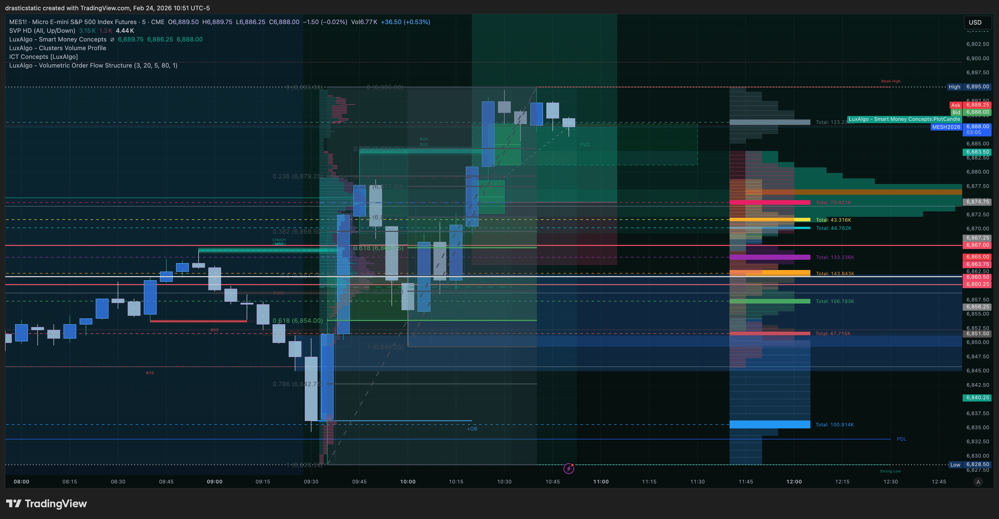

# 🔍 Trade Review — MES Long
### Feb 24, 2026 | FCR + ZTH | Fortuna
*For coaches + SmartTraderAI — Session review*

[Jump to 📝 Notes for Coaches](#notes-for-coaches)

---

> **Result: 🔴 Loss (-$35.00)**
> **Verdict: SL hit 66 seconds after fill. Counter-trend
> entry into a macro bearish sell-off day.**
> **Core lesson: Scenario B counter-trend FCR requires
> strict EMA confirmation before entry. Red dominant =
> do not long.**

---

## ⚡ What Happened in One Paragraph

Christopher completed strong pre-market analysis flagging
the Feb 24 open as a major bearish event day across all
equity indices. The first 15-min FCR candle closed at 9:45
with a bearish first candle, consistent with Scenario A
SHORT. Despite this, Christopher placed a LONG order at
9:54 AM on MES (Scenario B counter-trend) citing the ZTH
1-2-3 setup and FCR FVG. The entry filled at 6,867.25 at
09:55:16 EST. The stop at 6,860.25 was hit 66 seconds
later at 09:56:22 EST. The TP at 6,883.50 was canceled.
Net loss: -$35.00. He logged his emotional state as
"anxious, fearful, stressed, greedy." He respected the
stop. The trade was Scenario B (counter-trend) in a macro
bearish context where IT Foundation EMAs were steeply red
dominant — the one condition that required the long to be
skipped. He did not move the stop. That is the behavioral
win for the day.

---

## 📊 Trade Data

| Field | Value |
|-------|-------|
| **Instrument** | MES (Micro E-mini S&P 500) |
| **Direction** | Long |
| **Entry Price** | 6,867.25 |
| **Entry Time** | 09:55:16 EST |
| **Entry Type** | Limit order on FVG retrace |
| **Stop Loss** | 6,860.25 |
| **Take Profit** | 6,883.50 (canceled at SL hit) |
| **SL Distance** | 7.00 pts (28 ticks) |
| **TP Distance** | 16.25 pts (65 ticks) |
| **R:R Planned** | 2.32 : 1 |
| **Exit Time** | 09:56:22 EST |
| **Duration** | 66 seconds |
| **Gross P&L** | -$35.00 |
| **Commission** | $0.00 |
| **Net P&L** | -$35.00 |
| **Setup tagged** | ZTH 1-2-3, STB FCR |
| **Bias** | Bullish lower TF / bearish higher TF |
| **Emotional state** | Anxious, fearful, stressed, greedy |
| **SL respected** | Yes ✅ |
| **Emotionally stable** | No |

---

## 📋 Order Execution (Broker — Tradovate)

| Time | Order | Price | Status |
|------|-------|-------|--------|
| 09:54:04 | Buy MES (long entry — limit) | 6,867.25 | ✅ Filled 09:55:16 |
| 09:55:16 | Sell MES (TP — limit) | 6,883.50 | ❌ Canceled (SL hit) |
| 09:55:16 | Sell MES (SL — stop) | 6,860.25 | ✅ Filled 09:56:22 |

*Total session trades after this: 0 filled.
Trade 002 (6,888 limit) was placed but never filled.*

---

## 📖 Session Narrative

Feb 24 was a risk-off macro sell-off day. The pre-market analysis was explicit: IT Foundation EMAs steeply red dominant on all three indices, Scenario B LONG vetoed before the open. The 9:45 first candle closed bearish — Scenario A SHORT confirmed. Christopher took a counter-trend MES long anyway. Sixty-six seconds later the SL was hit for −$35. The emotional state logged in TradeZella: anxious, fearful, stressed, greedy.

The loss was small and entirely contained because the SL held — the habit established after Feb 13 was intact. The EMA gate said no. The emotional state said no. Both filters were visible and both were overridden. On Feb 13 the same override led to stop movement and blown accounts. On Feb 24: the SL held. That is the only thing that separates the two days.

---

## 📸 Screenshot Timeline

---

### Phase 1 — Pre-Market Context (9:26–9:36 AM)

All pre-market screenshots across NQ, ES, YM documented
in `premarket_20260224_NQ.md`, `premarket_20260224_ES.md`,
and `premarket_20260224_YM.md`.

```
9:26–9:37 AM: NQ, ES, YM pre-market screenshots taken
  → IT Foundation EMAs: STEEPLY RED DOMINANT on all three
  → VRVP POC: Above price on all three — bearish
  → Overnight sell-off: ~$600+ points on NQ from Monday
  → SESSION RISK ALERT: Broad risk-off event across all
    equity indices + metals (GC, SI)
  → PRIMARY SCENARIO: Scenario A SHORT (triple bearish)
  → Scenario B LONG requires EMA flatness/reversal → NOT
    present this session
```

---

### Phase 2 — First Candle (9:30–9:45 AM)

```
9:45 AM first candle result on MES/ES:
  → First candle closed BEARISH
  → Confirms Scenario A — this is a SHORT day
  → ES Scenario A: TP pointing lower toward KEY support

Correct FCR call per pre-market plan:
  → SHORT from HERE ray at 9:45 candle LOW
  → Wait for FVG displacement BELOW on 5-min
  → Short entry, 2:1 TP below
  → IT Foundation EMAs red dominant = do NOT counter-trend
```

---

### Phase 3 — Entry Setup (9:54 AM)

**MES 5-min + ES at 9:54**


```
Entry thesis (counter-trend / Scenario B):
  → ZTH 1-2-3 pattern identified on lower TF
  → FVG at 6,868 area (FCR FVG candidate)
  → ORDER BLOCK below at 6,858–6,862 cited as support floor
  → Entry: 6,867.25 (limit on FVG retrace)
  → SL:    6,860.25 (below the OB)
  → TP:    6,883.50 (2:1 R:R, just above prior HOD)

TradeZella logged entry logic:
  "fear of missing out, fvg"

The conflict:
  → Higher TF bias: BEARISH (IT Foundation red dominant)
  → Lower TF setup: BULLISH (1-2-3, FVG)
  → Pre-market plan: Scenario B only valid IF EMAs show
    flatness or early reversal signal
  → EMAs at 9:45 close: STILL STEEPLY RED DOMINANT
  → CONCLUSION: This trade did not meet the Scenario B
    entry condition. It was a B-grade entry at best and
    a clear violation of the pre-market plan criteria.
```

---

### Phase 4 — Trade Active + Stop Hit (9:55–9:56 AM)

```
09:55:16  → Entry filled at 6,867.25
09:56:22  → SL hit at 6,860.25 (66 seconds later)
           → TP at 6,883.50 canceled

Price action after fill:
  MES immediately moved AGAINST the long — consistent with
  Scenario A (the bearish resolution of the first candle).
  Price broke below the OB (6,858–6,862) without support,
  confirming the bearish continuation thesis was correct.
  The macro sell-off was the dominant force.

Duration: 66 seconds.
MFE (max favorable): not meaningful — trade never gained
MAE (max adverse): 7.0 pts adverse = full SL distance
```

---

### Phase 5 — Post-Trade

After the stop hit, Christopher reset mentally and continued
monitoring. He identified two further trade ideas (Trade 002
and Trade 003 — the afternoon SMT divergence read). Those
are documented in `STB_export_20260224_daily-review.md`.

---

## ✅ What Went Well

```
1. SL FULLY RESPECTED — BEHAVIORAL WIN
   → Stop at 6,860.25 hit → closed immediately
   → No "give it a minute," no SL movement
   → TradeZella confirms: "respected, stop hit" ✅
   → -$35 is the maximum risk. Plan held.
   → This was the core lesson from Feb 11 vs Feb 13.
     Feb 24: the rule held.

2. MENTAL RESET AFTER LOSS
   → Post-loss mental state logged as GOOD (6–7/10)
   → "mental state is good, that first $35 'loss' was
     a good way to start off and get the nervousness
     out of my system, sticking to the plan, and able
     to better see the trend now"
   → Loss used as calibration, not as emotional hit
   → This is the correct post-loss response

3. CONTINUED MONITORING WITHOUT CHASING
   → After Trade 001 loss, did not immediately re-enter
   → Spent time analyzing structure (Trade 002 at 6,888)
   → Trade 002 had stronger parameters:
     → HVN entry (vs FVG alone)
     → SL below 5/5 (structural)
     → TP at 5/5 above (structural)
     → R:R 1.86:1
   → Showed patience and structural thinking post-loss

4. PRE-SESSION PREP WAS EXCELLENT
   → Full pre-market across 5 instruments completed
   → SESSION RISK ALERT flagged correctly
   → Level Quality Inventory, Pre-Entry Checklist present
   → The prep was right. The execution deviated from prep.

5. RTY SMT MONITORING
   → Extended the analysis to include RTY (Russell 2000)
     for added confluence on Trade 002
   → Correct multi-instrument SMT thinking
```

---

## ⚠️ The Core Issue — Counter-Trend Entry
### With Red Dominant EMAs

The pre-market plan for Feb 24 was explicit:

```
From premarket_20260224_NQ.md:

SCENARIO B — Triple bullish close (counter-trend)
  → "Requires EMAs to show flattening/early reversal
    signal"
  → "red EMA still steeply down at 9:45 = do NOT take
    this long"
  → "This is a B-grade setup in the best case. Very
    strict."

The EMA condition at 9:45 close on Feb 24:
  → IT Foundation: RED DOMINANT, STEEPLY DOWN
  → Identical to pre-market screenshots at 9:26–9:37 AM
  → No flattening, no reversal signal
  → CONCLUSION: Scenario B long criteria NOT MET
```

Trade 001 was a counter-trend long into a steeply bearish
EMA stack on a macro risk-off sell-off day. The pre-market
plan had a specific filter for this — and the filter said
no. The entry happened anyway.

```
What the trade was:
  → Scenario B counter-trend (bullish lower TF)
  → Into bearish higher TF (macro sell-off)
  → With steeply red EMAs (Scenario B disqualifier)
  → Emotional state: anxious, fearful, stressed, greedy
  → Duration: 66 seconds
  → Result: full SL hit

What the trade needed to be:
  → Either: No trade (Scenario B criteria not met)
  → Or:     Scenario A SHORT (the pre-market primary plan)
            with bearish FVG on 5-min + 5/5 alignment
```

---

## 💡 The Adjustment

```
A+ TRADE FILTER (applies to all Scenario B longs):

  CHECK 1: What do the IT Foundation EMAs look like at
           the time of the planned entry?
    → Green dominant or flattening = Scenario B possible
    → Red dominant (any degree): NO LONG. FULL STOP.

  CHECK 2: Is this the primary scenario from pre-market?
    → Primary: Scenario A SHORT this session
    → If taking Scenario B: extra conviction required
      (EMA + strong KEY level hold + candle structure)

  CHECK 3: Emotional state at entry:
    → "Anxious, fearful, stressed, greedy" =
      below 6/10 threshold → NO TRADE regardless of setup
    → Feb 24 premarket plan: "Mental state: 6/10 or above"
    → This trade was below that threshold. The rule was
      already set. It was not followed.

THE RULE IN ONE LINE:
  Red dominant EMAs = no counter-trend long. Period.
```

---

## 💡 What Would A+ Have Looked Like?

```
The A+ trade on Feb 24 was Scenario A:

  9:45 close: BEARISH (confirmed)
  → SHORT from HERE on NQ/MNQ
  → 5-min FVG displacement BELOW first candle low
  → Entry: limit on FVG retrace (bearish FVG zone)
  → SL: HIGH of FVG candle 1 (above the FVG)
  → TP: 2:1 R:R below entry (fixed, no adjustment)
  → EMA confirmation: red dominant = bearish trend ✅
  → SMT: NQ, ES, YM all bearish first candle ✅
  → Setup grade: A+ (triple confirmation + trend aligned)

What Christopher chose instead:
  → Scenario B counter-trend long (lower TF only bias)
  → Against steeply red EMAs (explicit disqualifier)
  → In macro risk-off context (sell-off day)
  → With "anxious, fearful, stressed, greedy" state

The A+ was available. The B-grade was taken.
The pre-market work identified the A+.
The execution chose the B-.
```

---

<a id="notes-for-coaches"></a>

## 📝 Notes for Coaches + SmartTraderAI

**Setup:** FCR Scenario B (counter-trend long) on a macro
bearish sell-off day. ZTH 1-2-3 pattern on lower TF with
FVG at 6,868. Structurally a plausible lower-TF long idea.
The disqualifying factor: IT Foundation EMAs were steeply
red dominant at the time of entry — the explicit Scenario B
veto condition from the pre-market plan.

**Execution:** Limit order on FVG was correct mechanics.
SL at 6,860.25 was respected when hit 66 seconds later.
TP was set correctly at 2:1 R:R. The process held. The
scenario selection was the flaw.

**The one adjustment:** When pre-market flags a Scenario B
long as only valid with EMA confirmation (flatness or green
flip) — and the EMAs are steeply red at entry time — the
trade does not meet criteria. It should not be taken. The
pre-market plan correctly identified this boundary. The
execution crossed it anyway.

**Behavioral:** Four emotional flags at entry
(anxious, fearful, stressed, greedy). Below the 6/10
mental state threshold established in the pre-market
plan. The emotional state was a second independent
disqualifier. Either one alone (red EMAs, or below-6/10
state) should have stopped this entry. Both were present.

**Positive behavioral marker:** The stop was respected at
-$35.00. This is not a small thing. On Feb 13, the same
emotional triggers led to moved stops and account-ending
losses. On Feb 24, -$35 was accepted cleanly. The
behavioral improvement is measurable and real.

---

## 🧠 Behavioral Notes (from TradeZella)

| Field | Logged | Fortuna's Read |
|-------|--------|----------------|
| Emotions | Anxious, fearful, stressed, greedy | Four emotional flags simultaneously — this is not a 6/10 mental state. The threshold was not met. |
| Affected decisions | Yes | Self-logged honestly. Confirms the entry was not process-driven. |
| Entry logic | "fear of missing out, fvg" | FOMO again — same as Feb 23. Pattern is consistent. |
| Was emotionally stable | No | Consistent with the 4-flag emotional state logged above. |
| Mistakes | "continued to retrace after entry, stopped out" | Correctly identified the result but not the root cause (wrong scenario) |
| What I did well | "committed to plan, realized trade was moving opposite direction" | SL respected = behavioral win. This matters. |
| Rating | 2.32:1 R:R | The setup R:R was fine. The problem was scenario selection. |

**The behavioral pattern on Feb 24:**

```
Pre-session: Nervous about $ and time spent trading.
             Aware of missing work hours to trade.
9:45 close:  Bearish first candle (Scenario A confirmed)
9:54 entry:  Counter-trend long placed (Scenario B)
             → Emotional drivers: FOMO, anxiety
9:56 SL:     Hit. -$35.
Post-loss:   Mental reset, logging good. Improved from
             prior sessions.

Pattern match: Feb 13 → emotions → wrong position
Pattern match: Feb 23 → FOMO → B-grade entry
Pattern match: Feb 24 → anxiety/greedy → wrong scenario

The difference Feb 24: SL was respected. -$35 not -$3,500.
The similarity: The emotion preceded the wrong choice.
```

---

## 🔁 Pattern Tracker

> Full progress tracker (all sessions, behavioral arc, compliance scores, statistical summary):
> **[`pattern_tracker.md`](../../pattern_tracker.md)**

*This trade's entry: Feb 24 MES — SL respected ✅, wrong scenario taken (EMAs vetoed, ignored), -$35.00. Next layer identified: entry filter.*

---

## 🎯 Forward Focus

1. **Scenario B long veto: red EMAs = no long. Hard stop.** The pre-market plan said it explicitly. The EMA stack at 9:45 was still steeply red dominant — the same as at 9:26 pre-market. No counter-trend long when the gate is closed. No exceptions.
2. **Emotional state check before every entry.** Four flags (anxious, fearful, stressed, greedy) simultaneously = below the 6/10 threshold set in the pre-market plan. Either disqualifier alone — red EMAs or emotional state — should have stopped this entry. Both were present.
3. **The pre-market plan exists for this exact moment.** It was written during calm analysis and identified the Scenario B boundary correctly. Trust the plan at execution time, not the in-the-moment feeling that overrides it.

---

*🙏🏼 Fortuna — Wealth Warden | Claude Code CLI*
*Anthropic claude-sonnet-4-6 | Feb 24, 2026*
*Trade data sourced from TradeZella export + Tradovate Orders.csv*
