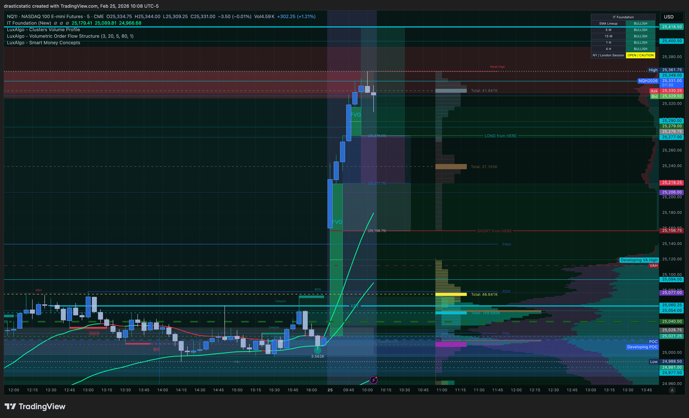
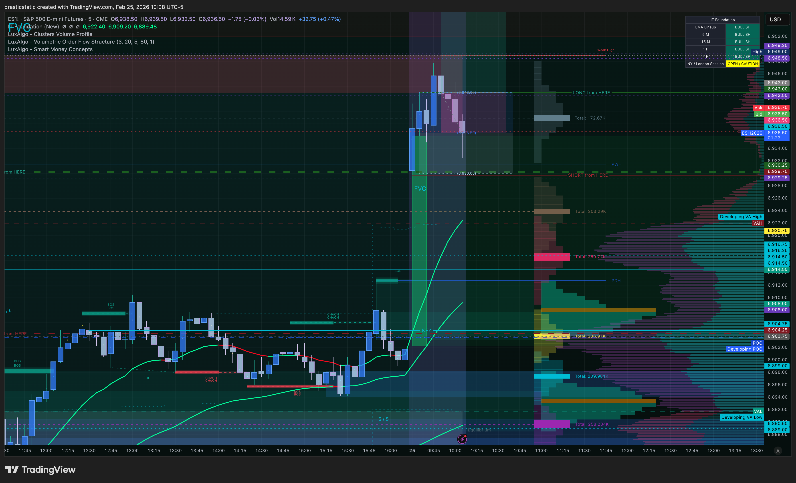
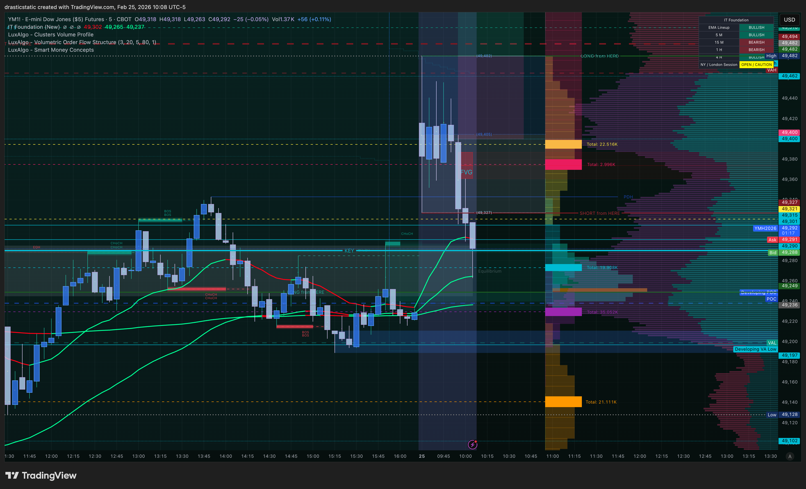
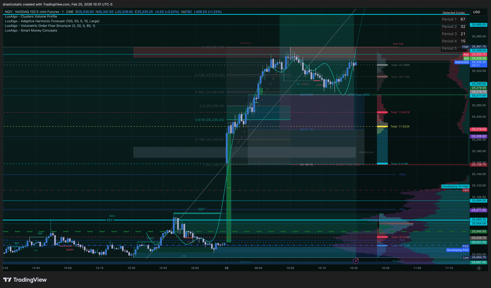
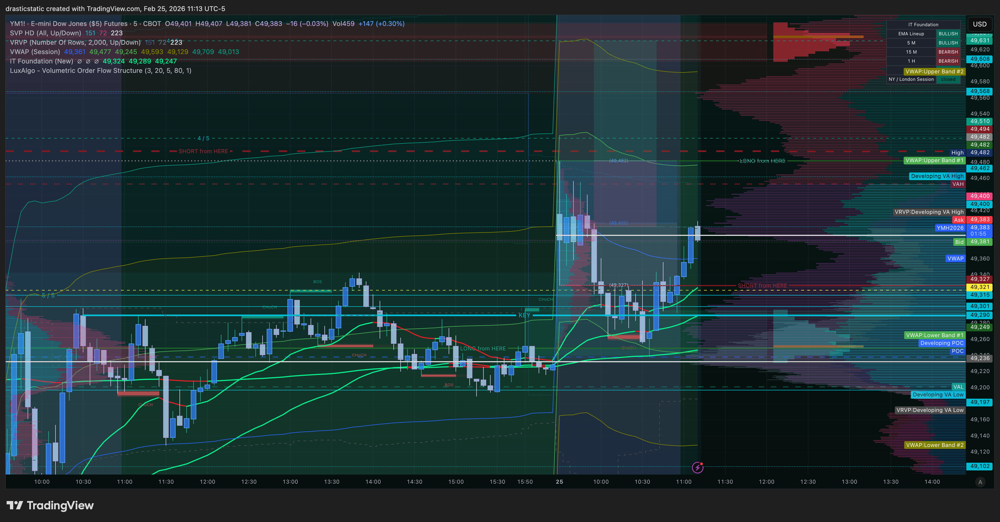
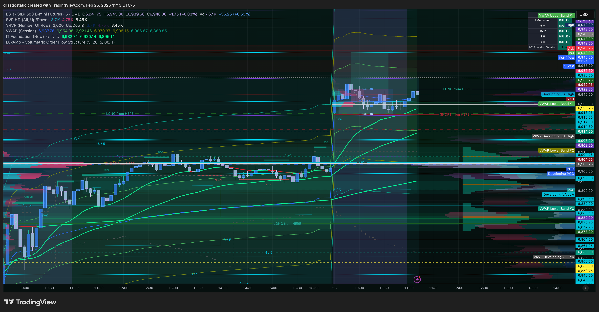
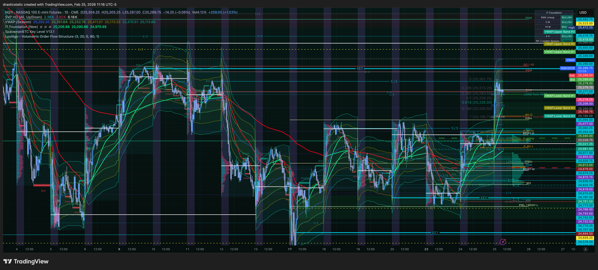
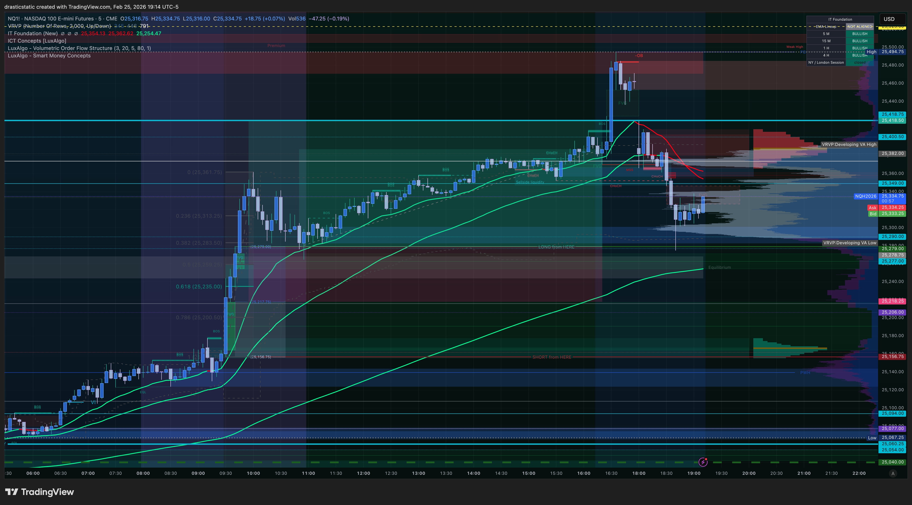

# 🔍 Trade Review — MNQ Long
### Feb 25, 2026 | FCR + ZTH + IT Foundation | Fortuna
*For coaches + SmartTraderAI — Session review*

[Jump to 📝 Notes for Coaches](#notes-for-coaches)

---

> **Result: 🟢 Winner (+$565.00)**
> **Verdict: Five-layer confluence. 2.32 R:R. TP hit cleanly at 16:26 ET.**
> **Core lesson: The entry filter is the entire game. Honor all five layers, trust the levels, do other things.**

---

## ⚡ What Happened in One Paragraph

After a two-day sell-off (Feb 23–24), a sustained overnight ETH rally set up a genuine Scenario B LONG on Feb 25. The first 15-min candle closed bullish across NQ, ES, and YM at 9:45 AM. IT Foundation EMAs flipped green dominant on all three — Scenario B fully valid, no EMA veto. A large impulse candle at 9:50 created FVG displacement above the first candle high. Christopher placed a MNQ limit buy in the FVG zone at 10:08 AM; it was not filled during the EIA Crude Oil spike at 10:30 (correct risk management), and filled cleanly post-EIA at 10:53:18 EST at 25,278.75. At the exact moment of fill, ES was retesting its SHORT from HERE level while YM was closing above its own — textbook SMT divergence confirming institutional support. The Fibonacci 0.5–0.618 golden pocket from LOD to HOD aligned precisely with the entry zone, completing a five-layer confluence stack. Christopher held past 4 PM RTH close with a structured plan (1.272 Fib target at 25,418, hard stop 4:30 PM), working the lathe while the trade ran. TP at 25,418 filled at 25,420.00 at 16:26:32 ET — 2 ticks better than target. SL at 25,218.50 was never threatened. Net: +$565.00. Zella Score: 100. First emotionally stable session of the recovery arc.

---

## 📊 Trade Data

| Field | Value |
|-------|-------|
| **Instrument** | MNQ (Micro E-mini Nasdaq-100) |
| **Direction** | Long (Scenario B — counter-trend after two-day sell-off) |
| **Entry Price** | 25,278.75 |
| **Entry Time** | 10:53:18 EST |
| **Order Placed** | 10:08:03 EST (45-min wait through EIA) |
| **Entry Type** | Limit buy — FVG zone post-EIA |
| **Contracts** | 2 MNQ (MNQH6) |
| **Stop Loss** | 25,218.50 — Canceled ✅ Never hit |
| **SL Distance** | 60.25 pts (241 ticks) |
| **Take Profit** | 25,418 (target) / 25,420.00 (fill — 2 ticks better) |
| **TP Distance** | 141.25 pts (565 ticks) |
| **R:R Planned** | 2.32 : 1 |
| **R:R Actual** | 2.34 : 1 (TP filled 2 ticks above target) |
| **Exit Time** | 16:26:32 EST |
| **Duration** | 5h 33m 14s |
| **Gross P&L** | +$565.00 |
| **Commission** | $0.00 (Apex Trader Funding) |
| **Net P&L** | +$565.00 |
| **Points** | 141.25 |
| **Zella Score** | 100 |
| **Rating** | 4 / 5 |
| **Emotionally stable** | Yes ✅ (first time in recovery arc) |
| **Emotions logged** | Happy, confident, anxious, neutral, excited |
| **Mistakes logged** | None |
| **Playbook** | STB \| FCR |
| **Account** | APEX-484839-05 (Apex Trader Funding 100K Full Reset-3) |

---

## Session Header

```
DATE: February 25, 2026
SESSION: RTH (9:30–16:00 ET) + ETH runner (to ~16:30 ET)
ACCOUNT: APEX-484839-05 (Apex Trader Funding 100K Full Reset-3)
MARKET: MNQ (executed — WINNER)
COACHES ON CALL: STB + ZTH — 9:30 AM open session (FCR framework, first candle)
                 Inevitrade — 11:00–13:00 ET live call (watching MNQ + SOL)
```

---

## Trade Summary

```
Instrument: MNQ (Micro E-mini Nasdaq-100)
Direction:  LONG
Entry:      25,278.75 (limit fill in FVG zone — 10:53:18 EST)
            [Pre-CSV estimate was ~25,234–25,264 area; actual fill: 25,278.75]
SL:         25,218.50 — never hit (canceled when TP filled)
TP:         25,418 target / 25,420.00 filled (2 ticks better)
R:R:        2.32 planned / 2.34 actual
Result:     WINNER — +$565.00

SL respected: Yes — never threatened after fill
Revenge trading: None
```

---

## Trade 001 — MNQ LONG (EXECUTED — WINNER)

### Setup

```
Account:    APEX-484839-05
Instrument: MNQ (Micro E-mini Nasdaq-100)
Direction:  LONG (Scenario B — counter-trend after two-day sell-off)
Framework:  ZeroToHero FCR + IT Foundation EMAs + Fibonacci golden pocket

Entry:      Limit buy — FVG zone (filled 25,278.75 at 10:53:18 EST)
            Order placed 10:08:03 AM — waited 45 min through EIA window
            3rd candle wick: 25,234 (structural reference for SL)
SL:         25,218.50 (below FVG candle 3 wick — structural placement)
TP:         25,418 (key level — also near 1.272 Fib extension)
R:R:        2.32
Result:     TP HIT ✅ — ~16:25–16:30 ET (stayed in past RTH close)
```

### Pre-Entry Confluence Stack (5 layers)

```
1. FCR Scenario B — LONG from HERE triggered at first candle HIGH ✅
   First 15-min candle (9:30–9:45 ET) closed BULLISH.
   LONG from HERE marked at first candle HIGH.

2. IT Foundation EMAs — GREEN DOMINANT ✅
   Green EMA crossed ABOVE red EMA on NQ, ES, and YM (1hr charts).
   Scenario B EMA veto completely removed.

3. FVG displacement confirmed ✅
   Large impulse candle at ~9:45–9:50 created FVG above first
   candle HIGH. Limit entry placed in the FVG zone.

4. SMT divergence (bullish) ✅
   ES pulled back to test SHORT from HERE level (providing fill).
   YM closed ABOVE SHORT from HERE level (relative strength).
   ES liquidity grab → YM holding = institutional support confirmed.

5. Fibonacci golden pocket ✅
   0.5–0.618 retracement from LOD → HOD landed precisely in the
   FVG / SL zone. Five-layer confluence at a single price area.
```

### Session Narrative

```
Pre-market (9:18–9:28 AM):
  Six screenshots submitted — 1hr structure + 5min RTH + 5min ETH.
  ETH context revealed a sustained overnight rally (not a weak bounce)
  from the Feb 24 lows. All three instruments rallied nearly
  uninterrupted through the full ETH session. VRVP POC forming in
  the upper half of overnight range = institutional value shifted
  higher overnight. Two-way setup confirmed for 9:45.

9:45 AM — First candle close:
  BULLISH across NQ, ES, and YM.
  LONG from HERE + SHORT from HERE both marked (correct practice).
  IT Foundation EMAs: green crossed above red on all three.
  Scenario B fully valid — no EMA veto.

9:50–10:08 AM:
  Large impulse candle created FVG on NQ and ES.
  YM retraced significantly more than NQ/ES (noted as SMT observation).
  Limit order placed on MNQ in FVG zone at 10:08:03 AM.

10:08–10:39 AM:
  EIA Crude Oil Inventory released at 10:30 ET.
  Order not filled pre-EIA. Price came close but bounced.
  Post-EIA (10:39): price came back toward entry zone.
  YM: putting in higher highs and higher lows — bullish structure.
  ES: double-tested SHORT from HERE level and held both times.
  NQ: bounced off 25,264, heading back up.
  Momentum hierarchy: YM > ES > NQ.

10:53:18 AM — FILLED:
  Limit order filled in FVG zone as ES retested SHORT from HERE.
  YM simultaneously closing ABOVE its SHORT from HERE level.
  SMT divergence at exact moment of fill = optimal entry confirmation.
  Fib 0.5–0.618 golden pocket aligned with entry zone.

11:00–13:00 PM — Inevitrade call:
  Christopher joined Inevitrade coaching call while in the trade.
  Coaches watching MNQ and SOL.
  ZTH coaches waiting for continuation long at 25,348 — never triggered.
  Christopher was already in the trade from 25,278.75 and mentioned it in chat.
  Coaches excited. This validated the pre-market read.
  ZTH's continuation entry at 25,348 was on the PATH to Christopher's TP
  at 25,418 — Christopher was positioned before that level was even reached.

Post-Inevitrade:
  Strong conviction to stay in trade past 4 PM.
  Reason: 1.272 Fib extension sitting a few ticks above TP at 25,418.
  Key institutional target = additional conviction to hold.
  Christopher was running machines (lathe) — not watching every tick.
  This was the correct behavioral approach. Trade managed itself.

16:26:32 ET — TP HIT:
  Price filled TP at 25,420.00 — 2 ticks better than 25,418 target.
  No manual intervention required.
  Hard stop: 4:30 PM ET — TP hit before the hard stop.
  Session closed with clean 2.34 R:R win (+$565.00 on 2 contracts).
```

### Behavioral Score

```
Entry filter:      ✅ All 5 criteria met before entry
EMA check:         ✅ Green dominant confirmed — no veto triggered
SL discipline:     ✅ Never moved, never threatened after fill
TP discipline:     ✅ Set and left alone (TP hit cleanly without manual exit)
Conviction hold:   ✅ Stayed in past 4 PM with structured plan
                      (4:30 hard stop — rule followed)
No overtrading:    ✅ One trade, one clean exit
Working while in:  ✅ Running lathe — not watching every tick
                      This is the correct relationship with a
                      properly structured trade. Trust the levels.
```

---

## 📋 Order Execution (Broker — Tradovate)

| Time (EST) | Order | Price | Status |
|------------|-------|-------|--------|
| 10:08:03 | Buy 2 MNQ (long entry — limit) | 25,278.75 | ✅ Filled 10:53:18 |
| 10:53:18 | Sell 2 MNQ (TP — limit) | 25,419.25 | ✅ Filled 16:26:32 at 25,420.00 |
| 10:53:18 | Sell 2 MNQ (SL — stop) | 25,218.50 | ❌ Canceled (TP hit first) |

*Order placed 10:08 AM. EIA at 10:30 — not filled during spike. Filled post-EIA at 10:53 when price returned to FVG zone with confirming structure. TP filled 2 ticks better than target. SL canceled when TP hit.*

---

## 📖 Session Narrative

After a two-day sell-off (Feb 23–24), a sustained ETH rally set up a genuine Scenario B LONG on Feb 25. IT Foundation EMAs flipped green dominant across all three indices at the 9:45 first candle close. Christopher placed a MNQ limit buy in the FVG zone at 10:08 AM — held patiently through the EIA Crude Oil window at 10:30 — and filled post-EIA at 10:53:18 at 25,278.75. At the exact moment of fill, ES retested its SHORT from HERE level while YM closed above its own — textbook SMT divergence confirming institutional support. All five confluence layers aligned simultaneously at the entry zone. Christopher worked the lathe while the trade ran, holding past 4 PM RTH close with a structured plan (1.272 Fib extension at 25,418, hard stop 4:30 PM). TP hit at 25,420.00 at 16:26:32 ET — 2 ticks better than target. First emotionally stable session of the recovery arc.

---

## 📸 Screenshot Timeline

| Time (ET) | File | Description |
|-----------|------|-------------|
| 9:18 AM | `ES1!_2026-02-25_09-18-16_d7885.png` | ES 1hr — structure + new key level |
| 9:18 AM | `NQ1!_2026-02-25_09-18-28_5fee4.png` | NQ 1hr — structure + VRVP |
| 9:18 AM | `YM1!_2026-02-25_09-18-43_b90c9.png` | YM 1hr — structure + VRVP |
| 9:22 AM | `YM1!_2026-02-25_09-22-38_4581e.png` | YM 5min — FCR context |
| 9:22 AM | `ES1!_2026-02-25_09-22-50_c7f06.png` | ES 5min — FCR context |
| 9:23 AM | `NQ1!_2026-02-25_09-23-06_57ef6.png` | NQ 5min — FCR context |
| 9:27 AM | `NQ1!_2026-02-25_09-27-15_1fba5.png` | NQ ETH — sustained overnight rally |
| 9:27 AM | `ES1!_2026-02-25_09-27-51_cb238.png` | ES ETH — overnight rally |
| 9:28 AM | `YM1!_2026-02-25_09-28-17_c51af.png` | YM ETH — VRVP POC upper range |
| 9:46 AM | `ES1!_2026-02-25_09-46-35_99871.png` | ES — EMAs flipped + FCR levels |
| 9:47 AM | `NQ1!_2026-02-25_09-47-07_9804f.png` | NQ — EMAs flipped + FCR levels |
| 9:47 AM | `YM1!_2026-02-25_09-47-49_a7bd4.png` | YM — EMAs flipped + FVG labeled |
| 9:58 AM | `ES1!_2026-02-25_09-58-24_16314.png` | ES — FVG displacement confirmed |
| 9:58 AM | `NQ1!_2026-02-25_09-58-37_0c637.png` | NQ — FVG displacement confirmed |
| 9:58 AM | `YM1!_2026-02-25_09-58-52_def8d.png` | YM — deeper retracement noted |
| 10:08 AM | `NQ1!_2026-02-25_10-08-30_98062.png` | NQ — post-EIA setup context |
| 10:08 AM | `ES1!_2026-02-25_10-08-37_731b8.png` | ES — FVG zone approach |
| 10:08 AM | `YM1!_2026-02-25_10-08-43_b532d.png` | YM — YM/ES divergence |
| 10:08 AM | `Screenshot 2026-02-25 at 10.08.15.png` | MNQ — order setup visible |
| 10:29 AM | `Screenshot 2026-02-25 at 10.29.52.png` | MNQ — order 1min + bracket |
| 10:31 AM | `NQ1!_2026-02-25_10-31-39_ef4ac.png` | NQ 1min — post-EIA reaction |
| 10:39 AM | `Screenshot 2026-02-25 at 10.39.19.png` | MNQ — order approaching fill |
| 11:09 AM | `Screenshot 2026-02-25 at 11.09.58.png` | MNQ — trade running, HA candles |
| 11:13 AM | `YM1!_2026-02-25_11-13-05_8058b.png` | YM — HH/HL structure confirmed |
| 11:13 AM | `ES1!_2026-02-25_11-13-37_a5bad.png` | ES — holding structure |
| 11:16 AM | `NQ1!_2026-02-25_11-16-03_0dbf8.png` | NQ — 5min consolidation |
| 11:55 AM | `Screenshot 2026-02-25 at 11.55.07.png` | MNQ HA — consolidation phase |
| 7:14 PM | `NQ1!_2026-02-25_19-14-04_96085.png` | NQ ETH — full day arc + TP hit |
| 7:18 PM | `MNQ1!_2026-02-25_19-18-13_6354e.png` | MNQ HA + Koalified Volume — full trade |

**10:08 AM — NQ / ES / YM post-EIA setup context**

**10:08 ET — NQ post-EIA setup context**


**10:08 ET — ES FVG zone approach**


**10:08 ET — YM YM/ES divergence visible**


**10:31 AM — NQ 1min post-EIA reaction**


**11:13 AM — YM + ES structure confirmation**

**11:13 ET — YM HH/HL structure confirmed**


**11:13 ET — ES holding structure**


**11:16 AM — NQ 5min consolidation**


**7:14–7:18 PM — Full day arc + trade result**



---

## Strategy Execution Scores

```
ZeroToHero Compliance Score: 10/10
  + Pre-market levels marked and ready ✓
  + First candle rule applied correctly ✓
  + LONG from HERE + FVG entry ✓
  + EMAs confirmed before entry (no veto override) ✓
  + SL placed structurally (below FVG candle wick) ✓
  + SL never touched ✓
  + TP hit at key level ✓
  + No overtrading ✓
  + Conviction hold to 1.272 fib target with structured plan ✓
  + Hard stop rule followed (4:30 PM hard stop — TP hit before it) ✓

Inevitrade Compliance Score: 10/10
  + IT Foundation EMAs confirmed green dominant before entry ✓
  + Coaches validated read live on call (11:00–13:00) ✓
  + Was already in the trade when Inevitrade coaches arrived ✓
  + Was positioned before ZTH continuation level (25,348) was reached ✓

STB/ICT Framework Score: 10/10
  + FCR setup executed correctly ✓
  + SMT divergence (YM strong / ES testing) identified at fill ✓
  + Fibonacci golden pocket confluence identified independently ✓
  + No coach-lag pattern — reversed from Feb 24 ✓

Overall Discipline Score: 10/10
  Best executed session of the recovery arc.
```

---

<a id="notes-for-coaches"></a>

## 📝 Notes for Coaches + SmartTraderAI

**Setup:** Scenario B LONG on Feb 25, 2026 after a two-day sell-off. Five-layer confluence: (1) FCR first candle bullish close across NQ/ES/YM, (2) IT Foundation EMAs green dominant on all three, (3) FVG displacement above first candle HIGH, (4) SMT divergence at fill (YM above SHORT from HERE, ES retesting it), (5) Fibonacci golden pocket 0.5–0.618 aligned with entry zone. EIA Crude Oil Inventory at 10:30 correctly managed — order placed pre-EIA, not filled during spike, filled post-EIA at 10:53.

**Execution:** 2 MNQ contracts (MNQH6). Entry 25,278.75 at 10:53:18 EST. Exit 25,420.00 at 16:26:32 EST (2 ticks better than 25,418 target). SL 25,218.50 — never threatened, canceled when TP hit. Duration: 5h 33m. Points: 141.25. P&L: +$565.00. R:R actual: 2.34.

**Coach context:** STB = FCR at the 9:30 AM open (more STB strategies to come). ZTH = setups monitored all day long, not limited to the open. Inevitrade = IT Foundation strategies applied outside the NY AM session. All groups interact across sessions and masterclasses. On Feb 25, ZTH was waiting for a continuation long at 25,348 that never triggered — Christopher was already positioned at 25,278.75 before ZTH's level was reached. When the Inevitrade call opened at 11:00 AM, coaches found Christopher already in the trade and validated the read live.

**Behavioral:** First emotionally stable session of the recovery arc. No mistakes logged by TradeZella. Zella Score 100. Emotions present (anxious, excited) but did not drive the entry — the rules did. Held with structured conviction past 4 PM (1.272 Fib target, 4:30 hard stop). Worked the lathe during the hold.

**Framework portability:** Same IT Foundation EMA crossover + FVG pullback setup produced a winning SOL/USDT trade on BTCC on the same day. The edge is structural, not instrument-specific.

---

## 🧠 Behavioral Notes (from TradeZella)

| Field | Logged | Fortuna's Read |
|-------|--------|----------------|
| Emotions | Happy, confident, anxious, neutral, excited | Anxious and excited are present but not dominant. Happy and confident led. First emotionally healthy entry in the recovery arc. |
| Emotionally stable | Yes ✅ | First time since recovery arc began. A meaningful marker. |
| Affected decisions | Not logged as affected | No emotional override — the rules drove the entry, not anxiety. |
| Entry logic | FVG + FCR + IT Foundation EMAs | Process-driven. The framework was the trigger, not FOMO. |
| Mistakes logged | None | TradeZella found no errors. Coaches validated live. Structure validated at TP. |
| Rating | 4 / 5 | Near-perfect. Zella suggested price reached 25,495 by 5 PM — additional upside after TP. |
| Zella Score | 100 | Highest possible score. |

**The behavioral shift from Feb 23–24 to Feb 25:**

```
Feb 23: "Excited, anxious" — FOMO entry into B-grade level
Feb 24: "Anxious, fearful, stressed, greedy" — wrong scenario
Feb 25: "Happy, confident, anxious, neutral, excited" — correct scenario,
        all five confluence layers honored, emotionally stable: YES

The anxious feeling did not disappear on Feb 25.
What changed: the anxiety did not drive the entry.
The rules drove the entry. That is the difference.
```

---

## Discipline Notes

**What went right — every single step:**

1. **Pre-market analysis was complete.** All levels marked, all scenarios planned, ETH context read correctly. The sustained overnight rally upgraded Scenario B from theoretical to probable — and that read was right.

2. **Entry filter held.** Five layers of confluence confirmed before a single dollar was risked. This is the entry discipline that Feb 24 lacked and today delivered.

3. **The EIA window was managed correctly.** Order placed before EIA, not filled during the spike, filled cleanly post-EIA when the structure confirmed. The volatile candle was behind the entry — not around it.

4. **SMT read at fill.** YM closing above SHORT from HERE while ES retested it = textbook SMT divergence bullish signal. The fill happened at the exact institutional support moment.

5. **Fibonacci confluence identified independently.** The golden pocket alignment was a self-discovered confluence — not coached in real time. This shows the analytical framework is being internalized.

6. **Worked the lathe while the trade ran.** This is the correct relationship with a properly structured trade. Set the levels. Trust the levels. Do other things. The trade did exactly what the levels said it would.

7. **Held conviction past 4 PM with a structured plan.** The conviction to stay was grounded in the 1.272 fib target, not emotion. The hard stop at 4:30 was set and respected. TP hit before the hard stop.

8. **Was already positioned when coaches looked at the trade.** On Feb 24, the coach-lag pattern occurred with STB & ZTH during the 9:30 AM open session — following their entries late = wrong timing. On Feb 25, ZTH was waiting for a continuation entry at 25,348 that never triggered. Christopher was already in from 25,278.75. When the Inevitrade call opened at 11:00 AM, he was in the trade and shared it — coaches were excited. The framework put him in before either group's confirmation level was reached.

---

## Patterns Confirmed

**The recovery arc is complete:**
```
Feb 13: Stops moved, accounts blown. The low point.
Feb 23: SL respected. FOMO noted. Direction correct, structure wrong.
Feb 24: SL respected. Wrong scenario taken. Entry filter identified as next layer.
Feb 25: Entry filter locked in. Five-layer confluence. Clean 2.34 R:R win.
        Double green (MNQ + SOL). Coaches validated live.
        The framework works. The discipline works.
```

---

## 🔁 Pattern Tracker

> Full progress tracker (all sessions, behavioral arc, compliance scores, statistical summary):
> **[`pattern_tracker.md`](../../pattern_tracker.md)**

*This trade's entry: Feb 25 MNQ — emotionally stable ✅, all 5 confluence layers ✅, SL never threatened ✅, +$565.00. Recovery arc complete.*

---

## 🎯 Forward Focus

1. **Carry this forward, not backward.** Today is not a reason to size up or take more trades. It is proof that the system works when the rules are followed. Follow the rules again.

2. **Pre-market discipline.** Same process: screenshots before open, levels marked, scenarios planned, ETH context reviewed.

3. **One clean trade is a complete session.** Today proved this. The MNQ trade was complete. The SOL trade was a bonus. Both worked because both had structure.

4. **The entry filter is now a habit — protect it.** The Feb 24 lesson (EMAs bearish = no counter-trend long) was tested today in reverse (EMAs bullish = Scenario B valid). Both directions of the rule held.

---

> See full trade review: https://github.com/drasticstatic/trading-assistant-public-preview/blob/main/smarttrader-ai/reviews/2026/02-Feb/review_20260225_MNQ_001.md

*🙏🏼 Fortuna — Wealth Warden | Claude Code CLI*
*Anthropic claude-sonnet-4-6 | Feb 25, 2026*
*Trade data sourced from TradeZella export + Tradovate Orders.csv*
