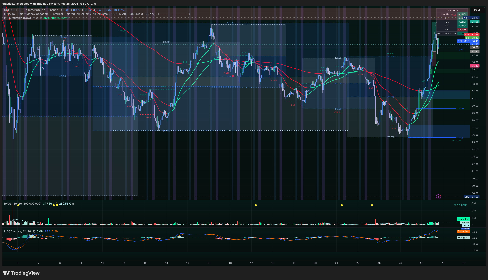
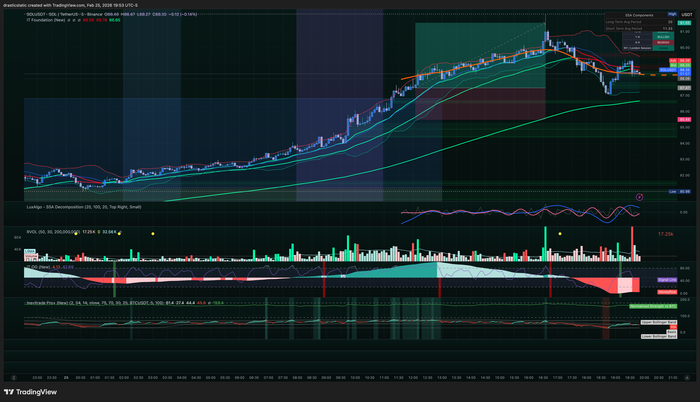

# 🔍 Trade Review — SOLUSDT Long
### Feb 25, 2026 | IT Foundation EMAs + FVG | Fortuna
*For coaches + SmartTraderAI — Session review*

---

> **Result: 🟢 Winner (+$20.63 USDT)**
> **Verdict: IT Foundation EMA crossover + FVG pullback — same framework as MNQ, applied to crypto.**
> **Core lesson: The edge is structural, not instrument-specific. Rode the trend, exited near HOD.**

---

## ⚡ What Happened in One Paragraph

Strong overnight bullish price action on SOL/USDT set up an IT Foundation EMA crossover on the chart — green crossed above red, the same structural crossover that appeared on NQ, ES, and YM on Feb 25. Price pulled back into a Fair Value Gap zone, providing the entry. During the Inevitrade live call (operating outside the NY AM session, as is the Inevitrade model), coaches were watching SOL simultaneously. Christopher identified the setup independently and entered long on BTCC at $87.4701 at 12:04:57 ET using the $20 voucher with 20x leverage on 5 SOL. Held for approximately 2.5 hours. Exited at $91.5556 at 14:36:26 ET near the session high of day. Price subsequently pulled back to $89.16 at the time of evening review, confirming the exit was well-timed. Profit: +$20.63 USDT. BTCC account now carries a positive balance. Framework portability confirmed: the same structural setup — IT Foundation EMA crossover + FVG pullback — produced winning trades on NQ futures and SOL crypto on the same day.

---

## 📊 Trade Data

| Field | Value |
|-------|-------|
| **Platform** | BTCC (crypto futures) |
| **Instrument** | SOL/USDT perpetual futures |
| **Direction** | Long |
| **Leverage** | 20x |
| **Size** | 5 SOL |
| **Entry Price** | $87.4701 |
| **Entry Time** | 12:04:57 ET |
| **Exit Price** | $91.5556 |
| **Exit Time** | 14:36:26 ET |
| **Duration** | ~2 hours 31 minutes |
| **Move** | +$4.09 (+4.68%) |
| **Gross Profit** | +$20.63 USDT |
| **Net Profit** | +$20.63 USDT |
| **Transaction ID — Open** | 122544060 |
| **Transaction ID — Close** | 122547713 |
| **Exit vs HOD** | Near HOD — price at $89.16 at 19:35 ET review (well below exit) |
| **Setup** | IT Foundation EMA crossover + FVG pullback |
| **Framework** | Inevitrade — applied outside NY AM session |
| **BTCC account status** | Positive balance secured post-trade ✅ |

---

## 📋 Order Execution (Platform — BTCC)

| Transaction ID | Action | Price | Time (ET) | Status |
|----------------|--------|-------|-----------|--------|
| 122544060 | Buy 5 SOL (long entry) | $87.4701 | 12:04:57 | ✅ Filled |
| 122547713 | Sell 5 SOL (close long) | $91.5556 | 14:36:26 | ✅ Filled |

*BTCC perpetual futures position using $20 voucher. 20x leverage on 5 SOL. Opened during Inevitrade live call — Inevitrade framework applied outside NY AM session, per the group's model. Closed near session HOD. Both transaction IDs confirmed in BTCC trade history screenshot (19:35 ET).*

---

## 📸 Screenshot Timeline

| Time (ET) | File | Description |
|-----------|------|-------------|
| ~19:35 | `Screenshot 2026-02-25 at 19.35.51.png` | BTCC — trade history + P&L confirmed |
| ~19:52 | `SOLUSDT_2026-02-25_19-52-26_f9147.png` | SOL — IT Foundation EMAs + crossover |
| ~19:53 | `SOLUSDT_2026-02-25_19-53-03_7dc5b.png` | SOL — full trade arc + entry/exit zone |





---

### Chart Notes

```
IT Foundation EMA chart (SOLUSDT):
  Left side shows prior bearish structure (red dominant).
  EMA crossover visible — green breaks above red.
  FVG pullback entry area clearly identifiable.
  Same visual pattern as NQ on Feb 25 — mirror structure.

Full arc chart:
  Overnight → morning rally visible.
  Entry in the FVG pullback zone at $87.47.
  Continuation to exit near HOD at $91.56.
  LuxAlgo Detrended indicator at bottom confirms momentum.
  RSI/MACD supporting bullish read at entry.

BTCC trade history (Screenshot 19:35):
  Both positions visible in trade log.
  Opening buy at $87.4701 confirmed.
  Closing sell at $91.5556 confirmed.
  Profit: +20.63 USDT logged and visible.
```

---

## 🧠 Behavioral Notes

| Field | Observed | Fortuna's Read |
|-------|----------|----------------|
| Setup identification | Independent — not following a coach | Christopher identified the EMA crossover and FVG setup before coaches triggered. Correct model. |
| Direction | With the trend (EMA crossover bullish) | Not counter-trend. Correct read. Same framework that worked on MNQ. |
| Inevitrade involvement | Coaches watching SOL on the live call | Validation, not the trigger. The trigger was the framework. |
| Exit timing | Exited at $91.5556 near HOD | Price at $89.16 at 19:35 review confirms exit was correct. Not greedy, not early. |
| Leverage / sizing | 5 SOL, 20x, $20 voucher | Controlled risk given the voucher size. No oversize. |
| Emotionally stable | Yes (same session as MNQ 100 Zella stable rating) | Consistent behavioral state across both trades on the day. |
| Mistakes | None logged | Clean execution — in with the trend, out near HOD. |

**Same-session consistency:**

```
Feb 25 MNQ: Zella Score 100, emotionally stable ✅
Feb 25 SOL: Same structural framework, same behavioral state ✅

Two instruments, two platforms, same day, same framework, same result.
The edge transfers. The discipline transfers.
```

---

## Setup Rationale

```
Framework: IT Foundation EMAs + FVG pullback (identical model to MNQ trade)

Signal stack:
  1. Strong bullish price action overnight in crypto ✅
  2. IT Foundation EMAs: green crossed ABOVE red (EMA crossover)
     → Same structural crossover pattern as NQ/ES/YM on Feb 25
     → Bearish → bottom → crossover → bullish continuation
  3. Pullback into FVG zone — same entry model as the MNQ trade
  4. Bullish momentum confirmed on EMAs at entry
  5. Entered with the trend, not against it

Context:
  Opened during Inevitrade live call (12:04 ET) — Inevitrade strategies
  are applied outside the NY AM session, consistent with their model.
  Coaches were watching SOL simultaneously on the call.
  Christopher identified the setup independently and entered.
  Inevitrade coaches provided additional confluence confirmation.

Price at evening review (~19:35 ET): $89.1567
  → Exit at $91.5556 was near the session HOD — well-timed exit.
  → Price came back to $89.16 after close — correct decision to exit.
```

---

## Key Observations

```
1. Framework portability confirmed.
   The IT Foundation EMA crossover + FVG pullback entry produced
   winning trades on NQ futures AND SOL crypto on the same day.
   The same structural pattern appeared on both instruments.
   The edge is not instrument-specific — it is structural.

2. Rode the wave instead of fighting it.
   Prior crypto trades may have involved overthinking or
   counter-trend positioning. Today: identified the trend
   (EMAs bullish, FVG pullback), entered with it, exited near HOD.
   Simple, clean, correct.

3. Exit timing was excellent.
   Closed at $91.5556 near the HOD.
   Price at review time ($89.16) confirms the exit was right.
   Not greedy, not early. At the structural level.

4. The $20 BTCC voucher produced a real, positive balance.
   This account now has a positive balance after the voucher trade.
   The platform and instrument have been validated for future use.

5. Inevitrade framework outside NY AM session — working as designed.
   Inevitrade strategies are intended for outside the NY AM session.
   SOL trade opened at 12:04 ET (NY AM close approaching) and ran
   into the afternoon. This is the correct application window.
```

---

## 📝 Notes for Coaches + SmartTraderAI

**Setup:** IT Foundation EMA crossover (green above red) on SOL/USDT — same structural pattern as NQ, ES, YM on the same day. Pullback into FVG zone provided the entry. Taken during Inevitrade live call, consistent with the Inevitrade model (strategies outside NY AM session). Coaches watching SOL simultaneously — provided confluence, not the trigger.

**Execution:** BTCC perpetual futures, 5 SOL, 20x leverage, $20 voucher. Entry $87.4701 at 12:04:57 ET (Transaction ID: 122544060). Exit $91.5556 at 14:36:26 ET (Transaction ID: 122547713). Duration: ~2.5 hours. Move: +$4.09 (+4.68%). Profit: +$20.63 USDT. Exited near HOD — correct read.

**Coach context:** Inevitrade = IT Foundation strategies applied outside NY AM session. STB = FCR at the 9:30 AM open (more strategies to come). ZTH = setups monitored all day long. This trade was opened at 12:04 ET during the Inevitrade afternoon call window — correct framework, correct time.

**Behavioral:** Same emotional stability as the MNQ trade on the same day (Zella Score 100, emotionally stable). No mistakes. Independent setup identification. Exited at the structural level, not at emotion or greed. BTCC account positive balance secured.

**Framework portability note:** MNQ and SOL both produced winners on Feb 25 using the same IT Foundation EMA crossover + FVG pullback framework. Two instruments, two platforms, one structural edge. This is worth tracking going forward as additional instruments are added.

**Forward focus:**
1. Continue applying IT Foundation framework outside NY AM session on crypto when setup appears.
2. BTCC account now has a positive balance — treat it as a real account with real risk management.
3. Track whether the same crossover + FVG pattern appears on other instruments.

---

## 📖 Session Narrative

Feb 25 was the A+ session — double green day on MNQ (+$565) and SOL (+$20.63 USDT). The SOL trade on BTCC ran in parallel with the MNQ hold and confirmed the same thesis: IT Foundation EMA crossover green dominant + FVG pullback = long entry. SOL/USDT entered near the session open and exited near the HOD without intervention.

The framework is not instrument-specific — the same structural logic that identified a Scenario B LONG on MNQ also found the same setup on SOL. Both instruments, same day, same edge. Emotionally stable for the first time in the recovery arc. The rules drove both entries; neither was FOMO.

---

## 🔁 Pattern Tracker

> Full progress tracker (all sessions, behavioral arc, compliance scores, statistical summary):
> **[`pattern_tracker.md`](../../pattern_tracker.md)**

*This trade's entry: Feb 25 SOL — emotionally stable ✅, IT Foundation EMA crossover + FVG pullback ✅, exited near HOD ✅, +$20.63 USDT. Framework portability confirmed across instruments.*

---

*🙏🏼 Fortuna — Wealth Warden | Claude Code CLI*
*Anthropic claude-sonnet-4-6 | Feb 25, 2026*
*Trade data sourced from BTCC transaction history | Screenshots taken 19:35–19:53 ET*
