# Trade Review — Monday, March 2, 2026
#### Christopher Wilson | Fortuna — Wealth Warden
#### Trade 2 of 3 | ES Pivot Sell — A+ Trade | Account: APEX-484839-05

[Jump to 📝 Notes for Coaches](#notes-for-coaches)

---

## ⚡ What Happened in One Paragraph

The A+ trade of the day. At 10:00 AM ET, ISM Manufacturing PMI printed a beat and sent all three equity indices spiking hard into overhead supply. Christopher did not chase — he waited. Over the next 78 minutes he watched the divergence form: RTY and YM began rolling over while NQ held elevated — classic SMT. When ES printed a CHoCH and displacement to the downside (CISD — Change in State of Delivery), he entered a Scenario A SHORT at 6,876.50 at 11:18 AM. Nine minutes later, price hit full TP at 6,855.75 for +$1,037.50. No SL movement. No second-guessing. No partials — 1 contract, full TP. Position MAE was only +$50 (essentially went straight down). Zella Score: 94.05. Full process. This is the standard.

---

## 📊 Trade Data

| Field | Value |
|-------|-------|
| Instrument | ESH6 (E-mini S&P 500, $50/pt) |
| Direction | SHORT |
| Entry | 6,876.50 |
| Exit (TP) | 6,855.75 |
| Points | +20.75 |
| P&L | **+$1,037.50** |
| Entry Time | 11:18 AM ET |
| Exit Time | 11:27 AM ET |
| Hold Time | ~9 minutes (~527 sec) |
| Confluence Grade | A — all 5 layers present |
| Zella Score | **94.05** |
| TradeZella Rating | 4.0 / 5 |
| Position MAE | +$50 (barely moved against — straight line to TP) |
| Position MFE | +$1,100 (price touched 6,854.50 — slightly through TP) |
| Entry Model | CISD — Change in State of Delivery |
| Playbook | ZTH \| Pivot |

---

## 📋 Order Execution (Broker — Tradovate / APEX)

| Time (ET) | Action | Instrument | Price | Qty |
|-----------|--------|------------|-------|-----|
| 11:18 AM | Sell | ESH6 | 6,876.50 | 1 |
| 11:27 AM | Buy | ESH6 | 6,855.75 | 1 |

Account: APEX4848390000005 | No open position after TP hit

---

## 📖 Session Narrative

After the FOMO YM scalp at the open (T1), Christopher sat on his hands for 78 minutes. ISM Manufacturing PMI printed a beat at 10:00 AM — the market spiked hard into overhead supply on all three indices. Rather than chasing the spike, he watched. SMT divergence developed: RTY and YM rolled off the highs while NQ held elevated. When ES printed a CHoCH and bearish displacement candle, he entered short at 6,876.50.

Nine minutes later the trade closed at TP — +$1,037.50. The entire session context (ETH red dominant, IT Foundation EMAs capping the bounce, SMT divergence, CISD entry model, Fib 0.5 confluence) confirmed simultaneously at the moment of entry. This is the benchmark: patient, structured, calm. The difference between T1 and T2 is not luck — it is process.

---

## 📸 Screenshot Timeline

| Time | File | Description |
|------|------|-------------|
| 10:22 AM | `NQ1!_2026-03-02_10-22-29_c2e55.png` | NQ 5-min — ISM spike |
| 10:22 AM | `ES1!_2026-03-02_10-22-42_59243.png` | ES 5-min — ISM spike |
| 10:23 AM | `YM1!_2026-03-02_10-23-04_ae573.png` | YM 5-min — ISM spike |
| 10:54 AM | `YM1!_2026-03-02_10-54-54_06982.png` | YM 5-min — post-spike pullback forming |
| 10:55 AM | `NQ1!_2026-03-02_10-55-04_d2350.png` | NQ 5-min — rejection forming |
| 10:55 AM | `ES1!_2026-03-02_10-55-13_bb455.png` | ES 5-min — rejection forming |
| 11:04 AM | `RTY1!_2026-03-02_11-04-04_7b90b.png` | RTY 2-min — leading lower (SMT) |
| 11:04 AM | `ES1!_2026-03-02_11-04-31_a3960.png` | ES 2-min — SMT confirmation |
| 11:04 AM | `NQ1!_2026-03-02_11-04-52_12c03.png` | NQ 2-min — lagging (divergence) |
| 11:05 AM | `YM1!_2026-03-02_11-05-11_6972b.png` | YM 2-min — leading roll |
| 11:19 AM | `Screenshot 2026-03-02 at 11.19.06.png` | ES 1-min — Trade in progress |
| 11:20 AM | `Screenshot 2026-03-02 at 11.20.45.png` | ES 1-min — approaching TP |
| 11:26 AM | `Screenshot 2026-03-02 at 11.26.11.png` | ES — TP hit, trade closed |
| 11:28 AM | `Screenshot 2026-03-02 at 11.28.17.png` | ES — post-TP context |
| 11:29 AM | `ES1!_2026-03-02_11-29-51_9ac5a.png` | ES 5-min — TP chart |

**10:22 AM — NQ 5-min — ISM spike**
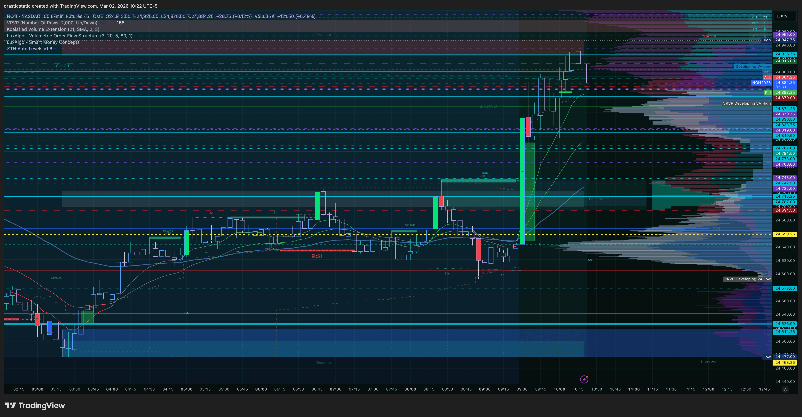

**10:22 AM — ES 5-min — ISM spike**
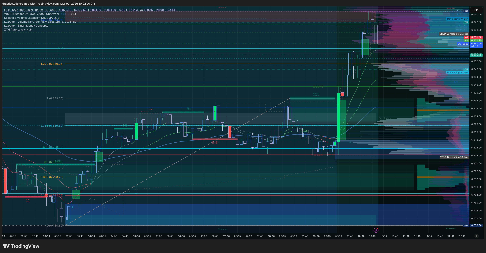

**10:23 AM — YM 5-min — ISM spike**
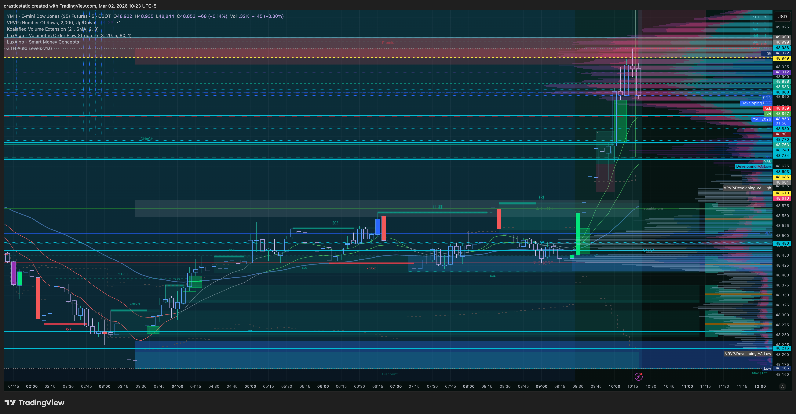

**10:54 AM — YM 5-min — post-spike pullback forming**
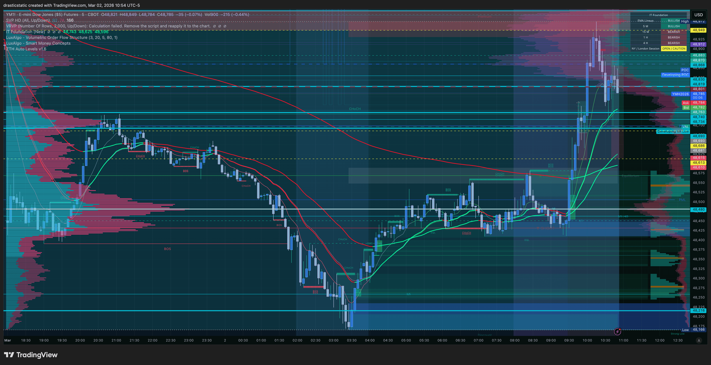

**10:55 AM — NQ 5-min — rejection forming**
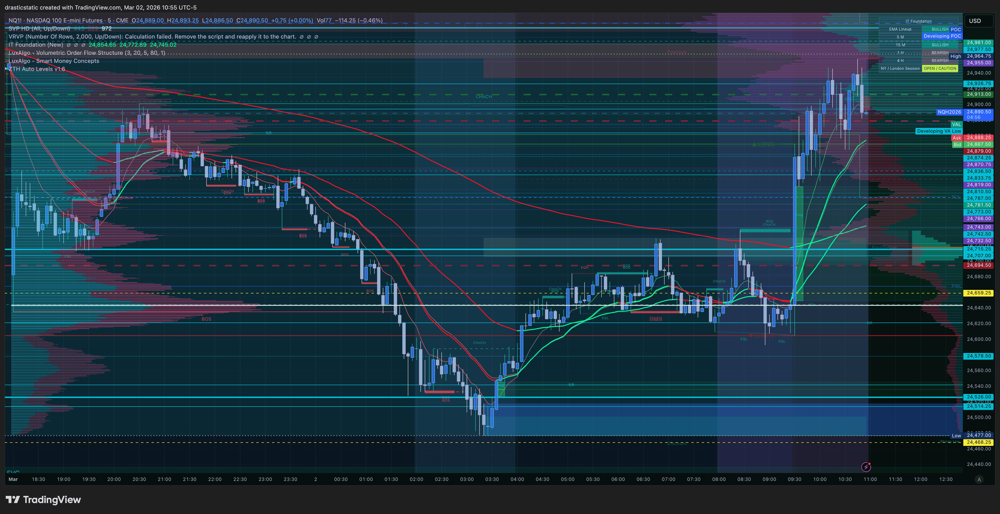

**10:55 AM — ES 5-min — rejection forming**
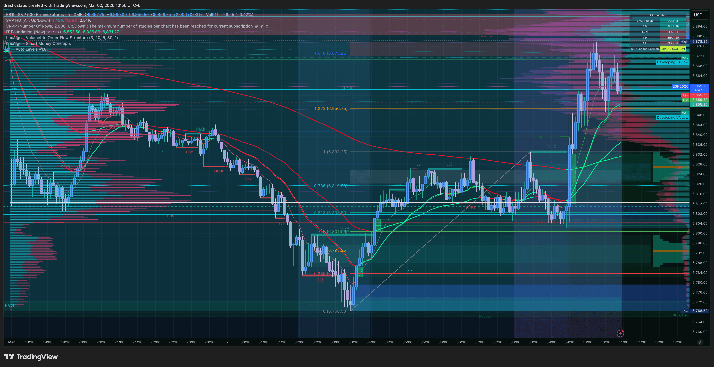

**11:04 AM — RTY 2-min — leading lower (SMT)**
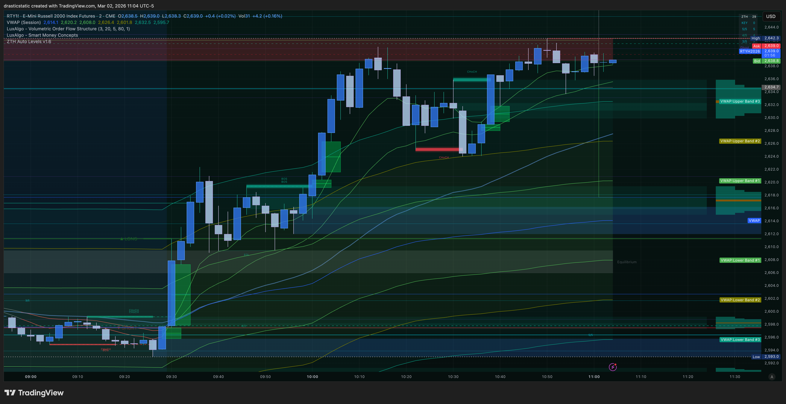

**11:04 AM — ES 2-min — SMT confirmation**
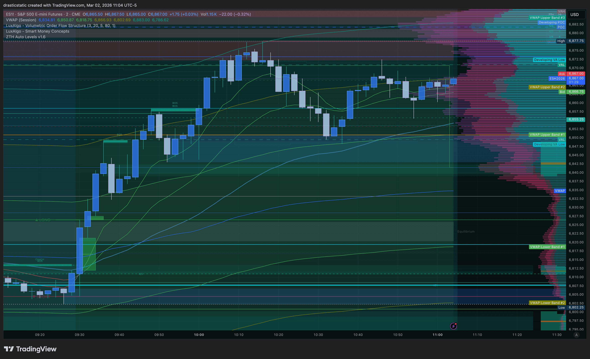

**11:04 AM — NQ 2-min — lagging (divergence)**
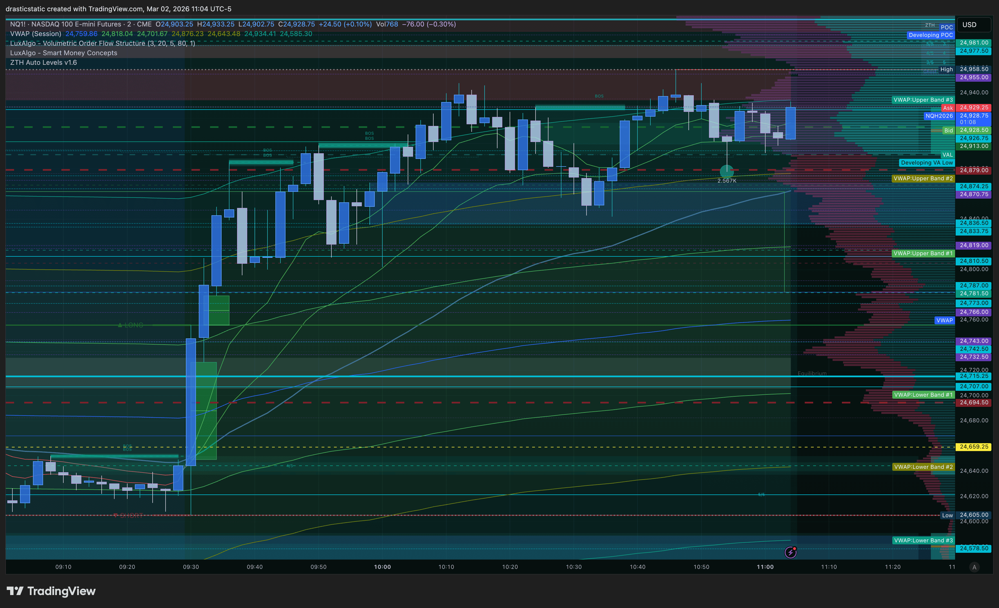

**11:05 AM — YM 2-min — leading roll**
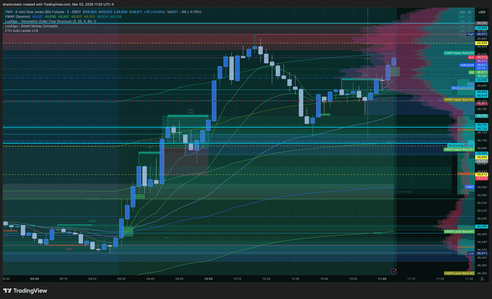

**11:19 AM — ES 1-min — Trade in progress**

**11:20 AM — ES 1-min — approaching TP**

**11:26 AM — ES — TP hit, trade closed**

**11:28 AM — ES — post-TP context**

**11:29 AM — ES 5-min — TP chart**
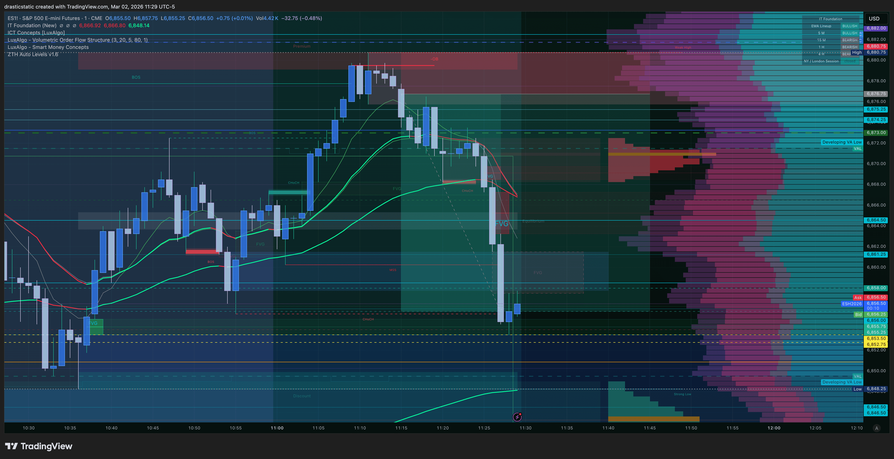

---

## 📝 Notes for Coaches + SmartTraderAI

### Confluence Stack (5/5 — A Grade)

1. **FCR:** Scenario C at the 9:30 open (mixed). But ISM spike at 10:00 created a new structural event — the spike into overhead supply reset the read. Treated as Scenario A SHORT on confirmation.
2. **IT Foundation EMAs:** ETH setup was red dominant. IT Foundation 9 EMA (~6,893) capped the post-spike bounce perfectly — textbook EMA resistance acting as the structural gate.
3. **FVG + CHoCH (CISD):** Change in State of Delivery — bearish CHoCH followed by displacement candle to the downside. 5-min FVG formed on the displacement.
4. **SMT Divergence:** RTY and YM rolling over after the spike while NQ held elevated = inter-market divergence. RTY led the roll, YM followed. NQ lagged = distribution.
5. **Fibonacci:** 0.5 retracement from 9am to day's high = 6,848.50 (TP zone). VWAP center, inverse FVG on 30-min, and bullish FVG from daily all converged at 6,848.50 — four independent confluences at same price level.

### ZTH Application
- ISM spike ran into overhead supply — ZTH supply rejection thesis confirmed
- SMT divergence read: RTY/YM lead, NQ lagged = classic inter-market read
- CHoCH to downside on ES post-spike was the entry trigger
- Inverse FVG on 30-min provided structural resistance reference

### FCR / STB
- ISM spike created a new structural event that superseded the mixed 9:30 open
- Trade was entered from a ZTH pivot + SMT framework, not a direct FCR trigger
- First candle at 9:30 was correctly identified as Scenario C (no FCR trade forced)

### IT Foundation (Inevitrade)
- Red dominant ETH → bearish bias established pre-session
- Open reversed bullish, but IT Foundation 9 EMA (~6,893) capped the bounce exactly
- This is the EMA acting as a structural gate: red dominant means no counter-trend long, and EMA resistance confirms the short entry zone

---

## 🧠 Behavioral Notes

**Emotional State:** Calm, confident, excited, happy

**Was Emotionally Stable:** Yes

**Did Emotions Affect Decisions:** No

**Mistakes logged in TradeZella:** None

**What I Did Well:**
> *"committed to plan, did not touch the trade idea, simply watched it run to tp!"*

**TradeZella Notes (verbatim):**
> *"woah, if they all were like that lol"*

**Fortuna Assessment:**
94.05 Zella Score is near the top of the range. The behavioral profile here — calm, committed, no adjustments, patient setup construction over 78 minutes from spike to entry — is the complete opposite of Trade 3 taken 19 minutes later. The contrast between T2 and T3 is the sharpest behavioral data point of the session. When Christopher follows full process, the trade manages itself. When he doesn't, 5+ hours of chop.

---

## 🔁 Pattern Tracker

- **No violations this trade** — this is the positive data point for the pattern tracker.
- **Full process followed:** Patient 78-minute wait from ISM spike to entry. No chasing. No adjustment under pressure.
- **This is the counter-entry to Pattern 5:** Entry was set structurally, waited for confirmation, did not adjust. SL was placed and not moved. TP hit, trade closed.
- **Benchmark for future reviews:** When behavior deviates, this trade is the reference.

> Full progress tracker (all sessions, behavioral arc, compliance scores, statistical summary):
> **[`pattern_tracker.md`](../../pattern_tracker.md)**

---

## 🎯 Forward Focus

1. **This is the standard.** Nine minutes, full process, 94 Zella, full TP. File it. Reference it when the next trade feels rushed or uncertain.
2. **Post-TP urgency is the next risk.** The 19-minute re-entry in T3 followed directly from this win. After a full TP: stop, breathe, let at least 30 minutes pass before evaluating a re-entry.
3. **Re-entry rule:** On re-entries, never enter in the risky direction from the original entry. For a short: never re-sell below the original short entry.

---

> See full trade review: https://github.com/drasticstatic/trading-assistant-public-preview/blob/main/smarttrader-ai/reviews/2026/03-Mar/review_20260302_ES_002.md

*Fortuna — Wealth Warden | Claude Code CLI*
*Trade 2 of 3 | A+ Trade | March 2, 2026*
