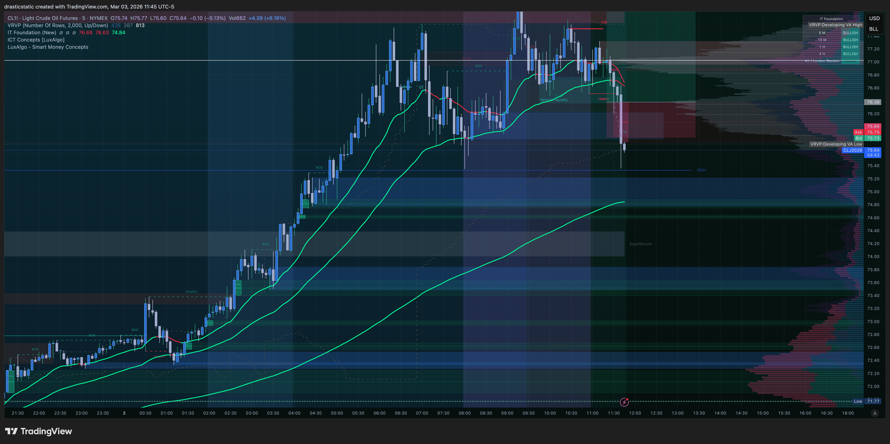
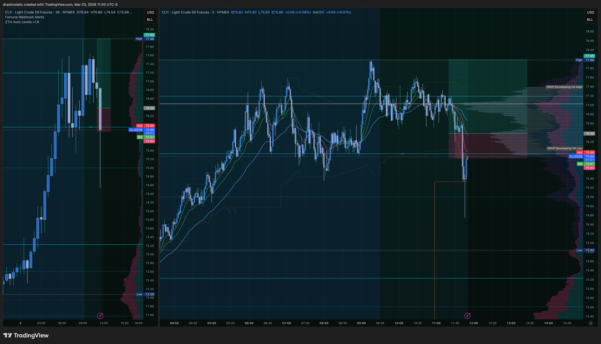
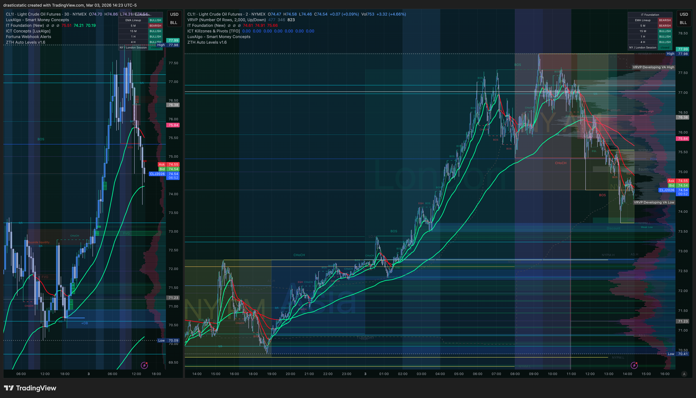

# Trade Review — CL Long | March 3, 2026 | T1
#### Fortuna — Wealth Warden | Claude Code CLI
#### Account: APEX-484839-05 | APEX 100K Legacy (BLOWN)

[Jump to 📝 Notes for Coaches](#notes-for-coaches)

---

## ⚡ What Happened in One Paragraph

With CL confirmed green dominant on the 1-hour chart (IT Foundation EMAs fanned bullishly after an overnight continuation), Christopher entered a long at 76.38 at 11:31 AM ET — adjusting the entry lower from his original plan to account for volatility, which allowed the wick to fill him. Price briefly moved in favor to 76.73 (MFE: +0.35 / $350) before reversing sharply. The trailing drawdown floor was breached at 11:43:44 ET and Apex auto-liquidated both open positions simultaneously — closing CL at 75.92 via market order. The SL order (75.84) was cancelled by the auto-liq system, but the auto-liq fill of 75.92 was 8 ticks *better* than the SL price. TradingView was frozen during the trade, preventing Christopher from cancelling the SL manually — which was accidental protection. After the close, CL continued crashing to approximately 73.50–74.00, a further 2+ point decline. The SL (via auto-liq) saved an estimated $2,000–$3,000 in additional losses that would have certainly blown the account with far greater damage.

---

## 📊 Trade Data

| Field | Value |
|-------|-------|
| Date | March 3, 2026 |
| Instrument | CL (CLJ6) — Light Crude Oil |
| Direction | Long |
| Entry Price | 76.38 |
| Exit Price | 75.92 (AutoLiq market order) |
| Entry Time | 11:31:07 EST |
| Exit Time | 11:43:44 EST |
| Duration | 12 min 37 sec |
| Points | −0.46 |
| Net P&L | **−$460.00** |
| Price MAE | 75.36 (−1.02 pts from entry) |
| Price MFE | 76.73 (+0.35 pts from entry) |
| Zella Score | **−45.10** |
| Commission | $0.00 |
| Account | APEX-484839-05 |

---

## 🧠 Behavioral Notes (TradeZella)

| Field | Value |
|-------|-------|
| Emotions | Ambivalent, frustrated, stressed, neutral |
| Emotionally Stable | Yes |
| Did Emotions Affect Decisions? | No |
| Entry Model (Zella) | ZTH Bounce, ZTH Pivot |
| Entry Logic | Fear of missing out, waited for pivot retracement, FVG |
| Setups | Continuation, pivot buy, bounce off support |
| Mistakes | FOMO, continued to retrace after entry |
| SL Respected | ✅ Yes — respected (stop hit via auto-liq; did not cancel) |
| What I Did Well | Accepted it, committed to plan, did not touch the trade idea, realized the trade was moving the opposite direction |
| TP Target | 77.99 (anticipating break of prior high) |

**Zella note:** "Lessons documented, ouch — see my review on GitHub, price action went against my daily plan, I even entered lower than I wanted to be 'safe' lol."

---

## 📝 Notes for Coaches + SmartTraderAI

**What was correct:**
- CL was green dominant on the 1-hour. The premarket game plan (`premarket_20260303_CL.md`) called for a long on pullback to EMA zone if green dominant held. That's exactly what was executed.
- Entry was adjusted *lower* to account for CL's typical volatility — a proactive risk-aware adjustment that allowed the wick to fill rather than missing the trade.
- SL was placed at 75.84. It was not manually cancelled (TradingView was frozen — accidental protection from the same impulse that led to cancelling the ES SL).
- Auto-liq closed at 75.92 — 8 ticks *better* than the SL. The system protected the account.

**What the post-trade chart showed:**
After the auto-liq close at 75.92, CL continued falling dramatically — to approximately 73.50–74.00. Without the SL/auto-liq:

| Scenario | P&L |
|----------|-----|
| Closed by auto-liq at 75.92 | −$460 |
| Held to price MAE 75.36 | −$1,020 |
| Held to ~74.00 | ~−$2,380 |
| Held to ~73.00 | ~−$3,380 |

The $460 loss was painful. The alternative was account liquidation — or far greater damage on a renewed account.

**The TradingView freeze as protection:**
Christopher noted — with some dark humor — that he was "glad TradingView froze" because it prevented him from cancelling the CL SL, which he might otherwise have done (as he did with ES). The SL on CL was non-negotiable. This session confirmed the rule in the most visceral way possible: CL does not give second chances when it moves.

**CL behavioral rule — confirmed again:**
> CL wicks are not pullbacks. When CL begins moving against a position, it regularly extends 2–3 full points without warning or recovery. A stop loss on CL is not optional — it is the difference between a manageable loss and account destruction.

This pattern has been observed across multiple sessions. It is not anomalous. CL volatility is structural. SL placement must account for this — wider stops, fewer contracts, never unprotected.

**On the "FOMO" label from Zella:**
The FOMO flag here is nuanced. The entry adjustment *lower* was not FOMO — it was smart risk management. The FOMO component may refer to taking the trade while already in an ES short (two simultaneous positions on a nearly-blown account), or to the urgency around the eval deadline.

---

## 🔁 Pattern Tracker

**Trade 012** — CL Long, green dominant setup. Auto-liq exit at 75.92 (8 ticks better than SL of 75.84). SL respected via account protection. CL continued −2+ points post-close. $460 loss saved estimated $2,000–$3,000. TradingView freeze = accidental SL protection.

> Full progress tracker (all sessions, behavioral arc, compliance scores, statistical summary):
> **[`pattern_tracker.md`](../../pattern_tracker.md)**

---

## 📋 Order Execution (Tradovate)

| Order ID | Type | Side | Price | Status | Time |
|----------|------|------|-------|--------|------|
| 404101861003 | Limit | Buy | 76.38 | Filled | 11:31:07 |
| 404101861006 | Limit | Sell | 77.99 | Cancelled (AutoLiq) | 11:43:44 |
| 404101861008 | Stop | Sell | 75.84 | Cancelled (AutoLiq) | 11:43:44 |
| 404101861155 | Market | Sell | 75.92 | Filled — **AutoLiq** | 11:43:44 |

**Note:** Auto-liquidation cancelled both the TP (77.99) and SL (75.84) orders and replaced them with a market sell at 75.92 — 8 ticks better than the SL price. This was not a SL hit in the traditional sense; it was account-level position closure. The protective outcome was identical.

---

## 📸 Screenshot Timeline

| File | Time | Content |
|------|------|---------|
| `CL1!_2026-03-03_08-59-23_5b1f7.png` | 08:59 ET | CL pre-market — green dominant confirmed, overnight continuation |
| `Screenshot 2026-03-03 at 11.33.25.png` | 11:33 ET | CL — in trade, adverse movement developing |
| `CL1!_2026-03-03_11-45-17_4192e.png` | 11:45 ET | CL — just after auto-liq, wick visible |
| `CL1!_2026-03-03_11-50-10_c5f18.png` | 11:50 ET | CL — continuing to crash; "would have been liquidated" |
| `CL1!_2026-03-03_14-23-08_585b2.png` | 14:23 ET | CL — full session view; crash extended to ~73.50–74.00 |

**08:59 ET — CL pre-market — green dominant confirmed, overnight continuation**

**11:33 ET — CL — in trade, adverse movement developing**

**11:45 ET — CL — just after auto-liq, wick visible**

**11:50 ET — CL — continuing to crash; "would have been liquidated"**

**14:23 ET — CL — full session view; crash extended to ~73.50–74.00**

---

## 📖 Session Narrative

The CL trade was the most process-correct of the three today. Green dominant, pullback entry, SL in place, TP at prior high. The thesis was sound. The exit was forced by the account-level auto-liquidation triggered by the ES position — not by anything CL did wrong at the moment of entry.

The hard truth: both entries were ultimately correct in direction. CL was long-biased by EMA structure. ES eventually corrected from 6,807. But the account didn't have the equity buffer to survive the delay between entry and outcome. On a properly-funded account, the CL entry at 76.38 with a 54-tick SL and a TP at 77.99 is a reasonable trade. On a near-breach eval account running two simultaneous positions without a SL on one of them, there was no margin for error.

**The lesson this session is building toward:**
> Respect the SL. See the market's hand. If stopped out, wait — then look for the next aligned entry with the direction the market just revealed.
> — Christopher's own words, March 3, 2026.

That is the rule March 2 T3 tried to teach. Today confirmed it from a different angle.

---

*Fortuna — Wealth Warden | Claude Code CLI*
*March 3, 2026 | APEX-484839-05*
