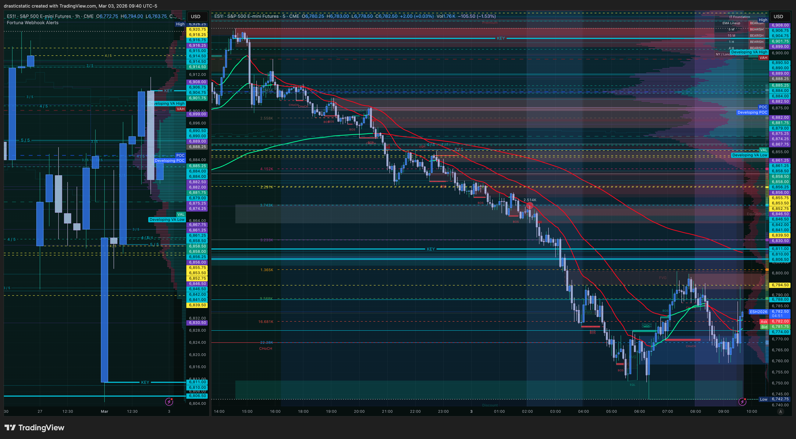

# Trade Review — ES Long | March 3, 2026 | T1
#### Fortuna — Wealth Warden | Claude Code CLI
#### Account: APEX-484839-05 | APEX 100K Legacy (BLOWN)

---

## ⚡ What Happened in One Paragraph

Thirteen minutes into the NY open, with ES confirmed red dominant and Scenario B LONG explicitly vetoed, Christopher entered a long on ES at 6,765.25 — chasing momentum on what he labeled a break-and-retest setup. The entry lasted 86 seconds. Price barely moved in favor (MFE: +1 pt / $50) before dropping through the SL at 6,758.25 (filled 6,757.75 due to 2-tick slippage). The trade was closed for −$375. The thesis was directionally wrong given the EMA structure, the execution was rushed, and TradeZella logged it explicitly: "shouldn't be in this trade."

---

## 📊 Trade Data

| Field | Value |
|-------|-------|
| Date | March 3, 2026 |
| Instrument | ES (ESH6) — E-Mini S&P 500 |
| Direction | Long |
| Entry Price | 6,765.25 |
| Exit Price | 6,757.75 |
| Entry Time | 09:43:03 EST |
| Exit Time | 09:44:29 EST |
| Duration | 86 seconds |
| Points | −7.5 |
| Net P&L | **−$375.00** |
| Price MAE | 6,757.25 (−8 pts from entry) |
| Price MFE | 6,766.25 (+1 pt from entry) |
| Zella Score | **−93.75** |
| Commission | $0.00 |
| Account | APEX-484839-05 |

---

## 🧠 Behavioral Notes (TradeZella)

| Field | Value |
|-------|-------|
| Emotions | Anxious, frustrated |
| Emotionally Stable | No |
| Did Emotions Affect Decisions? | Yes |
| Entry Model (Zella) | Other — Break & Retest ("shouldn't be in this trade") |
| Entry Logic | Pivot buy before pivot sell, FVG, momentum |
| Mistakes | Rushing, volatility, ignored bias, FOMO, chasing price |
| SL Respected | ✅ Yes — stop hit |
| Profit Target Respected | Tried to exit immediately, then stayed in anyway |
| HTF Bias | Bearish on higher TF |

**Zella note:** "I feel NY open is somewhere I need to improve, the idea was there but execution was off."

---

## 📝 Notes for Coaches + SmartTraderAI

**What went wrong:**
- ES was red dominant at the open. IT Foundation EMAs confirmed bearish stack. Scenario B LONG is explicitly vetoed under red dominant conditions. This rule was broken within 13 minutes of the open.
- The FCR first candle (9:30–9:45) had not yet closed. No directional scenario had been confirmed. Entering a long before FCR candle close = no entry authorization.
- Trade logic ("break and retest") was valid in a vacuum but entirely wrong for the environment.

**What was right:**
- SL was placed structurally and respected. Hit and moved on.
- Duration was 86 seconds — did not hold and hope. Out immediately when thesis invalidated by fill.
- Recognized the error quickly and documented it honestly.

**Pattern this represents:** Pattern 2 (Wrong Scenario) + FOMO-at-the-open. Red dominant = zero counter-trend longs. No exceptions at the open when volatility is highest and confirmation is lowest.

**For coaching groups:**
- STB: FCR candle had not closed — no directional scenario existed at 9:43 AM.
- ZTH / Inevitrade: IT Foundation EMA gate closed this trade before it opened.

---

## 🔁 Pattern Tracker

**Trade 010** — Wrong Scenario at the Open (Pattern 2 variant). Red dominant, Scenario B LONG vetoed, entered long anyway within 13 min of open. SL respected. −$375. → See `pattern_tracker.md`

---

## 📋 Order Execution (Tradovate)

| Order ID | Type | Side | Price | Status | Time |
|----------|------|------|-------|--------|------|
| 404101860846 | Limit | Buy | 6,765.25 | Filled | 09:43:03 |
| 404101860849 | Limit | Sell | 6,769.00 | Cancelled | 09:44:27 (TP cancelled before SL hit) |
| 404101860851 | Stop | Sell | 6,758.25 | Filled @ 6,757.75 | 09:44:29 |

**Note:** TP at 6,769.00 was cancelled before SL was hit. SL at 6,758.25 filled 2 ticks of slippage at 6,757.75.

---

## 📸 Screenshot Timeline

| File | Time | Content |
|------|------|---------|
| `ES1!_2026-03-03_09-29-20_43366.png` | 09:29 ET | ES pre-open — Christopher's manually drawn levels |
| `ES1!_2026-03-03_09-40-10_629de.png` | 09:40 ET | ES at open — red dominant confirmed |
| `Screenshot 2026-03-03 at 09.44.33.png` | 09:44 ET | ES — T1 stop-out area |
| `Screenshot 2026-03-03 at 09.48.12.png` | 09:48 ET | ES — post-stop context |
| `Screenshot 2026-03-03 at 09.48.28.png` | 09:48 ET | ES — post-stop context (2 of 2) |

**09:29 ET — ES pre-open — Christopher's manually drawn levels**

**09:40 ET — ES at open — red dominant confirmed**

**09:44 ET — ES — T1 stop-out area**

**09:48 ET — ES — post-stop context**

**09:48 ET — ES — post-stop context (2 of 2)**

---

## 🏛️ Session Narrative

**Context:** Second-to-last day of APEX eval. Gap of ~$5,634 to target. Eval pressure explicitly noted in premarket as "NOT a trading input." Within 13 minutes of the open, eval pressure produced exactly the error it was supposed to prevent — a rushed, pre-FCR, counter-trend long in a confirmed bearish EMA environment.

The SL held. The loss was contained. But the behavioral pattern — urgency → FOMO → wrong scenario — is the same root cause as Feb 23 (FOMO entry) and Feb 24 (wrong scenario). The premarket brief correctly identified the eval deadline as a behavioral risk. The trade executed that risk precisely.

**Post-stop:** Christopher identified the mistake, did not re-enter immediately in the wrong direction, and regrouped for T2.

---

*Fortuna — Wealth Warden | Claude Code CLI*
*March 3, 2026 | APEX-484839-05*
