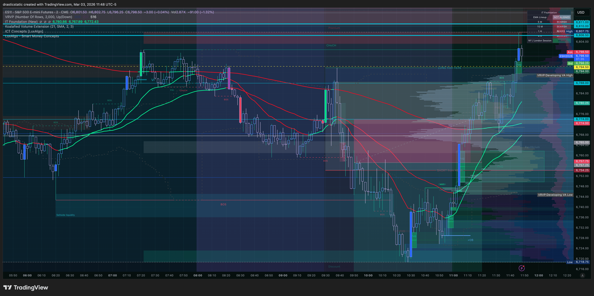
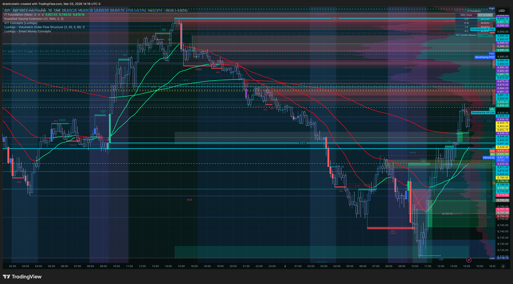

# Trade Review — ES Short | March 3, 2026 | T2
#### Fortuna — Wealth Warden | Claude Code CLI
#### Account: APEX-484839-05 | APEX 100K Legacy (BLOWN)

---

## ⚡ What Happened in One Paragraph

After the T1 stop-out, Christopher waited ~80 minutes before entering an ES short at 6,757.25 at 11:04 AM ET, framing it as an FCR trade ("short from here"). The entry was flawed at the source: he had manually drawn his FCR rays at candle open and close instead of the required HIGH and LOW. The true FCR High was 6,794 — his "short from here" level at 6,757.25 was the midpoint of the FCR range, not the structural entry. He placed an SL at 6,811.00 but cancelled it at 11:25 AM, citing the eval deadline ("committed to what happens"). ES wicked to a MAE of 6,791.75 before the account auto-liquidated both open positions at 11:43:44 ET — closing the short at 6,786.25 for −$1,450. The eval was over.

---

## 📊 Trade Data

| Field | Value |
|-------|-------|
| Date | March 3, 2026 |
| Instrument | ES (ESH6) — E-Mini S&P 500 |
| Direction | Short |
| Entry Price | 6,757.25 |
| Exit Price | 6,786.25 (AutoLiq market order) |
| Entry Time | 11:04:24 EST |
| Exit Time | 11:43:44 EST |
| Duration | 39 min 20 sec |
| Points | −29.0 |
| Net P&L | **−$1,450.00** |
| Price MAE | 6,791.75 (−34.5 pts from entry) |
| Price MFE | None — no positive movement from entry |
| Zella Score | **−84.06** |
| Commission | $0.00 |
| Account | APEX-484839-05 |

---

## 🧠 Behavioral Notes (TradeZella)

| Field | Value |
|-------|-------|
| Emotions | Stable before entry; became unstable in-trade: calm, confident, excited, fearful, frustrated, anxious, angry, ambivalent, stressed |
| Emotionally Stable | No (in-trade) |
| Did Emotions Affect Decisions? | Yes |
| Entry Model (Zella) | FCR — ZTH Rejection, ZTH Pivot, STB FCR |
| Entry Logic | Waited for pivot retracement |
| Mistakes | Bleed, continued to retrace after entry, ignored recent bias, moved TP & SL, kept moving stoploss, cancelled stop loss |
| SL Respected | ❌ Not respected — cancelled, auto-liquidated |
| HTF Bias | Bearish on higher TF, bullish developing on lower TF |

**Zella note:** "Marked FCR on open and close vs wicks by accident today somehow — even after building an indicator to do it for me, I manually drew the lines today. I entered at FCR 'short from here' after retrace from displacement but it retraced today again back through the 'long from here'."

---

## 📝 Notes for Coaches + SmartTraderAI

**The FCR Ray Error:**
The FCR first candle (9:30–9:45) rays must be drawn at the candle's **HIGH** and **LOW** — not at the open or close. Christopher manually drew them at open/close today, shifting his entire reference frame:

| Reference | Price |
|-----------|-------|
| True FCR High (SHORT entry zone) | 6,794 |
| True FCR Low (LONG entry zone) | ~6,751 |
| Christopher's "short from here" drawn | 6,772.75 (open/close midpoint) |
| Actual entry (after retrace) | 6,757.25 |
| His "long from here" drawn | ~6,751 |

His entry at 6,757.25 was the **midpoint of the true FCR range**, not a structural short entry. A proper FCR short waits for price to retrace UP to the FCR High (6,794) before shorting. Price wicked to 6,788.75 — 5.25 pts below the true FCR High — but Christopher was already short from 6,757.25 by then, 37 pts below where the FCR entry would have been.

**Note:** The Auggie pine script draws FCR rays correctly at High/Low. The manual drawing introduced the error. Going forward: verify FCR ray placement against the indicator output before using manually drawn levels.

**The SL Cancellation:**
The original SL was placed at 6,811.00 (Stop Buy). At 11:25 AM, with the trade running against, Christopher cancelled this SL reasoning that the eval deadline made the outcome irrelevant — "committed to what happens." The account auto-liquidated at 11:43:44 at 6,786.25.

> **New rule — Pattern 7:** The eval deadline is never a reason to cancel a stop loss. The SL protects the account from a larger breach regardless of the deadline. "Committed to the outcome" is a rationalization — the outcome with an intact SL is always superior to the outcome without one.

**Post-analysis:** ES ran to 6,807.75 after the auto-liq before eventually correcting. Even at the correction, the short thesis only became valid hours later — after the market revealed its hand via displacement. The original entry was structurally incorrect (midpoint, not FCR High).

**Pattern this represents:**
- Pattern 7 (new): SL Cancellation Under Eval Pressure
- Pattern 2 (variant): FCR placement error changed the scenario framing
- March 2 T3 echo: Cancelling the structural risk management = same as moving stops

---

## 🔁 Pattern Tracker

**Trade 011** — SL cancelled under eval deadline pressure. FCR rays drawn at open/close instead of HIGH/LOW — structural entry misidentified. AutoLiq at 6,786.25. −$1,450. New Pattern 7 introduced.

> Full progress tracker (all sessions, behavioral arc, compliance scores, statistical summary):
> **[`pattern_tracker.md`](../../pattern_tracker.md)**

---

## 📋 Order Execution (Tradovate)

| Order ID | Type | Side | Price | Status | Time |
|----------|------|------|-------|--------|------|
| 404101860897 | Limit | Sell | 6,757.25 | Filled | 11:04:24 |
| 404101860900 | Limit | Buy | 6,718.75 | Cancelled | ~11:04 (TP — cancelled at entry) |
| 404101860902 | Stop | Buy | 6,811.00 | Cancelled | 11:25:06 (SL cancelled by Christopher) |
| 404101861153 | Market | Buy | 6,786.25 | Filled — **AutoLiq** | 11:43:44 |

**Note:** SL at 6,811 was manually cancelled at 11:25 AM. Auto-liquidation closed the position at 6,786.25 via market order at account drawdown breach. ES MAE was 6,791.75 — price came back from 6,791.75 to 6,786.25 before auto-liq fired (or auto-liq fired during the wick). ES subsequently ran to 6,807.75 then began correcting.

---

## 📸 Screenshot Timeline

| File | Time | Content |
|------|------|---------|
| `ES1!_2026-03-03_09-29-20_43366.png` | 09:29 ET | Christopher's manually drawn levels (FCR rays at open/close) |
| `ES1!_2026-03-03_09-29-25_405c7_Auggie-Plot.png` | 09:29 ET | Auggie's pine script (FCR at HIGH/LOW — correct) |
| `ES1!_2026-03-03_09-31-46_e0add.png` | 09:31 ET | Christopher's levels zoomed |
| `ES1!_2026-03-03_09-31-50_1dfa5_Auggie-Plot.png` | 09:31 ET | Auggie's plot zoomed |
| `Screenshot 2026-03-03 at 10.05.51.png` | 10:05 ET | ES — pre-T2 analysis |
| `Screenshot 2026-03-03 at 10.18.16.png` | 10:18 ET | ES — pre-T2 analysis |
| `Screenshot 2026-03-03 at 10.28.58.png` | 10:28 ET | ES — pre-T2 analysis |
| `Screenshot 2026-03-03 at 10.33.17.png` | 10:33 ET | ES — pre-T2 analysis |
| `Screenshot 2026-03-03 at 11.01.46.png` | 11:01 ET | ES — pre-entry context |
| `Screenshot 2026-03-03 at 11.02.40.png` | 11:02 ET | ES — entry area forming |
| `Screenshot 2026-03-03 at 11.05.48.png` | 11:05 ET | ES — short just entered |
| `Screenshot 2026-03-03 at 11.06.35.png` | 11:06 ET | ES — first adverse movement |
| `Screenshot 2026-03-03 at 11.33.52.png` | 11:33 ET | ES — price still climbing |
| `ES1!_2026-03-03_11-48-25_b254d.png` | 11:48 ET | ES post-auto-liq — ran to 6,807.75, beginning to correct |
| `ES1!_2026-03-03_14-18-58_821b3.png` | 14:18 ET | ES — correction underway; original short thesis now playing |

**09:29 ET — Christopher's manually drawn levels (FCR rays at open/close)**

**09:29 ET — Auggie's pine script (FCR at HIGH/LOW — correct)**

**09:31 ET — Christopher's levels zoomed**

**09:31 ET — Auggie's plot zoomed**

**10:05 ET — ES — pre-T2 analysis**

**10:18 ET — ES — pre-T2 analysis**

**10:28 ET — ES — pre-T2 analysis**

**10:33 ET — ES — pre-T2 analysis**

**11:01 ET — ES — pre-entry context**

**11:02 ET — ES — entry area forming**

**11:05 ET — ES — short just entered**

**11:06 ET — ES — first adverse movement**

**11:33 ET — ES — price still climbing**

**11:48 ET — ES post-auto-liq — ran to 6,807.75, beginning to correct**

**14:18 ET — ES — correction underway; original short thesis now playing**

---

## 📖 Session Narrative

ES red dominant all session. The FCR short thesis was structurally sound — the market did eventually correct from 6,807.75 downward hours later, validating the bearish read. But the entry was built on a miscalculated reference frame (open/close vs. HIGH/LOW rays), placed at the midpoint rather than the FCR structural entry zone, and then left unprotected after the SL was cancelled.

The market gave Christopher a chance to be right. The setup was simply entered too early, at the wrong structural price, without protection. That is not bad luck — it is a process error that can be corrected specifically:

1. **Verify FCR ray placement against the Auggie indicator** before using manually drawn levels.
2. **FCR SHORT entry = FCR High (candle HIGH).** Not the midpoint. Not after the first retrace.
3. **SL stays. Always.** Even on the last day of the eval.

---

*Fortuna — Wealth Warden | Claude Code CLI*
*March 3, 2026 | APEX-484839-05*
