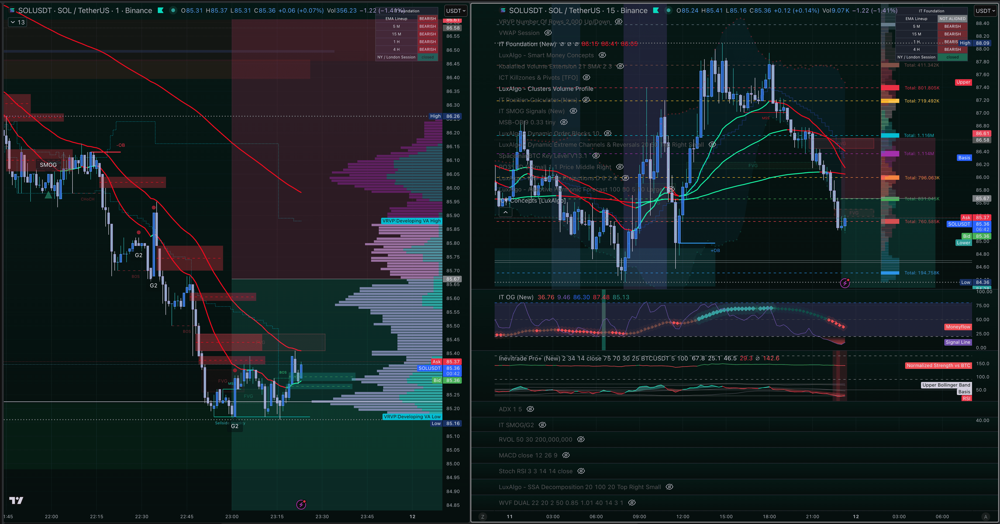
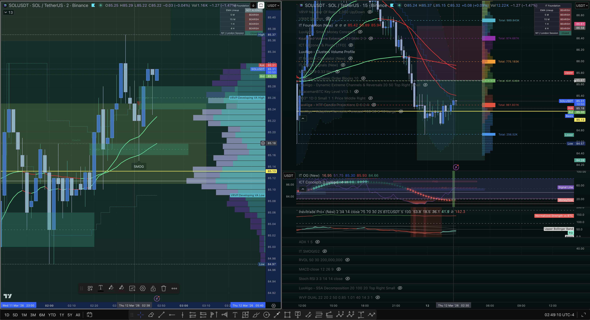
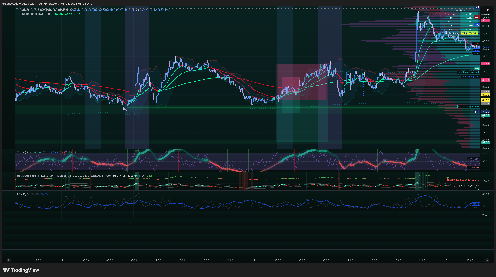

# Trade Review — Mar 12, 2026 | SOL/USDT · BTCC | Two Shorts
#### Fortuna — Wealth Warden | Claude Code CLI
#### Review #001 for Mar 12

[Jump to 📝 Notes for Coaches ↓](#notes-for-coaches)

---

## ⚡ 1. What Happened

Going into Mar 12, SOL was in a confirmed bearish structure. All IT Foundation EMA timeframes were aligned bearish (5M, 15M, 1H, 4H). A SMOG zone was visible on the 1D chart near the 85–87 range with G2 patterns marked. Volume profile (VRVP) showed developing low-volume nodes below.

At 02:41 ET, Christopher entered a **5 SOL SHORT at 85.1332 (20x leverage)** via market order — reading the bearish IT Foundation alignment and SMOG rejection as directional confirmation. Eleven minutes later at 03:32 ET, a second **1 SOL SHORT at 85.68 (50x leverage)** was placed via limit order — presumably to add at a slightly higher price with a tight stop.

The 50x position hit its stop loss at **86.63 ET at 05:45 ET** — a $0.95 loss on a small position quickly managed. That one worked as designed.

The 20x position is where the session diverged from plan. Price initially dipped toward 84.97 (the session low), then reversed upward overnight. There was no documented SL or exit plan enforced — the position held through the night and into the next day. By the time Christopher manually closed it on Mar 13 at **09:17 ET**, SOL had run to **91.69** — a 6.56 move against the short. Loss: **-$32.80**.

The full 5-day context chart (see Mar 25 overview screenshot) confirms what happened: the 84.97 low on Mar 12 was a trap reversal. The market swept sell-side liquidity, then ran to ~93 over the next two weeks. Christopher was right about the short-term structure but held through the reversal without an exit.

---

## 📊 2. Trade Data

| Field | Position A (20x) | Position B (50x) |
|-------|-----------------|-----------------|
| Platform | BTCC | BTCC |
| Direction | SHORT | SHORT |
| Quantity | 5 SOL | 1 SOL |
| Leverage | 20x | 50x |
| Entry Price | $85.1332 | $85.68 |
| Entry Time (ET) | Mar 12 · 02:41 | Mar 12 · 03:32 |
| Exit Price | $91.6940 | $86.6297 |
| Exit Time (ET) | Mar 13 · 09:18 | Mar 12 · 05:45 |
| Exit Type | Market (manual) | Stop Loss |
| Duration | ~30.5 hours | ~2.2 hours |
| P/L | **-$32.80** | **-$0.95** |
| Margin Used | $21.28 | $1.71 |
| Fees | — | -$0.05 |

**Session Total: -$33.75 USD**

*Note: Times converted from BTCC UTC+8 to EDT (UTC-4).*

---

## 📋 3. Order Execution

| Order | Time (ET) | Type | Price | Notes |
|-------|-----------|------|-------|-------|
| OPEN — 5 SOL SHORT (20x) | Mar 12 · 02:41 | Market | $85.1332 | Position 30348603 |
| OPEN — 1 SOL SHORT (50x) | Mar 12 · 03:32 | Limit | $85.68 | Position 30349047 |
| CLOSE — 1 SOL (SL hit) | Mar 12 · 05:45 | Stop Loss | $86.6297 | -$0.95 ✓ managed |
| CLOSE — 5 SOL (manual) | Mar 13 · 09:18 | Market | $91.6940 | Held ~30.5h; -$32.80 |

*Source: BTCC-orders_2024_12-17_thru_2026_03-26.csv*

---

## 📖 4. Session Narrative

*[Stub — to be filled in. Describe the overnight arc: entering in the early hours of Mar 12 with a clean bearish read, how the position felt through the overnight hours as price dipped toward 84.97 then reversed, and what the decision process looked like on Mar 13 at the RTH open when the loss became undeniable.]*

---

## 📸 5. Screenshot Timeline

**Mar 11, 23:23 ET — Pre-entry context: IT Foundation bearish, SMOG zone, G2 setup**

**Mar 12, 02:49 ET — During trade: price testing SMOG zone, 2M + 15M view**

**Mar 25, 08:08 ET — 5-day context: the Mar 12 trap reversal visible in full**

---

## 📝 6. Notes for Coaches + SmartTraderAI

*This trade is on BTCC (crypto perp), not a prop firm account, so there are no firm-specific rule violations. However, it reflects behavioral tendencies that carry across all accounts.*

**What the IT Foundation showed:**
- All timeframes (5M, 15M, 1H, 4H) were bearish-aligned at entry
- SMOG zone and G2 pattern confirmed rejection area
- This was a valid read — the bias was correct

**What went wrong:**
- No SL enforced on the primary position (20x), or if one existed, it was not triggered/was too wide
- Position held overnight through a reversal with no exit strategy
- The 84.97 low represented the SMOG support being swept — a classic liquidity run before reversal — which in IT Foundation terms is often a signal that the move is exhausting, not accelerating

**Suggestion for coaches:** The market's behavior on Mar 12–13 was a textbook example of sell-side liquidity being swept before a multi-week reversal. If Christopher can learn to identify when "my level was reached, now what?" — and have a pre-planned response for that scenario — this type of loss becomes manageable.

---

## 🧠 7. Behavioral Notes

**Pattern 8 — Exit Passivity (recurring):** The 50x position had a stop loss and exited cleanly. The 20x position had no documented exit rule enforced — it held through a gap reversal, overnight, and into the next day's RTH open. By the time it was closed, price had moved 6.56 against the short. This is the same pattern that has appeared in recent futures reviews: entries are placed, but exits are passive (no SL enforcement on the main position, or SL set so wide as to be meaningless).

**Position A held ~30.5 hours.** That is not a scalp or a swing with a plan — it's a position that became unmanageable. The exit at 09:17 ET Mar 13 (RTH open area) suggests Christopher may have closed it when the new session started and the loss became undeniable.

**Holding through a trap reversal:** The 84.97 low was likely a liquidity sweep — the kind of move IT Foundation is built to identify. If the 4H bearish alignment was valid, the failure to reclaim below 84.97 and the subsequent bounce should have been a signal to close or stop out. Instead, the position held through a 6.5+ point run against it.

**The 50x limit entry is worth noting:** Placing a second SHORT above the first (85.68 vs 85.13) with a 50x multiplier while the primary short was already open shows conviction in the direction — and the stop loss on it shows at least some risk management was attempted. The execution on Position B was clean. Position A needed the same discipline.

---

## 🔁 8. Pattern Tracker

| Pattern | Status | Notes |
|---------|--------|-------|
| **Pattern 8 — Exit Passivity** | 🔴 Recurring | 20x position had no enforced exit; held 30+ hours through reversal |
| Pattern 7 — SL Modification | ⚠️ Possible | No clear SL on primary position; may have been absent entirely |

---

## 🎯 9. Forward Focus

1. **Hard stop required on every BTCC position before stepping away from the desk.** An overnight crypto position without a stop is not a swing trade — it is an unmanaged position. The 50x position demonstrated exactly how a stop works: clean exit, defined loss, no decision required at 03:00 AM. The 20x position needed the same treatment.
2. **When price sweeps a key liquidity level and fails to continue, that is an exit signal.** The 84.97 low was the SMOG zone being tested. The failure to break below and continue is a specific condition in IT Foundation — price swept the sell-side, couldn't sustain the move. The correct response in that scenario is to close or tighten the stop dramatically, not hold for a second attempt.
3. **Three-item pre-trade checklist applies to BTCC as much as to futures.** Entry thesis + SL level + one defined exit condition — written before any BTCC bracket is placed. Position B had a stop. Position A did not. The difference in outcome (-$0.95 vs -$32.80) is the same difference that will appear in every account where the checklist is applied inconsistently.

---

> See full trade review: https://github.com/drasticstatic/trading-assistant-public-preview/blob/main/smarttrader-ai/reviews/2026/03-Mar/review_20260312_SOLUSDT-BTCC_001.md

*Produced with 🙏🏼 Fortuna — Wealth Warden | Claude Code CLI*
*Trade Review — SOLUSDT SHORT · March 12–13, 2026 · 20260312_SOLUSDT-BTCC_001*
