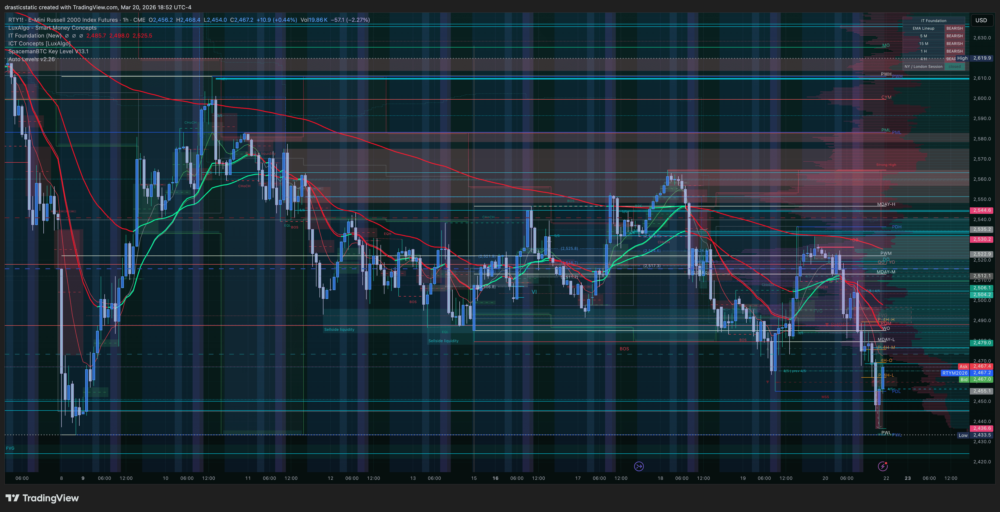
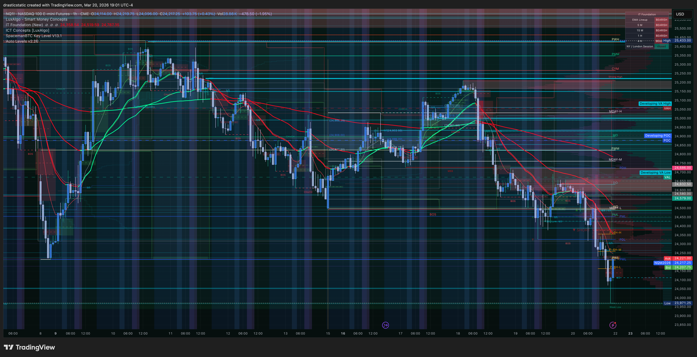
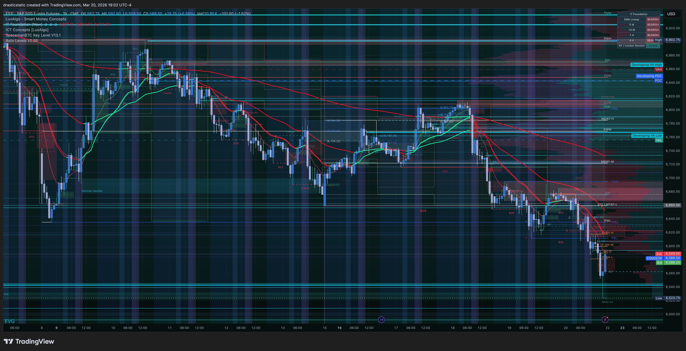
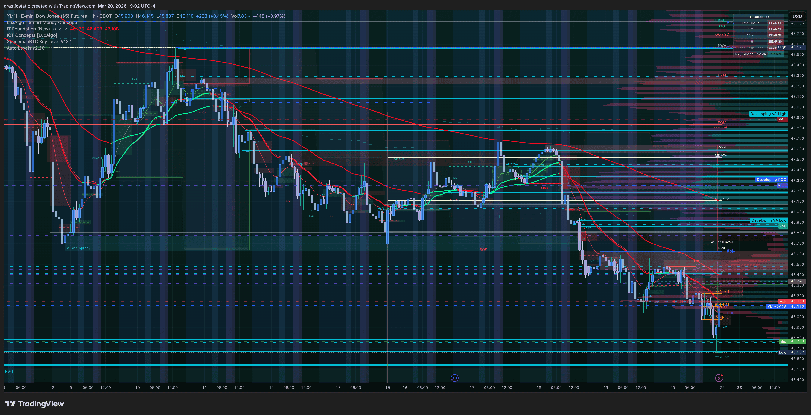

# Trade Review #001 — RTY Long · March 20, 2026
### Quadruple Witching Friday · Unintentional Fill · AutoLiq Exit

[Jump to 📝 Notes for Coaches ↓](#notes-for-coaches)

---

## ⚡ What Happened in One Paragraph

On quadruple witching Friday, Christopher had a projected limit bracket order on RTY left active while resting — exhausted after a full, emotionally demanding session. Price sold aggressively post-FCR, sweeping through the ZTH support zone where a buy limit at **2455.10** was waiting from an earlier projection bracket (set around 13:15 ET). The order filled at **14:22:19 EDT** without intent. The position went immediately against, reaching a MAE of **-$925** (low ~2436.60 — just 0.40pts above the original SL at 2436.20 which had been subsequently canceled). Price reversed sharply off an HVN shelf and the March 8 low (RTY held while NQ/ES/YM broke below — a clear SMT divergence). Once Christopher recognized the position and saw it recovering, he chose to hold on the structural read. **Apex AutoLiq** closed at **16:59:01 EDT** via Market order at **2465.60** — a gain of +10.5 points / **+$525 net**. The AutoLiq was intentional — Christopher was watching and chose to let Apex close the position at session end for the final profit.

---

## 📊 Trade Data

| Field | Value |
|-------|-------|
| **Instrument** | RTY (RTYM6 — E-Mini Russell 2000) |
| **Account** | APEX-484839-06 (100K eval) |
| **Side** | Long |
| **Entry Price** | 2,455.10 |
| **Exit Price** | 2,465.60 |
| **Entry Time** | 14:22:19 EDT · March 20, 2026 |
| **Exit Time** | 16:59:01 EDT · AutoLiq (Market) |
| **Duration** | 2hr 36min 42sec |
| **Points** | +10.5 |
| **Ticks** | +105 |
| **Gross P&L** | **+$525.00** |
| **Net P&L** | **+$525.00** (no commission on Apex) |
| **Position MAE** | -$925.00 (low ~2,436.60) |
| **Position MFE** | +$665.00 (high ~2,468.40) |
| **Best Exit** | 2,468.40 at 4:50 PM EDT |
| **Exit Efficiency** | 78.95% |
| **Realized R:R** | Not calculated (SL canceled) |
| **Setup** | ZTH Bounce · SFP · HVN Shelf |
| **Entry Model** | Unintentional fill — old projected limit order |
| **Rating** | 2.5 / 5 |
| **Emotionally Stable** | No |
| **Zella Score** | 78.94 |

---

## 📋 Order Execution

**From Tradovate orders CSV:**

| Time (EDT) | Event | Detail |
|-----------|-------|--------|
| 10:45:36 | RTY short bracket SL canceled | Stop buy 2,513.50 removed — earlier short bracket cleanup |
| 13:12:04 | RTY short bracket canceled | Sell TP 2,502.30 + Buy entry 2,457.10 removed |
| 13:15:01 | RTY long limit order placed | Buy limit 2,455.10 (new bracket entry) + TP 2,484.10 + SL 2,436.20 |
| 14:22:19 | **RTY long filled** | Buy 1 RTYM6 @ 2,455.10 — unintentional fill while resting |
| 14:39:10 | **SL canceled** | Sell stop 2,436.20 removed — position unprotected |
| ~14:22–16:03 | MAE reached | Price low ~2,436.60 — 0.40pts above original SL |
| 16:03:24 | Screenshot taken | Position in green, HVN shelf thesis visible |
| 16:15:44 | TP canceled | Sell limit 2,484.10 removed — no replacement exit defined |
| 16:59:01 | **AutoLiq close** | Sell 1 RTYM6 @ 2,465.60 Market — Apex auto-liquidation (intentional) |

**Full bracket context (from Tradovate orders CSV):**

| Order | Instrument | Type | Price | Status |
|-------|-----------|------|-------|--------|
| Sell limit | RTY | TP | 2,502.30 | Canceled 13:12:04 |
| Buy limit | RTY | Entry (short SL) | 2,457.10 | Canceled 13:12:04 |
| Buy stop | RTY | SL (short) | 2,513.50 | Canceled 10:45:36 |
| **Buy limit** | **RTY** | **Entry** | **2,455.10** | **Filled 14:22:19** |
| Sell limit | RTY | TP | 2,484.10 | Canceled 16:15:44 |
| Sell stop | RTY | SL | 2,436.20 | Canceled 14:39:10 |
| **Sell market** | **RTY** | **AutoLiq** | **2,465.60** | **Filled 16:59:01** |

**Fills only:**
```
LONG  1x RTY @ 2,455.10 | 14:22:19 EDT | Limit | Tradovate
SHORT 1x RTY @ 2,465.60 | 16:59:01 EDT | Market | AutoLiq (intentional)
──────────────────────────────────────────
Net: +10.50 pts | +105 ticks | +$525.00
```

---

## 📖 Session Narrative

Quadruple witching Friday — the convergence of stock index futures, stock index options, stock options, and single stock futures expiration on the same day. Christopher came into the session with a correct pre-market directional read (Scenario B SHORT, potential Scenario A upgrade) but could not bring himself to execute the intraday FCR/SMT setups due to eval anxiety and witching-day volatility fear. This is the behavioral theme of the week: knowing the trade, not being able to click.

During pre-session chart work (10:45–13:15 ET), multiple bracket orders were placed and cleaned up on RTY as Christopher mapped out potential scenarios. At 13:15 ET a fresh long bracket was set with entry at 2455.10, TP at 2484.10, SL at 2436.20 — a valid ZTH support level projection. This bracket was not cleaned up before Christopher rested.

The witching session's late intraday whipsaw — exactly the 15:00–16:00 risk window that had been flagged in pre-market — swept RTY aggressively into the 2430s, filling the 2455.10 limit order at 14:22 ET. Christopher became aware of the position as it was recovering from the MAE. The SL had already been canceled at 14:39 ET, leaving the position unprotected through the -$925 low. The March 8 low held as ZTH support while NQ, ES, and YM had already broken below their equivalent lows — a textbook SMT divergence confirming the HVN bounce thesis.

Christopher watched the position recover into profit, canceled the original TP at 16:15 with no replacement exit defined, and then intentionally allowed Apex AutoLiq to close the position at 16:59 — capturing +$525 from a position he never meant to enter.

---

## 📸 Screenshot Timeline

**16:03 ET — Position in green, HVN shelf visible**


TradingView trade projection panel showing the RTY long position live at ~16:03 ET. Price had recovered from the MAE lows into the HVN cluster. The green P&L bar confirms the position had turned profitable. The volume profile on the right panel shows the thick HVN shelf in the 2440–2460 zone — the structural support referenced when choosing to hold.

---

**18:52 ET — Post-close overview: RTY 1min full day**


---

**19:05 ET — Post-close review: full day RTY action (1min)**


Full intraday picture on 1min RTY. The aggressive witching-day sell into the 2430s is clear — the sweep that filled the 2455.10 limit is visible as the capitulation wick. The subsequent recovery off the HVN shelf into the 2465 area (where AutoLiq closed the position) is the green reversal candles in the lower-right. Exit at 2465.60 captured approximately 79% of the total available bounce.

---

**19:14 ET — Post-close review: 5min RTY, March 8 low + HVN context**


Wider 5min view showing the structural significance of today's low. The March 8 low zone (which NQ, ES, and YM had already broken below) held as support on RTY — this is the SMT divergence that confirmed the HVN bounce thesis. The volume profile histogram on the right shows the dense HVN cluster exactly where price reversed. The ZTH + HVN confluence at this level is the structural reason the unintentional fill turned into a winner.

---

**Post-close index comparison — NQ, ES, YM (19:01–19:02 ET)**




NQ, ES, and YM post-close charts for SMT context. These three broke below their March 8 lows during the witching sell — while RTY held above its equivalent. This is the SMT divergence (RTY holdout) that underpinned the bounce thesis on the long position.

---

<a id="notes-for-coaches"></a>
## 📝 Notes for Coaches + SmartTraderAI

**For ZTH / Inevitrade:**
- RTY defended the March 8 low as a ZTH support level when NQ, ES, and YM had already broken below their equivalent lows. This SMT divergence (RTY holdout, others below) was the structural thesis for the bounce. RTY's HVN shelf in the 2440–2460 zone provided the actual floor.
- The ZTH Bounce setup was technically valid: price swept below a significant support cluster, found buyers at the HVN, and reversed. The issue is entry process (unintentional fill, canceled SL) — not the setup itself.
- This trade demonstrates why ZTH levels are drawn ahead of time: the 2455.10 projection was structurally reasoned before the witching session began. The structural thesis was correct even if the execution process failed.

**For STB:**
- No FCR trade was taken today. Pre-market read (Scenario B SHORT, potential Scenario A upgrade) was correct in direction for the morning session, but Christopher could not bring himself to execute. The quadruple witching volatility and eval anxiety created a paralysis situation.
- The witching session's late intraday whipsaw (the 15:00–16:00 risk window flagged pre-market) is what swept RTY to the lows and filled this long.
- The lesson for the next witching session: pre-market scenarios were correct, the setup types were correct. The gap was execution confidence, not analytical accuracy.

**Process flags:**
1. Old projected limit orders left active while resting — primary process failure this week. Pre-rest checklist: cancel all open limit orders before stepping away from the desk.
2. SL canceled after unintentional fill — dangerous regardless of outcome. Rule: if an unintentional fill occurs, the SL stays or gets tightened, never removed.
3. TP canceled at 16:15 with no replacement exit defined — position exposed to open-ended drawdown for 44 minutes. Resolved by AutoLiq in Christopher's favor today.

---

## 🧠 Behavioral Notes

**What this trade was:** An unintentional fill on an old projected limit order from a bracket set up during pre-session chart work (~10:45–13:15 ET). Christopher had been watching the witching-day sell unfold, chose not to trade the fast intraday action due to fear of the whipsaw, and closed his eyes from exhaustion — not intending to enter.

**The SL cancelation:** Original SL was 2436.20. Canceled at 14:39 ET — approximately 17 minutes after fill. Price hit 2436.60 during the MAE — 0.40 points from where the SL would have triggered. This is the critical behavioral note: canceling a SL on a position you didn't intend to enter is the highest-risk moment of the trade. The outcome was a winner, but the process during that 17-minute window was dangerous.

**The hold decision:** Once Christopher recognized the position and saw it in the green at 16:03 ET, the decision to hold for the HVN shelf was structurally reasoned. The March 8 low acting as support on RTY (while NQ/ES/YM blew through their equivalents) was a valid SMT divergence read. The HVN cluster visible in the volume profile confirmed the thesis. The hold was correct.

**The AutoLiq exit:** The position was closed by Apex's auto-liquidation at 16:59 — this was a deliberate choice. Christopher was watching and chose to let AutoLiq handle the close rather than manually exiting. AutoLiq at 2465.60 captured 78.95% of the available move. Had Christopher manually exited earlier, the most likely target would have been 2468–2470 (just below the visible FVG/resistance above).

**The bigger behavioral thread:** All week Christopher was attempting to force trades due to eval anxiety, kept conservative projections, couldn't bring himself to click into fast witching-day setups due to fear, and ultimately got filled on an overlooked old limit order while resting. The outcome was profitable. **The conviction he couldn't find to act was ultimately delivered by rest and an overlooked order — the market gave it, not force.**

---

## 🔁 Pattern Tracker

Five patterns active in this trade — two new, three recurrences:

| Pattern | Status | Notes |
|---------|--------|-------|
| **Unintentional fill (old projected order)** | 🔴 New — Pattern 9 | Left bracket limit order active while resting — filled without intent. Pre-rest cancel-all checklist required. |
| **SL canceled on live position** | 🔴 Recurrence (Mar 3 pattern) | SL at 2436.20 canceled 17 min post-fill. Position went to 2436.60 — 0.40pts from where SL would have hit. Lucky escape. |
| **TP canceled without replacement** | 🟡 New sub-pattern | TP at 2484.10 canceled 16:15:44 with no replacement exit — relied on AutoLiq. Positive outcome but exposed to open-ended drawdown risk. |
| **Hold conviction via structural read** | ✅ Positive | Once aware of position, used HVN + SMT divergence (RTY holding March 8 low) to justify hold. Structurally sound. |
| **Fear paralysis on quality setups** | 🔴 Session theme | Could not execute intraday FCR/SMT setups despite correct read. Eval anxiety + witching volatility = paralysis. |

Trade 20260320_RTY-APEX_001 logged.

> See full running progress tracker (all sessions, behavioral arc, compliance scores, statistical summary): [../../pattern_tracker.md](../../pattern_tracker.md)

---

## 🎯 Forward Focus

1. **Pre-rest order cancel checklist** — before stepping away from the desk for any reason, cancel all open limit orders that are not actively monitored. This is the immediate process fix from Pattern 9.
2. **SL discipline on unintentional fills** — if an unintentional fill occurs, the SL stays or tightens. Never remove a SL on a position entered outside of intent.
3. **Execution confidence on witching setups** — the pre-market read was correct, the setup types were correct. Work on clicking into confirmed FCR/SMT setups even on high-volatility days. The fear of the whipsaw is manageable with pre-defined entries and SL levels.

---

> See full trade review: [https://github.com/drasticstatic/trading-assistant-public-preview/blob/main/smarttrader-ai/reviews/2026/03-Mar/review_20260320_RTY-APEX_001.md](https://github.com/drasticstatic/trading-assistant-public-preview/blob/main/smarttrader-ai/reviews/2026/03-Mar/review_20260320_RTY-APEX_001.md)

*Produced with 🙏🏼 Fortuna — Wealth Warden | Claude Code CLI*
*Trade Review — RTY LONG · March 20, 2026 · 20260320_RTY-APEX_001*
