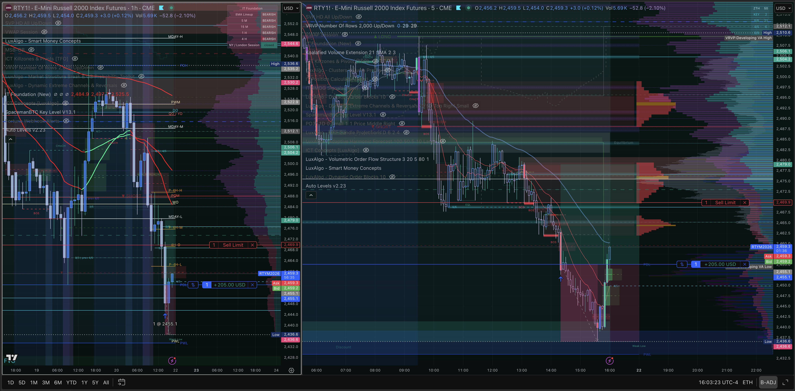
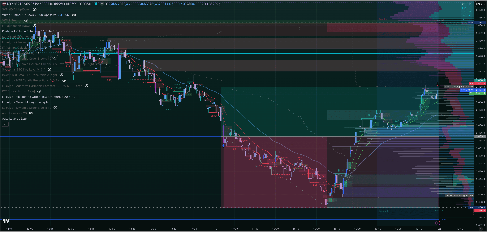
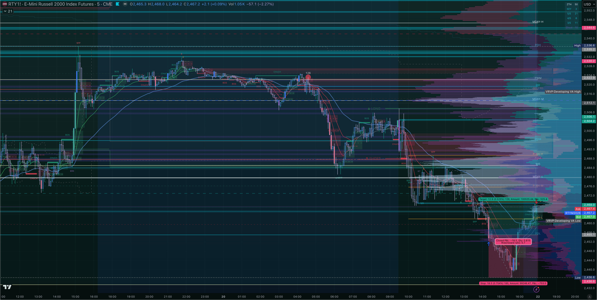

# Trade Review #014 — RTY Long · March 20, 2026
### Quadruple Witching Friday · Unintentional Fill · AutoLiq Exit

---

## ⚡ What Happened

Christopher had a projected limit bracket order on RTY left active while resting — exhausted after a full, emotionally demanding quadruple witching session. Price sold aggressively into the lows post-FCR, sweeping through the ZTH support zone where the limit BUY at **2455.10** was waiting from an earlier projection bracket (set around 13:12 ET, not the active trade of the day). The order filled at **14:22:19 EDT** without intent.

The position went immediately against, reaching a MAE of **-$925** (price low ~2436.60 — just 0.40 points above where the original SL had been set at 2436.20). The SL had been canceled at 14:39 EDT — meaning the position was unprotected through its worst drawdown.

Price then reversed sharply off the HVN shelf (a significant volume node cluster in the 2440–2460 area, coinciding with the March 8 low that RTY had respected while NQ/ES/YM blew past it). Christopher became aware of the position when it was already recovering and chose to remain in it, citing the structural HVN support and a Spirit-led sense of staying with it.

**Apex AutoLiq** closed the position at **16:59:01 EDT** (1 minute before the Apex eval hard close at 17:00) via Market order at **2465.60** — a gain of +10.5 points / **+$525 net**.

Best exit per TradeZella would have been **2468.40** at 4:50 PM EDT (+$665), meaning exit efficiency was **78.95%** — respectable given AutoLiq and not a manual exit.

---

## 📊 Trade Data

| Field | Value |
|-------|-------|
| **Instrument** | RTY (RTYM6 — E-Mini Russell 2000) |
| **Account** | APEX-484839-06 (100K eval) |
| **Side** | Long |
| **Entry Price** | 2,455.10 |
| **Exit Price** | 2,465.60 |
| **Entry Time** | 14:22:19 EDT · March 20, 2026 |
| **Exit Time** | 16:59:01 EDT · AutoLiq (Market) |
| **Duration** | 2hr 36min 42sec |
| **Points** | +10.5 |
| **Ticks** | +105 |
| **Gross P&L** | **+$525.00** |
| **Net P&L** | **+$525.00** (no commission on Apex) |
| **Position MAE** | -$925.00 (low ~2,436.60) |
| **Position MFE** | +$665.00 (high ~2,468.40) |
| **Best Exit** | 2,468.40 at 4:50 PM EDT |
| **Exit Efficiency** | 78.95% |
| **Realized R:R** | Not calculated (SL canceled) |
| **Setup** | ZTH Bounce · SFP · HVN Shelf |
| **Entry Model** | Older manipulation wick (unintentional fill) |
| **Rating** | 2.5 / 5 |
| **Emotionally Stable** | No |
| **Zella Score** | 78.94 |

**Original bracket context (from Tradovate Orders CSV):**

| Order | Instrument | Type | Price | Status |
|-------|-----------|------|-------|--------|
| Sell limit | RTY | TP | 2,502.30 | Canceled 13:12:04 |
| Buy limit | RTY | Entry (short SL) | 2,457.10 | Canceled 13:12:04 |
| Buy stop | RTY | SL (short) | 2,513.50 | Canceled 10:45:36 |
| **Buy limit** | **RTY** | **Entry** | **2,455.10** | **Filled 14:22:19** |
| Sell limit | RTY | TP | 2,484.10 | Canceled 16:15:44 |
| Sell stop | RTY | SL | 2,436.20 | Canceled 14:39:10 |
| **Sell market** | **RTY** | **AutoLiq** | **2,465.60** | **Filled 16:59:01** |

---

## 🧠 Behavioral Notes

**What this trade was:** An unintentional fill on an old projected limit order from a bracket that was set up during pre-session chart work (around 10:45–13:12 ET timeframe, when earlier projection brackets for RTY were active). Christopher had been watching the witching-day sell unfold, chose not to trade the fast intraday action due to fear of the whipsaw, and closed his eyes from exhaustion — not intending to enter.

**The SL cancelation:** The original SL was 2436.20. It was canceled at 14:39 ET — approximately 17 minutes after fill. Price hit 2436.60 during the MAE — 0.40 points from where the SL would have triggered. This is the critical behavioral note: canceling a SL on a position you didn't intend to enter is the highest-risk moment of the trade. The outcome was a winner, but the process during that 17-minute window was dangerous.

**The hold decision:** Once Christopher recognized the position and saw it in the green at 16:03 ET, the decision to hold for the HVN shelf was structurally reasoned. The March 8 low acting as support on RTY (while NQ/ES/YM blew through their equivalents) was a valid SMT divergence read. The HVN cluster visible in the volume profile confirmed the thesis. The hold was correct.

**The AutoLiq exit:** The position was closed by Apex's auto-liquidation at 16:59 — this was not a choice. Had Christopher manually exited, the most likely target would have been 2468–2470 (just below the visible FVG / resistance above). AutoLiq at 2465.60 captured 78.95% of the available move — a reasonable result.

**The bigger behavioral thread:** Christopher journaled this honestly: all week he was attempting to force trades due to eval anxiety, kept conservative projections, couldn't bring himself to click into the fast witching-day setups due to fear, and ultimately got filled on an overlooked old limit order while resting. The outcome was profitable. The lesson is layered: **the conviction he couldn't find to act was ultimately delivered by rest and an overlooked order — the market gave it, not force.**

---

## 📝 Notes for Coaches

**For ZTH / Inevitrade:**
- RTY defended the March 8 low as a ZTH support level when NQ, ES, and YM had already broken below their equivalent lows. This SMT divergence (RTY holdout, others below) was the structural thesis for the bounce. RTY's HVN shelf in the 2440–2460 zone provided the actual floor.
- The ZTH Bounce setup was technically valid: price swept below a significant support cluster, found buyers at the HVN, and reversed. The issue is entry process (unintentional fill, canceled SL) — not the setup itself.

**For STB:**
- No FCR trade was taken today. Pre-market read (Scenario B SHORT, potential Scenario A upgrade) was correct in direction for the morning session, but Christopher could not bring himself to execute. The quadruple witching volatility and eval anxiety created a paralysis situation.
- The witching session's late intraday whipsaw (the very thing we flagged as the 15:00–16:00 risk window) is what swept RTY to the lows and filled this long.

**Process flags:**
1. Old projected limit orders were left active while resting — this is the primary process failure this week (and arguably this month). A clear pre-rest checklist: cancel all open limit orders before stepping away.
2. SL was canceled after unintentional fill — dangerous regardless of outcome. Rule: if an unintentional fill occurs, the SL stays or gets tightened, never removed.
3. The TP at 2484.10 was canceled at 16:15:44 — 44 minutes before close. Without a defined TP or SL active, the position relied entirely on AutoLiq for exit. This was resolved by the market in Christopher's favor today.

---

## 🔁 Pattern Tracker

| Pattern | Status | Notes |
|---------|--------|-------|
| **Unintentional fill (old projected order)** | 🔴 New occurrence | Left bracket limit order active while resting — filled without intent. Add pre-rest cancel-all checklist. |
| **SL canceled on live position** | 🔴 Recurrence (Mar 3 pattern) | SL at 2436.20 canceled 17 min post-fill. Position went to 2436.60 — 0.40pts from where SL would have hit. Lucky escape. |
| **TP canceled without replacement** | 🟡 New sub-pattern | TP at 2484.10 canceled 16:15:44 with no replacement exit — relied on AutoLiq. Positive outcome but exposed to open-ended drawdown risk. |
| **Hold conviction via structural read** | ✅ Positive | Once aware of position, used HVN + SMT divergence (RTY holding March 8 low) to justify hold. Structurally sound. |
| **Fear paralysis on quality setups** | 🔴 Session theme | Could not execute intraday FCR/SMT setups despite correct read. Eval anxiety + witching volatility = paralysis. |

---

## 📋 Order Execution

| Time (EDT) | Event | Detail |
|-----------|-------|--------|
| 10:45:36 | RTY short bracket SL canceled | Stop buy 2,513.50 removed — earlier short bracket cleanup |
| 13:12:04 | RTY short bracket canceled | Sell TP 2,502.30 + Buy entry 2,457.10 removed |
| 13:15:01 | RTY long limit order placed | Buy limit 2,455.10 (new bracket entry) + TP 2,484.10 + SL 2,436.20 |
| 14:22:19 | **RTY long filled** | Buy 1 RTYM6 @ 2,455.10 — unintentional fill while resting |
| 14:39:10 | **SL canceled** | Sell stop 2,436.20 removed — position unprotected |
| ~14:22–16:03 | MAE reached | Price low ~2,436.60 — 0.40pts above original SL |
| 16:03:24 | Screenshot taken | Position in green, HVN shelf thesis visible |
| 16:15:44 | TP canceled | Sell limit 2,484.10 removed — no replacement exit defined |
| 16:59:01 | **AutoLiq close** | Sell 1 RTYM6 @ 2,465.60 Market — Apex auto-liquidation |

**Fills only:**
```
LONG  1x RTY @ 2,455.10 | 14:22:19 EDT | Limit | Tradovate (Tradingview webhook)
SHORT 1x RTY @ 2,465.60 | 16:59:01 EDT | Market | AutoLiq
──────────────────────────────────────────
Net: +10.50 pts | +105 ticks | +$525.00
```

---

## 📸 Screenshot Timeline

**16:03 ET — Position in green, HVN shelf visible**


TradingView trade projection panel showing the RTY long position live at ~16:03 ET. Price had recovered from the MAE lows into the HVN cluster. The green P&L bar confirms the position had turned profitable. The volume profile on the right panel shows the thick HVN shelf in the 2440–2460 zone — the structural support Christopher was referencing when choosing to hold.

---

**19:05 ET — Post-close review: full day's RTY action (1min)**


Full intraday picture on 1min RTY. The aggressive witching-day sell into the 2430s is clear — the sweep that filled the 2455.10 limit is visible as the capitulation wick. The subsequent recovery off the HVN shelf into the 2465 area (where AutoLiq closed the position) is the green reversal candles in the lower-right. The TradingView bracket projection overlays (red/green zone) show where the original bracket had been projected. Exit at 2465.60 captured approximately 79% of the total available bounce.

---

**19:14 ET — Post-close review: 5min RTY, March 8 low + HVN context**


Wider 5min view showing the structural significance of today's low. The March 8 low zone (which NQ, ES, and YM had already broken below) held as support on RTY — this is the SMT divergence that confirmed the HVN bounce thesis. The volume profile histogram on the right shows the dense HVN cluster exactly where price reversed. The ZTH + HVN confluence at this level is the structural reason the unintentional fill turned into a winner.

---

*Review #014 — Fortuna · March 20, 2026*
