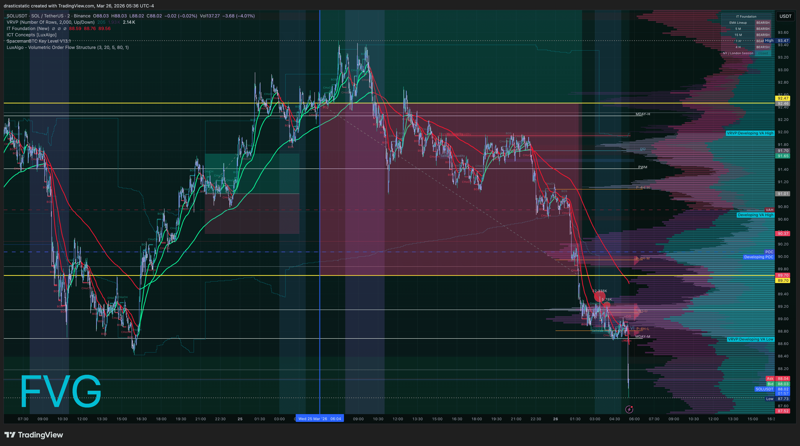
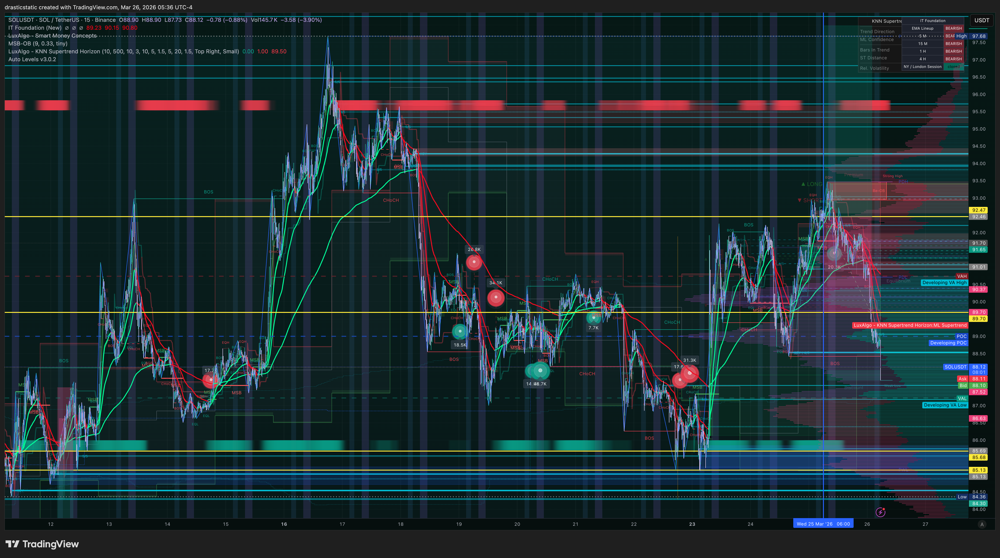

# Trade Review — Mar 25–26, 2026 | SOL/USDT · BTCC Voucher | Long

**Account:** BTCC Crypto Exchange (voucher trade)
**Instrument:** SOLUSDT (20x Perp)
**Session:** Pre-NY Open (entry) → Overnight (exit)
**Review #:** 001 for Mar 25

[Jump to 📝 Notes for Coaches ↓](#notes-for-coaches)

---

## ⚡ 1. What Happened

At 06:04 ET on Mar 25, Christopher entered a **5 SOL LONG at 92.4686 (20x leverage)** via market order on BTCC. This was a voucher position — BTCC credit rather than personal capital — though the mechanics and P/L tracking are the same.

At the time of entry, the IT Foundation EMA Lineup showed **BULLISH** across 5M, 15M, and 1H timeframes, with 4H also bullish. The NY/London session indicator showed "OPEN / CAUTION" — a mixed signal at the session transition. SOL had made a significant run from ~$85 to ~$93 in the days prior (visible on the 5-day chart), and price at entry was near the high of that move.

Christopher mentioned multiple times throughout the hold that he told himself to take profit but didn't. The position remained open overnight. At 01:44 ET on Mar 26, the position was closed via market order at **89.6435** — a 2.83 move against the long. Loss: **-$14.13**.

The Mar 26 charts show SOL continuing to decline after the exit, with significant bearish pressure visible on the 2M timeframe (sharp waterfall from ~92+ to ~88 range), IT Foundation flipping to BEARISH on higher timeframes, and AutoLevels marking the FVG zone that had been the launch pad for the original rally.

---

## 📊 2. Trade Data

| Field | Value |
|-------|-------|
| Platform | BTCC (voucher) |
| Direction | LONG |
| Quantity | 5 SOL |
| Leverage | 20x |
| Entry Price | $92.4686 |
| Entry Time (ET) | Mar 25 · 06:04 |
| Exit Price | $89.6435 |
| Exit Time (ET) | Mar 26 · 01:44 |
| Exit Type | Market (manual) |
| Duration | ~19.7 hours |
| P/L | **-$14.13** |
| Margin Used | $23.12 |

*Note: Times converted from BTCC UTC+8 to EDT (UTC-4). Voucher face value ~$20–25 USDT.*

---

## 📋 3. Order Execution

| Order | Time (ET) | Type | Price | Notes |
|-------|-----------|------|-------|-------|
| OPEN — 5 SOL LONG (20x) | Mar 25 · 06:04 | Market | $92.4686 | Position 30600389; voucher |
| CLOSE — 5 SOL (manual) | Mar 26 · 01:44 | Market | $89.6435 | Held ~19.7h; -$14.13 |

*Source: BTCC-orders_2024_12-17_thru_2026_03-26.csv*

---

## 📖 4. Session Narrative

*[Stub — to be filled in. Describe the broader session context: what was happening in the SOL/crypto market in the days leading up to this, how the voucher decision was made, and how the overnight hold unfolded from a session-arc perspective.]*

---

## 📸 5. Screenshot Timeline

**Mar 25, 08:08 ET — 5D overview at time of entry: bullish run, OPEN/CAUTION at session transition**

**Mar 26, 05:36 ET — 2M timeframe: post-exit price action showing continued decline**

**Mar 26, 05:37 ET — 15M timeframe: full context of the reversal from the entry high**

---

## 📝 6. Notes for Coaches + SmartTraderAI

*This trade is on BTCC (voucher/crypto perp), not a prop firm account. Pattern documentation is the relevant output.*

**Entry context was valid but timing was near resistance:**
- All IT Foundation EMAs bullish across 5M, 15M, 1H at entry ✓
- But NY/London session showing "OPEN / CAUTION" at transition ⚠️
- SOL had run ~$8 in the days prior — entry was near the high of that move ⚠️
- No documented TP target or SL at entry

**The exit was passive, not planned:**
- Position held ~20 hours with no documented exit rule
- Multiple internal signals to take profit — ignored each time
- Eventually closed at a loss, ~3 points below entry

**For coaches:** The self-awareness is there. Christopher knew he should have taken profit multiple times. The gap between knowing and doing is Pattern 8. Building a pre-planned exit at entry (TP at +1R, SL at -0.5R, set both before walking away) would eliminate the decision fatigue that enables this pattern.

---

## 🧠 7. Behavioral Notes

**Pattern 8 — Exit Passivity (recurring):** By Christopher's own account: "so many times I told myself to take some $ off the table." SOL ran from 92.47 near a multi-week swing high, gave clear signals of exhaustion (OPEN/CAUTION indicator, VRVP developing VA high overhead), and declined steadily. Each time the internal voice said *take profit* or *close this*, the action wasn't taken. The position was eventually closed ~20 hours later at a loss.

This is Pattern 8 in its clearest form — not a fast, emotional hold, but a sustained, deliberate *decision not to decide*. The market moved, the signals were there, and the exit never came until it became unavoidable.

**Entering near a swing high:** SOL had rallied from ~$85 to ~$93 in a week. A LONG entry at $92.47 — near the top of that move — required either a very clear continuation setup or tight management. The OPEN/CAUTION signal on the NY/London session indicator at the time of entry was a flag. The IT Foundation EMAs were bullish at that moment, but that reflected the prior move, not the next one.

**Voucher psychology:** The $20–25 BTCC voucher framing can create a "house money" mindset that loosens risk management. If this had been $92 of personal capital at 20x, would the exit have come sooner? Possibly. The lesson: manage voucher positions identically to real capital — because the habit of passivity carries over.

**The walk away + see what happens pattern:** Christopher noted he was planning to take the dog for a walk and "see what the world has to say." Stepping away from an open, unmanaged position is a version of Pattern 9 (pre-rest order hygiene) — the position needed either a hard SL set before stepping away, or a decision to close it first.

---

## 🔁 8. Pattern Tracker

| Pattern | Status | Notes |
|---------|--------|-------|
| **Pattern 8 — Exit Passivity** | 🔴 Recurring | ~20hr hold with no exit decision; internal signals repeatedly ignored |
| **Pattern 9 — Pre-rest order hygiene** | 🔴 Echo | Stepped away from desk without SL or TP in place |

Trade 20260325_SOLUSDT-BTCC_001 logged.

> See full running progress tracker (all sessions, behavioral arc, compliance scores, statistical summary): [../../pattern_tracker.md](../../pattern_tracker.md)

---

## 🎯 9. Forward Focus

1. **Pre-plan the exit before the position opens.** Both TP and SL written on the chart before stepping away from any crypto position. "See what the world has to say" is Pattern 8 framing, not a plan. The exit decision must be made in a clear mental state — before the trade begins, not during it.
2. **Voucher capital follows the same rules as personal capital.** The funding source is different; the discipline required is not. Manage BTCC voucher positions identically to real capital — because the habits built here carry directly into funded accounts.
3. **OPEN/CAUTION at a multi-week swing high is a hold-time signal.** It's not a reason to skip the entry outright, but it is a reason to keep the hold short and tight. An entry near the high of an 8-point rally with the session indicator showing OPEN/CAUTION is not a setup for a 20-hour unmanaged overnight position.

---

> See full trade review: https://github.com/drasticstatic/trading-assistant-public-preview/blob/main/smarttrader-ai/reviews/2026/03-Mar/review_20260325_SOLUSDT-BTCC_001.md

*Produced with 🙏🏼 Fortuna — Wealth Warden | Claude Code CLI*
*Trade Review — SOLUSDT LONG · March 25–26, 2026 · 20260325_SOLUSDT-BTCC_001*
