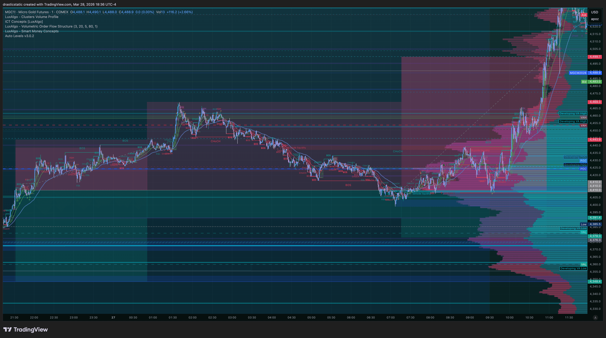
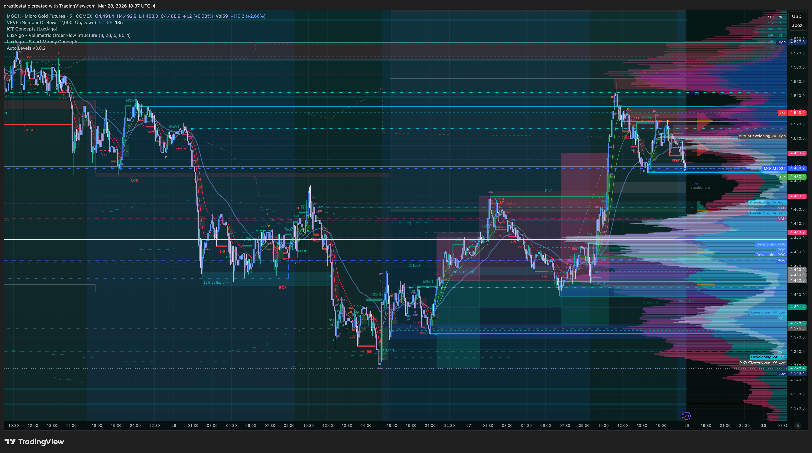
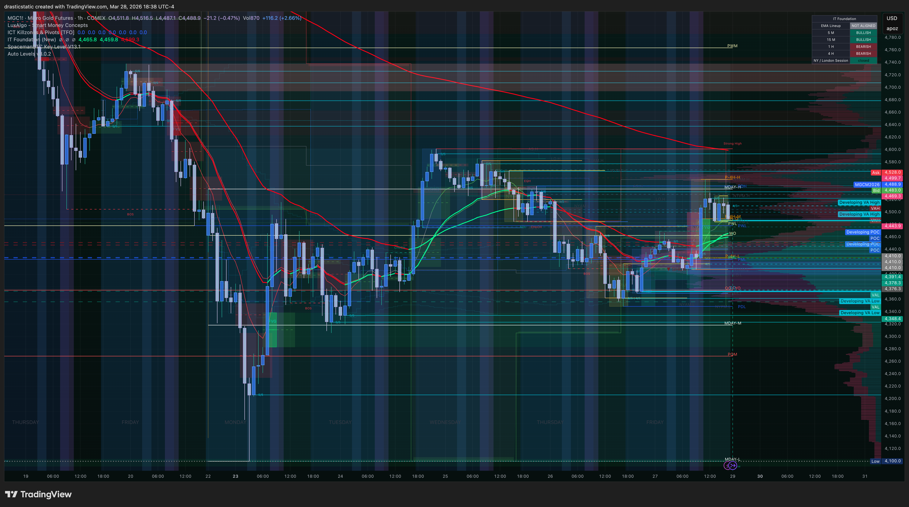

# 🔍 Trade Review — MGC Short · TPT 50K · Thu, Mar 26, 2026
### 20260326_MGC-TPT_003 · -$1,794.00 · Overnight · SL moved 13h · TPT reset-2 blown

[Jump to 📝 Notes for Coaches ↓](#notes-for-coaches)

---

## ⚡ 1. What Happened

Hours after closing his first MGC trade of the day for +$94, Christopher re-entered **2 MGC SHORT at 4,410.0** at **21:32 EDT on March 26**. The setup premise was the same bearish thesis — EMAs bearish, downtrend continuation — and there was an added external driver: TPT's 5-day minimum trading requirement meant a trade was needed to keep the path to passing the eval alive.

Price moved against the position immediately. A news event at approximately 22:00 EDT drove a sharp adverse spike. From that point the trade became a 13-hour overnight ordeal.

Three times Christopher identified an exit opportunity:
1. **At the start** — early in the adverse move, before it fully developed
2. **First return to near break-even** — the market pulled back close to the entry zone
3. **Second return to near break-even** — a second retracement toward 4,410–4,430 gave another window

Each time, he stayed in. Each time, he hoped the downside would come. The stop was moved repeatedly to avoid liquidation. The market gave two break-even-level reprieves and he stayed through both.

At **10:55 EDT on March 27**, after 13 hours and 23 minutes, the position was **auto-liquidated at 4,499.7**.

**Net result: -$1,794.00. TPT 50K account BLOWN.**

The loss was not just financial. Christopher has described this experience as one of the most severe emotional, mental, and physical hits of the recovery arc — and the most spiritually humbling. He walked away from the terminal afterward to rest, reflect, and recoup.

---

## 📊 2. Trade Data

| Field | Value |
|-------|-------|
| Account | Tradovate TPT 50K — TAKEPROFIT363712064 · **BLOWN** |
| Instrument | MGC (E-Micro Gold) |
| Direction | SHORT |
| Quantity | 2 contracts |
| Entry Price | 4,410.0 |
| Entry Time (ET) | Mar 26 · 21:32:00 EDT |
| Exit Price | 4,499.7 |
| Exit Time (ET) | Mar 27 · 10:55:00 EDT |
| Duration | 48,180 seconds (~13h 23m) |
| Exit Type | Auto-liquidation |
| Points | -89.7 |
| Gross P&L | **-$1,794.00** |
| Net P&L | **-$1,794.00** |
| MAE | -$2,706.00 (price 4,545.3 — 135.3 pts adverse) |
| MFE | $0.00 — trade never in profit |
| Price MFE | 4,431.8 (nearest to entry; market came close but never reached 4,410) |
| Price MAE | 4,545.3 (worst adverse point) |
| Best Exit | At or near break-even (twice offered and declined) |
| Tick Value | -$1,794 total (-$897 per contract) |
| Rating | 1.0 / 5 |
| Zella Score | -66.30 |
| Bias | Bearish HTF, downtrend continuation |
| Confluence | EMAs bearish |
| Setup | Trend continuation short (not an A+ setup per Christopher's own assessment) |

---

## 📋 3. Order Execution

| Order | Time (ET) | Type | Price | Notes |
|-------|-----------|------|-------|-------|
| OPEN — 2x MGC SHORT | Mar 26 · 21:32:00 | Limit fill (multi-bracket) | 4,410.0 | Avg entry |
| [Stop moved repeatedly] | 21:32 – 10:55 | Manual SL moves | — | SL moved through 13h adverse move; original stop would have hit early |
| CLOSE — 2x MGC (auto-liq) | Mar 27 · 10:55:00 | Auto-liquidation | 4,499.7 | Account blown |

*No Orders.csv available for this trade — position closed by AutoLiq after account breach. TradeZella data confirmed from tradezella_20260329.csv.*

---

## 📖 4. Session Narrative

*[Stub — to be filled in. Describe the overnight arc: the mental state entering at 21:32 after an already-full trading day (2 prior trades, emotional MCL stop-out + MGC win), how the 13-hour hold unfolded in real time, and the decision to walk away after AutoLiq.]*

---

## 📸 5. Screenshot Timeline

**Mar 27–28 — MGC: Higher timeframe overview · downtrend context and violent breakout rally**

**Mar 27–28 — MGC: Mid timeframe · V-reversal detail and volume profile**

**Mar 27–28 — MGC: Lower timeframe · entry zone detail · IT Foundation EMAs · upside continuation**

*Screenshots taken Mar 28 during post-trade documentation and reflection.*

---

## 📝 6. Notes for Coaches + SmartTraderAI

*STB: Christopher was removed from mentorship on March 26 (unpaid final payment). These notes are written to support his own documentation of the development arc, and for any future coaching context.*

- Trade entered overnight (21:32 EDT) — outside optimal NY AM session window.
- Not an A+ setup by Christopher's own assessment: *"not an a+ setup"* in TradeZella mistakes.
- **Eval pressure was a contributing entry factor** — 5-day minimum trading requirement (TPT) was explicitly noted as motivation to take a trade.
- Stop moved repeatedly through adverse move (Pattern 7) — original stop would have been hit early in the position.
- Three exit opportunities identified in real-time and bypassed (Pattern 8 — critical failure).
- Market came back close to break-even twice. Both times: stayed in.
- Trade lasted 13h 23m overnight, auto-liquidated at 4,499.7 for -$1,794.
- **TPT 50K (reset-2) account BLOWN.** Christopher intends to let it renew if bank processes the subscription.
- Emotional impact: severe — took significant time to digest. Christopher stepped away intentionally to rest, journal, and recoup. This is the correct response.
- Zella Score: -66.30 (career low to date for this arc).

---

## 🧠 7. Behavioral Notes

**Pattern 7 — recurring and escalating.** The stop was moved repeatedly through 13 hours of adverse movement. TradeZella records it directly: *"kept moving stoploss, essentially cancelled, not respected, original stop would have hit."* This is the same Pattern 7 that appeared on Mar 2, Mar 16, Mar 17, Mar 20, and again on Mar 26 (the first MGC trade). Each prior echo produced a win or a survivable outcome. This time, the market did not cooperate.

**Pattern 8 — acute failure at three decision points.** This is the most significant Pattern 8 occurrence to date. The first MGC trade of the day had shown a partial improvement — a manual exit. Here, three separate exit opportunities were presented and bypassed: once at the initial adverse move and twice when the market returned to near break-even. The inability to pull the trigger at break-even, not once but twice, is the clearest expression of exit passivity in this recovery arc.

**Pattern 10 — NEW: Eval pressure trade.** Christopher's own notes state: *"I had to take a trade to pass the eval anyway."* This is a new behavioral category: entering a position not primarily because the A+ criteria are met, but because external structure (the 5-day minimum trading requirement) creates pressure to be active. The 5-layer entry filter exists precisely to prevent this. When the motivation for entry is partly "I need to trade today," the filter is compromised before the first candle. This distinction matters: a trade entered for external compliance reasons carries a fundamentally different psychological profile than a trade entered purely on technical conviction.

**The emotional profile.** TradeZella lists the emotions experienced: ambivalent, angry, anxious, confident, fearful, frustrated, greedy, happy, calm, excited, stressed. This is the full emotional spectrum compressed into a single position — and it shows. "I was stable before entering but not while in the trade." The period before entry and the period in the trade are two entirely different states. The entry-state can look like conviction. The in-trade state, when adverse, reveals everything that was actually present underneath.

**Three exit opportunities: the architecture of the hold.** The first opportunity was "at the start" — likely during the initial adverse spike when the thesis was already under pressure. The second and third opportunities were when price came back toward break-even. Christopher notes he *"didn't listen to that feeling and instead listened to the opposite."* This is the Pattern 8 mechanism: at each decision point, the feeling to exit was recognized, identified, and overridden. The question to sit with is not why he didn't exit but what specifically overrode the exit impulse at each moment. Journaling on those three specific moments will be more valuable than any technical post-mortem.

**"The humbling experience I still needed yet."** His own words. This is important framing — not victimhood, but recognition that something in the pattern had to reach this severity before it could shift. The fact that he was able to walk away, rest, and return with perspective in hand is itself a form of discipline. The session ended. The next one hasn't started yet.

---

## 🔁 8. Pattern Tracker

| Pattern | Status | Notes |
|---------|--------|-------|
| **Pattern 7 — SL modification** | 🔴 Critical | SL moved through entire 13h adverse move. Original stop would have hit early. 6th consecutive occurrence across recovery arc. |
| **Pattern 8 — exit passivity** | 🔴 Critical | 3 exit opportunities identified and bypassed — including 2 near break-even. Most significant P8 occurrence to date. |
| **Pattern 10 — Eval pressure trade** | 🔴 NEW | Entered because "I had to take a trade to pass the eval anyway." External compliance motivation bypasses A+ entry filter. |

Trade 20260326_MGC-TPT_003 logged.

> See full running progress tracker (all sessions, behavioral arc, compliance scores, statistical summary): [../../pattern_tracker.md](../../pattern_tracker.md)

---

## 🎯 9. Forward Focus

1. **The eval filter is non-negotiable.** Before any entry: "Would I take this trade if today were not a minimum-day requirement?" If the honest answer is no — the trade is not taken. The eval structure is a container, not a directive. Passing an eval on a pressure trade that blows the account produces zero net result. The entry filter exists for exactly this scenario.
2. **Overnight positions require a pre-written SL rationale that will not be moved.** Not a mental note — a written sentence: "SL at X because [structural reason]. If price reaches X, the thesis is invalidated. I accept that outcome." The overnight session is not the place to discover whether you'll hold the stop. The commitment must be made before sleep, not tested during it.
3. **The three break-even moments were three decisions.** Pre-commit in writing before any entry: "If price returns to X, I close the position." Writing the condition before the trade means it exists when the emotional weight of being in a 13-hour overnight hold tries to override it. The recognition was already there — it failed at the action step, not the awareness step. The pre-commitment is the bridge.

---

> See full trade review: https://github.com/drasticstatic/trading-assistant-public-preview/blob/main/smarttrader-ai/reviews/2026/03-Mar/review_20260326_MGC-TPT_003.md

*Produced with 🙏🏼 Fortuna — Wealth Warden | Claude Code CLI*
*Trade Review — MGC SHORT · March 26–27, 2026 · 20260326_MGC-TPT_003*
