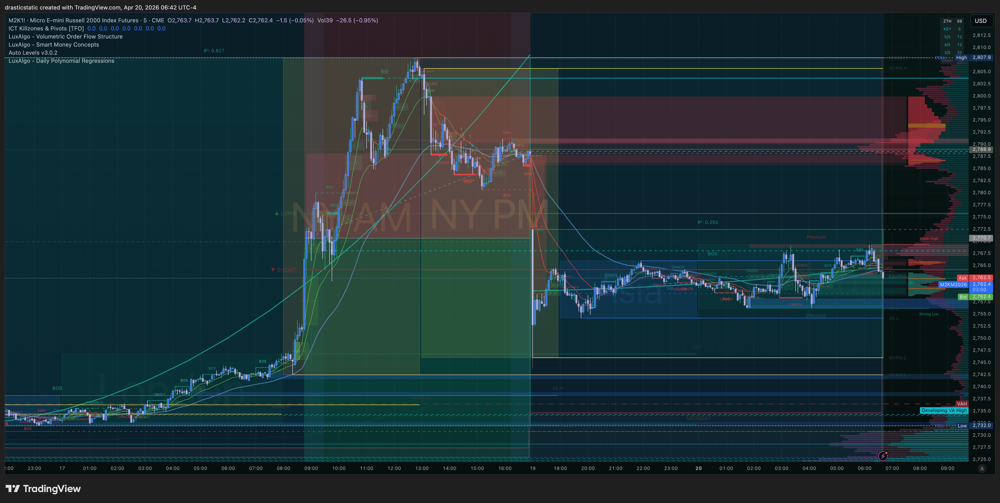

# Trade Review — M2K SHORT | Apr 17, 2026
### Review #023 · Account: APEX-484839-06 · Trade #001 of Apr 17

[Jump to 📝 Notes for Coaches ↓](#notes-for-coaches)

---

## ⚡ What Happened in One Paragraph

Limit SHORT entered at 2770.70 on M2K (Micro E-mini Russell 2000), set during the overnight session Wednesday Apr 16 (~9:50 PM ET). Filled Thursday morning at 8:52 AM ET as price traded through the level. Both bracket orders (TP 2655.20, SL 2857.10) were canceled at the exact moment of fill — the trade ran unprotected all day. Christopher planned to trail the SL or tighten the TP based on how the trade developed, actively monitoring throughout. MFE touched 2761.80 around 9:00 AM (+8.9 pts); price then reversed and trended higher. A SELL MES at 7225.00 was considered and immediately canceled at 11:52 AM. Christopher held intentionally through the afternoon, expecting one final end-of-day exhaustion move back toward SHORT. That reversal did not come. Exit: 2788.10 at 16:59 ET via Apex close. Net: **-$87.00**.

---

## 📊 Trade Data

| Field | Value |
|-------|-------|
| **Account** | APEX-484839-06 |
| **Platform** | Apex Trader Funding |
| **Instrument** | M2K (Micro E-mini Russell 2000) |
| **Contract** | M2KM6 (June 2026) |
| **Direction** | SHORT |
| **Entry Price** | 2770.70 |
| **Exit Price** | 2788.10 |
| **Qty** | 1 micro ($5/point) |
| **Entry Time** | 08:52:32 AM ET, Apr 17, 2026 |
| **Exit Time** | 16:59:02 PM ET, Apr 17, 2026 |
| **Duration** | 8h 6min |
| **Order Set** | Overnight Apr 16 ~9:50 PM ET (limit) |
| **Venue** | TradingView → Tradovate |
| **TP Set / Result** | 2655.20 — canceled at fill (manual management intended) |
| **SL Set / Result** | 2857.10 — canceled at fill (manual management intended) |
| **MFE** | 2761.80 (~9:00 AM ET) = +8.9 pts = **+$44.50** |
| **MAE** | 2807.90 = -37.2 pts = **-$186.00** |
| **Gross P&L** | **-$87.00** |
| **Net P&L** | **-$87.00** |
| **Realized R:R** | Negative |
| **Zella Score** | -46.77 |
| **Rating** | 1/5 |
| **Emotionally Stable** | No |

---

## 📋 Order Execution

| Time (ET) | Order | Instrument | Price | Status |
|-----------|-------|-----------|-------|--------|
| Apr 16, ~9:50 PM | SELL limit set | M2KM6 | 2770.70 | Resting overnight |
| Apr 17, 08:52:32 | SELL limit **filled** | M2KM6 | 2770.70 | ✅ Filled |
| Apr 17, 08:52:32 | BUY TP | M2KM6 | 2655.20 | ❌ Canceled at fill (manual mgmt) |
| Apr 17, 08:52:32 | BUY SL | M2KM6 | 2857.10 | ❌ Canceled at fill (manual mgmt) |
| Apr 17, 11:52:31 | SELL MES placed + canceled | MESM6 | 7225.00 | ❌ Canceled |
| Apr 17, 16:59:02 | BUY exit | M2KM6 | 2788.10 | ✅ Filled — Apex end-of-day close |

---

## 📖 Session Narrative

The week of Apr 14–18 was heavily weighted toward community service work (PIR Devine News launching), coaching calls, and course study. Thursday Apr 17 was the only live trade day. The M2K SHORT was a swing idea formed during the Wednesday overnight session — a limit at a key overhead level with a large target (115 points to 2655.20) and a wide initial SL (2857.10).

The position filled right at the open. The initial bracket was canceled at fill with an intention to manage exits actively — trailing the SL up or tightening the TP once the trade showed direction. Within 8 minutes price touched MFE (2761.80). The trade had early momentum but it was shallow. A SELL MES was briefly considered mid-session at 11:52 AM (either a correlated add or hedge) and immediately dropped.

As the afternoon wore on, the market continued trending up above entry. Christopher held, waiting for what he anticipated would be a final end-of-day exhaustion flush back in the SHORT direction. That move never came. Apex closed the position at 16:59 at 2788.10 for -$87.

The emotional environment for the session: anxious, ambivalent, and frustrated — significant external financial pressure (phone suspended, bank account at risk) was present throughout.

---

## 📸 Screenshot Timeline

**15:33 ET — Trade in progress (3h 41min in)**

**16:29 ET — Approaching close, position adverse**

**16:30 ET — Still open**

**16:40 ET — 19 minutes to close**

**16:41 ET — Final minutes**

**Apr 20 Pre-Market — M2K context for the week ahead**

---

## 📝 Notes for Coaches + SmartTraderAI

> *"I notice I look for reversals more so than continuations. Hearing Jesse say that the market is typically trending — if I made that simple change or did everything opposite what I do, I've caught both continuations and reversals cleanly before, but recently I have been getting an incorrect feel again often."*

This trade is a counter-trend SHORT in a market Christopher's own notes acknowledge was in an uptrend on the higher timeframe. The early MFE (8.9 points, 9 AM) gave momentary validation, then the trend reasserted.

The bracket cancellation was intentional — not mechanical failure. The problem: "I'll manage it manually" requires a rule for what triggers an exit. Without one, the default is to hold and wait for the thesis to materialize. When the thesis is an expected exhaustion that doesn't come, there's no fallback. The end-of-day exhaustion expectation is a recognizable pattern: waiting for the market to bail out the thesis.

Practical fix: if manually managing, the exit rule must be written down before the trade is on. "I will exit if price trades above [X]" or "I will exit if MFE retraces 50%." Holding based on a thesis alone is not management — it's waiting.

Counter-trend bias continues and the ZTH coach has spoken directly to it. The practical filter before any short: "Is the trend broken, or just pausing?" Pausing ≠ reversal.

---

## 🧠 Behavioral Notes

**Reversal bias (persistent):** SHORT against an acknowledged uptrend. The setup is structurally a reversal trade. ZTH coach feedback this week confirmed this is a recurring tendency. MFE was shallow (8.9 pts) — the setup never developed as a reversal.

**Manual management without a rule:** Bracket canceled intentionally with plans to trail/tighten. Active monitoring was present. The missing piece: no pre-defined trigger for the manual exit. "Wait for end-of-day exhaustion" is a thesis, not a rule.

**Nuanced Pattern 8:** This is not the pure version (inattention/forgetting). Christopher was watching and chose to hold. But the outcome is the same: no exit when MFE was reached, held through a reversal, exited at a loss. The structural fix is still the same — a mechanical rule that fires regardless of thesis.

**MES canceled (11:52 AM):** Active attention shown. Decision to not add was ultimately correct given the trade direction.

**External pressure:** Phone suspended, bank account at risk — this creates a "need the trade to work" emotional state that makes exiting a loser harder. Worth naming.

**What went right:** 1 micro contract. Testing the idea at minimum exposure. The loss is manageable precisely because of correct position sizing.

| Pattern | Status | This Trade |
|---------|--------|------------|
| Pattern 7 (SL modification) | Monitoring | N/A — SL never active |
| Pattern 8 (exit passivity) | 🔴 Nuanced active | Held intentionally for exhaustion thesis · no fallback rule · -$87 |
| Pattern 9 (order hygiene) | 🟡 Monitoring | TP/SL canceled intentionally · but no replacement rule set |
| Reversal bias | 🟡 Emerging | Counter-trend SHORT in uptrend — not yet numbered, worth tracking |

---

## 🔁 Pattern Tracker

Trade #023 logged.

> See full running tracker: [../../pattern_tracker.md](../../pattern_tracker.md)

**Pattern 8 refinement:** The "exhaustion hold" variant — Christopher holds a losing position based on an anticipated reversal that hasn't happened yet. The reversal expectation keeps the position alive past the point where a rule-based system would have exited. Mechanically identical to passivity in outcome; different in intent. Fix is the same: write the exit rule before the trade is live.

---

## 🎯 Forward Focus

1. **One mechanical exit rule — written, committed, non-negotiable:** Define what triggers an exit when MFE is reached and price reverses. No "waiting for exhaustion" without a fallback trigger.
2. **Reversal pre-filter:** Before any SHORT, ask: "Is the trend broken or pausing?" Pausing = no trade until confirmation of break.
3. **Bracket or rule — never neither:** If canceling the bracket, immediately write the manual exit rule on paper before the trade runs. If the rule can't be stated in one sentence, keep the bracket.

---

> See full trade review: [https://github.com/drasticstatic/trading-assistant-public-preview/blob/main/smarttrader-ai/reviews/2026/04-Apr/review_20260417_M2K-APEX_001.md](https://github.com/drasticstatic/trading-assistant-public-preview/blob/main/smarttrader-ai/reviews/2026/04-Apr/review_20260417_M2K-APEX_001.md)

*Fortuna — Wealth Warden*
